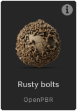

# Trabalhar com o Função SDF

Na versão 16.0.0, o Substance 3D Designer introduziu um poderoso conjunto de nós para criar Funções SDF, que podem ser usadas para criar e manipular formas 3D de procedimentos.

Função SDF são gráficos de função de Substance que combinam nós SDF disponíveis no conjunto de ferramentas e são aplicados a parâmetros dedicados em nós que suportam Função SDF.

Como ponto de partida, lembre-se de que o fluxo de trabalho básico se parece com isso:

1. Crie uma Função SDF em um nó do [visualizador 3D](../../../../compositing-graphs/nodes-reference-for-com/node-library/filters/effects/3d-viewer/3d-viewer.md) para visualizar o resultado.
2. Copie o gráfico de função final (ou [crie uma instância dele](../../../../glossary/glossary.md#instance-node)) no parâmetro de Função SDF de um nó que ofereça suporte a Função SDF, como o [respingo de forma v2](../../../../compositing-graphs/nodes-reference-for-com/node-library/texture-generators/patterns/shape-splatter-v2/shape-splatter-v2.md).

## O que é uma Função SDF?

<table style="border: none">
    <tr style="border: 0">
        <td style="border: 0; vertical-align: top">
            
Assim como funções matemáticas podem ser plotadas em 2D como curvas, elas podem ser plotadas em 3D como superfícies.

Um campo de distância com sinal é uma função matemática que define uma superfície no espaço 3D calculando a distância de qualquer ponto no espaço até o ponto mais próximo na superfície.

Vamos detalhar o nome “campo de distância assinado” para entendê-lo melhor:<ul><li><b>Signed</b> significa que a função retorna um valor positivo se o ponto estiver fora/na frente da superfície, um valor negativo se o ponto estiver dentro/atrás da superfície e zero se o ponto estiver exatamente na superfície.</li><li><b>Distância</b> refere-se ao fato de que a função calcula a distância de qualquer ponto no espaço até o ponto *mais próximo* na superfície.</li><li><b>Campo</b> significa que a função descreve um campo de valores, pois cada ponto no espaço tem um valor correspondente que representa sua distância até a superfície mais próxima.</li></ul>

        </td>
        <td style="border: 0; width: 33%; vertical-align: top">
            
        </td>
    </tr>
</table>

Essas funções têm muitas aplicações em computação gráfica, como superfícies de desenho, projeção de sombras, máscara de contorno, detecção de colisão e muito mais.

No Substance 3D Designer, as Funções SDF são usadas para criar e manipular formas 3D de maneira processual.

### A saída e o uso pretendido de uma Função SDF

Os nós de Função SDF geram um único valor de flutuação: a distância assinada até a superfície mais próxima.

No entanto, há mais para eles: eles obtêm internamente e definem os valores das variáveis que os nós host precisam definir e/ou saber sobre para manipular e desenhar as formas resultantes.

Isso significa que esses nós precisam ser usados no contexto de nós que *suportam Função SDF* porque ele conhece essas variáveis e as integra nativamente.

Os nós incluem [respingo de forma v2](../../../../compositing-graphs/nodes-reference-for-com/node-library/texture-generators/patterns/shape-splatter-v2/shape-splatter-v2.md) e [visualizador 3D](../../../../compositing-graphs/nodes-reference-for-com/node-library/filters/effects/3d-viewer/3d-viewer.md).

### O gráfico da função Substance

Os nós de Função SDF devem ser usados em gráficos de função de Substance dedicados e, portanto, estão disponíveis apenas nesse tipo de gráfico.
Os parâmetros de nó que devem ser expressos como uma função usam um botão &#39;Editar função&#39;.

O que você precisa saber sobre gráficos de função Substance:
* Da mesma forma que os gráficos de Substance, os conectores de nós são *especializados*, o que significa que só podem ser conectados a outros conectores de *cor correspondente* [representando seu tipo](../../function-nodes-overview/function-nodes-overview.md#color-coding).
* Os nós não têm parâmetros, eles só podem ter entradas. (Com algumas exceções específicas)
* O gráfico tem um único nó de saída. Clique com o botão direito do mouse em um nó e selecione `Set as output` para designá-lo como o nó de saída.
* Da mesma forma que os gráficos de Substance, existem *nós atômicos* - os blocos de construção de base - e nós de *instância* que representam outros gráficos de função de Substance.
* Há operadores separados (algébricos, lógicos e de comparação) que permitem executar operações nos valores do gráfico, mas os nós SDF têm [seus próprios operadores](#operators)

+++ Exemplo de um gráfico de função definindo uma Função SDF

+++

## Introdução

Para criar Funções SDF, primeiro precisamos visualizá-las para que possamos entender o efeito dos nós e parâmetros que estamos ajustando.

O nó [visualizador 3D](../../../../compositing-graphs/nodes-reference-for-com/node-library/filters/effects/3d-viewer/3d-viewer.md) tem um modo dedicado para visualizar formas criadas com o Função SDF: defina o parâmetro <b>Tipo de cena</b> do nó como `SDF function` e clique no botão **Editar função** para abrir o gráfico de função que hospedará a própria Função SDF.

O nó oferece recursos dedicados para visualizar aspectos da Função SDF que nos permitirão criá-los de forma mais intuitiva e eficiente, como um quadro delimitador e isolines.

O nó [Sol/céu físico](../../../../compositing-graphs/nodes-reference-for-com/node-library/3d-view-library/hdri-tools/physical-sun-sky/physical-sun-sky.md) pode ser usado para configurar rapidamente a iluminação do ambiente no visualizador 3D.

>[!TIP]
> 
> <table style="border: none"><tr style="border: none"><td style="border: none; vertical-align: top">
Todos os nós de Função SDF, bem como seus conectores de entrada, têm dicas de ferramentas que permitirão que você saiba mais sobre seu propósito e como usá-los.

Não se esqueça de conferi-los!
</td><td style="border: none; width: 33%; vertical-align: top"></td></tr></table>

### Configuração de valores de nó

Como com todos os nós em gráficos de função Substance, os nós de Função SDF não têm parâmetros, mas apenas conectores de entrada que são usados como parâmetros.

Para definir o valor dessas entradas, você pode usar [nós de constante](../../atomic-function-nodes/constant-nodes/constant-nodes.md) como **Flutuante**, **Flutuante3** e **Inteiro3**.\
Você pode criá-los da maneira usual através do menu nó, ou pode arrastar uma nova conexão dos conectores para se beneficiar de uma lista filtrada de nós de tipos correspondentes.

A maioria dos conectores de entrada dos nós de Função SDF tem um valor padrão, que é revelado na dica de ferramenta.

>[!TIP]
> 
> <table style="border: none"><tr style="border: none"><td style="border: none; vertical-align: top">
Se você não precisa manter alguns valores sempre visíveis, encaixe os nós usando a tecla <code>D</code> para economizar espaço e reorganizar o gráfico.

Também é possível usar comentários para controlar os valores.
</td><td style="border: none; width: 67%; vertical-align: top"></td></tr></table>

### O quadro delimitador

<table style="border: none">
    <tr style="border: none">
        <td style="border: none; vertical-align: top">
            
O quadro delimitador é uma caixa no espaço 3D que define os <i>limites</i> nos quais a Função SDF é avaliada e desenhada no nó <a href="../../../../compositing-graphs/nodes-reference-for-com/node-library/texture-generators/patterns/shape-splatter-v2/shape-splatter-v2.md">respingo de forma v2</a>.

Se o quadro delimitador for muito pequeno, partes da forma poderão ser cortadas. Se for muito grande, pode levar a cálculos desnecessários e tempos de processamento mais longos.

O parâmetro <b>quadro delimitador</b> permite habilitar a visualização do quadro delimitador. Você pode ajustar o tamanho do quadro delimitador alterando os valores do parâmetro <b>Tamanho do quadro delimitador</b>.

Use o parâmetro <b>Colorir fora do quadro</b> para visualizar as áreas fora do quadro delimitador em vermelho vivo para que você possa ajustar o quadro adequadamente.

        </td>
        <td style="border: none; width: 33%; vertical-align: top">
            
        </td>
    </tr>
</table>

### Isolines

<table style="border: none">
    <tr style="border: none">
        <td style="border: none; vertical-align: top">
            
Como transformar formas envolve realmente *transformar o espaço* no qual são desenhadas, o resultado dos nós usados após algumas transformações pode ser surpreendente. Nesses casos, é útil visualizar o próprio espaço, o que pode ser feito <i>visualizando o campo de distância</i> da forma.

Para isso, o nó do visualizador 3D usa <i>isolines</i>, que são linhas de contorno repetidas que representam uma determinada distância da superfície da forma. O parâmetro <b>Isolines do SDF</b> habilita essa visualização. As isolinhas são desenhadas em um plano horizontal colocado no height especificado pelo parâmetro <b>Posição de isolinhas SDF</b>.

Ver como as isolinhas são deformadas pelas transformações aplicadas à forma pode ajudar a entender como a própria forma é transformada e ajustar os parâmetros dos nós de acordo.

        </td>
        <td style="border: none; width: 33%; vertical-align: top">
            
        </td>
    </tr>
</table>

## Função SDF categorias de nós

Os nós do Função SDF são categorizados na Biblioteca com base em sua função e finalidade.

É possível criar quantas exibições de biblioteca forem necessárias para organizar seu espaço de trabalho de modo que o conjunto de ferramentas do Função SDF seja organizado por categoria, mantendo tudo à mão. Vá para a exibição **Janelas > Nova biblioteca** para adicionar exibições separadas e independentes da biblioteca.

+++ Exemplo de espaço de trabalho

+++

### Primitivos

Os blocos de construção básicos das Funções SDF, que permitem criar formas básicas, como esferas, caixas, cilindros e muito mais.

+++ Nós

[Cone limitado](./sdf-functions-primitives/3d-sdf-capped-cone/3d-sdf-capped-cone.md)\
[Cone limitado (2 pontos)](././sdf-functions-primitives/3d-sdf-capped-cone-2-points/3d-sdf-capped-cone-2-points.md)\
[Toro limitado](./sdf-functions-primitives/3d-sdf-capped-torus/3d-sdf-capped-torus.md)\
[Cápsula](./sdf-functions-primitives/3d-sdf-capsule/3d-sdf-capsule.md)\
[Cone](./sdf-functions-primitives/3d-sdf-cone/3d-sdf-cone.md)\
[Cubo](./sdf-functions-primitives/3d-sdf-cube/3d-sdf-cube.md)\
[Cilindro](./sdf-functions-primitives/3d-sdf-cylinder/3d-sdf-cylinder.md)\
[Cilindro (2 pontos)](./sdf-functions-primitives/3d-sdf-cylinder-2-points/3d-sdf-cylinder-2-points.md)\
[Elipsoide](./sdf-functions-primitives/3d-sdf-ellipsoid/3d-sdf-ellipsoid.md)\
[Cilindro alongado](./sdf-functions-primitives/3d-sdf-elongated-cylinder/3d-sdf-elongated-cylinder.md)\
[Plano terrestre](./sdf-functions-primitives/3d-sdf-ground-plane/3d-sdf-ground-plane.md)\
[Hélice](./sdf-functions-primitives/3d-sdf-helix/3d-sdf-helix.md)\
[Prismo hexagonal](./sdf-functions-primitives/3d-sdf-hexagonal-prism/3d-sdf-hexagonal-prism.md)\
[Plano infinito](./sdf-functions-primitives/3d-sdf-infinite-plane/3d-sdf-infinite-plane.md)\
[Plano](./sdf-functions-primitives/3d-sdf-plane/3d-sdf-plane.md)\
[Pirâmide](./sdf-functions-primitives/3d-sdf-pyramid/3d-sdf-pyramid.md)\
[Quadrado de pirâmide](./sdf-functions-primitives/3d-sdf-pyramid-square/3d-sdf-pyramid-square.md)\
[Rocha](./sdf-functions-primitives/3d-sdf-rock/3d-sdf-rock.md)\
[Esfera](./sdf-functions-primitives/3d-sdf-sphere/3d-sdf-sphere.md)\
[Toro](./sdf-functions-primitives/3d-sdf-torus/3d-sdf-torus.md)

+++

### Operadores

Estes nós permitem combinar e modificar formas criadas com primitivas. Eles incluem:
* Operadores **booleanos diretos**, como [União](sdf-functions-operators/3d-sdf-op-union/3d-sdf-op-union.md), [Interseção](sdf-functions-operators/3d-sdf-op-intersection/3d-sdf-op-intersection.md) e [Subtração](sdf-functions-operators/3d-sdf-op-subtraction/3d-sdf-op-subtraction.md), que permitem combinar formas de várias maneiras.
* **Deformando operadores booleanos**, como [Arredondamento](sdf-functions-operators/3d-sdf-op-rounding/3d-sdf-op-rounding.md) e [Morph](sdf-functions-operators/3d-sdf-op-morph/3d-sdf-op-morph.md), que permitem combinar formas com um efeito de mesclagem.
* **Outros operadores** especializados, como [Shell](sdf-functions-operators/3d-sdf-op-shell/3d-sdf-op-shell.md) e [Simetria](sdf-functions-operators/3d-sdf-op-symmetry/3d-sdf-op-symmetry.md), que permitem modificar e/ou duplicar uma forma.

+++ Nós

[Interseção](./sdf-functions-operators/3d-sdf-op-intersection/3d-sdf-op-intersection.md)\
[Interseção suave](./sdf-functions-operators/3d-sdf-op-intersection-smooth/3d-sdf-op-intersection-smooth.md)\
[Superfície de interseção](./sdf-functions-operators/3d-sdf-op-intersection-surface/3d-sdf-op-intersection-surface.md)\
[Morph](./sdf-functions-operators/3d-sdf-op-morph/3d-sdf-op-morph.md)\
[Repetir espelho](./sdf-functions-operators/3d-sdf-op-repeat-mirror/3d-sdf-op-repeat-mirror.md)\
[Arredondamento](./sdf-functions-operators/3d-sdf-op-rounding/3d-sdf-op-rounding.md)\
[Shell](./sdf-functions-operators/3d-sdf-op-shell/3d-sdf-op-shell.md)\
[Subtração](./sdf-functions-operators/3d-sdf-op-subtraction/3d-sdf-op-subtraction.md)\
[Subtração suave](./sdf-functions-operators/3d-sdf-op-subtraction-smooth/3d-sdf-op-subtraction-smooth.md)\
[Simetria](./sdf-functions-operators/3d-sdf-op-symmetry/3d-sdf-op-symmetry.md)\
[União](./sdf-functions-operators/3d-sdf-op-union/3d-sdf-op-union.md)\
[Campeão da União](./sdf-functions-operators/3d-sdf-op-union-chamfer/3d-sdf-op-union-chamfer.md)\
[União suave](./sdf-functions-operators/3d-sdf-op-union-smooth/3d-sdf-op-union-smooth.md)

+++

### Transformações

As formas podem ser transformadas de várias maneiras, como [traduzidas](sdf-functions-transforms/3d-sdf-transform-offset/3d-sdf-transform-offset.md), [giradas](sdf-functions-transforms/3d-sdf-transform-rotate/3d-sdf-transform-rotate.md), [dimensionadas](sdf-functions-transforms/3d-sdf-transform-scale/3d-sdf-transform-scale.md), [torcidas](sdf-functions-transforms/3d-sdf-transform-twist/3d-sdf-transform-twist.md) e muito mais.
Esses nós permitem que você execute essas transformações *transformando o próprio espaço* no qual as superfícies são definidas.

Esse espaço é chamado de `P`. Vá para a próxima seção para saber mais sobre o que isso significa e como a transformação do espaço funciona.

+++ Nós

[Curvar](./sdf-functions-transforms/3d-sdf-transform-bend/3d-sdf-transform-bend.md)\
[Alongar](./sdf-functions-transforms/3d-sdf-transform-elongate/3d-sdf-transform-elongate.md)\
[Inverter](./sdf-functions-transforms/3d-sdf-transform-flip/3d-sdf-transform-flip.md)\
[Deslocamento](./sdf-functions-transforms/3d-sdf-transform-offset/3d-sdf-transform-offset.md)\
[Deslocamento P](./sdf-functions-transforms/3d-sdf-transform-offset-p/3d-sdf-transform-offset-p.md)\
[Girar](./sdf-functions-transforms/3d-sdf-transform-rotate/3d-sdf-transform-rotate.md)\
[Girar P](./sdf-functions-transforms/3d-sdf-transform-rotate-p/3d-sdf-transform-rotate-p.md)\
[Escala](./sdf-functions-transforms/3d-sdf-transform-scale/3d-sdf-transform-scale.md)\
[Torcer](./sdf-functions-transforms/3d-sdf-transform-twist/3d-sdf-transform-twist.md)

+++

### Material

O gerenciamento básico de materiais está disponível para formas criadas com o Função SDF.

Você pode definir atributos básicos de material: cor, aspereza e metalidade, a serem usados para visualização direta no nó do visualizador 3D ou como base para o trabalho de material nos nós Shape splatter v2.\
Você também pode atribuir IDs de material a diferentes partes de uma forma para separá-las.

Saiba mais sobre os aplicativos destes nós [abaixo](#material-id).

+++ Nós

* [Definir ID de material](./sdf-functions-material/set-id/set-id.md)
* [Definir material](./sdf-functions-material/set-material/set-material.md)
* [Definir cor](./sdf-functions-material/set-color/set-color.md)
* [Definir a metalidade](./sdf-functions-material/set-metalness/set-metalness.md)
* [Definir aspereza](./sdf-functions-material/set-roughness/set-roughness.md)

+++

## A entrada &#39;P&#39;

Quando aplicamos uma transformação a uma forma, como um deslocamento ou uma rotação, nós realmente transformamos o espaço no qual a forma é definida.

Se quisermos que uma transformação se propague para outras formas — por exemplo, se quisermos girar várias formas da mesma forma — precisamos ter certeza de que todas estão usando o mesmo espaço transformado.

Um espaço transformado é compartilhado entre os nós usando a entrada `P` dedicada, que você pode encontrar na maioria dos nós SDF.\
O &#39;P&#39; significa espaço mundial **P** posição: um vetor 3D que representa as coordenadas de um ponto no espaço mundial.

Os nós [Deslocamento P](sdf-functions-transforms/3d-sdf-transform-offset-p/3d-sdf-transform-offset-p.md) e [Girar P](sdf-functions-transforms/3d-sdf-transform-rotate-p/3d-sdf-transform-rotate-p.md) transformam o espaço e permitem propagar essa transformação para todos os nós que devem herdá-la.\
Por exemplo, várias formas podem ser giradas juntas conectando sua entrada `P` ao mesmo nó Girar página.

Isso não é apenas uma questão de conveniência, é garantir que os nós SDF funcionem com as mesmas posições no espaço.

Veja um exemplo:

Uma esfera é repetida para visualizar espaço como uma grade 3D. É repetido *repetindo o espaço*.\
Sem um `P` compartilhado, o cilindro curvo usa o espaço de repetição usado pela esfera.\
Com um `P` compartilhado, as formas podem ser definidas corretamente em um espaço girado compartilhado.

## Usar o Função SDF nos nós “Shape splatter v2”

Depois de concluir uma Função SDF no contexto do nó do visualizador 3D, você pode copiar a função inteira e colá-la no nó [Respingo de forma v2](../../../../compositing-graphs/nodes-reference-for-com/node-library/texture-generators/patterns/shape-splatter-v2/shape-splatter-v2.md) para usá-la como um gerador de formas para esse nó.

Defina o parâmetro **Tipo de forma** como `SDF function`, vá para o parâmetro **Função SDF de padrão** e clique no botão **Editar função** para abrir o gráfico de função do parâmetro.
Em seguida, é possível colar a função copiada do nó do visualizador 3D nesse gráfico. (Não se esqueça de definir o nó de saída do gráfico de função novamente!)

Certifique-se de ajustar o parâmetro **Tamanho do quadro delimitador SDF** para corresponder ao [quadro delimitador](#the-bounding-frame) que você estava usando no nó do visualizador 3D e certifique-se de que a forma foi desenhada corretamente.

\
*respingo de forma v2 com um **tipo de forma**&#x200B;definido como `SDF function`. Observe que o **tamanho do quadro delimitador do SDF**&#x200B;foi ajustado para se ajustar à forma.*

>[!TIP]
> 
> Para reutilizar facilmente uma Função SDF, copie-a para um novo gráfico de função Substance e use esse gráfico como um **nó de instância** no visualizador 3D e nos nós Shape splatter v2.
> 
> Isso oferece vários benefícios:
> * Qualquer atualização feita na função será refletida em ambos os nós sem precisar copiar e colar novamente. Esta é uma excelente melhoria na qualidade de vida das formas complexas.
> * O gráfico pode ter um nome descritivo que ficará visível nos nós de instância, o que tornará o uso da sua própria biblioteca de formas SDF muito mais gerenciável e os seus gráficos mais legíveis.
> * Você pode criar entradas para o gráfico de função que pode ser usado com os nós [Get](../../atomic-function-nodes/get-nodes/get-nodes.md). Essas entradas serão expostas como conectores de entrada no nó da instância e permitirão que você faça variações facilmente nas formas.

### ID do material

Uma forma SDF pode ter uma ID de material atribuída a ela, que é um valor inteiro que pode ser usado para diferenciar partes da forma e atribuir diferentes materiais a elas no [visualizador 3D](../../../../compositing-graphs/nodes-reference-for-com/node-library/filters/effects/3d-viewer/3d-viewer.md) e nos nós [respingo de forma v2](../../../../compositing-graphs/nodes-reference-for-com/node-library/texture-generators/patterns/shape-splatter-v2/shape-splatter-v2.md).

Observe que superfícies com diferentes IDs de material são divididas com uma borda rígida em formas mescladas, como é visível no exemplo abaixo.

Use o nó [Definir ID de material](./sdf-functions-material/set-id/set-id.md) após a parte de uma forma que você deseja marcar com uma ID de material específica e use um nó de constante [Inteiro](../../atomic-function-nodes/constant-nodes/constant-nodes.md) para definir o valor de ID de material desejado.\
No nó do visualizador 3D, defina o parâmetro **Saída** como `Material ID` para visualizar as IDs de material das formas.

\
*À direita, a saída de dois nós do visualizador 3D é composta para mostrar a forma (à esquerda) e suas IDs de material (à direita) para ilustrar como, em formas mescladas, os materiais são interpolados enquanto as IDs de material são divididas.*

As IDs de material podem ser aproveitadas pelos nós complementares do Shape splatter v2:
* Os nós do [mapeador de respingo de forma v2](../../../../compositing-graphs/nodes-reference-for-com/node-library/texture-generators/patterns/shape-splatter-v2-mapper-color/shape-splatter-v2-mapper-color.md) podem usar essas IDs de material para atribuir padrões diferentes.
* O [respingo de forma v2 a ser mascarado](../../../../compositing-graphs/nodes-reference-for-com/node-library/texture-generators/patterns/shape-splatter-v2-to-mask/shape-splatter-v2-to-mask.md) pode mascarar parte das formas de acordo com a ID do material.

<table style="border: none; margin-top: 32px">
    <tr style="border: 0">
        <td style="border: 0; width: 33%">
            <i>IDs de material usadas para mapeamento de cores na cor do mapeador do respingo de forma v2</i>
        </td>
        <td style="border: 0; width: 33%">
            <i>IDs de material usadas para mapeamento triplanar na cor do mapeador do respingo de forma v2</i>
        </td>
        <td style="border: 0; width: 33%">
             <i>IDs de material usadas para mascaramento no respingo de forma v2 para mascarar</i>
        </td>
    </tr>
</table>

### Cor, rugosidade e metalidade

Os nós [Definir cor](./sdf-functions-material/set-color/set-color.md), [Definir aspereza](./sdf-functions-material/set-roughness/set-roughness.md) e [Definir metalidade](./sdf-functions-material/set-metalness/set-metalness.md) permitem definir esses atributos de material para formas na Função SDF.

Em seguida, ao usar essa Função SDF como um tipo de forma no nó [respingo de forma v2](../../../../compositing-graphs/nodes-reference-for-com/node-library/texture-generators/patterns/shape-splatter-v2/shape-splatter-v2.md), esses atributos de material estarão disponíveis como mapas nas saídas de **cor SDF**, **aspereza SDF** e **metalidade SDF** do nó. Esses mapas podem servir de base para trabalhos de materiais mais complexos usando outros nós.

Observe que, distintamente das IDs de material, os valores são *interpolados* entre formas mescladas como um gradiente, como é visível nos exemplos abaixo.

<table style="border: none; margin-top: 32px">
    <tr style="border: 0">
        <td style="border: 0; width: 33%">
            <i>Saída de cores SDF</i>
        </td>
        <td style="border: 0; width: 33%">
             <i>Saída de aspereza SDF</i>
        </td>
        <td style="border: 0; width: 33%">
            <i>Saída de metalidade SDF</i>
        </td>
    </tr>
</table>

### Amostra de material

<table style="border: none">
    <tr style="border: none">
        <td style="border: none; vertical-align: top">
            
A <b>amostra de material</b> <a href="../../../../compositing-graphs/creating-compositing-gra/material-samples/material-samples.md">de parafusos enferrujados</a> está disponível para saltar para as Funções SDF aplicadas no contexto do nó Shape splatter v2.

O gráfico é organizado e anotado para guiá-lo através de sua estrutura, configurações de nó e configurações de Função SDF.

Ele também é <i>totalmente editável</i>. Portanto, pode ser usado como uma sandbox para obter uma compreensão mais prática do respingo de Forma v2 e dos conjuntos de ferramentas do Função SDF. Você pode criar quantos gráficos de amostra quiser, portanto, fique à vontade para brincar.

        </td>
        <td style="border: none; width: 20%; vertical-align: top; text-align: right">
            
        </td>
    </tr>
</table>
