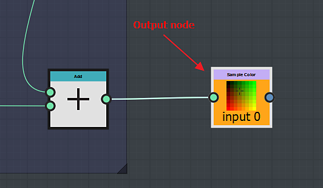

# Semelhanças com um gráfico de Substance

À primeira vista, o gráfico de função Substance é realmente semelhante a um gráfico de Substance e o fluxo de trabalho é quase o mesmo.

## A navegação é semelhante

No gráfico de função Substance, você pode criar e organizar seus nós da mesma forma que faria em um gráfico de Substance.

você pode acessar os nós da mesma maneira:

* Da biblioteca
* pressionando a barra de espaço ou a tecla Tab
* clicando com o botão direito do mouse e usando o menu Adicionar nó

### O fluxo de trabalho é semelhante

Como no gráfico de Substance, você criará sua função encadeando séries de nós, cada um deles usando o resultado gerado pelo(s) anterior(es).

A saída definirá o valor de um parâmetro ou a saída do nó de processador de pixels.

## Diferenças com um gráfico de Substance

<table>
<tr style="border: 0;">
<td width="100.00%" style="border: 0;" valign="top">

### Os nós

Os nós disponíveis no gráfico de função Substance são completamente diferentes daqueles que você encontraria em um gráfico de Substance.

</td>
<td width="25.00%" style="border: 0;" valign="top">

</td>
</tr>
</table>

<table>
<tr style="border: 0;">
<td style="border: 0;" valign="top">

### A saída

Ao contrário dos gráficos de Substance, uma função pode ter apenas uma saída.

Outro ponto a ser observado é que não há um nó de saída específico no qual você conecta o resultado final. Em vez disso, você pode sinalizar diretamente como saída, o nó que gera o resultado esperado:

</td>
<td style="border: 0;" valign="top">

</td>
</tr>
</table>

#### Como definir o nó de saída?

Para definir a saída, basta clicar com o botão direito do mouse no nó que gera a saída esperada e clicar em *Definir como nó de Saída:*

>[!WARNING]
>
> <b>Verificar o tipo de resultado gerado</b>
> 
> Se você observar que *Definir como Nó de Saída* está acinzentado, isso significa que o valor gerado pelo nó é diferente do valor esperado pelo parâmetro ou pelo processador de pixels.

<table>
<tr style="border: 0;">
<td style="border: 0;" valign="top">

Quanto aos gráficos de Substance, você pode importar funções feitas em outro gráfico. É possível abrir o gráfico de referência clicando nele com o botão direito do mouse e selecionando “Abrir referência”:

</td>
<td style="border: 0;" valign="top">

</td>
</tr>
</table>

Se você tiver um sbs contendo várias funções, poderá arrastá-lo e soltá-lo diretamente em um gráfico de função do Substance e escolher a função que deseja importar na lista exibida:

