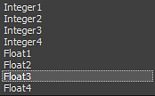

# Variáveis

>[!NOTE]
>
> Para obter informações sobre a criação e o uso dos nós de variáveis, consulte a *[seção Nós de Variáveis](../../function-graphs/nodes-reference-for-fun/atomic-function-nodes/get-nodes/get-nodes.md)*.

## Definição

Se você tem pouco conhecimento em programação, você pode estar familiarizado com o conceito de variável.

Caso contrário, veja uma definição simples:

>[!NOTE]
>
> Uma variável é apenas um “contêiner” com um nome específico que contém um valor.
> 
> Você pode usar o valor contido em uma variável chamando-o com seu nome.

## Tipos de variáveis

No Substance 3D Designer você tem duas famílias de variáveis: Numéricos e Booleanos.

## Variáveis numéricas

Variáveis numéricas são basicamente números. Mas fazemos uma distinção clara entre dois tipos de números:

* Inteiros : 0 | 1 | -1 | 203568, etc...
* Precisão decimal: 0.23 | 1,0 | -0,3546 | etc.

>[!WARNING]
>
> O Designer faz uma distinção clara entre inteiros e flutuantes : por padrão você não pode operá-los juntos.
> 
> Felizmente, você pode usar os nós *Para Inteiro* ou Para Precisão decimal para executar conversões de tipo.

### Vários valores numéricos na mesma variável

Dependendo das suas necessidades, você pode acumular até 4 valores numéricos dentro da mesma variável.

Mais uma vez, todos os valores devem ser do mesmo tipo.

Para fazer isso, você tem a opção entre todos esses valores numéricos:

## Boolean

Um booliano é um valor binário puro, o que significa que seu valor só pode ser *Verdadeiro* ou *Falso* (você também pode dizer 0 ou 1).
