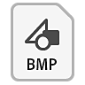

# Visão geral

O [Substance 3D Designer](https://www.adobe.com/br/products/substance3d-designer.html) é um aplicativo destinado à criação de texturas, materiais e filtros 2D em uma interface baseada em nó, com foco pesado na geração de procedimentos, parametrização e fluxos de trabalho não destrutivos. É o aplicativo de execução mais longa no ecossistema Substance 3D e os recursos feitos com ele são os mais versáteis e dinâmicos possíveis.

Veja como ele se compara a outros aplicativos:

|  | 

  Substance 3D Sampler | 

  Substance 3D Painter | 

  Substance 3D Designer |
| --- | --- | --- | --- |
| <b>Curva de aprendizado</b> | Baixa | Média | Alta |
| <b>Materiais de criação</b> | Sim | Sim | Sim |
| <b>Criar modelos 3D</b> | Não | Limitado\* | Limitado\* |
| <b>Filtros, padrões e efeitos do autor</b> | Não | Limitado | Sim |
| <b>Exportar conteúdo paramétrico</b> | Não | Não | Sim |

\*: somente Deslocamento, consulte o recurso <b>Exportação de cena</b> na seção [Exibição 3D](../../interface/3d-view/3d-view.md).

Resumindo, o Substance 3D Designer deve ser visto como o aplicativo de texturização mais técnico e avançado disponível.

Ele permite criar conteúdo para praticamente qualquer caso de uso ou cenário. Isso significa que você não está limitado a um único tipo de saída, como um material/conjunto de texturas exclusivo para uma malha mapeada por UV, mas pode criar conteúdo para um conjunto muito mais amplo de usos.

Por exemplo, a maioria dos conteúdos inteligentes de procedimentos no Painter e no Sampler foi criada e exportada do Designer. Coisas como Alpha de pincel, geradores, filtros e Materiais de base podem ser criadas no Designer.

## Fluxo de trabalho (WRK)

O Substance 3D Designer é um editor baseado em nó que permite criar conteúdo de muitas maneiras diferentes com complexidades variadas. [O fluxo de trabalho é explicado com mais detalhes em páginas dedicadas](../../getting-started/workflow-overview/workflow-overview.md), mas os seguintes benefícios são ao trabalhar com o software:

<b>[Não linear](../../compositing-graphs/substance-compositing-graphs.md) </b>: você pode criar várias saídas de textura de uma só vez. Edite uma máscara ou um controle deslizante e, automaticamente, qualquer saída conectada será recalculada. Não é mais necessário criar mapas separadamente, como Basecolor, Aspereza, Normal etc.

<b>[Não destrutivo](../../compositing-graphs/compositing-graph-key-con/substance-compositing-graph-key-concepts.md) </b>: você pode reverter qualquer ação *sem* perder seu trabalho. Torna-se muito mais rápido iterar e experimentar, encontrando fluxos de trabalho ainda mais eficientes.

<b>[Preparação integrada](../../bakers/bakers.md) </b>: acesse ferramentas avançadas de malha de alta velocidade diretamente no software. Você não precisa mais executar cozimento em um software separado e executar processos demorados de importação e exportação.

<b>[Paramétrico](../../compositing-graphs/manage-parameters/exposing-a-parameter/exposing-a-parameter.md) </b>: você pode configurar para controlar quase qualquer aspecto de uma textura por meio de um único controle deslizante ou lista suspensa. Isso permite adicionar controle e variação infinitos a apenas um ativo.

## Tipos de arquivo

O aplicativo e seu ecossistema usam 4 tipos diferentes de arquivos. Para deixar claro: esses são tipos de arquivo que são <b>exportados do Substance 3D Designer</b> e podem ser importados para alguns ou todos os outros aplicativos da Substance 3D.

<table>
<tr style="border: 0;">
<td style="border: 0;" valign="top">

### Arquivo do Substance 3D

*(\*.SBS)*

Os Arquivos Substance são os **principais arquivos de origem** do Designer. Ao abrir um Arquivo Substance, você pode **exibir e editar todos os nós em um Gráfico**. Eles são representados como pacotes, que podem conter qualquer número de recursos, como gráficos, funções, bitmaps, malhas, etc... Eles são mais difíceis de compartilhar e menos rápidos de calcular. Eles só podem ser abertos no Substance 3D Designer e no Substance Player.

</td>
<td style="border: 0;" valign="top">

### Ativo do Substance 3D

*(\*.SBSAR)*

Os arquivos de Substance são <b> arquivos de Substance compilados, otimizados </b>. Eles são muito mais rápidos de calcular e podem ser compartilhados facilmente sem problemas de referência. Os parâmetros ainda podem ser ajustados, mas a edição do gráfico está <b>bloqueada</b>. Os arquivos de Substance podem ser usados em todos os aplicativos da Substance 3D e em qualquer aplicativo que tenha a [integração do Substance 3D](https://experienceleague.adobe.com/en/docs/substance-3d/ecosystem/home) (alguns com um plug-in externo), como o Autodesk 3DS Max &amp; Maya, o Unreal Engine ou o Unity Engine.

</td>
<td style="border: 0;" valign="top">

{width="48px"}

### Arquivos estáticos

*(\*.TGA, \*.BMP, \*.PNG, \*.FBX, \*.OBJ etc...)*

O Substance 3D Designer sempre suporta a exportação para tipos de arquivo estáticos. Uma imagem 2D pode ser exportada para um arquivo bitmap, um modelo 3D pode ser exportado para tipos de arquivo 3D comuns. Quando exportada para arquivos estáticos, **toda a funcionalidade dinâmica é perdida**. As imagens são bloqueadas em resolução, os modelos 3D são bloqueados em policontagem.

</td>
</tr>
</table>

Isso geralmente significa que você manterá seu trabalho no formato SBS ao trabalhar no Designer, exportará para SBSAR se o destino for compatível (Painter, por exemplo) ou usará arquivos bitmap estáticos se não houver necessidade ou não houver suporte para SBSAR.

## Tipos de recurso

Os arquivos do Substance 3D podem conter uma grande variedade de recursos que servem a diferentes propósitos. Alguns recursos só podem ser criados no Designer, alguns virão de aplicativos externos.

<table>
<tr style="border: 0;">
<td width="16.67%" style="border: 0;" valign="top">

[{width="150px"}](../../compositing-graphs/substance-compositing-graphs.md)

</td>
<td width="100.00%" style="border: 0;" valign="top">

### Gráficos do Substance

Os gráficos de Substance permitem gerar e processar *dados de imagem 2D* e depois enviá-los para uma ou mais saídas de textura. Em muitos casos de uso, um projeto girará em torno de um ou mais gráficos de Substance.

[Vá para a seção dedicada aos gráficos de Substance.](../../compositing-graphs/substance-compositing-graphs.md)

</td>
</tr>
</table>

<table>
<tr style="border: 0;">
<td width="16.67%" style="border: 0;" valign="top">

[{width="150px"}](../../function-graphs/function-graphs.md)

</td>
<td width="100.00%" style="border: 0;" valign="top">

### gráficos de função Substance

<b>As funções</b> são um nível mais alto de abstração e complexidade: em vez de processar dados de imagem (conjuntos de valores de pixel), você *processa valores únicos* (inteiros, flutuantes, vetores). As funções são usadas quando você deseja executar operações mais complicadas ou ajustar comportamentos específicos. Funções geralmente não funcionam de forma independente, e não são usadas fora do contexto de gráficos de Substance.

[Vá para a seção dedicada aos gráficos de função de Substance.](../../function-graphs/function-graphs.md)

</td>
</tr>
</table>

<table>
<tr style="border: 0;">
<td width="16.67%" style="border: 0;" valign="top">

[{width="150px"}](../../resources/importing-linking-and-new/importing-linking-and-new-resources.md)

</td>
<td width="100.00%" style="border: 0;" valign="top">

### Recursos não gráficos

Os recursos não gráficos podem vir de aplicativos externos (como Photoshop ou Autodesk Maya), enquanto alguns também podem ser *criados no Designer*. A maior diferença é que eles não são grafos baseados em nós; a maioria deles são elementos para serem usados dentro ou ao lado dos tipos de gráficos mencionados anteriormente.

Existem os seguintes tipos de recursos:

* [Bitmaps](../../resources/bitmap-resource/bitmap-resource.md)
* [Gráficos vetoriais (SVG)](../../resources/vector-graphics-svg-res/vector-graphics-svg-resource.md)
* [Cenas 3D](../../resources/3d-scene-resource/3d-scene-resource.md)
* [Fontes](../../resources/font-resource/font-resource.md)
* [Arquivos AxF](../../resources/axf-appearance-exchange/axf-appearance-exchange-format.md)

</td>
</tr>
</table>
