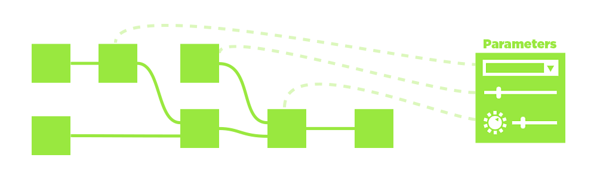

# Visão geral do fluxo de trabalho

O Substance 3D Designer é um editor baseado em nó. Isso significa que quase todos os tipos de projeto ou recurso envolverão a inserção de nós (blocos de construção) e a conexão deles para criar uma cadeia de operações (um gráfico). Esta página explica o conceito de fluxos de trabalho baseados em nós e fornece um resumo dos três tipos principais de gráficos que você pode criar no Designer.

## Sumário

[Fluxo de trabalho baseado em nó](#node-workflow)

[Fluxo de trabalho da instância do gráfico](#instance-workflow)

[Parâmetros personalizados](#custom-parameters)

[Tipos de gráfico](#graph-types)

## Fluxo de trabalho baseado em nó

Trabalhar no Designer é diferente de outros softwares de edição de imagens 2D, como o Photoshop. Em vez de executar uma ação manualmente (como ajustar a saturação indo até uma opção do menu e alterar um controle deslizante), <b>você constrói as etapas lógicas</b> de edição ou criação da imagem. Isso acontece através da construção de uma rede de pequenos blocos de construção chamados &#39;nós&#39;. Os dados da imagem viajam da <b> esquerda para a direita</b> através dos blocos de construção, conectados por Links que determinam o caminho das informações. Cada Nó, se conectado, contribuirá para os resultados finais.

A maior vantagem é que seu fluxo de trabalho se torna <b>não linear</b>. Ao contrário das ações executadas manualmente que entram em uma pilha de histórico, você sempre pode trocar ou modificar um Nó a qualquer momento. Se você decidir que o primeiro ajuste de Contraste, afetando o resultado da imagem até o final, foi muito, ainda será possível voltar e ajustá-lo ou até mesmo recortá-lo completamente, sem perder todo o trabalho que executou depois.

## Fluxo de trabalho da instância do gráfico

Criar instâncias de gráficos é um processo importante no Designer. Ele permite que você crie seus próprios nós utilizando qualquer tamanho ou tipo de gráfico e empacotando-o como novo bloco de construção de nó. Esses tipos de nós são chamados de “Instâncias de gráfico”. Isso permite que você seja muito mais eficiente, economize tempo e compartilhe trabalho com outras pessoas. Você desenvolveu uma ótima técnica para o desgaste de bordas, por exemplo? Crie uma instância de gráfico a partir dela e reutilize-a você mesmo, compartilhe-a com a comunidade ou sua equipe.

Para obter mais informações sobre Instâncias de Gráfico em [gráficos de Substance](../../compositing-graphs/substance-compositing-graphs.md), há uma [seção dedicada](../../compositing-graphs/creating-compositing-gra/graph-instances-sub-gra/graph-instances-sub-graphs.md) sobre elas na documentação.

## Parâmetros personalizados

Qualquer nó em sua cadeia de operações terá alguma forma de controle: botões, controles deslizantes, configurações para você ajustar, influenciando o resultado final. Se você criar um Sub-gráfico ou quiser exportar seu Arquivo Substance para outro aplicativo, poderá criar seu próprio “painel de controle” para seus arquivos, permitindo que qualquer pessoa que usar o Gráfico o ajuste e o modifique com um painel de controle totalmente exclusivo, expondo possibilidades infinitas. [Saiba mais sobre o conceito geral de parâmetros personalizados aqui](../../compositing-graphs/compositing-graph-key-con/substance-compositing-graph-key-concepts.md) ou vá mais na profundidade e [comece a expor parâmetros](../../compositing-graphs/manage-parameters/exposing-a-parameter/exposing-a-parameter.md).

## Tipos de gráfico

Você encontrará abaixo um resumo dos três tipos de gráfico que podem ser editados no Substance 3D Designer, além de um link para a seção relevante da documentação.

<table>
<tr style="border: 0;">
<td width="16.67%" style="border: 0;" valign="top">

[{width="120px"}](https://substance3d.adobe.com/)

</td>
<td width="100.00%" style="border: 0;" valign="top">

### Gráficos do Substance

[gráficos de Substance](https://substance3d.adobe.com/) são o tipo principal de gráfico criado no Substance 3D Designer. A finalidade é <b>gerar e processar dados de imagem 2D</b> que não estejam restritos a uma resolução, cor ou forma definidas. Eles são feitos com ferramentas extremamente versáteis de processamento de imagens e geração, não apenas resultados estáticos e predefinidos.

Os resultados podem estar na forma de um padrão simples em preto e branco, um filtro que roda apenas em outras imagens e não gera conteúdo por si só, ou mesmo um material de procedimento completo com vários canais.

gráficos de Substance são[o tipo de gráfico mais amplamente suportado](../../getting-started/overview/overview.md) e podem ser exportados e usados em uma infinidade de fluxos de trabalho diferentes.

</td>
</tr>
</table>

#### Exemplos

Abaixo você pode encontrar alguns exemplos típicos de casos de uso comuns.

+++Forma simples
{width="512px"}

Uma forma de máscara simples para um decalque é criada gerando[um pedaço de texto](../../compositing-graphs/nodes-reference-for-com/atomic-nodes/text/text.md) e uma [forma de disco](../../compositing-graphs/nodes-reference-for-com/node-library/texture-generators/patterns/shape/shape.md), [extraindo a borda](../../compositing-graphs/nodes-reference-for-com/node-library/filters/effects/edge-detect/edge-detect.md) do disco e finalmente [mesclando-os](../../compositing-graphs/nodes-reference-for-com/atomic-nodes/blend/blend.md) antes de defini-los como saída final [9&rbrace;.](../../compositing-graphs/nodes-reference-for-com/atomic-nodes/output/output.md)

O Texto com o número, ou o thickness da aresta, pode ser exposto externamente para tornar este um gráfico mais dinâmico.

+++

+++Filtro de ajuste
{width="512px"}

Um gráfico de filtro usa um mapa normal como [entrada](../../compositing-graphs/nodes-reference-for-com/atomic-nodes/input/input.md)(com uma visualização personalizada), [converte-o em curvatura](../../compositing-graphs/nodes-reference-for-com/node-library/filters/effects/curvature-smooth/curvature-smooth.md) e depois [ajusta o contraste](../../compositing-graphs/nodes-reference-for-com/node-library/filters/adjustments/histogram-scan/histogram-scan.md) para criar uma máscara de bordas convexas como [saída](../../compositing-graphs/nodes-reference-for-com/atomic-nodes/output/output.md) final.

Os valores de contraste definidos no Histograma podem ser expostos, tornando-o um filtro simples, mas útil, em combinação com o slot de entrada dinâmico.

+++

+++Material completo
{width="512px"}

Um gráfico mais complicado[mescla dois Materiais de base](../../compositing-graphs/nodes-reference-for-com/node-library/material-filters/blending-material/material-blend/material-blend.md). Um [Material de base](../../compositing-graphs/nodes-reference-for-com/node-library/material-filters/pbr-utilities/base-material/base-material.md) é mantido simples, o outro usa algumas entradas personalizadas para adicionar interesse. Uma máscara é usada para determinar qual dos dois materiais aparece onde antes de ser definido como [saídas](../../compositing-graphs/nodes-reference-for-com/atomic-nodes/output/output.md) finais.

Este exemplo usa os [Modos de Criação de Link](../../interface/the-graph-view/link-creation-modes/link-creation-modes.md) para simplificar usando vários links.

+++

<table>
<tr style="border: 0;">
<td width="16.67%" style="border: 0;" valign="top">

[{width="120px"}](https://substance3d.adobe.com/)

</td>
<td width="100.00%" style="border: 0;" valign="top">

### gráficos de função Substance

Funções <b>processam valores únicos</b> (inteiros, flutuantes, vetores) em vez de dados de imagem (conjuntos inteiros de pixels). As funções também são Gráficos com redes de nós, mas os [Nós usados](../../function-graphs/nodes-reference-for-fun/function-nodes-overview/function-nodes-overview.md)e a interface é diferente dos [gráficos de Substance regulares](../../compositing-graphs/substance-compositing-graphs.md). O fluxo de trabalho é completamente baseado em <b>operações matemáticas</b> e não mostra miniaturas de visualização de imagem, tornando-o uma <b>maneira muito mais avançada de trabalhar</b> com o Substance 3D Designer.

As funções podem ser usadas em muitos contextos diferentes, sendo os principais a modificação do comportamento de [um Parâmetro exposto](../../compositing-graphs/manage-parameters/exposing-a-parameter/exposing-a-parameter.md), a criação do comportamento de [Processadores de pixels](../../compositing-graphs/nodes-reference-for-com/atomic-nodes/pixel-processor/pixel-processor.md) ou [FX-Maps](../../compositing-graphs/nodes-reference-for-com/atomic-nodes/fx-map/fx-map.md) e o uso de [valores](../../compositing-graphs/values-compositing-graphs/values-in-substance-compositing-graphs.md) em um gráfico de Substance.

</td>
</tr>
</table>

#### Exemplos

Abaixo estão alguns exemplos de casos de uso comuns para gráficos de função Substance.

+++Função simples
{width="256px"}

Uma função simples no contexto de um parâmetro exposto. Ele obtém um valor de flutuação de entrada chamado “Intensidade”, que é determinado para ir de 0 a 1 (um intervalo fácil de entender) e o remapeia para um intervalo definido de 0,1 a 0,8. Isso significa que se o usuário definir Intensidade como 0, internamente será usado 0,1, se a interface estiver definida como 1, será usado 0,8 e qualquer valor intermediário será interpolado linearmente. Este tipo de função é algo comumente usado ao [expor parâmetros](../../compositing-graphs/manage-parameters/exposing-a-parameter/exposing-a-parameter.md), mas usar funções personalizadas.

Esta função também pode ser escrita como *lerp(0.1, 0.8, Intensity)* em um pseudocódigo semelhante a HLSL ou GLSL.

+++

+++Função avançada
{width="512px"}

Esta função avançada mostra o funcionamento interno de um [Processador de pixels](../../compositing-graphs/nodes-reference-for-com/atomic-nodes/pixel-processor/pixel-processor.md) destinado ao ajuste do matiz de uma entrada do mapa de cores com base na intensidade de uma segunda entrada de máscara em tons de cinza.

Ele faz a amostragem de ambas as entradas com a variável “$pos” do sistema, retira o Alpha, converte o valor da cor em HSL e modifica o componente Matiz, multiplicando-o pelo valor da amostra de tons de cinza. Depois, ele remonta o vetor, converte o HSL de volta em RGB e adiciona o Alpha de volta para a saída final.

em pseudo-código esta seria uma função muito mais complicada que não caberia em uma única linha.

+++

### Gráficos MDL

Esta página apresenta gráficos MDL no Substance 3D Designer, que permitem criar materiais MDL e visualizar o comportamento deles em tempo real.
