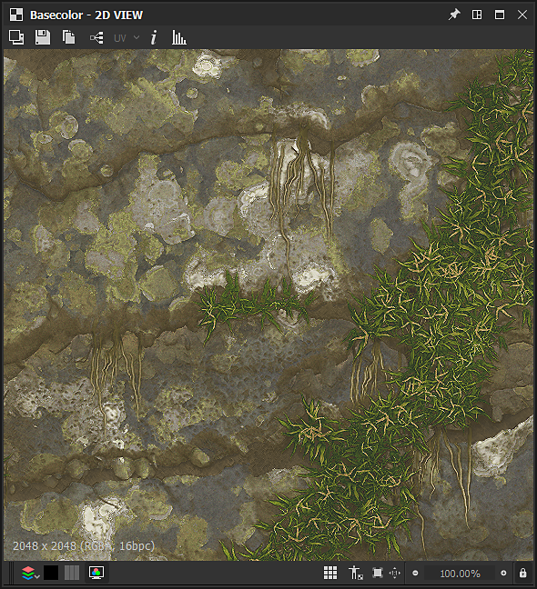
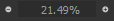
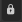
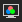

# Exibição 2D

Esta página descreve a interface do usuário e os recursos do painel **Exibição 2D** no Substance 3D Designer.

## Visão geral

A [Exibição 2D](https://substance3d.adobe.com/) é um dos painéis principais da interface do usuário do Designer. Seus principais objetivos são os seguintes:

* exibindo saída de *valor* ou *imagem* por um *nó* especificado ou passando por um *conector de nó* especificado
* exibindo [bitmaps](../../resources/bitmap-resource/bitmap-resource.md) e [gráficos vetoriais](../../resources/vector-graphics-svg-res/vector-graphics-svg-resource.md) [recursos](../../resources/resources.md)
* exibindo *informações adicionais* sobre o conteúdo que ele contém atualmente, como canais de cores ou valores de cores exatos
* controlando parâmetros&#39; *gizmos*

Quando uma imagem exibida ou um valor é modificado, a Exibição 2D *é atualizada automaticamente* para permanecer em sincronia com o estado atual dos dados.\
*Vários* painéis de exibição 2D podem estar ativos a qualquer momento, e cada um pode exibir imagens ou valores diferentes. Você pode controlar quando um novo painel deve ser usado usando o recurso  <b>Pin</b> do painel de interface do usuário.

### Exibição de conteúdo na Visualização 2D

>[!WARNING]
>
> Todas as menções de ações feitas em *nós* nesta seção se aplicam apenas a [gráficos de Substance](../../compositing-graphs/substance-compositing-graphs.md).

A maneira mais direta de exibir qualquer imagem na Exibição 2D é clicar duas vezes no *LMB*...

* ...em um recurso de [Bitmap](../../resources/bitmap-resource/bitmap-resource.md) ou [gráficos vetoriais](../../resources/vector-graphics-svg-res/vector-graphics-svg-resource.md) no [Explorer](../../interface/the-explorer-window/the-explorer-window.md)
* ...em um nó ou conector de nó na [Exibição de Gráfico](../../interface/the-graph-view/the-graph-view.md)

As imagens também podem ser *arrastadas e soltas* diretamente na viewport mantendo *LMB* em um [recurso](../../resources/resources.md) no painel [Explorer](../../interface/the-explorer-window/the-explorer-window.md) ou *RMB* em um nó na Exibição de Gráfico.

Na Exibição Gráfica, você pode enviar uma imagem para a Exibição 2D usando a opção de menu contextual <b>Exibir saída em Exibição 2D</b>, que é acessada clicando em *RMB*...

* ...em um *nó* para exibir *a saída desse nó*. Se o nó tiver mais de uma saída, selecione a saída desejada no submenu
* ...em *espaço vazio* na Exibição de Gráfico para exibir *a saída desse gráfico*. Se o gráfico tiver mais de uma saída, selecione a saída desejada no submenu

Ao carregar um gráfico, sua *primeira saída* é exibida automaticamente na Exibição 2D por padrão. Você pode desabilitar esse comportamento em [Preferências](../../interface/preferences-window/preferences-window.md). Vá para <b>Editar > Preferências > Gráfico > Gráfico de composição de Substance</b> e *desmarque* a opção <b>Exibir saída em exibição 2D ao abrir um gráfico</b>.

## Janela de visualização

O visor é a *área de exibição* da <b>Exibição 2D</b> e permite *navegar* pela imagem exibida usando os seguintes atalhos de mouse e teclado:

<table>
<tr style="border: 0;">
<td style="border: 0;" valign="top">

* <b>Panorâmica:</b> Ctrl+RMB / MMB
* <b>Ferramenta Zoom:</b> Alt+RMB / MouseWheel / &#39;Exibir escala&#39;:\
  
* <b>Ajustar para ajustar o visor:</b> botão F / &#39;Ajustar para visualização&#39; 
* <b>Ajustar para escala 1:1:</b> Z / botão &#39;Ajustar à escala&#39; 

</td>
<td style="border: 0;" valign="top">

</td>
</tr>
</table>

Usar um trackpad (somente macOS)

* <b>Panorâmica: </b>Passar com dois dedos
* <b>Aplicar zoom:</b> Pince com dois dedos/Deslize com dois dedos enquanto segura Cmd

>[!IMPORTANT]
>
> Ações indisponíveis
> 
> *Não* é possível aplicar panorama à imagem se o tamanho de exibição atual da imagem for *menor que o tamanho do visor*.
> 
> *Não* é possível aumentar/diminuir o zoom da imagem se o conteúdo exibido *não existir mais*. Por exemplo, um nó ou recurso de referência da imagem foi excluído.

>[!NOTE]
>
> Direção do zoom
> 
> Cada um dos métodos de zoom é invertido com o outro:
> 
> * O botão de rolagem do mouse *aproxima* a imagem
> * Alt+RMB e arraste *empurra* a imagem para longe
> 
> A direção do zoom pode ser invertida nas [Preferências](../../interface/preferences-window/preferences-window.md).

A *resolução* nativa da imagem, o *formato de cor* e a *profundidade de bits* aparecem na área inferior esquerda do visor.

Além da navegação, a viewport oferece os seguintes recursos:

* Exibição lado a lado: *repete a imagem* no visor usando um padrão lado a lado. Isso é útil para verificar como um padrão ou textura se repetirá. É habilitada com o uso da **Barra de espaços** ou do botão  **Exibição lado a lado**
* Exibição de tamanho físico: exibe a imagem com uma *proporção* correspondente à propriedade [Tamanho físico](../../compositing-graphs/graph-parameters/graph-parameters.md) do gráfico. Ela é habilitada usando o botão  **proporção de Tamanho físico**
* Manter tamanho da exibição: esta opção *bloqueia a escala de exibição* para que ela permaneça consistente em todas as imagens diferentes. Está *habilitado por padrão* e pode ser desabilitado com o botão  **Manter tamanho de exibição**

## Barra de ferramentas principal

A barra de ferramentas principal do painel <b>Exibição 2D</b> permite que você faça mais com as imagens exibidas e oferece os seguintes recursos:

+++Imagem do fundo
{width="360px"}

Você pode *sobrepor uma imagem diferente* sobre a imagem atualmente exibida. Pressione o botão  <b>Imagem de Fundo</b> e você será solicitado a selecionar um arquivo de imagem para usar como sobreposição.

Quando o arquivo é selecionado, uma nova barra de ferramentas é exibida com os seguintes controles para a sobreposição de imagem:

<b> Fechar:</b> *fechar* a barra de ferramentas de controles de sobreposição e *desabilitar* a sobreposição da imagem de fundo.

<b> Carregar imagem:</b> selecione *outro arquivo de imagem* para usar como sobreposição.

<b> Imagem de origem:</b> define a sobreposição da imagem como *0%* de opacidade.

<b> Imagem de fundo:</b> define a sobreposição da imagem como *100%* de opacidade.

<b> Redefinir:</b> define a imagem de sobreposição para *50%* de opacidade.

Um controle deslizante oferece *controle manual* sobre a opacidade da imagem sobreposta.

+++

+++Exportar imagem
{width="360px"}

A imagem atualmente exibida pode ser *exportada para um arquivo de imagem*. Pressione o botão  <b>Salvar Imagem...</b> e você será solicitado a selecionar um *local*, *nome* e *formato de arquivo* para o arquivo exportado.

Enquanto a imagem será exportada como sua *resolução nativa* - que é exibida na área inferior esquerda do visor - a *profundidade de bits* e o *formato de cor* dependerão *do formato de imagem* selecionado. Por exemplo, imagens de precisão de ponto flutuante de 32 bits só podem ser exportadas em seu intervalo de dados completo com formatos de imagem que ofereçam suporte a essa precisão, como TIFF, EXR e HDR. Se o formato da imagem não suportar os dados, é provável que ocorram grampos e/ou faixas de cores na imagem exportada.\
Em geral, esteja ciente da precisão e dos recursos oferecidos pelos formatos de imagem que pretende usar - suporte a ponto flutuante, perfis ICC etc.

Se <b>OCIO</b> ou <b>Adobe ACE</b> o [modo de gerenciamento de cores](../../color-management/color-management.md) está em uso no momento, e a opção adicional está disponível para selecionar o *espaço de cores* da imagem exportada.

+++

+++Copiar para área de transferência
{width="360px"}

A imagem atualmente exibida pode ser *copiada para a área de transferência*. Pressione o botão  <b>Copiar Imagem para a Área de Transferência</b> e a imagem estará pronta para ser colada em qualquer software de terceiros, como o Adobe Photoshop.

A imagem será copiada como uma imagem de precisão de *8 bits* em sua *resolução nativa*, que é exibida na área inferior esquerda do visor.

+++

+++Alternar saídas de gráfico
{width="360px"}

Se a imagem atualmente exibida for uma *saída de gráfico*, você poderá *alternar rapidamente para qualquer* outra saída de gráfico usando o botão  <b>Selecionar saída</b>.

Este recurso *não* está disponível para outros nós, incluindo nós que têm mais de uma saída.

+++

+++Sobreposição UV
{width="357px"}

Se a opção <b>Exibir UVs na visualização 2D</b> estiver habilitada no menu <b>Cena</b> do encaixe da [visualização 3D](../../interface/3d-view/3d-view.md), o recurso de sobreposição UV estará disponível na visualização 2D.

Você pode habilitá-lo usando o botão <b>UV</b>. 

Isso exibe os UVs da malha [atualmente selecionados na Visualização 3D](../../interface/3d-view/3d-view.md) como um wireframe colorido.

Se as informações de cor do material estiverem disponíveis no arquivo de malha, a cor do material será usada como a cor da sobreposição UV.

Se a malha tiver <b>vários conjuntos UV</b>, os UVs desejados poderão ser selecionados na lista de verificação suspensa, que poderá ser aberta clicando na seta ao lado do rótulo &#39;UV&#39; no botão.

+++

+++Informações da imagem
{width="360px"}

Você pode exibir os *valores exatos de pixel* *e as coordenadas* em uma imagem com o painel <b>Informações</b>, que é habilitado usando o botão  <b>Informações da Imagem</b>. Isso é muito útil ao inspecionar imagens HDR, por exemplo, ou garantir que a depuração entre pixels siga a progressão pretendida.

As cores são representadas pelos valores <b>RGBA</b> e <b>HSV</b> e exibidas dependendo da *precisão* da imagem, da seguinte maneira:

* <b>8 bits</b>: 0-255 inteiro / 0,0-1,0 ponto flutuante

* <b>16 bits</b>: 0-65532 inteiro / 0,0-1,0 ponto flutuante

* <b>16F</b> (ponto flutuante de 16 bits): valor de ponto flutuante bruto

* <b>32F</b> (ponto flutuante de 32 bits): valor de ponto flutuante bruto

As coordenadas de pixel são representadas por valores <b>X</b> e <b>Y</b>.

+++

+++Histograma
{width="360px"}

Você pode exibir o *histograma* da imagem com o painel <b>Histograma</b>, que é habilitado usando o botão  <b>Exibir histograma</b>.

Os *modos de histograma* a seguir estão disponíveis:

* <b>Luminância</b>

* <b>Vermelho</b>

* <b>Verde</b>

* <b>Azul</b>

* <b>RGB</b>

* <b>Alpha</b>

As seguintes informações estão relacionadas abaixo dos modos:

* <b>Pixels</b>: o número de pixels na imagem

* <b>Intervalo</b>: todo o intervalo de valores disponível

* <b>Intervalo usado</b>: o intervalo de valores entre o pixel de menor valor e o de maior valor

Além disso, você pode clicar **LMB** no histograma ou *manter* **LMB** pressionado e *arrastar* pelo histograma para *selecionar uma parte específica* dos dados. As seguintes informações são exibidas para esta seleção:

* **Pixels selecionados**: o número de pixels que têm os valores selecionados

* **Intervalo selecionado**: o intervalo de valores da parte selecionada

* **Máx selecionado**: o número mais alto de pixels que têm um valor incluído na parte selecionada

A seleção pode ser *limpa* clicando em **RMB** no histograma.

O modo como alguns dos valores acima são representados depende da precisão selecionada na seção inferior do painel, da seguinte maneira:

* **8 bits**: 0-255 inteiros

* **16 bits**: 0 a 65532 inteiro

* **32 bits**: valor de ponto flutuante bruto

Algumas partes do histograma podem incluir valores muito baixos de contagem de pixels e, portanto, ser difíceis de ler. Nesse caso, você pode habilitar o modo de **raiz quadrada**, usando o botão **Quadrado**, que usa a *raiz quadrada dos valores reais* para desenhar o histograma.

+++

## Exibir barra de ferramentas

A barra de ferramentas **Exibição**, localizada na *parte inferior* do painel **Exibição 2D** por padrão, permite controlar como a imagem é exibida no visor.

A seção *mais à esquerda* inclui controles para *cor* e *transparência*, enquanto a seção *mais à direita* inclui os controles *viewport* detalhados na seção Visor desta página.

>[!NOTE]
>
> A barra de ferramentas pode ser *reposicionada* em torno do painel **Exibição 2D** usando a *alça* mais à esquerda representada por três linhas paralelas.

{width="360px"}

### Canais de cores

Você pode exibir um único canal da imagem usando o botão  <b>Canais de cores</b>. Isso abre uma caixa de combinação que permite selecionar quais canais <b>Vermelhos</b>, <b>Verdes</b>, <b>Azuis</b> e <b>Alpha</b> devem ser exibidos. O aspecto normal da imagem com todos os canais é restaurado selecionando a opção <b>RGB</b>.

Os *atalhos de teclado* a seguir podem ser usados para alternar rapidamente para canais de cores diferentes:

* RGB: <b>C</b>
* Vermelho: <b>R</b>
* Verde: <b>G</b>
* Azul: <b>B</b>
* Alpha: <b>A</b>

O *ícone* do botão <b>Canais de cores</b> *muda* dependendo do(s) canal(is) exibido(s) atualmente.

>[!NOTE]
>
> Os atalhos de teclado só podem ser usados se o painel Exibição 2D tiver foco. Você pode clicar neste painel pelo menos uma vez para garantir que seja o caso.
> 
> Como o painel precisa de foco, esses atalhos *não interferem* em nenhum *atalho personalizado* que você tenha definido para criar nós no gráfico. Saiba mais sobre esse recurso [aqui](../../interface/preferences-window/preferences-window.md).

{width="360px"}

### Alternar transparência

A exibição de transparência pode ser ativada e desativada usando o botão / <b>Mostrar tabuleiro de xadrez</b>. Quando habilitada, a transparência é exibida usando um padrão quadriculado.

Há duas maneiras principais de interpretar a transparência, que podem ser selecionadas usando o botão / <b>Modo de transparência</b>:

<b> Reta:</b> as informações de transparência são armazenadas somente no canal alfa e não afetam nenhum outro aspecto da imagem

<b> Pré-multiplicado:</b> as informações de transparência são armazenadas no canal alfa e também afetam os canais RGB, pois são multiplicados efetivamente em relação ao canal alfa

Para exibir *cores corretas*, o modo de transparência apropriado deve ser selecionado no painel <b>Exibição 2D</b> para corresponder ao método de transparência aplicado quando a imagem foi *criada*.

{width="360px"}

### Espaço da cor

Para obter uma representação mais precisa das cores, as imagens são exibidas por padrão em um *espaço de cores* que corresponde ao usado pelo *monitor*.

Os controles disponíveis e o efeito do botão / <b>Espaço de cores</b> dependerão do [Modo de gerenciamento de cores](../../color-management/color-management.md) definido em [Configurações do projeto](../../interface/preferences-window/project-settings/project-settings.md). Saiba mais sobre esses controles na seção Gerenciamento de cores desta página.

<table>
<tr style="border: 0;">
<td style="border: 0;" valign="top">

## Ferramentas de pintura de bitmap

As <b>ferramentas de pintura de bitmap</b> estão disponíveis para [recursos de bitmap](../../resources/bitmap-resource/bitmap-resource.md) que correspondem a estes critérios:

* O bitmap usa a precisão *8-bit*
* O recurso de bitmap é *importado* para o pacote, imagens vinculadas *não* são suportadas

>[!NOTE]
>
> *Novos* recursos de bitmap criados no Substance 3D Designer *corresponderão automaticamente* a esses critérios.

</td>
<td style="border: 0;" valign="top">

</td>
</tr>
</table>

>[!TIP]
>
> Saiba mais na página [Editor de pintura de bitmap](https://helpx.adobe.com/substance-3d/unlisted/documentation/sddoc/bitmap-painting-editor-102400057.html) da documentação.

<table>
<tr style="border: 0;">
<td style="border: 0;" valign="top">

## Editor de gráficos vetoriais

O <b>Editor de gráficos vetoriais</b> está disponível para *recursos [SVG* importados](../../resources/vector-graphics-svg-res/vector-graphics-svg-resource.md). Os recursos vinculados *não* são suportados.

>[!NOTE]
>
> *Novos* recursos de SVG criados no Substance 3D Designer *corresponderão automaticamente* a este critério.

</td>
<td style="border: 0;" valign="top">

</td>
</tr>
</table>

>[!TIP]
>
> Saiba mais na página [Editor de gráficos vetoriais (obsoleto)](https://helpx.adobe.com/substance-3d/unlisted/documentation/sddoc/vector-graphic-editor-deprecated-102400059.html) da documentação.

{width="360px"}

## Gerenciamento de cores

O <b>Modo de exibição 2D</b> oferece controles simples de *gerenciamento de cores* para permitir que você escolha qual *espaço de cores de exibição* deve ser usado ao exibir a imagem.

Estes controles se adaptarão ao [Modo de gerenciamento de cores](../../color-management/color-management.md) atual definido nas [Configurações do projeto](../../interface/preferences-window/project-settings/project-settings.md) da seguinte maneira:

* <b>Legado:</b> você pode exibir a imagem nos espaços de cores sRGB  ou sRGB Linear ;
* <b>ACE de Adobe:</b> você pode  *habilitar* o gerenciamento de cores e definir o espaço de cores mais apropriado para o *monitor atual*, conforme detectado pelo mecanismo ACE de Adobe, ou  *desabilitar* o gerenciamento de cores e exibir a imagem usando os valores de cores raw;
* <b>OCIO:</b> você pode  *habilitar* o gerenciamento de cores e definir o mais apropriado para o *monitor atual* conforme detectado pelo mecanismo OCIO. Use a caixa de combinação e selecione qualquer um dos *espaços de cores de exibição* disponíveis no [arquivo de configuração OCIO](../../color-management/color-management.md) atualmente em uso ou  *desabilitar* o gerenciamento de cores e exibir a imagem usando os valores de cores raw.

>[!WARNING]
>
> Lembre-se de que esses controles *somente* afetam o *espaço de cores de exibição*. O *espaço da cor original* das imagens e o *espaço da cor de trabalho* também devem ser levados em consideração para garantir que as cores sejam exibidas corretamente na **exibição 2D**.

>[!TIP]
>
> Vá para a seção [Gerenciamento de cores](../../color-management/color-management.md) desta documentação para saber mais sobre este recurso e sua implementação mais ampla no Designer.
