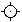

# Ferramenta Classificador de Cores

{zoomable="yes"}

A ferramenta Sampler de Cores permite <b>rastrear o valor de um pixel específico</b> na [Exibição 2D](../../../interface/2d-view/2d-view.md) conforme você ajusta os parâmetros ou alterna os nós.

Ele coloca um pino na viewport e faz a amostragem da cor e da posição do pixel nesse local.

## Usar a ferramenta

Siga estas etapas para acessar e usar a ferramenta:

1. Clique no botão  <b>Informações</b> na barra de ferramentas de exibição 2D para abrir o Dock de informações e a barra de ferramentas
1. Clique no botão  <b>Ferramenta Color Sampler</b> na barra de ferramentas Informações
1. No visor, clique no pixel específico em que você deseja obter uma amostra para colocar um  <b>pino</b>
1. Examine os valores de amostra na seção dedicada do Dock de informações
1. Quando terminar de usar a ferramenta, clique no botão  <b>Excluir</b> para remover o pino do visor.\
   Você também pode remover o pino clicando nele com o botão direito do mouse e selecionando a ação &#39;Excluir&#39; no menu contextual.

Aqui está uma demonstração da ferramenta em ação:

{zoomable="yes"}

*Clique para ampliar*

+++Copie os valores de RGBA de amostra
Você pode copiar os valores amostrados clicando em RMB no pino e selecionando a ação “Copiar valores RGBA” no menu contextual.

Os valores copiados podem ser <b>colados em parâmetros usando uma miniatura de cor</b>.

As miniaturas de cores no painel Informações também podem ser arrastadas e soltas diretamente nas miniaturas de cores desses parâmetros.

{zoomable="yes"}

*Clique para ampliar*

+++

## Informações de amostra

<table>
<tr style="border: 0;">
<td width="100.00%" style="border: 0;" valign="top">

As informações são agrupadas em três tipos e dois formatos.

* <b>Valores de amostra</b> armazenados em cada um dos canais RGBA da imagem:\
  Variável\* / Ponto flutuante
* <b>Amostra de cor</b> na representação HSV:\
  Inteiro de 8 bits / Ponto flutuante
* <b>Posição</b> do pixel em número de pixels e espaço de imagem normalizado:\
  Inteiro / Ponto flutuante

</td>
<td width="33.33%" style="border: 0;" valign="top">

{zoomable="yes"}

</td>
</tr>
</table>

O valor depende da profundidade de bits usada pela imagem. Em um gráfico de Substance, a profundidade de bits é controlada pelo <b>Formato de Saída</b> [parâmetro base](../../../compositing-graphs/graph-parameters/graph-parameters.md).

As profundidades de bits disponíveis são:

* <b>Inteiro de 8 bits:</b> 256 valores inteiros de 0 a 255.
* <b>Inteiro de 16 bits:</b> valores inteiros de 65.536 de 0 a 65.535.
* <b>Baixa precisão HDR (16 bits)</b>: um valor de ponto flutuante codificado usando 16 bits.
* <b>Alta precisão HDR (32 bits)</b>: um valor de ponto flutuante codificado usando 32 bits. Esta é a maior precisão disponível no Designer.
