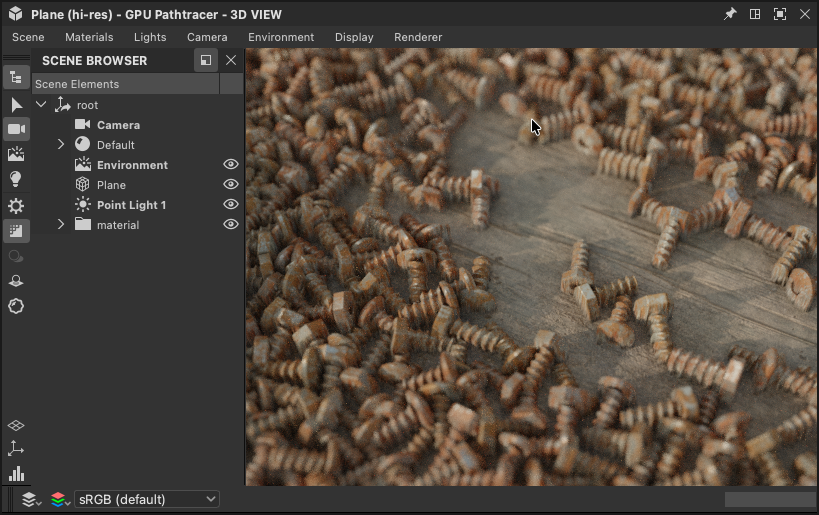
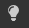
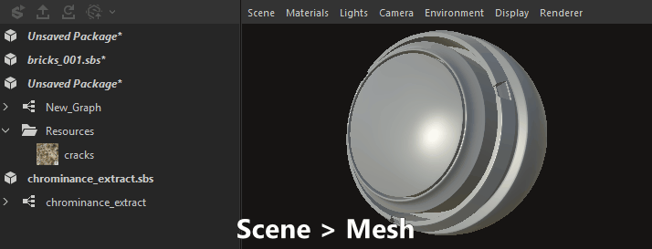
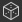
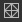

# Visualização 3D

A visualização 3D ajuda você a visualizar e entender seus materiais com malhas personalizadas e materiais PBR renderizados. Assim como ocorre com todas as janelas do Substance 3D Designer, ele funciona com outras janelas por meio de opções de menu de clique com o botão direito do mouse e operações de arrastar e soltar.

A visualização 3D também fornece dois métodos principais de renderização de materiais em cenas 3D:
* Visualização rápida e em tempo real com o **Rasterizador** e os **OpenGL** renderizadores
* Renderizações de rastreamento de raios de alta qualidade com renderizador **GPU Pathtracer**

Saiba mais aqui: [renderizadores 3D](3d-renderers/3d-renderers.md)

+++ O encaixe da visualização 3D

+++

## Interações do visor

A seção abaixo explica como realizar ações comuns resumidamente, juntamente com um GIF animado para ilustrar o processo.

### Navegação

A câmera e o ambiente de exibição 3D podem ser manipulados de três maneiras:

* <b>Órbita:</b> LMB+Arrastar
* <b>Panorâmica</b>: MMB+Arrastar/Ctrl+RMB+Arrastar
* <b>Zoom</b>: rolar usando MouseWheel / RMB+Arrastar
* <b>Girar ambiente:</b> ⇧+RMB+Arrastar
* <b>Foco em uma malha selecionada:</b> F (focaliza na cena inteira se não houver seleção)
* <b>Luz do ponto de órbita 1:</b> Ctrl++LMB+Arrastar
* <b>Mover a luz 1 para mais perto/longe da origem:</b> Ctrl++RMB+Arrastar
* <b>Redefinir posição orbital da câmera:</b> R
* <b>Redefinir a posição e as propriedades da órbita da câmera:</b> ⇧+R

Usar um trackpad (somente macOS)

* <b>Órbita:</b> deslizar com dois dedos
* <b>Panorâmica:</b> ⇧+Passar com dois dedos
* <b>Zoom: </b>Pince com dois dedos / ⌘+Toque com dois dedos
* <b>Girar ambiente:</b> ⇧+Deslizamento com dois dedos

>[!NOTE]
>
> Direção do zoom
> 
> Cada um dos métodos de zoom é invertido com o outro:
> 
> * O botão de rolagem do mouse *aproxima* a cena
> * RMB e arrastar *empurra* a cena para longe
> 
> A direção do zoom pode ser invertida nas [Preferências](../../interface/preferences-window/preferences-window.md).

### Selecionar e focar

Você pode interagir com malhas diretamente na viewport:

<b>Segure e clique no LMB em uma malha para selecionar uma malha.</b> As malhas selecionadas têm um contorno azul.

<b>Pressione F para focalizar em uma malha selecionada</b>. A focagem de uma malha move a câmera para enquadrá-la e orbitar ao redor dela.

<b>Clique em RMB enquanto uma malha é selecionada</b> para acessar suas [ações materiais](#material-actions) em um menu contextual.

<b>Pressione Esc para cancelar a seleção.</b> O cursor não precisa estar na malha.

{zoomable="yes"}

*Selecionar, focar, desmarcar*

{zoomable="yes"}

*Selecionar, menu contextual*

>[!NOTE]
>
> Estas ações não estão disponíveis para o renderizador [OpenGL](../../interface/3d-view/3d-renderers/3d-renderers.md) obsoleto.

### Alterar a iluminação do ambiente (IBL)

O Designer funciona com a iluminação baseada em imagem (IBL) por padrão. Um bitmap de intervalo dinâmico alto é usado para renderizar a iluminação do ambiente.

É possível girar esse ambiente em torno do objeto 3D ou carregar ambientes de luz HDR predefinidos ou personalizados. Observe que as imagens HDR devem usar uma projeção equiretangular e ter uma precisão de ponto flutuante de 32 bits.

⇧+RMB+Arrastar <b>gira o ambiente</b> na exibição 3D.

Para definir uma rotação precisa, use o <b>Ambiente > Editar</b> na barra de ferramentas de exibição 3D superior e altere o controle deslizante <b>Ângulo de rotação</b> na janela de propriedades.

Para usar um ambiente de luz HDR predefinido, clique na seção<b> ambientes HDRI</b> da <b>categoria Exibição 3D </b>na [Biblioteca](../../interface/the-library/the-library.md) e arraste e solte qualquer um dos ícones para a exibição 3D.

Para usar seu próprio ambiente de luz HDR personalizado, importe uma imagem HDR arrastando e soltando o arquivo em um pacote na Janela do Explorador (<b>Vincular</b> o arquivo quando solicitado). Em seguida, arraste e solte o recurso e escolha <b>Panorama Latitude/Longtitude</b> como destino.

### Luzes de ponto

Vá para <b>Luzes > Editar propriedades</b> para alternar as luzes de ponto na cena.

A luz de ponto 1 pode ser movida ao redor da origem da cena, segurando o LMB ou RMB e arrastando na viewport no modo de Iluminação. 

No modo Câmera  , você também pode mudar temporariamente para o modo Iluminação pressionando as teclas Ctrl+ em combinação com os botões do mouse.

## Visualização de dados em 3D

### Gráficos do Substance

É possível visualizar materiais inteiros como um material completo na Visualização 3D. Esta é a maneira mais comum de trabalhar e corresponderá os [atributos de uso nos nós de saída](../../compositing-graphs/nodes-reference-for-com/atomic-nodes/output/output.md) aos slots de textura relevantes do material de exibição 3D. Isso significa que as saídas precisam ser definidas corretamente (o uso de Modelos garante que esse seja o caso) e que você selecionou suporte para sombreador de material/visor

Para exibir todas as saídas de um gráfico, clique em *RMB* em uma área vazia na [Exibição de gráfico](../../interface/the-graph-view/the-graph-view.md) e escolha a opção **Exibir saídas na exibição 3D** no menu contextual.

Você também pode exibir as saídas de um gráfico sem precisar abri-lo, clicando em RMB em um recurso de gráfico no encaixe do [Explorer](../the-explorer-window/the-explorer-window.md) e escolhendo a opção **Exibir Saídas no Modo de Exibição 3D** no menu contextual.

Como alternativa ao menu contextual do gráfico, você pode obter o mesmo resultado arrastando o gráfico do encaixe do [Explorer](../the-explorer-window/the-explorer-window.md) para a Exibição 3D.

Ao *carregar um gráfico*, suas saídas são aplicadas automaticamente na Exibição 3D por padrão. Você pode desabilitar esse comportamento em [Preferências](../../interface/preferences-window/preferences-window.md). Vá para **Editar > Preferências > Gráfico > Comum** e desmarque a opção **Exibir saídas na exibição 3D ao abrir um gráfico**.

>[!NOTE]
>
> **Vários Slots de Material**
> 
> Se você usar malhas personalizadas com mais de um material, será solicitado a escolher a qual slot de material atribuir o material. Com qualquer um dos métodos acima, clique em um slot para confirmar sua escolha. Para obter mais informações sobre os materiais e suas atribuições, leia a seção detalhada abaixo.

### Nó individual/saída do gráfico

Você pode exibir apenas uma única saída em qualquer canal de material disponível na [Exibição 3D](https://substance3d.adobe.com/). Isso é usado com menos frequência, mas é bom para visualizar testes rápidos ou nós individuais sem saída.

Você pode exibir qualquer nó, não apenas os nós de saída, clicando com o botão direito do mouse no [Modo de exibição de Gráfico](../../interface/the-graph-view/the-graph-view.md) e escolhendo <b>Modo de Exibição 3D</b>. Você verá uma lista com canais disponíveis para atribuir o nó. Clique em qualquer para confirmar.

Você também pode usar *RMB* para arrastar e soltar qualquer nó da exibição Gráfico para a exibição 3D. Você verá uma lista com canais disponíveis para atribuir o nó. Clique em qualquer para confirmar.

Você pode exibir qualquer saída de gráfico individual expandindo o recurso de gráfico no encaixe do [Explorer](../the-explorer-window/the-explorer-window.md) e usando o *LMB* para arrastar essa saída para a Exibição 3D. Você verá uma lista com canais disponíveis para atribuir o nó. Clique em qualquer para confirmar.

## Exibir (personalizar) cenas 3D

O Designer oferece uma dúzia de malhas predefinidas. Essas malhas têm coordenadas UV uniformes e utilizáveis e servem à maioria dos cenários para texturas de revestimento. Também é possível importar e visualizar suas próprias malhas 3D.\
Escolha qualquer uma das malhas padrão no menu suspenso <b>Cena</b> na barra superior.

Para cenas 3D personalizadas, vá para a seção [Trabalhando com cenas 3D](../../working-with-3d-scenes/working-with-3d-scenes.md).

## Alterar propriedades do sombreador

Há alguns [sombreadores](../../glossary/glossary.md) diferentes disponíveis por padrão no Designer, e cada sombreador tem opções além de apenas canais de textura. Eles podem ser configurados individualmente.

Lembre-se de que os sombreadores são diferentes nos [renderizadores 3D](../../interface/3d-view/3d-renderers/3d-renderers.md) do Designer e somente configurações marcadas com um rótulo &#39;Comum&#39; serão mantidas ao alternar os renderizadores.

Para alterar o sombreador atual, vá para <b> Menu &#39;</b>Materiais&#39; e abrir o submenu do material que você deseja editar.

Por exemplo, para ajustar a propriedade &#39;Escala de Height&#39; para o material &#39;Padrão&#39; na cena &#39;Plano (alta resolução)&#39;, vá para &#39;Materiais > Padrão > Editar propriedades&#39;. Em seguida, localize a propriedade “Escala de Height” no encaixe Propriedades.

Os sombreadores podem ser redefinidos usando as ações “Redefinir material” ou “Redefinir para estado de cena” no submenu. Se você estava visualizando saídas de gráfico de Substance na visualização 3D, será necessário reaplicá-las.

>[!NOTE]
>
> Sobre o mosaico
> 
> A propriedade “Fator de mosaico” varia de acordo com o renderizador 3D selecionado:
> 
> * <b>Rasterizador/GPU Pathtracer:</b> localizado nas configurações do renderizador (Renderizador > Configurações de edição), afeta a *cena inteira*.
> * <b>OpenGL:</b> localizado nas propriedades do material, afeta o material.

## Exportar cena

Saiba como exportar cenas 3D em [esta página](../../working-with-3d-scenes/exporting-scenes/exporting-scenes.md).

### Exportar malha em mosaico (somente renderizador OpenGL)

Você pode exportar a malha da <b>Exibição 3D</b> para um arquivo nos formatos <b>OBJ</b>, <b>FBX</b> ou <b>PLY</b>. Se o deslocamento *mosaico* estiver habilitado, a subdivisão da geometria será inserida na malha exportada.

Entretanto, os normais de vértice da malha original podem não corresponder à sua nova forma deslocada, o que significa que a malha deslocada pode não ser renderizada corretamente. É possível gerenciar isso de duas maneiras:

* Use a malha *mapa normal* que fornecerá os normais corretos
* *Recalcular os normais de malha* na exportação usando o mapa de malha normal, o que significa que esses normais são colocados na malha exportada e que o mapa normal não é mais necessário

Para exportar a malha de Exibição 3D, vá para <b>Cena > Exportar malha em mosaico...</b>, defina sua escolha em relação ao recálculo normal e selecione um local, nome e formato de arquivo para a malha exportada.

>[!NOTE]
>
> Este recurso *não está disponível* no **macOS**.

>[!IMPORTANT]
>
> Algumas ressalvas
> 
> Se a malha original tiver vários materiais e/ou conjuntos UV, eles serão *mesclados em um*.
> 
> A duração do processo de exportação e o tamanho do arquivo resultante dependem da contagem do triângulo de malha e do *fator de mosaico*. Valores altos de fator de mosaico podem resultar em instabilidade, dependendo do pool de memória integrada da GPU.
> 
> Dito isso, a contagem de vértices da malha em mosaico deve estar no *mesmo intervalo* que a contagem de pixels do mapa de *height*.
> 
> Ter uma malha mais densa do que o mapa de heights pode criar uma malha um pouco mais suave ao usar o mosaico <b>Phong</b>, mas você deve buscar exportar a malha de forma confiável com os detalhes necessários do mapa de heights primeiro e, em seguida, refinar a malha exportada em outro software, se necessário.

>[!WARNING]
>
> **TDR (somente Windows)**
> 
> Este recurso requer que o <b>Timeout Detection and Recovery (TDR)</b> corresponda aos valores recomendados em [esta página](https://experienceleague.adobe.com/pt-br/docs/substance-3d-painter/using/technical-support/technical-issues/gpu-issues/gpu-drivers-crash-with-long-computations-tdr-crash) da nossa documentação, conforme estabelecido nos [Requisitos técnicos](../../getting-started/system-requirements/system-requirements.md) da Designer.

## Barra de menus

A barra de menus fornece sete menus com opções relacionadas à Visualização 3D. abaixo há uma visão geral de todas as opções disponíveis.

+++Cena
O menu <b>Cena</b> lida com a geometria (Recurso 3D) exibida e com os estados de exibição 3D. O compartilhamento de recursos 3D é apenas a malha, os estados da cena são luzes, câmera e configurações relacionadas e também podem conter a malha ao lado.

<b>Editar: </b>Carrega as opções de cena no painel [Propriedades](../../interface/properties/properties.md). Permite alternar a visibilidade da malha 3D.

<b>Primitivas padrão:</b> mostra qualquer uma das malhas 3D simples abaixo na Exibição 3D.

* Cubo

* Cilindro

* Caixa Vazia

* Caixa interna

* Plano

* Plano (alta resolução)

* Esfera

<b>Primitivas estendidas:</b> mostra qualquer uma das malhas 3D abaixo na exibição 3D.

* Tecido

* Mat Ball

* Cubo arredondado

* Cilindro arredondado

* Blocos da esfera 2

* Torus

<b>Exibir UVs em exibição 2D:</b> permite a exibição dos UVs para a malha selecionada atualmente como uma sobreposição na [exibição 2D](../2d-view/2d-view.md).

<b>Criar recurso 3D da cena atual...:</b> cria um novo [recurso de cena 3D](../../resources/3d-scene-resource/3d-scene-resource.md) em um pacote fora da cena atual.

<b>Carregar arquivo de estado...: </b>Carrega um [arquivo de estado de cena](../../working-with-3d-scenes/working-with-3d-scenes.md) salvo externamente (\*.sbsscn). Não substitui a malha 3D, carrega apenas configurações para renderizador 3D, câmera e luzes.

<b>Arquivo de estado de carregamento com malha...:</b> Carrega um [arquivo de estado de cena](../../working-with-3d-scenes/working-with-3d-scenes.md) salvo externamente (\*.sbsscn). Carrega as configurações de renderizador 3D, câmera, luzes, juntamente com sua cena 3D de referência. .

<b>Salvar arquivo de estado...: </b>Salve o estado atual da exibição 3D em um [arquivo de estado de cena](../../working-with-3d-scenes/working-with-3d-scenes.md) (\*.sbsscn).

<b>Salvar o estado atual como padrão: </b>Definir o estado atual da exibição 3D como um [arquivo de estado de cena](../../working-with-3d-scenes/working-with-3d-scenes.md) a ser usado por padrão ao criar novas Exibições 3D. Este arquivo é carregado sempre que a exibição 3D é redefinida ou inicializada e pode ser definido nas [Configurações do projeto](../../interface/preferences-window/project-settings/project-settings.md).

<b>Exportar cena:</b> *(Somente renderizadores Rasterizador/GPU Pathtracer)* Exporta a cena atual como uma [cena achatada](../../working-with-3d-scenes/exporting-scenes/exporting-scenes.md), em que apenas a cena resultante é gravada e todas as referências à cena original são perdidas. O conteúdo da cena exportada depende dos recursos compatíveis com o formato de exportação selecionado.\
Formatos disponíveis: STL, FBX, GLB, GLTF, PLY, USDC, USD, USDA, USDZ, OBJ.

<b>Exportar cena com camadas:</b> *(Somente renderizadores rasterizadores/GPU Pathtracer)*Exporta a cena atual como uma [cena em camadas](../../working-with-3d-scenes/exporting-scenes/exporting-scenes.md), onde todas as edições na cena original são salvas em arquivos separados em um fluxo de trabalho não destrutivo. Isso só está disponível para formatos de arquivo USD.\
Os formatos disponíveis são: USDC, USD, USDA.

<b>Exportar geometria em mosaico:</b> *(Somente renderizador OpenGL)* Exporta a cena atual com mosaico como geometria bruta. Consulte a seção Exportar cena.

<b>Redefinir cena: </b>Redefine a exibição 3D para o padrão.

Algumas atualizações de software podem alterar o modo como os arquivos de estado da Cena são salvos/carregados.

Se a cena não for restaurada corretamente *do arquivo, é recomendável definir manualmente o estado desejado da cena e* reexportar *o arquivo de estado da Cena.*

+++

+++Materiais
O menu <b>Materiais</b> muda com base na malha 3D carregada e no renderizador usado.

O menu “Materiais” apresenta uma lista de todos os materiais atribuídos a uma malha na cena. Cada material listado no menu “Materiais” tem um submenu de ações de material:

<b>Editar</b> - Edite as configurações do material atual na janela Propriedades.

<b>Lista de sombreadores</b> - Todos os [sombreadores](../../glossary/glossary.md) disponíveis para o [renderizador 3D](../../interface/3d-view/3d-renderers/3d-renderers.md) atual.

<b>Carregar definição...: </b>(somente renderizador OpenGL) permite carregar seu próprio sombreador personalizado de [GLSLFX.](../../interface/3d-view/glslfx-shaders/glslfx-shaders.md) O sombreador é adicionado à lista acima.

<b>Redefinir parâmetros comuns:</b> redefine todos os parâmetros que são comuns entre sombreadores. Por exemplo, ao alternar entre os renderizadores Rasterizer/GPU Pathtracer e OpenGL, vários valores de parâmetro no [Adobe Standard Material](https://experienceleague.adobe.com/pt-br/docs/substance-3d/general-knowledge/asm/adobe-standard-material) são transportados.

<b>Renomear:</b> altere o rótulo deste material.

<b>Redefinir material:</b> redefine todos os parâmetros de sombreador para seus valores padrão. Se as texturas estiverem conectadas a qualquer um dos classificadores do sombreador, elas serão desconectadas.

<b>Redefinir o material para o estado da cena: </b>*(apenas renderizadores Rasterizador/GPU Pathtracer)* Redefine todas as propriedades de [materiais substituídos](../../working-with-3d-scenes/overriding-scene-mat/overriding-scene-materials.md) para os valores originais da cena, incluindo texturas originais, se houver.

<b>Adicionar: </b>Adiciona um novo material à lista. Ele não é usado por padrão e pode estar [conectado a um material de cena](../../working-with-3d-scenes/overriding-scene-mat/overriding-scene-materials.md) usando o [navegador de cena](../../interface/3d-view/scene-browser/scene-browser.md).

+++

+++Luzes
O menu <b>Luzes</b> lida apenas com luzes de ambiente e de ponto antigas e herdadas. Essas luzes não são compatíveis com PBR e não fornecem os mesmos resultados de alta qualidade que a renderização baseada em imagem HDR.

<b>Editar:</b> edite configurações individuais para a luz ambiente e as luzes de dois pontos.

<b>Redefinir Luzes:</b> redefine as propriedades de luz para o estado padrão.

+++

+++Câmera
O menu <b>Câmera</b> permite alterar as configurações da câmera, ir para ângulos predefinidos e carregar ângulos da câmera armazenados em um arquivo de malha 3D personalizado.

<b>Editar propriedades:</b> abre as configurações padrão da câmera no encaixe Propriedades.

<b>Foco: </b>(F) focaliza a câmera padrão na malha selecionada atualmente. Ou seja, quadro a malha e alinha o giro da câmera a ela. Se não houver nenhuma seleção ativa, a caixa delimitadora global da cena será usada.

<b>Câmeras da cena:</b> se as cenas incluírem uma ou mais câmeras, elas serão listadas aqui e suas configurações serão usadas como predefinições a serem aplicadas à câmera padrão da cena.

<b>Pontos de vista:</b> ponto de vista pré-configurado para a câmera padrão. Elas somente afetam a transformação da câmera (posição e rotação).

* Padrão: uma tomada de ângulo alto a partir da frente esquerda dos objetos.

* Voltar

* Inferior

* Frontal

* Esquerda

* Direita

* Superior

<b>Salvar renderização...:</b> (Alt+S) salva a imagem renderizada atualmente em disco, na resolução especificada nas propriedades do renderizador ou nas propriedades padrão da câmera se uma resolução de substituição tiver sido configurada.

<b>Copiar renderização para a área de transferência:</b> (Alt+C) copia a imagem renderizada atualmente para a área de transferência, para colagem em um editor de imagens externo.

<b>Redefinir posição:</b> (R) redefine a posição da câmera.

<b>Redefinir selecionado:</b> (Shift+R) Redefine a posição e as propriedades da câmera.

+++

+++Ambiente
O menu <b>Ambiente</b> permite que você modifique as configurações relacionadas ao ambiente HDRI usado para iluminar materiais corretos de PBR.

<b>Editar propriedades:</b> dá acesso às configurações do ambiente HDR, usado para iluminação no PBR. Especificamente, você pode alternar a visibilidade, alterar a exposição com uma visualização e definir a rotação com um controle deslizante preciso.

<b>Redefinir ambiente:</b> redefine todas as propriedades do ambiente para o padrão.

+++

+++Exibir
O menu de exibição permite alternar os modos de exibição, auxiliares e informações da cena renderizada:

<b>Eixo:</b> alterna a exibição do eixo 3D no visor.

<b>Grade:</b> alterna a exibição do mundo amigo.

<b>Resolução:</b> alterna a exibição de um pequeno contador de resolução.

<b>Estatísticas de cena:</b> alterna a exibição de estatísticas de cena, como contagem de polígonos, contagem de materiais, contagem de malhas estáticas etc.

<b>Tempo de renderização:</b> O tempo para calcular uma amostra para a imagem completa.

<b>Amostras:</b> a quantidade de amostras de pixels computadas para suavização de borda de acumulação (rasterizador) ou rastreamento de caminho (rastreador de caminho de GPU).

<b>Seleção de face de fundo:</b> desabilitar esta opção permite ver uma face de malha de *ambos os lados*. A opção funciona em combinação com o Wireframe

<b>Caixa delimitadora:</b> alterna a exibição da caixa delimitadora da malha.

<b>Wireframe:</b> alterna a exibição do wireframe de malha.

<b>Luz:</b> alterna a exibição de linhas auxiliares para as luzes de ponto.

<b>Espaço tangente do vértice:</b> exibe os vetores tangente, binormal e normal para todos os vértices como gizmos coloridos

Algumas dessas opções estão disponíveis quando o botão é alternado na barra de ferramentas Cena.

+++

+++Renderizador
O menu <b>Renderizador</b> permite alternar renderizadores 3D e acessar as propriedades do renderizador 3D atual por meio da ação <b>Editar propriedades</b>.

Os renderizadores disponíveis e suas configurações estão documentados em [esta página dedicada](../../interface/3d-view/3d-renderers/3d-renderers.md).

+++

## Barra de ferramentas Cena

A barra de ferramentas **Cena**, localizada na borda esquerda da Exibição 3D por padrão, oferece controles para exibir e interagir com a cena.

Também permite acessar o [pop-up de Deslocamento](displacement/displacement.md) e o encaixe do [navegador de cena](scene-browser/scene-browser.md).

>[!NOTE]
>
> A barra de ferramentas pode ser *reposicionada* em torno do encaixe da **Visualização 3D** usando a *alça* mais à esquerda representada por três linhas paralelas.

### Opções de exibição

#### Superior

 

 <b>Navegador de cena</b>

Exibe uma hierarquia de todos os elementos em uma cena 3D.

>[!INFO]
>
>O navegador Cena e seus recursos são amplamente abordados na [página dedicada](../../interface/3d-view/scene-browser/scene-browser.md).

 <b>Selecionar</b>

Permite a seleção direta de malhas na cena.

<code> MB</code> Selecione uma malha na cena.

Seleciona malhas individuais na cena. As malhas selecionadas têm um contorno azul no visor e são destacadas no [navegador de cena](../../interface/3d-view/scene-browser/scene-browser.md).

Um menu contextual está disponível para malhas selecionadas e pode ser exibido clicando em <code>RMB</code>.

As malhas também podem ser selecionadas nos modos Câmera ou Luz ao pressionar <code>Shift+LMB</code>.

 

 <b>Câmera</b>

Permite o controle direto da câmera na cena.

<code> MB</code> Órbita a câmera ao redor de seu destino. <code>RMB</code> Mova a câmera para mais perto ou mais longe do destino.

 

 <b>Mostrar ambiente</b>

Esse botão alterna a exibição do ambiente da cena. A mesma configuração pode ser encontrada no Dock Propriedades depois de ir para <b>Ambiente > Editar</b> na barra de menus do Visualização 3D.

 

 <b>Claro</b>

Permite o controle direto do Ponto de luz 1 na cena.

<code> MB</code> Orbitar a câmera ao redor da origem da cena. <code>RMB</code> Mova a luz para mais perto ou mais longe da origem da cena.

 

 <b>Configurações do renderizador</b>

Exibe as configurações do renderizador atual no encaixe [Propriedades](../properties/properties.md).

 

 <b>Habilitar Pathtracer</b>

Alterna a seleção do renderizador [GPU Pathtracer](3d-renderers/3d-renderers.md#gpu-pathtracer).

 

 <b>Habilitar sombras</b>

Alterna a renderização de sombras em tempo real no renderizador [rasterizador](3d-renderers/3d-renderers.md#rasterizer).

 

 <b>Habilitar plano horizontal</b>

Alterna a renderização do plano terrestre nos renderizadores [Rasterizador](3d-renderers/3d-renderers.md#rasterizer) e [GPU Pathtracer](3d-renderers/3d-renderers.md#gpu-pathtracer).

 

 <b>Deslocamento</b>

Exibe o [pop-up de Deslocamento](displacement/displacement.md).

 

#### Inferior

 

 <b>Grade</b>

Alterna a exibição da grade mundial.

 

 <b>Estatísticas de cena</b>

Alterna a exibição de estatísticas de cena, como contagem de politons, contagem de materiais, contagem de malhas estáticas etc.

 

 <b>Eixo</b>

Alterna a exibição do eixo 3D na janela de visualização.

 

#### Somente renderizador OpenGL

 

 <b>Seleção de plano de fundo</b>

Desabilitar essa opção permite ver uma malha de *ambos os lados*. A opção funciona em combinação com o Wireframe.

 

 <b>Caixa Delimitadora</b>

Alterna a exibição da caixa delimitadora da malha.

 

 <b>Espaço tangente do vértice</b>

Exibe os vetores tangente, binormal e normal para todos os vértices como gizmos coloridos.

 

 <b>Wireframe</b>

Alterna a exibição da malha como um wireframe.

## Exibir barra de ferramentas

A barra de ferramentas <b>Exibição</b>, localizada na *parte inferior* do painel <b>Exibição 3D</b> por padrão, permite controlar como a imagem renderizada é exibida no visor.

>[!NOTE]
>
> A barra de ferramentas pode ser *reposicionada* em torno do encaixe da **Visualização 3D** usando a *alça* mais à esquerda representada por três linhas paralelas.

### Renderização 3D de AOVs

<table style="margin-top: 32px; margin-bottom: 32px">
    <tr style="border: 0; vertical-align: top">
        <td style="border: 0">
            
Você pode exibir <a href="../../glossary/glossary.md#aov">AOVs</a> diferentes usando o botão  <b>AOVs de renderização 3D</b>.

            
As AOVs permitem inspecionar as informações de malha e material isoladamente para trabalho e depuração focados.

            
Algumas AOVs incluem <i>valores HDR</i> que estão fixados em 1 (branco puro) ou 0 (preto puro) no visor. Para inspecionar o intervalo completo de valores, você pode exportar uma renderização 3D da AOV para um formato de arquivo de imagem que ofereça suporte a valores HDR, como <code>.exr</code>. Use a opção de menu <code>Camera > Save render...</code> para exportar a AOV atual.

            
<i>Observação:</i> as AOVs só estão disponíveis ao usar o Rasterizador e os <a href="./3d-renderers/3d-renderers.md">renderizadores 3D GPU Pathtracer</a>.

        </td>
        <td style="width: 33%; border: 0">
            
        </td>
    </tr>
</table>

### Canais de cores

Você pode exibir um único canal da imagem usando o botão  <b>Canais de cores</b>. Isso abre uma caixa de combinação que permite selecionar quais canais <b>Vermelhos</b>, <b>Verdes</b> e <b>Azuis</b> devem ser exibidos. O aspecto normal da imagem com todos os canais é restaurado selecionando a opção <b>RGB</b>.

O *ícone* do botão <b>Canais de cores</b> *muda* dependendo do(s) canal(is) exibido(s) atualmente.

### Espaço da cor

Para obter uma representação mais precisa das cores, as imagens são exibidas por padrão em um *espaço de cores* que corresponde ao usado pelo *monitor*.

Os controles disponíveis dependerão do modo de gerenciamento de cores definido em [Configurações do projeto](../../interface/preferences-window/project-settings/project-settings.md). Saiba mais sobre esses controles na seção [Gerenciamento de cores](../../color-management/color-management.md) desta página.
