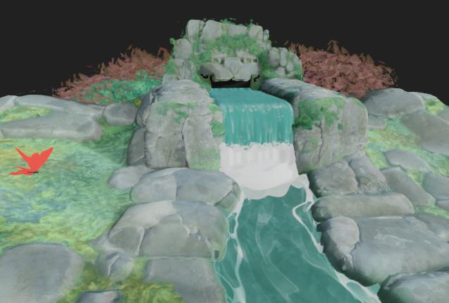
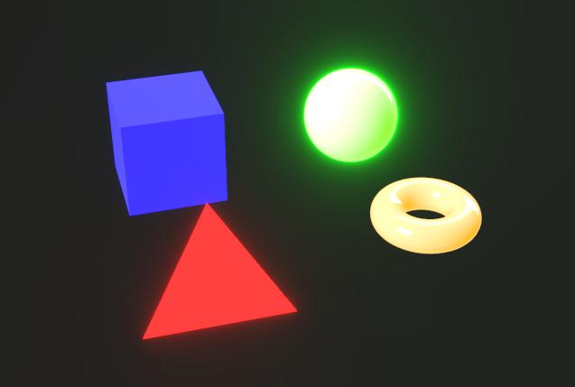

# Pós-efeitos

{zoomable="yes"}

Nas propriedades da câmera, você pode ativar os pós-efeitos para aprimorar as renderizações ou verificar as propriedades específicas do material.

Esses efeitos são desenvolvidos internamente e estão disponíveis somente para o Rasterizador e os [renderizadores](../../../../interface/3d-view/3d-renderers/3d-renderers.md) de GPU Pathtracer.

Qualquer pós-efeito habilitado no momento de salvar [recursos de cena 3D](../../../../resources/3d-scene-resource/3d-scene-resource.md) ou [arquivos de estado de cena](../../../../working-with-3d-scenes/working-with-3d-scenes.md) será salvo como parte do estado de cena.

<table>
<tr style="border: 0;">
<td style="border: 0;" valign="top">

## Mapeamento de tons

</td>
<td style="border: 0;" valign="top">

### Florescer

</td>
<td style="border: 0;" valign="top">

### Profundidade de campo

</td>
<td style="border: 0;" valign="top">

</td>
</tr>
</table>

## Mapeamento de tons

Remapeia as cores de renderização de acordo com algoritmos específicos e/ou tabelas de pesquisa (LUT).

Isso permite melhorar a consistência de cores entre aplicativos. Por exemplo, o mapeador de tons AgX também está disponível no Blender.

+++Reinhard

<table>
  <tr>
    <td>
      
       <i>Antes</i>
    </td>
    <td>
      
       <i>Depois</i>
    </td>
  </tr>
</table>

+++

+++Atan

<table>
  <tr>
    <td>
      
       <i>Antes</i>
    </td>
    <td>
      
       <i>Depois</i>
    </td>
  </tr>
</table>

+++

+++Exp

<table>
  <tr>
    <td>
      
       <i>Antes</i>
    </td>
    <td>
      
       <i>Depois</i>
    </td>
  </tr>
</table>

+++

+++Log

<table>
  <tr>
    <td>
      
       <i>Antes</i>
    </td>
    <td>
      
       <i>Depois</i>
    </td>
  </tr>
</table>

+++

+++Aces

<table>
  <tr>
    <td>
      
       <i>Antes</i>
    </td>
    <td>
      
       <i>Depois</i>
    </td>
  </tr>
</table>

+++

+++Hejl

<table>
  <tr>
    <td>
      
       <i>Antes</i>
    </td>
    <td>
      
       <i>Depois</i>
    </td>
  </tr>
</table>

+++

+++Neutro

<table>
  <tr>
    <td>
      
       <i>Antes</i>
    </td>
    <td>
      
       <i>Depois</i>
    </td>
  </tr>
</table>

+++

+++Agx

<table>
  <tr>
    <td>
      
       <i>Antes</i>
    </td>
    <td>
      
       <i>Depois</i>
    </td>
  </tr>
</table>

+++

+++Pbr neutro

<table>
  <tr>
    <td>
      
       <i>Antes</i>
    </td>
    <td>
      
       <i>Depois</i>
    </td>
  </tr>
</table>

+++

## Florescer

Simula o efeito na câmera de bordas de luzes sangrando para fora de áreas muito claras em áreas que recebem menos luz.

O efeito é influenciado pela iluminação, exposição da câmera e materiais emissivos da cena.

+++Limiar
O valor de luminância acima do qual a flor deve ser visível.

*Esquerda: 1.0 / Direita: 4.0*

<table>
  <tr>
    <td>
      
       <i>Antes</i>
    </td>
    <td>
      
       <i>Depois</i>
    </td>
  </tr>
</table>

+++

+++Queda
O gradiente de atenuação da flor, em que um valor mais baixo resulta em um raio de flor mais curto.

*Esquerda: 1.0 / Direita: 0.6*

<table>
  <tr>
    <td>
      
       <i>Antes</i>
    </td>
    <td>
      
       <i>Depois</i>
    </td>
  </tr>
</table>

+++

+++Nível
A intensidade da flor. Um valor mais alto resulta em bordas mais claras e mais brilhantes.

*Esquerda: 8.0 / Direita: 2.0*

<table>
  <tr>
    <td>
      
       <i>Antes</i>
    </td>
    <td>
      
       <i>Depois</i>
    </td>
  </tr>
</table>

+++

+++Mudança de cor
Desloca o matiz das áreas afetadas pela flor para cores mais quentes.

*Esquerda: 0.0 / Direita: 0.8*

<table>
  <tr>
    <td>
      
       <i>Antes</i>
    </td>
    <td>
      
       <i>Depois</i>
    </td>
  </tr>
</table>

+++

## Profundidade de campo

Simula o fenômeno óptico causado pelas lentes da câmera, em que os objetos mais próximos e distantes da distância de foco ficam desfocados.

O efeito é afetado pelos parâmetros “F-Stop” e “Distância de foco” da câmera.

>[!TIP]
>
> Para ajustar rapidamente o foco da câmera, coloque o cursor no local de uma cena que deseja em foco e pressione Ctrl+LMB (Windows) ou Cmd+LMB (macOS) para definir automaticamente a distância de foco para esse local.

+++Raio máximo
O raio máximo do efeito de desfoque.

*Esquerda: 32.0 / Direita: 4.0*

<table>
  <tr>
    <td>
      
       <i>Antes</i>
    </td>
    <td>
      
       <i>Depois</i>
    </td>
  </tr>
</table>

+++

+++Resistência composta
A magnitude do efeito de desfoque da distância de foco para fora.

*Esquerda: 0.2 / Direita: 0.05*

<table>
  <tr>
    <td>
      
       <i>Antes</i>
    </td>
    <td>
      
       <i>Depois</i>
    </td>
  </tr>
</table>

+++

+++Desvio longitudinal
A intensidade do desvio que ocorre fora da distância do foco.

O Desvio simula como diferentes comprimentos de onda de luz têm distâncias focais ligeiramente diferentes, resultando em cores que parecem estar deslocadas e com diferenças sutis de foco.

*Esquerda: 0.0 / Direita: 1.0*

<table>
  <tr>
    <td>
      
       <i>Antes</i>
    </td>
    <td>
      
       <i>Depois</i>
    </td>
  </tr>
</table>

+++

+++Desvio acromático
Especifica se o desvio deve ser acromático, o que significa que algumas ou todas as cores têm a mesma distância focal.

Isso faz com que o efeito de desfoque pareça estar mais uniformemente distribuído.

*Esquerda: Verdadeiro / Direita: Falso*

<table>
  <tr>
    <td>
      
       <i>Antes</i>
    </td>
    <td>
      
       <i>Depois</i>
    </td>
  </tr>
</table>

+++

+++Olho de gato
Ativa o efeito de olho do gato na cena, que simula como a luz que entra em um ângulo oblíquo não entra em um disco, mas em um oval irregular, causando distorção.

Esse efeito é mais pronunciado em aberturas mais altas, ou seja, valores de parada F mais baixos.

*Esquerda: Verdadeiro / Direita: Falso*

<table>
  <tr>
    <td>
      
       <i>Antes</i>
    </td>
    <td>
      
       <i>Depois</i>
    </td>
  </tr>
</table>

+++
