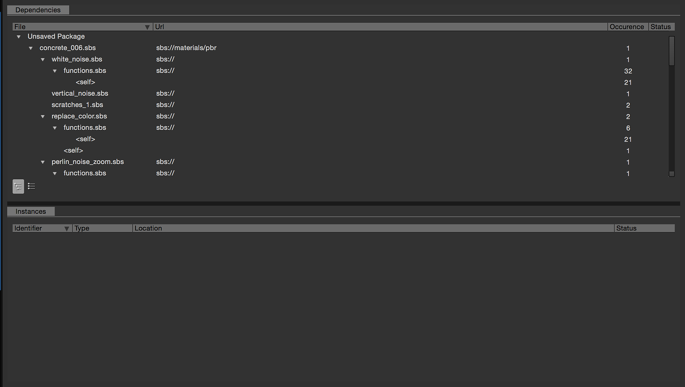

# Gerenciador de Dependências

O <b>Gerenciador de dependências</b> permite ver todas as dependências do pacote, bem como localizá-las e repará-las em caso de problemas.

Você pode acessá-lo clicando com o botão direito do mouse em um pacote no Explorer e escolhendo a opção “Gerenciador de dependências” no menu contextual.

