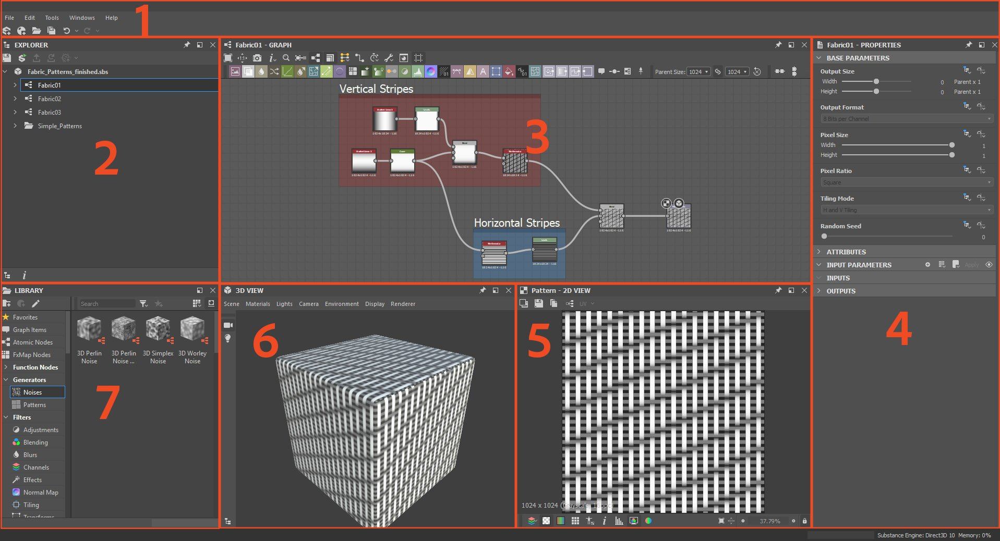

# Espaço de trabalho

O espaço de trabalho é dividido em áreas separadas chamadas <b>docks</b>, que podem ser [redimensionadas, movidas e desencaixadas](../interface/customizing-your-wor/customizing-your-workspace.md) da janela principal do Designer em uma doca flutuante.

Este é o layout de encaixe padrão do Designer:

<table>
<tr style="border: 0;">
<td style="border: 0;" valign="top">

Barra de ferramentas e menu principal do <b>1</b>

Explorador de <b>2</b>

Exibição de gráfico <b>3</b>

</td>
<td style="border: 0;" valign="top">

Propriedades de <b>4</b>

Visualização 2D <b>5</b>

</td>
<td style="border: 0;" valign="top">

Visualização 3D <b>6</b>

Biblioteca do <b>7</b>

</td>
</tr>
</table>

>[!NOTE]
>
> Dimensionamento de interface
> 
> O Designer adquire a escala específica de elementos da interface do usuário *do sistema operacional*. Portanto, qualquer ajuste no dimensionamento da interface de usuário deve ser feito nas configurações de exibição do SO.
> 
> Para garantir que as configurações de exibição sejam aplicadas corretamente no Designer, *saia* da sessão de usuário do sistema operacional e entre novamente após alterar essas configurações.

<table>
<tr style="border: 0;">
<td style="border: 0;" valign="top">

## Menu principal e barra de ferramentas

A barra de ferramentas principal permite acessar menus extras, como a[janela Preferências](../interface/preferences-window/preferences-window.md), e tem alguns botões para criar rapidamente um novo gráfico de Substance e pacote.

</td>
<td style="border: 0;" valign="top">

</td>
</tr>
</table>

* <b>Arquivo: </b>Permite criar novos pacotes e recursos, bem como salvar e fechar pacotes nos quais você está trabalhando. As funções deste menu também estão disponíveis como botões rápidos nesta barra de ferramentas.
* <b>Editar: </b>fornece as funções Desfazer e Refazer (disponíveis como botões rápidos abaixo), bem como acesso a [Preferências](../interface/preferences-window/preferences-window.md), para personalização na profundidade.
* <b>Ferramentas:</b> Controla Substance Engine e permite acessar o Gerenciador de Plug-ins.
* <b>Janelas:</b> permite que você oculte ou mostre qualquer uma das janelas (algumas estão ocultas por padrão) e permite que você redefina o layout da janela de volta ao padrão.
* <b>Ajuda: </b>Fornece acesso a informações adicionais e recursos online, como o Instituto Substance ou este site de documentação.

## Explorer

[A janela do Explorer](the-explorer-window/the-explorer-window.md) é a principal maneira de interagir com qualquer tipo de arquivo e recurso. Ele fornece mais opções do que o menu Arquivo na barra de ferramentas principal. Aqui é onde o início e o fim de cada sessão de trabalho.

## Exibição de gráfico

[O Dock do modo de exibição Gráfico](../interface/the-graph-view/the-graph-view.md) é a janela mais importante do Substance 3D Designer. Ele exibe as redes nodais de qualquer tipo de gráfico disponível no Designer ([gráficos de Substance](../compositing-graphs/substance-compositing-graphs.md), [gráficos de funções de Substance](../function-graphs/function-graphs.md), [gráficos de FX-Map](../function-graphs/fxmaps/fxmaps.md)) e permite que você os crie e edite.

## Propriedades

O [Encaixe de propriedades](properties/properties.md) é a janela mais técnica. É sempre sensível ao contexto e apresentará controles deslizantes, listas suspensas e outros elementos que alteram o comportamento de um recurso ou nó selecionado.

## Visualização 2D

[O Modo de Exibição 2D](../interface/2d-view/2d-view.md) é a ferramenta de visualização mais simples. Ele funciona em conjunto com o Gráfico: clicar duas vezes em qualquer Nó na Visualização do gráfico exibirá o resultado visual na Visualização 2D.

## Visualização 3D

[A Exibição 3D](../interface/3d-view/3d-view.md) é a janela de visualização mais interativa e avançada. Diferentemente da visualização 2D, ela usa vários mapas de saída diferentes para renderizar um material completo. Isso significa que todos os canais são representados, como Basecolor, Normal e Aspereza.

## Biblioteca

[O Dock da biblioteca](../interface/the-library/the-library.md) fornece acesso a todo o conteúdo incluído na biblioteca do Designer por padrão, bem como ao seu [conteúdo personalizado](../interface/the-library/managing-custom-content/managing-custom-content-and-filters.md). Para entender melhor a diferença entre Nós Atômicos e Nós de Instância na biblioteca, leia a [Visão Geral de Nós](https://helpx.adobe.com/substance-designer/using/nodes-overview.html).

