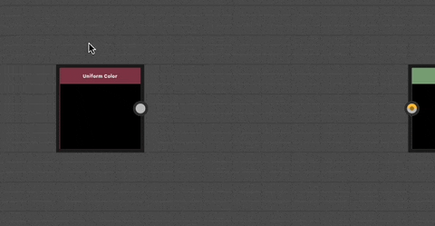

# Nó ponto (também Portal)

<table>
<tr style="border: 0;">
<td width="25.00%" style="border: 0;" valign="top">

</td>
<td width="100.00%" style="border: 0;" valign="top">

O nó <b>Ponto</b> é um auxiliar que permite simplificar e limpar gráficos redirecionando e agrupando conexões. É especialmente útil para gráficos com muitas conexões longas que se estendem por outras conexões ou nós.

Um par de nós Ponto pode ser usado como <b>portais</b> para ocultar uma conexão que percorra uma longa distância ou em locais onde o roteamento da conexão seria desafiador.

</td>
</tr>
</table>

## Criação de nós de ponto

Os nós pontos podem ser adicionados em qualquer tipo de gráfico, em qualquer uma das seguintes maneiras:

+++Inserir no link
Mantenha a tecla <b>Alt</b> pressionada enquanto passa o mouse sobre uma conexão para exibir a visualização do nó Ponto e, em seguida, clique em LMB para adicionar um nó Ponto na conexão nesse local.

{width="512px"}

+++

+++Conector do nó
Pressione a tecla <b>Alt</b> enquanto arrasta uma nova conexão de um conector de nó para inserir um nó Ponto nesse local.

Você pode continuar arrastando a nova conexão e repetir a operação para rotear essa conexão como quiser.

+++

+++Menu Nó
Pressione a <b>Barra de espaço</b> para exibir o <b>menu Nó</b> e, em seguida, selecione o item “Ponto” ou digite “ponto” no campo de pesquisa para exibir o item e localizá-lo mais rapidamente.

+++

>[!TIP]
>
> Quando um nó Ponto é criado, sua propriedade &#39;Nome&#39; ganha foco automaticamente para que você possa editar imediatamente o nome do nó.

<table>
<tr style="border: 0;">
<td style="border: 0;" valign="top">

## Mesclando vínculos

Pressione ALT e mova um nó Ponto sobre links para mesclar várias conexões de nó.

</td>
<td style="border: 0;" valign="top">

{width="512px"}

</td>
</tr>
</table>

## Portais

<table>
<tr style="border: 0;">
<td width="16.67%" style="border: 0;" valign="top">

</td>
<td width="100.00%" style="border: 0;" valign="top">

Os nós pontos podem ser usados como <b>portais</b> para enviar dados por uma longa distância no gráfico sem ter um link longo e incômodo que prejudique a legibilidade. Isso oculta efetivamente o vínculo entre os nós Ponto.

</td>
</tr>
</table>

### Criação de portais

Um portal é criado automaticamente entre dois nós de ponto - um transmissor e um receptor - quando o nó de ponto do transmissor é nomeado. A nomeação de um nó Ponto é feita por meio da configuração de um identificador exclusivo em sua propriedade <b>Name</b>.

Quando um ou mais nós Ponto nomeados existem em um gráfico, qualquer nó Ponto pode ser conectado a ele como um receptor por:

* Criar uma ligação entre a entrada do receptor e a saída de um transmissor;
* Selecionando o nome do transmissor na propriedade <b>Portal de Entrada</b> do receptor.

Duplicar ou copiar receptores preserva sua conexão com o transmissor como um portal.

### Identificação de portais

Os nós de ponto usados como portais têm um ícone de sinal wireless colocado ao lado do conector usado como um portal.

Selecionar qualquer nó Ponto usado como um portal exibe as conexões ocultas a outros portais como uma linha tracejada.

### Exclusão de portais

Um portal é excluído quando o <b>Nome</b> do transmissor é limpo ou quando a conexão oculta é excluída por:

* Selecionar um portal, depois selecionar a conexão oculta e excluí-la;
* Selecionando o receptor e pressionando o botão <b>X</b> ao lado do menu suspenso <b>Portal de Entrada</b> em Propriedades.

>[!IMPORTANT]
>
> Não há suporte para o uso de nós de ponto como portais em [gráficos FX-Map](../../../../function-graphs/fxmaps/fxmaps.md).

Confira este tutorial sobre os nós Pontos como portais:
