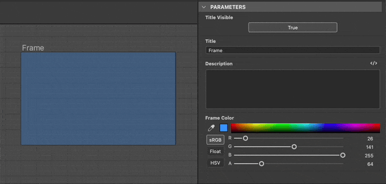
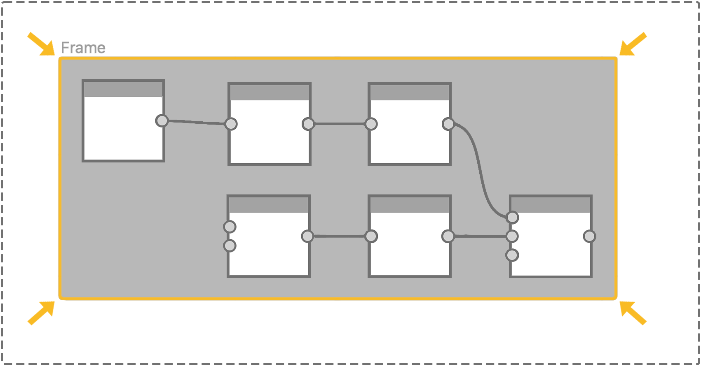

# Quadro

<table>
<tr style="border: 0;">
<td width="25.00%" style="border: 0;" valign="top">


</td>
<td width="100.00%" style="border: 0;" valign="top">

Um quadro facilita a legibilidade e o layout de gráficos, agrupando visualmente objetos nesse gráfico e permitindo mover facilmente todos esses objetos juntos.

Por exemplo, os quadros podem ser nomeados e coloridos para que a estrutura do gráfico saia claramente ao obter uma visão geral, o que é uma grande ajuda à medida que a complexidade de um gráfico aumenta.

Eles também podem ser anotados e, portanto, funcionar como uma ferramenta de documentação para explicar por que alguns nós foram configurados de uma maneira específica.

</td>
</tr>
</table>

## Aparência

Dependendo da posição do cursor do mouse ou se ele faz parte de uma seleção, um quadro se apresenta em diferentes estilos visuais para mostrar se e como você pode interagir com ele.

+++Padrão
Por padrão, o quadro é um retângulo com cantos arredondados preenchidos com a cor selecionada na propriedade <b>Cor do quadro</b>. Um tom mais escuro dessa cor será aplicado no contorno do quadro.

O título definido na propriedade <b>Título</b> repousa em cinza no canto superior esquerdo do quadro.

")


+++

+++Foco do cabeçalho
Ao passar o mouse sobre a parte superior do quadro, uma barra de cabeçalho é exibida.

O quadro pode ser movido arrastando essa barra de cabeçalho ou seu título.

")


+++

+++Selecionado
Quando selecionado, o título e o contorno do quadro são realçados em branco. O contorno fica mais espesso.

")


+++

## Criação de quadros

Os quadros podem ser adicionados em qualquer tipo de gráfico, de qualquer uma das seguintes maneiras:

+++Menu Nó
Pressione a <b>Barra de espaço</b> no modo de exibição Gráfico para abrir o <b>menu Nó</b> e selecione o item “Quadro” na lista.

Digite “frame” no campo de pesquisa para mostrar o item e encontrá-lo mais rapidamente.

+++

+++Atalho
Se um atalho de teclado for mapeado para o item &#39;Quadro&#39; nas [Preferências](../../../../interface/preferences-window/preferences-window.md), pressione esse atalho quando o Modo de Exibição de Gráfico tiver foco.

+++

+++Menu contextual
Na Exibição Gráfica, pressione <b>RMB</b> em qualquer objeto ou em um espaço vazio e selecione a opção <b>Adicionar Quadro</b>.

+++

+++Barra de ferramentas Gráfico
Na barra de ferramentas Exibição de Gráfico, clique no botão &#39;Quadro&#39; na <b>Paleta de nós</b>.

+++

+++Biblioteca
Na Biblioteca, selecione a categoria <b>Itens de gráfico</b> e arraste e solte o item &#39;Quadro&#39; no Modo de Exibição de Gráfico.

+++

### Seleções de enquadramento

Se uma seleção estiver ativa em um gráfico quando um quadro for criado, esse quadro será ajustado automaticamente para incluir completamente os objetos selecionados.

Tendo isso em mente, criar quadros usando um atalho do teclado torna ainda mais rápido enquadrar o conteúdo em um gráfico.

{width="480px"}

>[!TIP]
>
> Quando um quadro é criado, sua propriedade “Título” ganha foco automaticamente, para que você possa editar imediatamente o título do quadro.

## Manipulação de quadros

<table>
<tr style="border: 0;">
<td style="border: 0;" valign="top">

Os quadros podem ser <b>deslocados</b> arrastando seu título ou barra de cabeçalho e <b>redimensionados</b> arrastando qualquer uma de suas bordas ou cantos.

A ilustração destaca as zonas de interação para panorâmica (azul) e redimensionamento (amarelo).

</td>
<td style="border: 0;" valign="top">


</td>
</tr>
</table>

<table>
<tr style="border: 0;">
<td style="border: 0;" valign="top">

### Ajuste de grade

Por padrão, um quadro se ajusta à grade média quando movido ou redimensionado.

Segure a tecla <b>Ctrl</b> (Windows) / <b>Cmd</b> (macOS) para deslocar este encaixe para a grade pequena para ajustes mais finos.

</td>
<td style="border: 0;" valign="top">


</td>
</tr>
</table>

## Propriedades

Quando um quadro é selecionado, as seguintes propriedades ficam disponíveis no encaixe [Propriedades](../../../../interface/properties/properties.md):

+++Título
O <b>Título</b> está no canto superior esquerdo do quadro. Sua visibilidade do título pode ser ativada ou desativada usando a propriedade <b>Título visível</b>.

O tamanho do título pode ser bloqueado em um tamanho de tela mínimo para que permaneça legível ao reduzir o zoom do gráfico. Você pode fazer isso marcando a opção &#39;Títulos de quadros&#39; no menu suspenso <b>Informações</b> da barra de ferramentas [Exibição de gráfico](../../../../interface/the-graph-view/the-graph-view.md).

{width="640px"}


+++

+++Descrição
A <b>Descrição</b> é um texto adicional opcional que pode ser usado para anotar o conteúdo do quadro.

O texto pode ser formatado usando tags HTML. Para alternar essa formatação, clique no botão  <b>marcação de HTML</b>.

Saiba mais na seção Descrição abaixo.

{width="640px"}


+++

+++Cor
A <b>Cor do Quadro</b> é usada para preencher o quadro na exibição Gráfico. Use o seletor de cores para selecionar qualquer cor.

O canal alfa da cor controla a *opacidade* do quadro, onde um valor de 0 significa que o quadro é totalmente transparente.

{width="640px"}


+++

## Descrição

Um quadro pode ser anotado com um texto que será colocado dentro do quadro. O texto é alinhado à esquerda e começa no canto superior esquerdo do quadro. Use a propriedade [Descrição](#properties) do quadro para editar esse texto.

<table>
<tr style="border: 0;">
<td style="border: 0;" valign="top">

### Padrão

O <b>Título</b> é mostrado em negrito na parte superior esquerda do quadro. A visibilidade do título pode ser ativada ou desativada.

Seu tamanho pode ser bloqueado em um tamanho de tela mínimo para que permaneça legível ao reduzir o zoom do gráfico. Você pode fazer isso marcando a opção &#39;Títulos de quadros&#39; no menu suspenso <b>Informações</b> da barra de ferramentas [Exibição de gráfico](../../../../interface/the-graph-view/the-graph-view.md).

</td>
<td style="border: 0;" valign="top">

"){zoomable="yes"}

</td>
</tr>
</table>

<table>
<tr style="border: 0;">
<td style="border: 0;" valign="top">

### formatação HTML

O texto pode ser formatado por meio de marcas de HTML na propriedade <b>Descrição</b> do quadro. A formatação deve ser habilitada com o uso do botão  <b>marcação de HTML</b> nessa mesma propriedade.

</td>
<td style="border: 0;" valign="top">

"){zoomable="yes"}

</td>
</tr>
</table>

Você pode copiar e colar essa amostra na propriedade Description do quadro para testar esse recurso por conta própria:

```
<h2>HTML formatting</h2>

<p>This is a description formatted using <b>HTML markup</b>.</p>

<p>Formattig text makes it more <i>pleasant</i>, <font color="#CC8822">impactful</font> and <code>clearly structured</code> for users.</p>

<p>  Images are also supported! <sup>How nice!</sup></p>
```


Veja uma lista de tags úteis para formatar texto:

+++tags de formatação HTML

|  |  |
| --- | --- |
| Negrito | &lt;b>...&lt;/b> |
| Itálico | &lt;i>...&lt;/i> |
| Cor | &lt;font color=”#4A567C”>...&lt;/font> |
| Parágrafo | &lt;p>...&lt;/p> |
| Quebra de linha | &lt;br> |
| Títulos | &lt;h1>...&lt;/h1>, &lt;h2>...&lt;/h2> etc. |
| Imagem | &lt;img src=”{path\_to\_image}”> |
| Sobrescrito | &lt;sub>...&lt;/sub> |
| Lista não ordenada (marcadores) | &lt;ul> &lt;li>...&lt;/li> &lt;li>...&lt;/li> &lt;/ul> |
| Lista ordenada (números) | &lt;ol> &lt;li>...&lt;/li> &lt;li>...&lt;/li> &lt;/ol> |
| Código | &lt;code>...&lt;/code> |


+++

## Regras de inclusão

Um objeto é considerado incluído em um quadro se atender à sua regra de inclusão. Essas regras variam de acordo com o objeto e o caso especial. Eles estão listados abaixo.

O símbolo amarelo em cada ilustração representa o ponto ou a área que precisa estar totalmente dentro dos limites de um quadro para que um objeto seja incluído nesse quadro.

+++Nós
O <b>ponto central</b> é usado.

Emblemas, conectores e informações exibidos abaixo do nó são todos ignorados.

Os nós podem ser de heights diferentes, dependendo de seu número de conectores de entrada ou saída.

À medida que os conectores são exibidos ou ocultos, adicionados ou removidos, o height do nó se ajusta a partir de seu *centro*.

Portanto, o local do ponto central de um nó não deve ser alterado até que seja *movido deliberadamente*.


O <b>ponto de entrada</b><b>c</b> do nó *host* é usado.

O nó do host é o nó no qual um nó está encaixado.

Se vários nós estiverem ancorados em uma cadeia, o nó host do último nó ancorado será usado para toda a cadeia.

Emblemas, conectores e informações exibidos abaixo do nó são todos ignorados.


+++

+++Nós pontos
O <b>ponto central</b> do Ponto é usado.

Conectores, ícones de portal e nomes são todos ignorados.


+++

+++Comentários
O <b>ponto central</b> da *caixa delimitadora* do comentário (contorno amarelo) é usado.

Os comentários com parentesco não seguem as regras de inclusão de comentários.

Em vez disso, o <b>ponto central</b> do nó *pai* é usado.

Emblemas, conectores e informações exibidos abaixo do nó são todos ignorados.


+++

+++Marcadores
A <b>dica</b> do ícone de pino é usada.


+++

+++Quadros
A <b>caixa delimitadora</b> do quadro aninhado é usada.

Isso significa que um quadro aninhado deve estar inteiramente dentro dos limites de outro quadro para ser incluído no último.

O título é ignorado.


+++

## Ajustar tamanho ao conteúdo



Conforme você faz ajustes no gráfico, um quadro pode não ser mais ajustado normalmente ao seu conteúdo. Nesse caso, é possível ajustar automaticamente a posição e o tamanho do quadro de modo que ele se ajuste à extensão de seu conteúdo, com um preenchimento de uma célula de grade média.

Para fazer isso, clique em <b>RMB</b> no título do quadro ou na barra de cabeçalho - consulte [Aparência](#appearance) - e selecione a opção <b>Ajustar Tamanho ao Conteúdo</b> no menu contextual.

>[!NOTE]
>
> A opção estará disponível se pelo menos *um* objeto de gráfico atender às [regras de inclusão](../../../../interface/the-graph-view/graph-items/frame/frame.md) do quadro.

<table>
<tr style="border: 0;">
<td style="border: 0;" valign="top">

### Ajustar o texto de descrição

Se o quadro tiver uma descrição, ela será ajustada para usar qualquer espaço vazio ao lado da descrição, se possível.

Se nenhum objeto incluído puder ser encaixado nesse espaço, o height do quadro será ajustado para acomodar a descrição.

</td>
<td style="border: 0;" valign="top">

")

</td>
</tr>
</table>

+++Exemplo
"){width="640px"}


+++

## Expansão automática


À medida que o gráfico cresce, o conteúdo dos quadros pode precisar ser reorganizado. Os nós podem mudar para criar espaço para adições ou o conteúdo pode precisar ser espaçado mais para promover a legibilidade.

Para facilitar esses ajustes, é possível expandir automaticamente um quadro ao mover [objetos incluídos](#inclusion-rules): mantenha pressionado o <b>Shift</b> em qualquer ponto ao mover um objeto para que as bordas do quadro se ajustem automaticamente para manter esse objeto dentro de seus limites.

Isso também se aplica a seleções que podem incluir vários objetos. Nesse caso, o quadro host de cada objeto será ajustado simultaneamente.

Se um objeto não estiver totalmente delimitado pelos limites do quadro, mas ainda atender à sua [regra de inclusão](#inclusion-rules), o quadro será ajustado para delimitá-lo totalmente com um preenchimento adicional de uma célula de grade média assim que a tecla <b>Shift</b> for pressionada.

>[!NOTE]
>
> Enquanto a tecla <b>Shift</b> pode ser pressionada ou liberada em qualquer ponto durante o movimento para acionar ou cancelar o ajuste automático do quadro, ela *deve* ser mantida pressionada ao concluir o movimento para aplicar efetivamente o ajuste.

+++Exemplo
"){width="640px"}


+++
