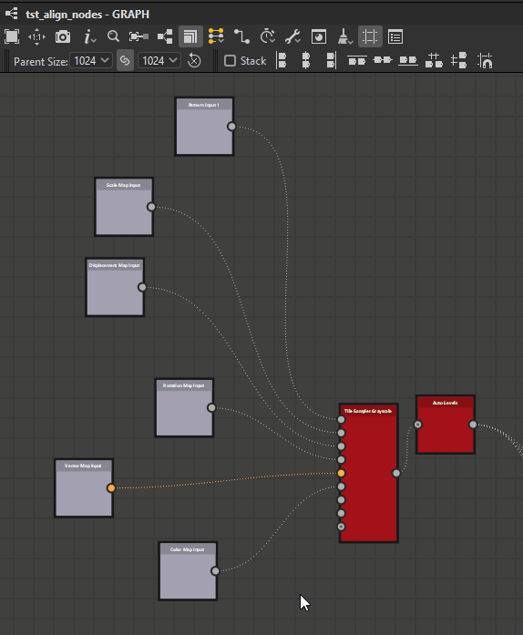

# Ferramentas de alinhamento de nó

{zoomable="yes"}

As ferramentas de alinhamento de nós permitem organizar os nós em gráficos para melhorar a legibilidade e a experiência de criação. Eles oferecem ações para alinhar nós, distribuí-los uniformemente e encaixá-los na grade.

Eles atuam somente nos <b>nós atualmente selecionados</b>.

>[!NOTE]
>
> Atalhos do teclado
> 
> Algumas ações têm atalhos de teclado para acesso rápido: H, V e S. Eles são exibidos entre parênteses na lista de ações abaixo.
> 
> Observe que eles substituirão qualquer [atalho de teclado atribuído aos nós](../../../interface/preferences-window/preferences-window.md).

## Alinhamentos

Os nós podem ser alinhados horizontal e verticalmente, com três modos para cada eixo:

### Alinhamentos horizontais

<b> Esquerda:</b> Alinhe o lado esquerdo dos nós selecionados ao lado esquerdo do nó mais à esquerda.

<b> Centro (H):</b> Alinhe o centro horizontal dos nós selecionados ao centro horizontal da caixa delimitadora que os abrange.

<b> Direita:</b> Alinhe o lado direito dos nós selecionados ao lado direito do nó mais à direita.

<table>
<tr style="border: 0;">
<td style="border: 0;" valign="top">

{zoomable="yes"}

*Esquerda*

</td>
<td style="border: 0;" valign="top">

{zoomable="yes"}

*Centro*

</td>
<td style="border: 0;" valign="top">

{zoomable="yes"}

*Direita*

</td>
</tr>
</table>

### Alinhamentos verticais

<b> Superior:</b> Alinhe o lado superior dos nós selecionados ao lado superior do nó superior.

<b> Médio (V):</b> Alinha o centro vertical dos nós selecionados ao centro vertical da caixa delimitadora que os abrange.

<b> Inferior:</b> Alinhe o lado inferior dos nós selecionados ao lado inferior do nó mais inferior.

<table>
<tr style="border: 0;">
<td style="border: 0;" valign="top">

{zoomable="yes"}

*Superior*

</td>
<td style="border: 0;" valign="top">

{zoomable="yes"}

*Meio*

</td>
<td style="border: 0;" valign="top">

{zoomable="yes"}

*Inferior*

</td>
</tr>
</table>

### Empilhamento

A <b>opção Empilhar </b> permite <b>evitar qualquer sobreposição</b> ao usar alinhamentos. Ela fica ativada por padrão.

Quando ativado, os nós serão movidos o mais longe possível para a posição de referência até que colidam com outro nó na seleção. Isso os empilha efetivamente no eixo selecionado com uma margem de uma célula de grade média entre cada nó.

{zoomable="yes"}

## Distribuições

Os nós podem ser distribuídos uniformemente entre os nós em cada extremo da seleção atual no eixo desejado.

<b> Horizontalmente:</b> nós são distribuídos uniformemente entre os nós mais à esquerda e mais à direita na seleção.

<b> Verticalmente:</b> Os nós são distribuídos uniformemente entre os nós superiores e inferiores na seleção.

As distribuições visam o <b>espaçamento par</b> entre os nós, independentemente de seu tamanho.

Quando vários nós têm seus centros perfeitamente alinhados no eixo selecionado, eles permanecem e são <b>tratados como um</b> na distribuição. O *maior* dos nós alinhados é usado para calcular o espaçamento uniforme.

Observe que quando o tamanho total dos nós selecionados é maior que o espaço disponível no eixo selecionado, pode ocorrer sobreposição.

<table>
<tr style="border: 0;">
<td width="58.33%" style="border: 0;" valign="top">

{zoomable="yes"}

*Horizontalmente*

</td>
<td width="100.00%" style="border: 0;" valign="top">

{zoomable="yes"}

*Verticalmente*

</td>
</tr>
</table>

<table>
<tr style="border: 0;">
<td width="58.33%" style="border: 0;" valign="top">

## Ajuste de grade

A ação <b>Encaixar (S) </b> move cada nó selecionado para que o canto superior esquerdo fique no ponto mais próximo da grade média.

</td>
<td width="100.00%" style="border: 0;" valign="top">

{zoomable="yes"}

</td>
</tr>
</table>
