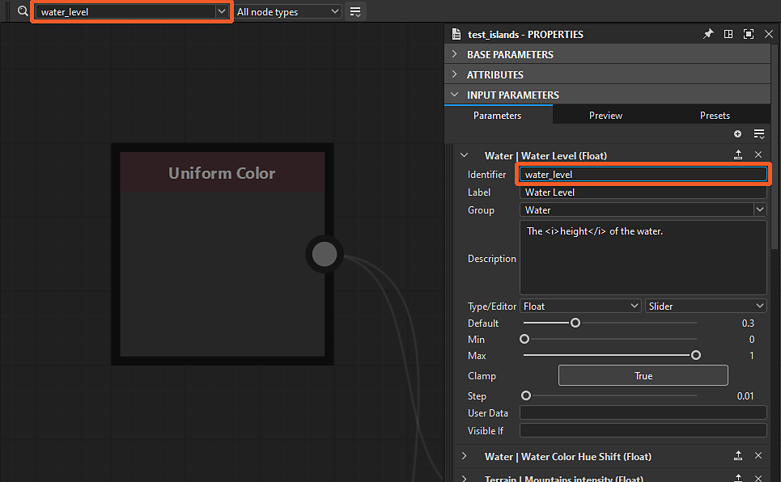

# Localizador de nós

{zoomable="yes"}

A ferramenta Localizador de Nós permite <b>procurar nós e variáveis</b> usando uma consulta de texto. Todos os nós que não corresponderem à consulta ficarão esmaecidos para que os resultados sejam exibidos.

A consulta pode corresponder a qualquer um destes critérios:

* Um <b>identificador de um gráfico</b> referenciado por um nó de instância
* Um <b>identificador de um parâmetro ou variável</b> exposto usado em uma função de parâmetro de nó
* <b>UID</b> de um nó (identificador exclusivo)
* O <b>rótulo</b> de um nó

A pesquisa pode percorrer [instâncias de gráfico](../../../compositing-graphs/creating-compositing-gra/graph-instances-sub-gra/graph-instances-sub-graphs.md) recursivamente, portanto, nós e variáveis podem ser encontrados em [subgrafos](../../../compositing-graphs/creating-compositing-gra/graph-instances-sub-gra/graph-instances-sub-graphs.md). Se você não tiver certeza sobre o termo exato que precisa pesquisar, uma opção de pesquisa difusa estará disponível para aplicar uma tolerância à consulta.

## Interface

O Localizador de nós pode ser acessado de duas maneiras:

No Modo de Exibição de Gráfico, pressione <b>Ctrl+F</b> (Windows) / <b>Cmd+F</b> (macOS) para exibir a barra de ferramentas Localizador de Nós e definir automaticamente o foco no campo de consulta. Isso permite que você faça uma pesquisa rapidamente.

Na barra de ferramentas Exibição de Gráfico, clique no <b>botão Localizador de Nó </b> para exibir a barra de ferramentas Localizador de Nó. Quando exibida, a barra de ferramentas só é fechada clicando nesse botão.

<b>Pesquisa gráficos de passagem</b>. Em outras palavras, uma pesquisa permanece ativa ao abrir gráficos por meio dessas ações:

* Nó de instância: abrir referência no contexto (Ctrl+E / Cmd+E) (*Observação:* a edição de gráfico no contexto precisa estar habilitada em Editar > Preferências > Gráfico)
* Processador de pixels: função Editar (Ctrl+E / Cmd+E)
* Processador de valores: função Editar (Ctrl+E / Cmd+E)
* FX-Map: Editar gráfico FX-Map (Ctrl+E / Cmd+E)
* Parâmetros de nó: função Edit

{zoomable="yes"}

### Consulta de pesquisa

{zoomable="yes"}

Os termos da pesquisa podem ser digitados neste campo e o botão de seta abre uma lista de sugestões de consulta que incluem algumas das variáveis disponíveis no contexto atual.

Saiba mais sobre as consultas que você pode executar na seção [Pesquisar consulta](#search-query) abaixo.

### Tipo de nó

{zoomable="yes"}

Essa caixa de combinação permite filtrar resultados da pesquisa para reter apenas um tipo específico de nós.

Observe que todos os nós de instância são do *mesmo tipo* de nó - na verdade, do tipo &#39;instância&#39; - enquanto os nós atômicos são de seu próprio tipo.

+++Listas de tipos de nó
A lista é contextual para o tipo de gráfico atual.

"){zoomable="yes"}

*Tipos de nó para composição de gráficos*

"){zoomable="yes"}

*Tipos de nó para gráficos de função*

+++

+++Procurando por nós atômicos
"){zoomable="yes"}

*Procurando o tipo de nó &#39;Níveis&#39; em um Substance gráfico*

+++

+++Procurando nós de instância
"){zoomable="yes"}

*Procurando o tipo de nó &#39;Instance&#39; em um Substance gráfico*

 &#39;Instância&#39;"){zoomable="yes"}

*Procurando o tipo de nó &#39;Instance&#39; em um gráfico de função Substance*

+++

### Opções de pesquisa

<table>
<tr style="border: 0;">
<td width="100.00%" style="border: 0;" valign="top">

O botão <b>Opções de pesquisa </b> abre uma lista de configurações usadas para pesquisa que podem ser ativadas e desativadas.

Saiba mais sobre essas opções na seção Opções de pesquisa abaixo.

</td>
<td width="33.33%" style="border: 0;" valign="top">

{zoomable="yes"}

</td>
</tr>
</table>

## Consulta de pesquisa

Para localizar nós, uma consulta de texto é comparada com as propriedades do nó listadas abaixo.

>[!NOTE]
>
> Sua consulta deve ser digitada com as seguintes advertências em mente:
> 
> * A pesquisa não diferencia maiúsculas de minúsculas. Por exemplo, “meu rótulo de nó” e “Meu rótulo de nó” retornam os mesmos resultados.
> * Os espaços em branco antes e depois da consulta são ignorados.
> * Várias consultas não podem ser executadas ao mesmo tempo no mesmo gráfico. Por exemplo, &#39;níveis de desfoque&#39; não corresponderão aos nós &#39;Níveis&#39; e &#39;Desfoque&#39;. Da mesma forma, os operadores lógicos não são suportados.

<table>
<tr style="border: 0;">
<td width="100.00%" style="border: 0;" valign="top">

### Identificadores do gráfico de instância

[Os nós de instância](../../../compositing-graphs/creating-compositing-gra/graph-instances-sub-gra/graph-instances-sub-graphs.md) podem ser encontrados usando o <b>identificador</b> dos gráficos aos quais fazem referência.

</td>
<td width="33.33%" style="border: 0;" valign="top">

{zoomable="yes"}

*Clique na imagem para ampliar*

</td>
</tr>
</table>

+++Identificador no Explorer
Os gráficos são listados por seus identificadores no Explorer.

{zoomable="yes"}

+++

+++Identificador na dica de ferramenta do nó da instância
A dica de ferramenta dos nós de instância inclui o identificador de seu gráfico referenciado.

{zoomable="yes"}

+++

<table>
<tr style="border: 0;">
<td width="100.00%" style="border: 0;" valign="top">

### Parâmetros e variáveis expostos

O identificador de [parâmetros expostos](../../../compositing-graphs/manage-parameters/exposing-a-parameter/exposing-a-parameter.md), ou qualquer outra variável, pode ser pesquisado diretamente.

</td>
<td width="33.33%" style="border: 0;" valign="top">

{zoomable="yes"}

*Clique na imagem para ampliar*

</td>
</tr>
</table>

+++Sugestões de consulta
O campo de consulta pode ser expandido para revelar uma lista de sugestões.

Isso inclui [variáveis internas](../../../function-graphs/variables/system-variables/system-variables.md) disponíveis para o tipo de gráfico atual, bem como os identificadores dos parâmetros expostos do gráfico.

{zoomable="yes"}

O identificador de parâmetros expostos também pode ser copiado ou editado diretamente nas [propriedades do gráfico de Substance](../../../compositing-graphs/graph-parameters/graph-parameters.md).

{zoomable="yes"}

*Clique na imagem para ampliar*

+++

+++Pesquisa de uma variável em um aviso/erro do Console
Quando um gráfico tiver erros ou avisos gerados por uma <b>variável</b> usada por um nó, vá para <b>Windows > Console</b> para exibir a mensagem completa de erro/aviso que incluirá a variável. Em seguida, você pode copiar e colar essa variável no campo de consulta Localizador de nós para localizar rapidamente o nó que está causando o problema.

As variáveis também podem ser copiadas diretamente dos dados XML no arquivo SBS usando qualquer editor de texto.

{zoomable="yes"}

+++

+++Obter/Definir nós
Ao pesquisar uma variável em um gráfico - incluindo parâmetros expostos - a pesquisa realçará todos os nós em que um nó [Get](../../../function-graphs/nodes-reference-for-fun/atomic-function-nodes/get-nodes/get-nodes.md) ou [Set](../../../function-graphs/fxmaps/using-functions-in-fxmaps/using-the-set-sequence/using-the-set-sequence-nodes.md) usa essa variável em qualquer uma das funções de parâmetro do nó.

{zoomable="yes"}

+++

<table>
<tr style="border: 0;">
<td width="100.00%" style="border: 0;" valign="top">

### UID do nó

Cada nó em um gráfico tem um número de identificador exclusivo (UID) que pode ser usado para pesquisar esse nó.

</td>
<td width="33.33%" style="border: 0;" valign="top">

{zoomable="yes"}

*Clique na imagem para ampliar*

</td>
</tr>
</table>

+++Copiando a UID de um nó
O UID de um nó pode ser copiado para a área de transferência a partir do menu contextual.

A ação copia a UID neste formato:

uid=1234567890

{zoomable="yes"}

+++

+++Pesquisando um UID de nó a partir de um aviso/erro de Console
Quando um gráfico apresentar erros ou avisos gerados por um nó, acesse Windows > Console para exibir a mensagem completa de erro/aviso que incluirá a <b>UID</b> do nó. Em seguida, você pode copiar e colar esse UID no campo de consulta Localizador de nós para localizar rapidamente o nó que está causando o problema.

Os UIDs de nó também podem ser copiados diretamente dos dados XML no arquivo SBS usando qualquer editor de texto.

{zoomable="yes"}

+++

### Rótulo do Nó

Os nós também podem ser encontrados usando seus rótulos.

Pesquisar nós específicos é particularmente eficaz ao usar o rótulo exato com a pesquisa difusa desativada.

## Opções de pesquisa

<table>
<tr style="border: 0;">
<td width="100.00%" style="border: 0;" valign="top">

O botão <b>Opções de pesquisa </b> permite alternar os modos <b>recursivo</b> e <b>difuso</b> para pesquisar nós.

Ambos podem ser ativados ao mesmo tempo.

</td>
<td width="33.33%" style="border: 0;" valign="top">

{zoomable="yes"}

</td>
</tr>
</table>

### Modo recursivo

Habilite esta opção para que as pesquisas atravessem [instâncias do gráfico](../../../compositing-graphs/creating-compositing-gra/graph-instances-sub-gra/graph-instances-sub-graphs.md) para incluir resultados de [subgrafos](../../../compositing-graphs/creating-compositing-gra/graph-instances-sub-gra/graph-instances-sub-graphs.md).

Essa opção pode ser essencial ao Troubleshoot gráficos, caso você precise encontrar um nó por seu UID obtido de uma mensagem de aviso ou erro no Console.

{zoomable="yes"}

*A consulta à direita realça o nó de instância abaixo, pois seu gráfico referenciado à esquerda tem correspondências para essa consulta*

+++Exemplo 1
{zoomable="yes"}

Um nó de instância faz referência a um gráfico em que vários nós correspondem à consulta.

+++

+++Exemplo 2
{zoomable="yes"}

Ativar a opção &#39;Pesquisa recursiva&#39; realça o nó da instância que faz referência a um gráfico no qual um nó do Processador de pixels usa uma variável correspondente à consulta.

+++

### Modo difuso

Se você não tiver certeza sobre a ortografia exata de uma consulta, esta opção habilita uma <b>tolerância</b> nos resultados.

Observe que o uso dessa opção provavelmente resultará em correspondências indesejadas.

{zoomable="yes"}
