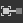
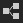
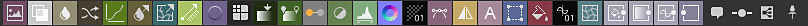
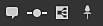
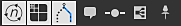
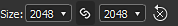
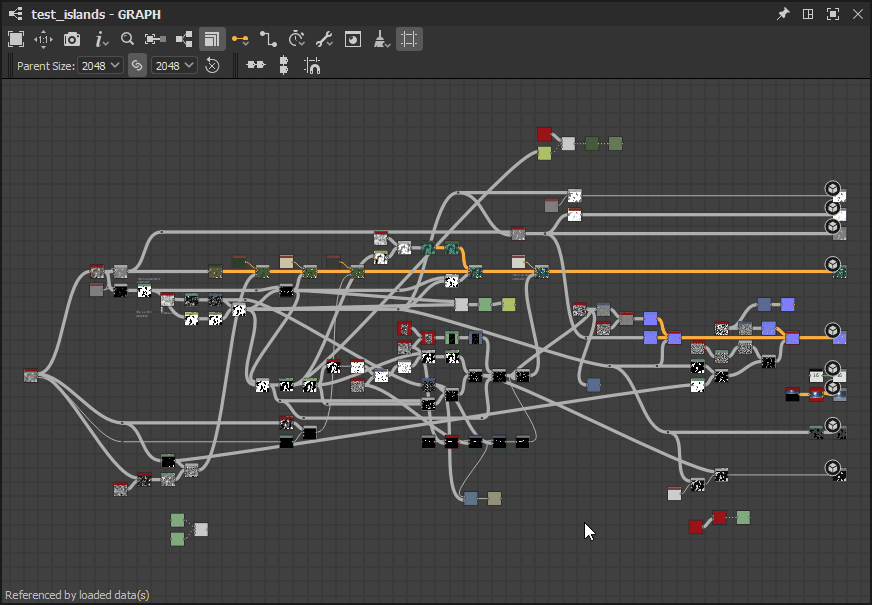

# Exibição de gráfico

Esta página apresenta o encaixe Exibição de gráfico do Substance 3D Designer.

A exibição de gráfico é a janela principal do [Substance 3D Designer](https://www.adobe.com/br/products/substance3d-designer.html), onde você cria e edita seus gráficos. A visualização de gráfico tem duas áreas principais: uma barra de ferramentas na parte superior, que fornece acesso rápido a determinadas funções, e a área real do gráfico na qual os nós são colocados.

A exibição de gráfico é usada para todos os tipos de gráfico, mas difere ligeiramente entre [gráficos de Substance](../../compositing-graphs/substance-compositing-graphs.md), [gráficos de funções](../../function-graphs/function-graphs.md) e [gráficos de FX-Map](../../function-graphs/fxmaps/fxmaps.md), principalmente na área de barras de ferramentas.

## Navegação no visor

O gráfico pode ser navegado usando as seguintes ações:

* <b>Panorâmica:</b> MMB / Ctrl+RMB
* <b>Zoom:</b> MouseWheel / Alt + RMB

Usar um trackpad (somente macOS)

* <b>Panorâmica: </b>Passar com dois dedos
* <b>Aplicar zoom:</b> Pince com dois dedos/Deslize com dois dedos enquanto segura Cmd

>[!NOTE]
>
> Direção do zoom
> 
> Cada um dos métodos de zoom é invertido com o outro:
> 
> * O botão de rolagem do mouse *aproxima* a exibição de gráfico
> * Alt+RMB e arraste *empurra* a exibição de gráfico para cima
> 
> A direção do zoom pode ser invertida nas [Preferências](../../interface/preferences-window/preferences-window.md).

Você <b>focaliza</b> o(s) nó(s) selecionado(s) ou o gráfico inteiro, se nada estiver selecionado, com a tecla F.

A navegação também pode acontecer usando os <b>Pinos de navegação </b>e a tecla F2. Consulte os [itens do gráfico](#graph-items) abaixo[.](../../interface/the-graph-view/graph-items/graph-items.md)

## Movimentação de objetos

Clique no LMB em um objeto (isto é, um nó ou item de gráfico) e, em seguida, mantenha pressionado e arraste o cursor para <b>mover um nó</b> ao redor do gráfico. Se mais de um objeto for selecionado, todos os objetos selecionados serão movidos junto com aquele que estiver sob o cursor.

Se o cursor <b>atingir uma borda</b> da Exibição de gráfico ao mover objetos, a exibição será deslocada na direção do cursor. Observe que a panorâmica é mais rápida à medida que o cursor se move para longe da borda.\
Isso também se aplica ao desenho de caixas de seleção nas bordas da Exibição de gráfico.

Por padrão, os objetos são <b>encaixados na grade</b> conforme são movidos. Pressione Ctrl (Windows) / ⌘ (macOS) enquanto move objetos para desabilitar esse encaixe.

## Itens gráficos

Vários objetos auxiliares estão disponíveis para ajudar a organizar e navegar pelo gráfico, especialmente quando ele cresce em uma rede complexa de nós que pode ser difícil de ler:

<b>Os nós de ponto</b> permitem redirecionar e mesclar conexões e podem ser usados como <b>portais</b> para ocultar conexões longas ou difíceis de utilizar;

<b>Quadros</b> ajuda a agrupar nós com um título visível e codificação por cores;

<b>Comentários</b> permitem rastrear a finalidade de um nó ou grupo de nós e fazer outras anotações úteis;

Os <b>pinos de navegação</b> habilitam a capacidade de saltar rapidamente para pontos de interesse no gráfico.

>[!NOTE]
>
> Saiba mais na seção [Itens de gráfico](../../interface/the-graph-view/graph-items/graph-items.md) desta documentação.

## Menu contextual Gráfico

Ao clicar em RMB em um espaço vazio no gráfico, um menu contextual é exibido e pode incluir as seguintes opções:

<b>Adicionar nó:</b> abra o menu Nó para adicionar um nó no gráfico;

<b>Adicionar comentário:</b> adicione um objeto de gráfico [Comentário](../../interface/the-graph-view/graph-items/graph-items.md) sem parentesco;

<b>Adicionar quadro:</b> adicione um objeto de gráfico [Quadro](../../interface/the-graph-view/graph-items/graph-items.md);

<b>Adicionar pino:</b> adicione um objeto de gráfico [Pino](../../interface/the-graph-view/graph-items/graph-items.md);

<b>Adicionar nó de ponto:</b> adicione um nó de [ponto](../../interface/the-graph-view/graph-items/graph-items.md);

<b>Exibir saídas na exibição 3D:</b> atribua todas as saídas do gráfico a um material na [exibição 3D](../../interface/3d-view/3d-view.md) correspondendo a usos, consulte [Interagindo com a exibição 3D](#interacting-with-the-3d-view) abaixo;

<b>Redefinir e exibir saídas na exibição 3D:</b> redefina um material na [exibição 3D](../../interface/3d-view/3d-view.md) e atribua todas as saídas do gráfico a esse material correspondendo aos usos; consulte [Interagindo com a exibição 3D](#interacting-with-the-3d-view) abaixo;

<b>Exibir saída em exibição 2D:</b> Exiba uma das saídas do gráfico na [exibição 2D](../../interface/2d-view/2d-view.md), consulte [Interagindo com a exibição 2D](#interacting-with-the-2d-view) abaixo;

<b>Miniaturas de nós de computação:</b> acione o cálculo do resultado de todos os nós no gráfico - que será armazenado no [cache de imagens](../../interface/preferences-window/preferences-window.md) - e use a primeira saída como miniatura;

<b>Limpar miniaturas de nós:</b> limpa o [cache de imagens](../../interface/preferences-window/preferences-window.md) que contém o resultado de todos os nós no gráfico, o que, por sua vez, limpa as miniaturas do nó;

<b>Salvar pacote:</b> salve o pacote que contém este gráfico;

<b>Colar:</b> cole os nós atualmente copiados na área de transferência, incluindo suas conexões upstream, no local do cursor. Se o cursor não estiver no visor da Exibição de gráfico, os nós serão colocados no centro do visor.

<b>Colar sem vínculo:</b> cole os nós copiados atualmente na área de transferência, excluindo suas conexões upstream, no local do cursor. Se o cursor não estiver no visor da Exibição de gráfico, os nós serão colocados no centro do visor.

<b>Selecionar tudo:</b> selecione todos os nós no gráfico;

<b>Pino anterior:</b> navegue para o objeto [Pino](../../interface/the-graph-view/graph-items/graph-items.md) anterior no gráfico;

<b>Próximo pino:</b> navegue para o próximo objeto [Pino](../../interface/the-graph-view/graph-items/graph-items.md) no gráfico;

<b>Copiar seleção:</b> copie o(s) nó(s), a(s) conexão(ões) e o(s) valor(es) de parâmetro selecionado(s) para a área de transferência;

<b>Excluir seleção:</b> exclua os nós selecionados;

<b>Excluir e revincular:</b> exclua o(s) nó(s) selecionado(s) e substitua-os por conexões diretas de seus nós upstream para seus nós downstream, se possível;

<b>Seleção duplicada:</b> duplique o(s) nó(s) selecionado(s) no mesmo gráfico, incluindo suas conexões upstream, no local do cursor. Se o cursor não estiver no visor da Exibição de gráfico, os nós serão colocados no centro do visor.

<b>Duplicar seleção sem link:</b> duplique o(s) nó(s) selecionado(s) no mesmo gráfico, excluindo suas conexões upstream, no local do cursor. Se o cursor não estiver no visor da Exibição de gráfico, os nós serão colocados no centro do visor.

<b>Selecionar nós upstream:</b> selecione todos os nós upstream dos nós selecionados;

<b>Selecionar nós downstream:</b> selecione todos os nós downstream dos nós selecionados;

<b>Links de troca\*:</b> Troque as conexões entre o par selecionado de conectores de entrada e saída;

<b>Desabilitar nó/seleção:</b> desabilite o(s) nó(s) selecionado(s) para que eles não tenham impacto no resultado do fluxo; consulte <b>Desabilitando nós</b> abaixo.

<b>\*:</b> Disponível somente quando a seleção inclui dois links ou três nós em que dois dos nós estão conectados a entradas do mesmo terceiro nó.

## Trabalhando com nós

Os gráficos são primariamente vasos para nós que podem assimilar, gerar e modificar os dados e então gerar sua saída como resultado do gráfico. O uso de nós envolve os seguintes conceitos e ações.

### Criando E Gerenciando NÓS

Os nós podem ser colocados em gráficos de 5 maneiras, independentemente do tipo de gráfico:

* Clique ou arraste de um ícone na barra de ferramentas do nó (veja abaixo). Somente [nós atômicos](../../compositing-graphs/nodes-reference-for-com/atomic-nodes/atomic-nodes.md) podem ser colocados desta maneira.
* Clique com o botão direito do mouse em uma área vazia do gráfico e escolha <b>Adicionar nó</b>. Somente [nós atômicos](../../compositing-graphs/nodes-reference-for-com/atomic-nodes/atomic-nodes.md) podem ser colocados desta maneira.
* Arrastar uma miniatura da visualização Biblioteca para a visualização de gráfico. Este método funciona para [todos os tipos de nós, incluindo instâncias de nó](../../compositing-graphs/nodes-reference-for-com/node-library/node-library.md).
* Pressionando a <b>Barra de Espaço</b> para acessar o <b>menu Nó</b>. Veja abaixo.
* Usando o atalho de teclado mapeado para um nó. O mapeamento é executado na [janela Preferências](../../interface/preferences-window/preferences-window.md).

Se um nó for colocado quando outro nó for selecionado, o Designer tentará conectar automaticamente o novo nó ao nó antigo.\
Esta conexão automática sempre coloca o novo nó *depois* do antigo no fluxo.

A remoção de nós pode ser feita de duas maneiras, dependendo de como você deseja que um link perdido seja tratado:

* Selecione um nó e pressione Delete ou clique com o botão direito do mouse e escolha <b>Excluir seleção</b>. Isso interrompe todas as conexões existentes, possivelmente levando à falha da funcionalidade.
* Selecione um nó e pressione Backspace, ou clique com o botão direito e escolha <b>Excluir e revincular</b>. Isso tenta manter os links quando possível, evitando a funcionalidade incorreta.

<table>
<tr style="border: 0;">
<td width="100.00%" style="border: 0;" valign="top">

### Menu Nó

Pressionar a <b>Barra de espaço</b> no Modo de Exibição de Gráfico exibe o menu Nó.

Este menu fornece acesso a todos os nós da [Biblioteca](../../interface/the-library/the-library.md) por meio de uma interface de pesquisa e permite que seus nós favoritos apareçam no topo da lista.

Você pode usar as teclas de seta para percorrer os resultados da pesquisa. As listas *loops*, de modo que o uso da tecla de seta para cima no primeiro item vá para o último item.

A pesquisa está *confusa*, o que significa que ela perdoa pequenas diferenças no termo da pesquisa. Por exemplo, &#39;Cor&#39; vs &#39;Cor&#39;, &#39;Normalizar&#39; vs &#39;Normalizar&#39;, etc.

Se um nó *único* for selecionado no gráfico ou o menu Nó for gerado arrastando um conector de nó, os resultados da pesquisa serão automaticamente *filtrados* com base no tipo de saída.\
Por exemplo, somente os nós com uma [Entrada primária](../../compositing-graphs/inheritance-compositing/inheritance-in-substance-compositing-graphs.md) do tipo Tons de Cinza são listados para uma saída do tipo Tons de Cinza.

</td>
<td width="33.33%" style="border: 0;" valign="top">

</td>
</tr>
</table>

### SELECIONANDO NÓS

Você pode selecionar um ou mais nós para copiá-los, excluí-los, movê-los ao redor do gráfico etc.

Para selecionar um nó *único*, coloque o cursor no nó e clique em LMB.

Para selecionar *vários* nós, os vários métodos estão disponíveis:

* <b>Um por um:</b> pressione Ctrl e clique em LMB nos nós. Os nós não selecionados são *adicionados* à seleção, enquanto os nós selecionados são *removidos* da seleção;
* <b>Caixa de seleção:</b> clique no LMB em um espaço vazio no gráfico, *mantenha pressionado e arraste* o cursor para desenhar uma caixa de seleção. Os nós *pelo menos parcialmente incluídos* na caixa são selecionados ao liberar LMB;
* <b>Upstream:</b> clique em RMB em um nó e selecione a opção <b>Selecionar nós upstream</b>: o nó e todos os nós que fazem parte de fluxos conectados às *entradas* do nó são selecionados;
* <b>Downstream:</b> clique em RMB em um nó e selecione a opção <b>Selecionar nós downstream</b>: o nó e todos os nós que fazem parte de fluxos conectados às *saídas* do nó são selecionados.

### Menu contextual do nó

Ao clicar em RMB em um nó, um menu contextual aparece e pode incluir as seguintes opções:

<b>Exibir saída em Visualização 2D:</b> Exiba uma das saídas do nó em [Visualização 2D](../../interface/2d-view/2d-view.md), consulte [Interagindo com o Visualização 2D](#interacting-with-the-2d-view) abaixo;

<b>Exibir na exibição 3D</b>: atribua todas as saídas do nó a um material no [Visualização 3D](../../interface/3d-view/3d-view.md) correspondendo a usos, consulte [Interagindo com a exibição 3D](#interacting-with-the-3d-view) abaixo;

<b>Redefinir e exibir no modo de exibição 3D:</b> redefinir um material no modo de exibição [3D](../../interface/3d-view/3d-view.md) e atribuir todas as saídas do nó a esse material correspondendo a usos, consulte [Interagindo com o modo de exibição 3D](#interacting-with-the-3d-view) abaixo;

<b>Exibir saída na exibição 3D\*:</b> atribua uma saída de nó específica a um material na [exibição 3D](../../interface/3d-view/3d-view.md) correspondendo a usos;

<b>Adicionar comentário:</b> crie um objeto de gráfico [Comentário](../../interface/the-graph-view/graph-items/graph-items.md) e adicione-o a este nó;

<b>Adicionar quadro:</b> crie um objeto de gráfico [Quadro](../../interface/the-graph-view/graph-items/graph-items.md) e ajuste-o aos nós selecionados;

<b>Copiar informações para a área de transferência:</b> copie o identificador exclusivo (UID) do nó para a área de transferência;

<b>Expor parâmetros:</b> exibe a caixa de diálogo [Expor parâmetros de nó](../../compositing-graphs/manage-parameters/exposing-a-parameter/exposing-a-parameter.md) para este nó;

<b>Criar\*:</b> crie nós de entrada e/ou saída para cada entrada e/ou saída deste nó;

<b>Abrir referência\*:</b> carrega o gráfico [referenciado por este nó](../../compositing-graphs/creating-compositing-gra/graph-instances-sub-gra/graph-instances-sub-graphs.md) como uma guia de exibição de Gráfico separada;

<b>Abrir referência no contexto\*\*:</b> carrega o gráfico [referenciado por este nó](../../compositing-graphs/creating-compositing-gra/graph-instances-sub-gra/graph-instances-sub-graphs.md) no contexto do gráfico atual, como uma trilha na guia Exibição de Gráfico existente;

<b>Criar gráfico a partir da seleção:</b> copie o(s) nó(s) selecionado(s) em um novo gráfico;

<b>Copiar seleção:</b> copie o(s) nó(s), a(s) conexão(ões) e o(s) valor(es) de parâmetro selecionado(s) para a área de transferência;

<b>Excluir seleção:</b> exclua os nós selecionados;

<b>Excluir e revincular:</b> exclua o(s) nó(s) selecionado(s) e substitua-os por conexões diretas de seus nós upstream para seus nós downstream, se possível;

<b>Seleção duplicada:</b> duplique o(s) nó(s) selecionado(s) no mesmo gráfico, incluindo suas conexões upstream;

<b>Duplicar seleção sem link:</b> Duplique o(s) nó(s) selecionado(s) no mesmo gráfico, excluindo suas conexões upstream;

<b>Selecionar nós upstream:</b> selecione todos os nós upstream dos nós selecionados;

<b>Selecionar nós downstream:</b> selecione todos os nós downstream dos nós selecionados;

<b>Links de troca\*\*\*:</b> Troque as conexões entre o par selecionado de conectores de entrada e saída;

<b>Desabilitar nó/seleção:</b> desabilite o nó ou o(s) nó(s) selecionado(s) para que eles não tenham impacto no resultado do fluxo; consulte <b>Desabilitando nós</b> abaixo.

<b>\*</b>: Disponível apenas para nós da [instância do gráfico](../../compositing-graphs/creating-compositing-gra/graph-instances-sub-gra/graph-instances-sub-graphs.md).\
<b>\*\*:</b> Disponível apenas para nós da [instância do gráfico](../../compositing-graphs/creating-compositing-gra/graph-instances-sub-gra/graph-instances-sub-graphs.md) e se a opção <b>Habilitar edição no contexto</b> estiver marcada em [Preferências](../../interface/preferences-window/preferences-window.md).\
<b>\*\*\*:</b> Disponível somente quando a seleção inclui dois links ou três nós em que dois dos nós estão conectados a entradas do mesmo terceiro nó.

>[!IMPORTANT]
>
> Se o *RMB* foi clicado quando o cursor é colocado *sobre um nó*, várias dessas opções de menu contextuais serão direcionadas para o nó *aquele*, independentemente de outros nós estarem atualmente *selecionados* no gráfico.
> 
> Portanto, para um resultado consistentemente previsível, recomenda-se sempre colocar o cursor sobre o nó que faz parte da seleção que você realmente deseja direcionar com uma ação de menu contextual.

### Conectando nós

O *conector de saída* do nó A pode ser conectado ao *conector de entrada* de outro nó B, o que fará com que o nó B use a saída de dados de A para realizar seus cálculos.

>[!NOTE]
>
> Todos os conectores de um nó *não* precisam necessariamente estar conectados. Deixar os conectores vazios resulta no seguinte:
> 
> * para um conector de *entrada*: o nó retorna a um valor padrão definido para essa entrada;
> * para um conector de *saída*: os dados são ignorados e descartados quando o gráfico é calculado.

Você pode <b>criar</b> um novo link clicando no LMB em cada um desses conectores, em *qualquer ordem*.\
Além disso, se um nó B for criado enquanto um nó A for selecionado, a *primeira saída* do nó A será automaticamente conectada à *entrada primária* do nó B.

As seguintes operações podem ser executadas em links *existentes*:

<b>Excluir:</b> exclua links clicando no LMB no link e pressionando *Excluir*<b>, </b>ou clicando com a tecla Alt pressionada em qualquer conexão que tenha links. Clicar com a tecla Alt pressionada apaga todos os links nessa conexão;

<b>Duplicar:</b> duplique links mantendo pressionada a tecla Ctrl, clicando em LMB em um conector e arrastando o cursor. Clique em LMB em outro conector para conectar a conexão;

<b>Mover:</b> os links podem ser escolhidos e movidos de um conector para outro mantendo a tecla Shift pressionada, clicando em LMB em um conector e arrastando o cursor. Clique no LMB em outro conector para conectar o link.

### Desabilitando nós

>[!NOTE]
>
> Isso se aplica somente a [gráficos de Substance](../../compositing-graphs/substance-compositing-graphs.md).

Os nós podem ser desabilitados para que não tenham *nenhum efeito* no gráfico, mas não precisam ser desconectados ou excluídos.

Os nós desativados têm o seguinte comportamento:

* Eles são exibidos com o emblema  <b>Desabilitado</b>*,* um *contorno tracejado* e um link interior *reencaminhamento* em vez de uma miniatura;
* Os nós gerarão a saída dos dados recebidos em sua *entrada principal*;
* Os nós desabilitados podem ser *encadeados* juntos;
* Suas propriedades e conexões *não foram modificadas*;
* Seu estado desabilitado é *salvo* e persiste entre as sessões;
* Ao publicar no SBSAR, o arquivo resultante leva *em consideração* o estado desabilitado dos nós, ou seja, o que você vê é o que você obtém.

Você pode desabilitar um nó ou um grupo de nós selecionados usando o pressionamento de tecla <b>Shift+D</b> ou clicando com o botão direito do mouse no gráfico e selecionando o item <b>Desabilitar nó/Desabilitar seleção</b> no menu contextual.

>[!IMPORTANT]
>
> Somente os nós que correspondem aos seguintes critérios podem ser desabilitados:
> 
> * O nó tem pelo menos *uma entrada*
> * O nó tem apenas *uma saída*
> * Os *tipos* da entrada principal e da saída devem *corresponder*, ou seja, tons de cinza para tons de cinza, cor para cor
> * Todos os nós selecionados devem ter o *mesmo estado*, ou seja, todos devem estar habilitados; a mesma regra se aplica para habilitá-los

{width="512px"}

## Interação com o Visualização 2D

>[!NOTE]
>
> Isso se aplica somente a [gráficos de Substance](../../compositing-graphs/substance-compositing-graphs.md).

Para exibir uma saída de nó no [Visualização 2D](../../interface/2d-view/2d-view.md), clique duas vezes em LMB em um nó ou clique em RMB no nó e selecione a opção [Exibir saída no Visualização 2D](#interacting-with-the-2d-view) no menu contextual. Se o nó tiver mais de uma saída, selecione a saída desejada no submenu.

Você pode exibir qualquer uma das saídas de gráfico no Visualização 2D clicando no botão direito do mouse em uma área vazia na [Exibição de gráfico](https://substance3d.adobe.com/) e selecionando a opção [Exibir saída no Visualização 2D](#interacting-with-the-2d-view) no menu contextual. Se o gráfico tiver mais de uma saída, selecione a saída desejada no submenu.

## Interação com a exibição 3D

>[!NOTE]
>
> Isso se aplica somente a [gráficos de Substance](../../compositing-graphs/substance-compositing-graphs.md).

Para aplicar uma saída de nó na [exibição 3D](../../interface/3d-view/3d-view.md), clique em RMB em um nó e selecione a opção <b>Exibir na exibição 3D</b> no menu contextual. Se o nó tiver mais de uma saída, selecione a saída desejada no submenu. Em seguida, escolha um canal de destino do sombreador atualmente usado na visualização 3D.

(*[gráfico de Substance](../../compositing-graphs/substance-compositing-graphs.md) somente*) Você pode aplicar todas as saídas de gráfico na exibição 3D clicando em RMB em uma área vazia na exibição de Gráfico e selecionando a opção <b>Exibir Saídas na exibição 3D</b> no menu contextual. Verifique se um ou mais nós [Saída](../../compositing-graphs/nodes-reference-for-com/atomic-nodes/output/output.md) estão presentes no gráfico e se ele está [configurado corretamente](../../compositing-graphs/nodes-reference-for-com/atomic-nodes/output/output.md).

## Barras de ferramentas

>[!NOTE]
>
> A lista completa só se aplica a [gráficos de Substance](../../compositing-graphs/substance-compositing-graphs.md). Outros tipos de gráficos têm um *conjunto limitado* dessas opções.

### Ferramentas de gráfico

A barra de ferramentas principal pode ser encontrada em cada tipo de gráfico e fornece funções gerais, bem como alternadores para a visibilidade das outras barras de ferramentas. Você pode encontrar estas funções:

 <b>Seleção de foco</b> (F)\
Focaliza a visualização na seleção, ou na cena inteira se a seleção estiver vazia.

 <b>Redefinir zoom</b> (Z)\
Traz de volta o nível de zoom atual para o estado padrão e centraliza a visualização no meio do gráfico. Pode significar aumentar ou diminuir o zoom.

 <b>Exibição de gráfico de exportação\
</b>Exporta o gráfico completo em uma resolução de 1:1 como uma imagem. Útil para compartilhar uma captura de tela de todo o gráfico.

 <b>Informações do nó\
</b>*- Nome do conector de exibição:* Alterna a exibição do nome de cada conector individual em um nó.\
*- Exibir emblemas de nó:* Alterna os Emblemas de nó em todos os nós.\
*- Tamanho do nó de exibição:* alterna a exibição da resolução do nó ([gráfico de Substance](../../compositing-graphs/substance-compositing-graphs.md) somente).\
*- Exibir intervalos:* Alterna a exibição de intervalos de milissegundos para cada nó ([gráfico de Substance](../../compositing-graphs/substance-compositing-graphs.md) somente).\
*- Limitar o dimensionamento de texto ao reduzir o zoom:* Mantém o texto de [itens de gráfico](../../interface/the-graph-view/graph-items/graph-items.md) em um tamanho de tela constante além de um limite de zoom, o que mantém o texto claramente visível ao reduzir o zoom.

<b> Localizador de nós</b> (Ctrl+F)\
Permite que uma ferramenta localize nós, parâmetros expostos e outras variáveis no gráfico. Saiba mais na [página dedicada](../../interface/the-graph-view/node-finder/node-finder.md).

 <b>Fluxo de realce\
</b>Realce todos os nós conectados antes ou depois do nó atualmente selecionado. Bom para traçar um caminho complexo de nós.

 <b>Paleta de nós\
</b>Mostra ou oculta a barra de ferramentas do nó, veja abaixo.

 <b>Vínculos de retângulo\
</b>Alternar entre vínculos arredondados ou em forma retangular entre nós. Indisponível para [FX-Maps.](../../compositing-graphs/nodes-reference-for-com/atomic-nodes/fx-map/fx-map.md)

 <b>Ferramentas de alinhamento de nós\
</b>Habilita ferramentas para organizar os nós selecionados no gráfico. Saiba mais na [página dedicada](../../interface/the-graph-view/node-alignment-tools/node-alignment-tools.md).

Somente em [gráficos de Substance](../../compositing-graphs/substance-compositing-graphs.md):

 <b>Tamanho do pai\
</b>Alterna a exibição das configurações de controle de Resolução da Página Principal, veja abaixo.

 <b>Modos de Criação de Link</b> (1, 2, 3)\
Escolha entre os modos de criação de vínculo Padrão (1), Material (2) e Material Compacto (3) para vincular conectores de nós individualmente ou em lote. Saiba mais na [página dedicada](../../interface/the-graph-view/link-creation-modes/link-creation-modes.md).

 <b>Controle de tempos\
</b>Permite redefinir todos os nós e todos os tempos.

 <b>Ferramentas\
</b>*- Limpar:* Remove todos os nós que fazem parte de um fluxo não conectado a um nó [Saída](../../compositing-graphs/nodes-reference-for-com/atomic-nodes/output/output.md).\
*- Exportar saídas:* Abre a [interface de Exportação de Bitmap](../../compositing-graphs/exporting-bitmaps/exporting-bitmaps.md).\
*- Reexportar saídas:* Executa novamente a operação de exportação anterior.\
*- Exportar PSD:* Abre a interface [Exportar PSD](../../compositing-graphs/exporting-psd-files/exporting-psd-files.md).

 <b>Cache de imagem de nó\
</b>Alterna a exibição da alternância de cache de imagem de nó, veja abaixo.

 Remover nós não usados\
</b>Exibe opções para remover nós não usados em gráficos, veja abaixo.

### Paleta de nós

A barra de ferramentas do nó difere dependendo do tipo de gráfico:

 
<b>[gráficos de Substance](../../compositing-graphs/substance-compositing-graphs.md):</b> veja [nós atômicos](../../compositing-graphs/nodes-reference-for-com/atomic-nodes/atomic-nodes.md) e [itens de gráfico](../../interface/the-graph-view/graph-items/graph-items.md).

 
<b>[gráficos de função de Substance](../../function-graphs/function-graphs.md):</b> consulte [itens de gráfico](../../interface/the-graph-view/graph-items/graph-items.md).

 
<b>[Gráficos FX-Map](../../compositing-graphs/nodes-reference-for-com/atomic-nodes/fx-map/fx-map.md):</b> consulte [itens de gráfico.](../../interface/the-graph-view/graph-items/graph-items.md)

### Tamanho da página principal

Esta barra de ferramentas só está disponível em [gráficos de Substance](../../compositing-graphs/substance-compositing-graphs.md) e define o [tamanho de saída](../../compositing-graphs/output-size/output-size.md) do *pai* do gráfico, o que afeta o tamanho de saída do gráfico se ele usar o *método de herança [&#x200B; Relativo ao pai*](../../compositing-graphs/inheritance-compositing/inheritance-in-substance-compositing-graphs.md).

Os tamanhos horizontal e vertical são vinculados por padrão, mas podem ser *desvinculados* para texturas não quadradas. Os valores também podem ser redefinidos para o valor padrão de 256 x 256.

### Cache de imagem do nó

Isso alterna o uso do cache ao computar nós em [gráficos de Substance](../../compositing-graphs/substance-compositing-graphs.md).

Quando um nó é calculado, suas imagens de saída são armazenadas na memória, isto é, em cache, para que possam ser *reutilizadas* durante o recálculo do gráfico, se esse nó não for afetado por uma alteração. Isso significa que apenas a parte do gráfico que realmente é alterada é recalculada.

O limite de armazenamento de memória deste cache pode ser alterado na seção <b>Geral</b> das [Preferências](../../interface/preferences-window/preferences-window.md), na seção <b>Memória</b>.

Ativar essa opção resulta em um grande aumento da capacidade de resposta geral dos cálculos de gráficos, ao custo de um aumento significativo do uso de memória do Designer.

### Remover os nós não utilizados

À medida que você itera em gráficos e tenta coisas, alguns nós que não têm efeito no resultado final podem ser deixados para trás. Isso adiciona desordem e processamento desnecessário, pois todos os nós são avaliados nos primeiros estágios de renderização do gráfico.

A ferramenta  Remover nós não usados</b> exclui todos os nós que *não* fazem parte de um fluxo que *termina em um nó de saída*. A única exceção são os nós de *entrada*, pois excluí-los alteraria a interface dos [nós de instância](../../compositing-graphs/creating-compositing-gra/graph-instances-sub-gra/graph-instances-sub-graphs.md) que fazem referência a este gráfico.

A primeira opção aplica a limpeza exclusivamente ao gráfico *atual*.

Se o gráfico atual for um [gráfico de Substance](../../compositing-graphs/substance-compositing-graphs.md), uma segunda opção será habilitada, permitindo que você *inclua todas as funções de parâmetro de nó* no processo de limpeza. Isso significa que se um [gráfico de função](../../function-graphs/function-graphs.md) que controla um valor de parâmetro de nó tiver nós não utilizados, esse gráfico também será limpo seguindo as mesmas regras.

Após a conclusão da limpeza, uma caixa de diálogo de relatório é exibida. Você encontrará mais detalhes no <b>Console</b>, pois os logs estão marcados como `GraphCleaner`. Esses registros incluirão o número de nós removidos por função de gráfico e parâmetro.

A limpeza pode ser desfeita em todos os gráficos afetados como uma ação *única*.
