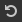
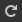

# A barra de ferramentas principal

<table>
<tr style="border: 0;">
<td width="100.00%" style="border: 0;" valign="top">

Esta página descreve a barra de ferramentas principal e o menu do [Substance 3D Designer](https://www.adobe.com/br/products/substance3d-designer.html), que aparecem no canto superior esquerdo da janela principal.Consiste em duas partes: os menus principais suspensos e os botões de acesso rápido. Todas as funções do botão de acesso rápido também podem ser acessadas por meio dos menus <b>Arquivo</b> e <b>Editar</b>.

</td>
<td width="41.67%" style="border: 0;" valign="top">

</td>
</tr>
</table>

## Botões de acesso rápido

 <b>Novo gráfico de Substance...:</b> (Ctrl+N)Apresenta a janela [Novo gráfico](../../compositing-graphs/creating-compositing-gra/creating-a-substance-compositing-graph.md) e, em seguida, cria um novo pacote com um [gráfico de Substance](../../compositing-graphs/substance-compositing-graphs.md).

 <b>Abrir...:</b> (Ctrl+O) Abra um [pacote de Substance (.SBS, .SBSAR, .SBSASM)](../../getting-started/overview/overview.md) existente.

 <b>Salvar Tudo:</b> (Ctrl++S) Salva todos os pacotes listados no [Gerenciador](../../interface/the-explorer-window/the-explorer-window.md).

 <b>Desfazer:</b> (Ctrl+Z) Desfaz a última operação.

 <b>Refazer:</b> (Ctrl+Y) Refaz a última operação desfeita.

## Arquivo

<b>Novo:</b> abre um submenu para criar um gráfico ou pacote:

* <b>Novo gráfico de Substance...:</b>(Ctrl+N) Apresenta a janela [Novo gráfico](../../compositing-graphs/creating-compositing-gra/creating-a-substance-compositing-graph.md) que permite configurar um novo gráfico de [Substance](../../compositing-graphs/substance-compositing-graphs.md);
* <b>Novo gráfico de função Substance:</b> cria um novo pacote com um [gráfico de função Substance](../../function-graphs/function-graphs.md);
* <b>Vazio:</b> cria um pacote vazio.

<b>Abrir...:</b> (Ctrl+O) Abre um [pacote de Substance existente (.SBS, .SBSAR, .SBSASM)](../../getting-started/overview/overview.md).

<b>Pacotes recentes:</b> exibe uma lista de pacotes abertos recentemente. Clique em uma entrada para abri-la.

<b>Abrir últimos pacotes de sessão (#)</b>: abre todos os pacotes que estavam abertos quando a última sessão foi fechada ou encerrada.

<b>Salvar todos os pacotes </b> (Ctrl++S) Salva todos os pacotes abertos, incluindo os pacotes carregados em segundo plano.

<b>Fechar tudo:</b> Fecha todos os pacotes abertos.

<b>Recarregar recursos:</b> força o Designer a recarregar [todos os recursos, incluindo bitmaps e dados de SVG](../../resources/importing-linking-and-new/importing-linking-and-new-resources.md).

<b>Sair:</b> (Ctrl+Q) - Fechar o Substance 3D Designer.

## Editar

<b>Desfazer:</b> (Ctrl+Z) desfaz a última operação.

<b>Refazer:</b> (Ctrl+Y) Refaz a última operação desfeita.

<b>Preferências...:</b> Abre a Janela Preferências.

>[!NOTE]
>
> Esta caixa de diálogo é acessada pelo menu do Substance 3D Designer na barra de tarefas do macOS.

## Ferramentas

<b>Cancelar renderização:</b> (Esc) para a operação atual do Substance Engine. Pode ser usado para abortar uma operação pesada e indesejada.

<b>Mecanismo de suspensão:</b> (+Esc) Suspende o mecanismo de renderização. Isso pode acelerar a edição de [gráficos de Substance](../../compositing-graphs/substance-compositing-graphs.md) complexos.

<b>Mecanismo de switch...: </b>(F9) Oferece uma seleção de mecanismos de renderização, incluindo mecanismos de GPU (”DirectX” no Windows, “OpenGL” no macOS), bem como o mecanismo de CPU (”NEON” no Apple Silicon, “SSE” em todos os outros).

<b>Substance Player:</b> gerencie a integração do Designer com o Substance Player:

* <b>Localizar o Player...:</b> informe ao Designer onde o Player está instalado;
* <b>Baixar Player...:</b> abre a [página de aterrissagem](https://helpx.adobe.com/substance-3d-player/home.html) da documentação do Substance Player, onde o Player pode ser baixado.

<b>Gerenciador de plug-ins...</b>: abre a janela Gerenciador de plug-ins, onde você pode instalar, carregar e descarregar plug-ins Python para o Substance 3D Designer.](../../scripting/scripting.md)[

## Windows

<b>Novo Explorer:</b> abre um novo Dock do Explorer. Você pode ter várias docking stations do Explorer abertas.

<b>Nova exibição 3D:</b> abre um novo encaixe de exibição 3D. É possível ter vários encaixes de visualização 3D abertos.

<b>Nova exibição da biblioteca:</b> abre uma nova área de Biblioteca. É possível ter várias docas de biblioteca abertas.

<b>Editor Python:</b> abre o Editor Python usado para[avaliar e criar scripts](../../scripting/scripting.md).

<b>Redefinir layout:</b> redefine o espaço de trabalho para o layout padrão. Todas as janelas serão reorganizadas e algumas janelas poderão ficar ocultas novamente. Use em caso de problemas com o layout do programa.

<b>Não maximizar janela:</b> quando qualquer painel estiver *maximizado*, essa opção não maximiza e restaura o layout como ele estava *antes* de a janela ser maximizada

<b>Explorador:</b> mostre/oculte o [Explorador](../the-explorer-window/the-explorer-window.md).

<b>Gráfico:</b> Mostrar/Ocultar a(s) [Janela(s) do gráfico](../../interface/the-graph-view/the-graph-view.md).

<b>Parâmetros:</b> mostra/oculta as [Propriedades](../properties/properties.md).

<b>Console:</b> mostre/oculte a janela do console.

<b>Visualização 3D:</b> mostra/oculta [Visualização 3D](../../interface/3d-view/3d-view.md).

<b>Gerenciador de Dependências:</b> mostre/oculte o [Gerenciador de Dependências](../../interface/dependency-manager/dependency-manager.md).

<b>Exibições 2D:</b> mostra/oculta o [Visualização 2D](../2d-view/2d-view.md).

<b>Biblioteca:</b> mostre/oculte a [Janela Biblioteca.](../../interface/the-library/the-library.md)

<b>Barra de ferramentas principal:</b> mostre/oculte a Barra de Ferramentas Principal (somente botões de acesso rápido).

>[!NOTE]
>
> Para saber mais sobre o gerenciamento de painéis do Designer, seus recursos de personalização e aprimoramento de fluxo de trabalho, acesse a página [Personalizando seu espaço de trabalho](../../interface/customizing-your-wor/customizing-your-workspace.md)desta documentação.

## Ajuda

<b>Tutorials:</b> abre o site dos [tutoriais do Substance 3D](https://substance3d.adobe.com/tutorials/) (antigo Substance Academy).<b>\
</b>

<b>Notas de versão:</b> abre uma janela com o log de alterações da versão mais recente.

<b>Requisitos técnicos:</b> mostra os requisitos técnicos para executar o aplicativo.

<b>Documentação:</b> abre o navegador padrão em [esta documentação](https://www.adobe.com/go/Substance-3D-doc-Designer_br).

<b>Documentação de scripts:</b> abre o navegador da Web nos documentos da API Python locais.

<b>Fóruns...:</b> abre seu navegador da Web em nosso fórum da [Comunidade de Suporte](https://forum.substance3d.com/) para entrar em contato com a comunidade e fazer perguntas.

<b>Relatar um erro...:</b> Abra a janela de relatório de erros.

<b>Exportar log...:</b> Exporta os arquivos de log atuais para um arquivo compactado (.zip), para fornecer ao suporte técnico.

<b>Dar feedback...:</b> abre o navegador da Web na página inicial da [Comunidade de Suporte](https://www.adobe.com/go/Substance-3D-feedback-Designer_br) do Adobe.

<b>Ativos do Substance 3D:</b> procure [conteúdo 3D premium](https://substance3d.adobe.com/assets) para assinantes (anteriormente Substance Source).

<b>Ativos da comunidade do Substance 3D:</b> permite procurar [ativos da comunidade gratuitos](https://substance3d.adobe.com/community-assets/) (anteriormente Substance share).

<b>Gerenciar minha conta\*:</b> abre a página da Web para sua conta Adobe.

<b>Entrar/Fazer logoff...\*:</b> Permite que você entre/saia de sua conta Adobe.

<b>Tela inicial...:</b> exibe a caixa de diálogo [Tela inicial](../../interface/home-screen/home-screen.md).

<b>Novidades...:</b> exibe uma tela, que destaca os recursos adicionados à versão mais recente do Designer

<b>Tela de boas-vindas...\*:</b> exibe uma tela que orienta os novos usuários pela finalidade do Designer e seu lugar no [ecossistema Substance 3D](https://helpx.adobe.com/substance-3d.html)

<b>Parceiros:</b> permite acessar as isenções de responsabilidade e avisos de integrações de terceiros de nossos parceiros no Designer.

<b>Sobre o Substance 3D Designer...:</b> Exibe informações sobre o aplicativo e seus componentes, como o número da versão.

\*: Essas opções estão disponíveis somente na versão do Designer instalada por meio da [Adobe Creative Cloud Desktop](https://creativecloud.adobe.com/en/apps/download/creative-cloud), que requer uma [assinatura do Substance 3D](https://www.adobe.com/creativecloud/plans.html?amp%3Bplan=individual#filter=3dar).
