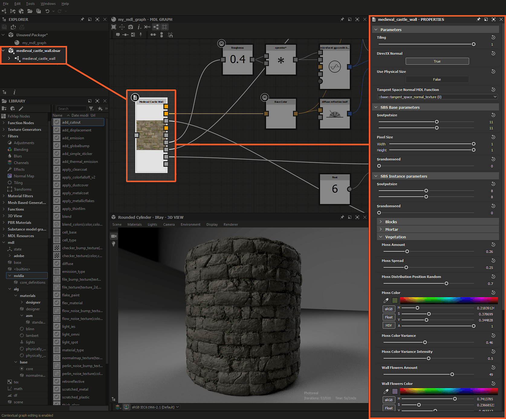

# Gráficos de Substance e materiais MDL

Esta página descreve as sinergias entre [gráficos de Substance](../../compositing-graphs/substance-compositing-graphs.md) e gráficos de MDL, e como conectar texturas de [saídas](../../compositing-graphs/nodes-reference-for-com/atomic-nodes/output/output.md) do gráfico de Substance para entradas do gráfico de MDL.

## Visão geral

As saídas de gráficos de Substance podem ser *passadas para parâmetros expostos* de materiais MDL de duas maneiras, que são descritas nesta página.

Se o material MDL atualmente aplicado na exibição 3D tiver parâmetros expostos cujo tipo é *[variável](../../mdl-graphs/main-mdl-graph-concepts/main-mdl-graph-concepts.md)* - esse tipo pode ser definido usando a opção <b>Modificador de tipo</b> nas propriedades do [parâmetro exposto](../../compositing-graphs/manage-parameters/exposing-a-parameter/exposing-a-parameter.md), eles podem ser conectados a *texturas*:

* um parâmetro <b>Color</b> pode ser conectado a texturas RGBA
* um parâmetro <b>Flutuante</b> para texturas em Tons de Cinza

Nesses casos, o valor uniforme bruto é substituído por um amostrador de texturas que fornece um valor variável. Esses classificadores têm um atributo <b>usage</b> definido no parâmetro exposto, e esse uso permite que o Designer conecte texturas de saída por gráficos de Substance ao parâmetro apropriado no material MDL, por *corresponderem a usos*.

## Gráficos de Substance na visualização 3D

Ao usar a opção <b>Exibir saídas na Visualização 3D</b> para um gráfico de Substance ou ao arrastar um gráfico de Substance do painel <b>Explorador</b> para a <b>visualização 3D</b>, as saídas são conectadas aos parâmetros expostos de *usos correspondentes* no material MDL atualmente exibido na visualização 3D.

Texturas individuais de um gráfico de Substance podem ser conectadas a qualquer um dos parâmetros de material MDL que suportam amostragem de textura, independentemente do identificador, pressionando RMB no nó do gráfico de Substance e arrastando para a visualização 3D. Uma lista de usos disponíveis do sampler é exibida, e você pode selecionar o uso de destino para a textura selecionada.

*A saída de texturas por um gráfico de Substance está conectada aos parâmetros expostos de um gráfico MDL na Exibição 3D*

## Gráficos de Substance em gráficos MDL

Instâncias de gráfico de Substance podem ser colocadas diretamente em gráficos MDL arrastando-as do painel <b>Explorer</b> para o gráfico MDL. Gráficos de Substance de <b>arquivos de Substance 3D</b> (SBS) e <b>arquivos de ativos de Substance 3D</b> (SBSAR) podem ser usados em gráficos MDL.

+++Substance do arquivo Substance 3D (SBS)

Instância do *[gráfico de Substance](../../compositing-graphs/substance-compositing-graphs.md) do [arquivo do Substance 3D](../../getting-started/overview/overview.md) (SBS) no gráfico MDL*

+++

+++Substance do ativo do Substance 3D (SBSAR)

Instância do *[gráfico de Substance](../../compositing-graphs/substance-compositing-graphs.md) do [ativo do Substance 3D](../../getting-started/overview/overview.md) (SBSAR) no gráfico MDL*

+++

Quando uma instância de gráfico de Substance é criada, ela aparece como um *nó* com os seguintes recursos:

* Um conector de *saída digitada* para cada uma das saídas do gráfico. Os dados de saída são digitados da seguinte maneira:
  * Bitmaps RGBA: cor (variável)
  * Bitmaps em tons de cinza: flutuante (variável)
  * Valores: Corresponder ao tipo de valor (variável)
* Uma *entrada* do tipo coordenadas UV para especificar as coordenadas UV que devem ser usadas para mapear a saída de texturas pelo gráfico de Substance. Se for deixado desconectado, o valor padrão é um gradiente linear clássico de 0-1 em X e Y no espaço UV
* O nó é *rotulado* após o rótulo do gráfico de Substance - ou identificador se nenhum rótulo estiver definido - e sua primeira saída de bitmap é uma miniatura

As propriedades do nó permitem modificar *todas as propriedades dinâmicas* do gráfico de Substance:

* Tamanho da saída
* Semente aleatória
* Parâmetros de entrada
* …

As propriedades do nó também permitem definir parâmetros específicos de como as texturas são *mapeadas* no material MDL:

* Revestimento
* Usar Tamanho físico
* Formato padrão
* Espaço tangente

A saída do nó da instância do gráfico de Substance pode ser conectada a qualquer entrada de nó de tipo correspondente no gráfico MDL.

Observe que alterar qualquer parâmetro na seção <b>Parâmetros básicos do SBS</b> envolve recalcular uma ou mais saídas do gráfico de Substance, que usa o <b>mecanismo de Substance</b> e envolve uma *sobrecarga de desempenho* sobre os cálculos do gráfico de MDL. Espera-se um impacto no desempenho ao *modificar um gráfico de Substance* que é instanciado em um gráfico de MDL aplicado na exibição 3D.

>[!WARNING]
>
> Ao usar um gráfico de Substance em um gráfico MDL, a exportação do gráfico MDL envolve colocar as saídas do gráfico de Substance em bitmaps que serão exportados como texturas empacotadas com o arquivo MDL exportado. Isso significa que a natureza paramétrica do gráfico de Substance é *perdida* no arquivo MDL exportado.
