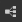

# Criar um gráfico MDL

Esta página descreve o processo de criação de um gráfico MDL para criar materiais MDL no Substance 3D Designer.

*Caminhos para criar um novo gráfico MDL na interface do Designer*

## Métodos de criação de um gráfico MDL

Você pode criar um gráfico MDL usando qualquer um dos seguintes métodos:

* Selecione a opção **Arquivo > Novo > gráfico MDL** na *barra do menu principal*
* Clique no botão  **Adicionar gráfico MDL** na *barra de ferramentas principal*
* Clique com o botão direito do mouse em um *pacote existente* no painel **Explorer** e selecione a opção **Novo > gráfico MDL**

Você verá a caixa de diálogo **Novo gráfico MDL**, veja abaixo.

*Nova caixa de diálogo de gráfico MDL*

## Caixa de diálogo Novo gráfico MDL

Independentemente do método usado para criar um novo gráfico MDL, você sempre será atendido com a caixa de diálogo <b>Novo gráfico MDL</b>, que permite configurar o novo gráfico.

### Modelos

A seção <b> Modelos</b> permite selecionar um modelo de gráfico, que inclui nós pré-configurados para que você comece a usar o gráfico mais rapidamente. Os nós pré-configurados incluem nós de saída, nós simples para passar valores para essas saídas - por exemplo, cor uniforme e nós de entrada, dependendo do modelo.

Para começar com um gráfico totalmente *em branco*, selecione o modelo <b>Vazio</b>.

A opção <b>Projeto</b> permite filtrar a lista de modelos por arquivo de projeto. Isso facilita a localização dos modelos personalizados nos locais adicionados na seção <b>Geral</b> das Configurações do projeto para o arquivo de projeto.

>[!WARNING]
>
> Se você selecionar o modelo errado, *não poderá* alternar para um modelo diferente após criar o gráfico.\
> Para migrar o gráfico existente para outro modelo, você pode criar um novo gráfico usando o modelo apropriado e copiar e colar o gráfico para o novo modelo. Reconecte os nós conforme apropriado, incluindo o nó [Raiz](../../mdl-graphs/main-mdl-graph-concepts/main-mdl-graph-concepts.md).

A lista de modelos pode ser exibida em modos diferentes usando os *botões* ao lado da caixa de combinação **Projeto**:

* **Exibição usada recentemente**: filtra a lista para exibir os últimos modelos usados na ordem de *mais recentes para menos recentes*, sendo o item superior o mais recente
* **Gráficos de exibição**: os modelos são exibidos somente pelo *rótulo*, na ordem dos arquivos do [Substance 3D](https://www.adobe.com/products/substance3d/3d-augmented-reality.html) no diretório de modelos
* **Exibir arquivos do Substance 3D**: os modelos são exibidos por seu rótulo como *filhos do arquivo do Substance 3D ao qual pertencem*, na ordem dos arquivos no diretório de modelos
* **Diretórios de exibição**: os modelos são exibidos por seu rótulo como *filhos do diretório ao qual pertencem*, na ordem dos arquivos no diretório de modelos

### Propriedades

A seção <b>Propriedades do gráfico </b> permite configurar informações básicas sobre o novo gráfico. Qualquer uma delas pode ser alterada depois, a qualquer momento, mas faz sentido prestar atenção no início e configurá-las adequadamente para seu caso de uso.

* <b>Nome do gráfico</b>: o identificador do gráfico. Ele precisa ser exclusivo para um determinado pacote e não pode incluir espaços nem alguns caracteres especiais.
* <b>Criar gráfico no pacote</b>: você pode usar esta caixa de combinação para criar um *novo* pacote para o novo gráfico ou adicionar o novo gráfico a qualquer pacote *existente* já carregado no painel do Explorer.\
  Observação: se o processo de criação for iniciado usando o método <b>4</b> (veja acima), esse parâmetro será *predefinido* para o pacote existente do qual o processo foi iniciado.
* <b>Detalhes do modelo</b>: esta seção fornece um texto curto explicando as características e a finalidade do modelo
