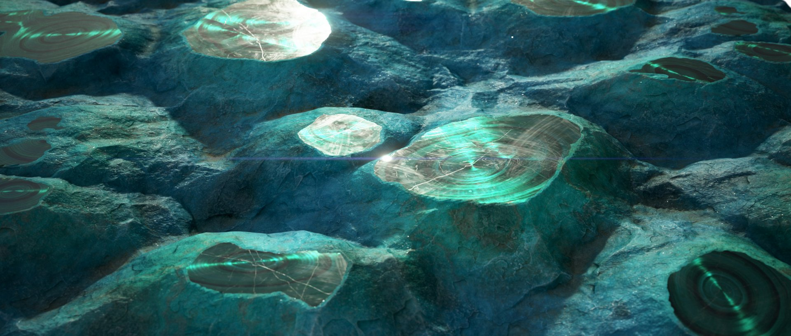

# Gráficos MDL

Esta página apresenta gráficos MDL no Substance 3D Designer, que permitem criar materiais MDL e visualizar o comportamento deles em tempo real.

*Malaquita com Crisófila, material MDL de [Mark Foreman](https://www.artstation.com/oggyart)* *disponível em nossa [plataforma de Substance share herdado](https://share-legacy.substance3d.com/libraries/4043)* *disponível*

>[!WARNING]
> 
> Os gráficos MDL e todos os recursos relacionados foram removidos do Designer na versão 16.0.0.
> 
> Saiba mais aqui: [Fim da vida útil do gráfico MDL e da Iray](../technical-issues/mdl-graph-iray-eol/mdl-graph-iray-eol.md)

+++Sumário

* [Principais conceitos do gráfico MDL](/help/mdl-graphs/main-mdl-graph-concepts/main-mdl-graph-concepts.md)
* [Criar um gráfico MDL](/help/mdl-graphs/creating-an-mdl-graph/creating-an-mdl-graph.md)
* [Biblioteca MDL](/help/mdl-graphs/mdl-library/mdl-library.md)
* [Expondo parâmetros em gráficos MDL](/help/mdl-graphs/exposing-parameters-mdl/exposing-parameters-in-mdl-graphs.md)
* [Gráficos de Substance e materiais MDL](/help/mdl-graphs/compositing-graphs-and/substance-compositing-graphs-and-mdl-materials.md)
* [Exportação de conteúdo MDL](/help/mdl-graphs/exporting-mdl-content/exporting-mdl-content.md)
* [Avisos em gráficos MDL](/help/mdl-graphs/warnings-in-mdl-graphs/warnings-in-mdl-graphs.md)
* [Recursos de aprendizado do MDL](/help/mdl-graphs/mdl-learning-resources/mdl-learning-resources.md)

+++

## Visão geral

MDL significa [Materials Definition Language](http://www.nvidia.com/object/material-definition-language.html): “uma tecnologia desenvolvida pela [NVIDIA](https://www.nvidia.com/) para definir materiais de base física para soluções de renderização de base física.” (Fonte: [Documentação do NVIDIA MDL](https://raytracing-docs.nvidia.com/mdl/index.html))

Usando essa linguagem, uma definição de material completa é portátil e, portanto, pode ser usada em aplicativos e renderizadores para uma saída consistente. Atualmente, o Substance 3D Designer é o aplicativo *somente* que oferece criação de nós baseada em gráfico de materiais MDL, expondo as funções MDL e os tipos de valor como nós em um gráfico MDL.

Ao criar materiais, você pode usar o renderizador [Iray](../interface/3d-view/iray/iray.md) da NVIDIA, incorporado ao Designer e disponível no painel [exibição 3D](../interface/3d-view/3d-view.md), para visualizar o comportamento do material *interativamente*.

Os gráficos MDL são complementares aos [gráficos de Substance](../compositing-graphs/substance-compositing-graphs.md), na medida em que o último gera *texturas* que podem ser *amostradas* pelo material MDL para afetar seu comportamento e aparência.

Sugerimos percorrer as seções desta documentação *na ordem* para obter um caminho de aprendizado guiado, começando com as propriedades de um recurso de gráfico MDL, logo abaixo.\
Ansioso para entrar? Comece com os gráficos MDL na seção [Recursos de aprendizado MDL](https://helpx.adobe.com/substance-3d/unlisted/documentation/sddoc/first-steps-with-mdl-145654095.html)!

>[!NOTE]
>
> Você pode saber mais sobre a implementação técnica da Linguagem de Definição de Material na [Documentação do NVIDIA MDL](https://raytracing-docs.nvidia.com/mdl/index.html), que inclui links para a Especificação do MDL e o [Manual do MDL](http://mdlhandbook.com/), todos criados e mantidos pela NVIDIA.

*Propriedades do gráfico MDL no painel [Propriedades](https://helpx.adobe.com/substance-3d/unlisted/documentation/sddoc/parameters-ui-129368153.html)*

## Propriedades do gráfico MDL

### Atributos

Esta seção inclui informações sobre o material MDL para fins de identificação, classificação e criação de autoria.

* <b>Identificador</b>: o nome deste recurso, que deve ser exclusivo em seu pai no pacote
* <b>Nome de exibição</b>: o nome do material MDL exibido na interface
* <b>Ícone</b>: a imagem usada como miniatura para este gráfico na Biblioteca do Designer
* <b>Oculto\*</b>: quando definido como* Verdadeiro*, o material MDL não é visível em uma biblioteca MDL, mas ainda existe internamente e pode ser referenciado
* <b>Mostrar na Biblioteca</b>: quando definido como *Verdadeiro*, o gráfico MDL é exibido na Biblioteca do Designer
* <b>Descrição</b>: a descrição do material MDL, que pode ser exibida na dica de ferramenta dos nós de instância que fazem referência a este gráfico
* <b>Categoria\*</b>: a categoria à qual o gráfico MDL pertence. No momento, isso não tem impacto sobre como o gráfico é classificado na [Biblioteca](../interface/the-library/the-library.md) do Designer
* <b>No grupo\*</b>: o grupo de biblioteca ao qual o material MDL pertence
* <b>Autor\*</b>: o autor do material MDL
* <b>Colaboradores\*</b>: os colaboradores do material do MDL, exceto o autor
* <b>Palavras-chave\*</b>: as palavras-chave que podem ser usadas para localizar o material MDL em uma pesquisa de biblioteca
* <b>Aviso de direitos autorais\*</b>: o aviso de direitos autorais relevante para a autoria e o uso do material MDL

Observação: as propriedades marcadas com um asterisco (\*) são anotações MDL a serem usadas por integrações de biblioteca MDL e não têm* impacto* no Designer.

### Entradas de gráfico

Esta seção lista os parâmetros interativos conectados a [parâmetros expostos](https://helpx.adobe.com/substance-3d/unlisted/documentation/sddoc/exposing-a-parameter-145654033.html) do gráfico MDL e define seus *valores padrão*. Eles podem ser *ajustados* e *reordenados* a qualquer momento.

A interface e o comportamento dessas entradas são definidos pelo *tipo de valor* e pelos *intervalos* dos parâmetros expostos aos quais estão conectados. Por exemplo:

* Um valor exposto do tipo <b>Flutuante</b> definido para um intervalo suave de [0.0,4.0] será exibido como um *controle deslizante único* de 0.0 a 4.0
* Um valor exposto do tipo <b>Cor</b> será exibido como um *widget de cores*, que inclui um gradiente de escolha e uma miniatura de cor

Para reordenar as entradas do gráfico, coloque o cursor na *alça escura* à esquerda do parâmetro, clique e *segure* <b>LMB</b> e arraste o cursor para cima ou para baixo. Essa ordem personalizada será usada para exibir as propriedades do material MDL nos seguintes contextos:

* Nós de instância que fazem referência ao gráfico MDL para este material
* As propriedades do material na [Exibição 3D](../interface/3d-view/3d-view.md)
* Integrações MDL de terceiros
