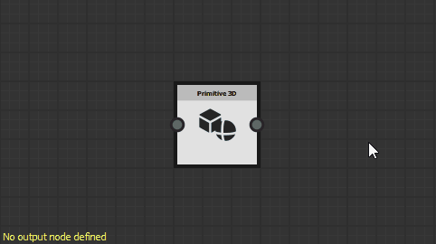

# Avisos em gráficos MDL

Esta página lista mensagens de erros e avisos que podem ser disparados por gráficos MDL no [Substance 3D Designer](https://www.adobe.com/br/products/substance3d-designer.html) e oferece etapas comuns de solução de problemas para cada um.

Os avisos são exibidos na dica de ferramenta do ícone de aviso para o recurso de gráfico no painel [Explorador](../../interface/the-explorer-window/the-explorer-window.md), bem como no canto inferior esquerdo da [Exibição de gráfico](../../interface/the-graph-view/the-graph-view.md) se o gráfico estiver carregado.

>[!NOTE]
>
> As ilustrações nesta seção foram gravadas em <b>gráficos de modelos de Substance</b>, que foram *desativados* na versão <b>13.0.0</b> do Substance 3D Designer. Entretanto, eles também se aplicam aos gráficos MDL.

##  Nenhum nó de saída definido

O gráfico não tem um nó de saída definido.

<b> Solução</b>

Selecione qualquer nó no gráfico que gera um valor cujo tipo corresponde ao tipo esperado para esta função, se houver, e clique em RMB e selecione a opção <b>Definir como raiz</b> no menu contextual ou clique duas vezes em LMB no nó.\
O nó de saída de um gráfico de modelo do Substance está colorido com *laranja*.

###  Pelo menos um valor de entrada foi rejeitado

O valor fornecido para um parâmetro não resulta em um cálculo válido do nó.

<b> Solução</b>

Ajuste o valor para que eles façam sentido para o parâmetro de destino.

###  Nenhum valor de entrada

Um valor de entrada esperado por um nó para executar seu cálculo não foi fornecido.

<b> Solução</b>

Alguns parâmetros de nó não podem retornar a um valor padrão quando nenhum dado é fornecido ao conector de entrada. Geralmente, esses são os casos para entradas de Cena.

Conecte as entradas do nó a outro conector de saída do nó do tipo correspondente.

### O nó  não foi computado

As informações fornecidas ao nó estão incompletas ou não são válidas, portanto, o nó não pôde realizar seus cálculos.

<b> Solução</b>

Suba no gráfico e verifique se há avisos acionados por problemas que impedem que os nós forneçam uma saída válida.

###  Os dados referenciados possuem alguns avisos

O recurso referenciado por um nó tem um ou mais avisos. Aqui estão alguns nós que fazem referência a um recurso:

* Um nó de instância de gráfico faz referência a um gráfico
* Um nó de recurso Cena faz referência a um recurso de cena Bitmap 3D

<b> Solução</b>

No painel Explorador, localize o recurso referenciado e solucione todos os avisos gerados pelo recurso:

* Para gráficos, consulte outros itens nesta página
* Para qualquer outro tipo de recurso, consulte a página Avisos de dependências

###  Recurso referenciado não encontrado

O recurso referenciado por um nó não foi encontrado no caminho salvo no arquivo do Substance 3D (SBS). Aqui estão alguns nós que fazem referência a um recurso:

* Um nó de instância de gráfico faz referência a um gráfico
* Um nó de recurso Cena faz referência a um recurso de cena Bitmap 3D

<b> Solução</b>

Para nós de instância de gráfico

Verifique se o gráfico de origem existe no pacote localizado no caminho salvo no atributo <b>Pacote</b>.\
Caso contrário, exclua o nó da instância e substitua-o por um nó de instância que faça referência a um pacote válido. Como alternativa, você pode recriar o pacote e o gráfico referenciados pelo nó da instância e recarregar o pacote do host clicando em *RMB* nele no painel [Explorer](https://substance3d.adobe.com/documentation/display/DRAFTDESIGNER/.The+Explorer+window+vDraftVersion) e selecionando a opção <b>Recarregar</b> no menu contextual.

Para nós de recursos de Cena

Localize os recursos referenciados no painel [Explorer](https://substance3d.adobe.com/documentation/display/DRAFTDESIGNER/.The+Explorer+window+vDraftVersion) e verifique se eles existem no local salvo no atributo <b>Caminho do Arquivo</b>.\
Caso contrário, clique em *RMB* no item de recurso no Explorer e selecione a opção <b>Realocar...</b> no menu contextual para definir um novo arquivo de destino válido para esse recurso.

###  Intervalo flexível não contém o valor

O valor padrão de um parâmetro exposto não é incluído no intervalo flexível definido para esse parâmetro.

<b> Solução</b>

Ajuste o valor padrão ou intervalo suave para que o primeiro seja incluído no segundo.

>[!NOTE]
>
> Este aviso não pode ser disparado por meio da interface do usuário, pois *ajusta automaticamente* o intervalo flexível para incluir o valor padrão. Modificar apenas os dados no arquivo do Substance 3D (SBS) *diretamente* pode fazer com que este aviso seja disparado.

###  Intervalo flexível fora do intervalo rígido

O intervalo suave do parâmetro e o parâmetro exposto não estão totalmente incluídos no intervalo rígido definido para esse parâmetro.

<b> Solução</b>

Ajuste o intervalo suave ou rígido para que o primeiro seja totalmente incluído no segundo.

>[!NOTE]
>
> Este aviso não pode ser disparado por meio da interface do usuário, pois *ajusta automaticamente* o intervalo flexível para ser totalmente incluído no intervalo rígido. Modificar apenas os dados no arquivo do Substance 3D (SBS) *diretamente* pode fazer com que este aviso seja disparado.

### Valor  está fora do intervalo rígido

O valor padrão de um parâmetro exposto não está incluído no intervalo rígido definido para esse parâmetro.

<b> Solução</b>

Ajuste o valor padrão ou intervalo rígido para que o primeiro seja incluído no segundo.

>[!NOTE]
>
> Este aviso não pode ser disparado por meio da interface do usuário, pois *ajusta automaticamente* o valor padrão a ser incluído no intervalo rígido. Modificar apenas os dados no arquivo do Substance 3D (SBS) *diretamente* pode fazer com que este aviso seja disparado.

