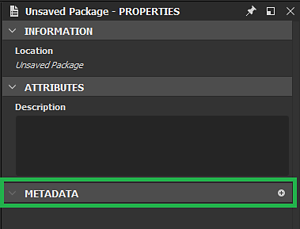

# Metadados do pacote

Metadados de pacote são um dicionário de valores de texto (string) definidos no nível do pacote. Ele está incluído no SBSAR quando é publicado, e é um armazenamento de uso geral destinado a ser usado por scripts python.

## Exibição e edição de metadados por meio da interface Designer

Se você estiver desenvolvendo um plug-in Python, talvez queira editar os metadados manualmente para fins de teste e depuração. Veja como fazer isso:

1. Se você clicar duas vezes em um pacote no explorador, o painel Propriedades será aberto nesse pacote.

   
1. Aqui você tem uma seção dedicada “Metadados”. É provável que ela esteja vazia no seu caso, como na captura acima.

   Você pode adicionar novos metadados usando o botão “mais”.

   
1. Um novo item aparece na seção:

   
1. Há os campos “Chave” e “Valor”. Ambos podem ser configurados para qualquer coisa que se adequar às suas necessidades. O campo “Chave” deve ter um valor exclusivo na lista.

   
1. Você também pode escolher o “Tipo” do item. No momento, pode ser “String” ou “URL”:

   
1. Aqui “URL” significa uma referência a um recurso incluído no pacote. Para isso, escolha um arquivo no disco rígido e arraste-o e solte-o no pacote no Explorer. Pode ser um recurso normal, como uma imagem, ou qualquer outro arquivo, como um arquivo de texto.

   
1. O arquivo aparece como um novo recurso no pacote.

   Agora, volte para o painel Propriedades do pacote, crie um novo metadado, dê a ele uma chave adequada e escolha “URL” como tipo. Depois, selecione o ícone “...” no campo “Valor”, e escolha “Do recurso”. Por fim, escolha o arquivo que você incluiu pouco antes e valide:

   
1. Agora você pode ver o “URL” do recurso armazenado no campo “Valor”.

   Você também pode excluir metadados usando o botão “X” à direita do item:

   

>[!NOTE]
>
> Mover ou reordenar entradas de metadados está desativado: a ordem não é significativa e não será mantida ao publicar o pacote.

## Metadados em arquivos SBSAR publicados

Em alguns casos, talvez você queira recuperar os metadados definidos em um pacote no SBSAR publicado correspondente. Abaixo você pode ler como os metadados são transformados e armazenados no arquivo e a maneira adequada de explorá-los a partir dele.

Os metadados são armazenados de acordo com o formato JSON em um arquivo chamado /assemblies/content/0000/metadata.json (o caminho é relativo à raiz do arquivo .sbsar).

Os metadados regulares (string) são armazenados como estão, por exemplo, “key”: “stringValue”, um por linha. Novamente, a ordem original das várias chaves não é mantida e sua implementação é definida. Nunca confie na ordem em seu processo, como acontece com dicts Python regulares!

Como o objetivo dos metadados de URL é permitir que usuários e plug-ins incluam arquivos externos no arquivo .sbsar, eles estão sujeitos a uma transformação específica: Primeiro, o arquivo do recurso correspondente ao URL armazenado é copiado para o arquivo em um local definido pela implementação (geralmente em uma subpasta numerada, que conterá apenas este arquivo. A questão é evitar o conflito de nomes.) O arquivo manterá seu nome original (o nome do recurso é descartado neste ponto). Em seguida, em vez do URL original no metadata.json, o caminho para o arquivo copiado no arquivo relativo ao metadata.json é gravado.

Se exportarmos o pacote de exemplo criado na seção anterior (depois de criarmos pelo menos um gráfico com algumas saídas), obteremos este conteúdo de arquivo:

```
myPackage.sbsar

|-- assemblies

        |-- content

            |-- 0000

                |-- New_Graph.sbsasm

                |-- New_Graph.xml

                |-- metadata.json

                |-- resources

                    |-- 0

                        |-- TEXT.txt
```


E o conteúdo de metadata.json é:

```
{

    "myResource": "resources/0/TEXT.txt",

    "myText": "This is a text"

}
```


No momento, nenhuma ferramenta específica é fornecida para acessar os metadados e recursos armazenados no arquivamento. A maneira recomendada é abrir o arquivo com o decodificador LZMA de sua escolha e analisar o metadata.json com um analisador JSON regular (se as chaves ou strings de valor contiverem alguns caracteres sofisticados, eles serão escapados da maneira JSON).

>[!NOTE]
>
> Não há informações sobre se cada metadado era uma simples string ou um URL, então você deve saber o que cada chave que você deseja ler deve significar.
