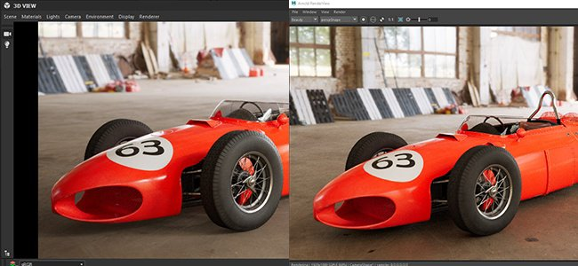
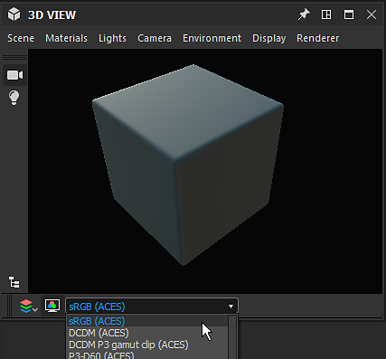

# Versão 2019.3 (9.3)

O **Substance Designer 2019.3** apresenta o Gerenciamento de Cores com suporte para OpenColorIO, além de atualizações de padeiros aprimoradas e um novo nó de atlas scatter.

Data de lançamento: *19 de dezembro de 2019*

## Principais recursos

### Gerenciamento de cores e suporte para OpenColorIO

O Substance Designer agora é compatível com o gerenciamento de cores, que permite controlar como as cores são interpretadas e transformadas. Este recurso é compatível com o [OpenColorIO](https://opencolorio.org/), um sistema de gerenciamento de cores amplamente usado no setor de Entretenimento e VFX.

* **Configurando o gerenciamento de cores nas configurações principais**\
  Por padrão, o Substance Designer será definido no modo “antigo”, o que significa que não carregará nenhuma configuração específica e continuará funcionando como antes. Para mudar para o OpenColorIO por exemplo, basta ir até as configurações principais e, em seguida, nas configurações do projeto para configurá-lo e ativá-lo.

  {width="600px"}
* **O Gerenciamento de cores é aplicado de três maneiras diferentes**\
  Diferentes partes do aplicativo recebem o gerenciamento de cores, que tem implicações diferentes:

  * **Exibição 2D e 3D**\
    Tanto o visor opengl em tempo real quanto o Iray podem ter as cores gerenciadas. Isso permite visualizar o material e a texturização no contexto. O perfil de cores pode ser alternado facilmente por meio do menu suspenso dedicado. Também é possível exibir a visualização em Gama linear sem correção de cores.

    {width="400px"}

    {width="400px"}
  * **Entradas e saídas de gráfico e exportação de bitmap**\
    Ao ler e gravar imagens bitmap na entrada e na saída de um gráfico, o gerenciamento de cores pode ajustar a imagem e convertê-la para trabalhar nas condições certas. Isso pode ser controlado na preferência principal do bitmap no gráfico e modificado na caixa de diálogo de exportação durante o processo de exportação. Salvar uma imagem da Visualização 2D também oferecerá uma maneira de escolher o espaço de cores.

    {width="400px"}

    {width="505px"}

### Nova curvatura do Baker de malha

A Curvatura do baker de malha foi refeito do zero. Ele agora aproveita o Rastreamento de raios, que permite a aceleração por GPU, mas também adiciona o suporte de interseções de malha.

Para obter mais informações, consulte a documentação [Curvatura da malha](https://experienceleague.adobe.com/pt-br/docs/substance-3d/bakers/bakers-settings/curvature-from-mesh).

>[!NOTE]
>
> A curvatura anterior do baker de malha foi descontinuada. Recomendamos mudar para a nova versão.

### Oclusão de ambiente aprimorada do Baker de malha

A Oclusão de ambiente do baker de malha agora tem uma nova configuração chamada “Plano do solo” que simula um plano abaixo da malha para produzir oclusão do solo. Isso pode ajudar a produzir resultados mais interessantes para geometria estática ou objetos não orgânicos. O plano terrestre fica na parte inferior da caixa delimitadora da malha por padrão, mas pode ser expandido ainda mais com configurações dedicadas.

Para obter mais informações, consulte a documentação da [Oclusão de ambiente do Mesh](https://experienceleague.adobe.com/pt-br/docs/substance-3d/bakers/bakers-settings/ambient-occlusion-from-mesh).

### Propriedades aprimoradas e Editor de predefinição

O editor de propriedades foi aprimorado, bem como o editor de predefinições:

* **Modo de visualização mais rápido**\
  Alternar para o modo de visualização ao editar parâmetros de gráfico agora é muito mais rápido, especialmente em gráficos com muitos parâmetros expostos. O modo de visualização agora é uma guia dedicada que facilita o deslocamento entre o editor de parâmetros e sua visualização.
* **Editor de predefinição reformulado**\
  A maneira como as predefinições são gerenciadas no Substance Designer agora é muito mais fácil e rápida: o editor de predefinições agora tem sua guia dedicada e cada predefinição agora lista quais parâmetros ela afeta.
* **Visível Se agora está levando em consideração gizmos de transformo 2D**\
  Quando um gizmo 2D transformado tem uma condição If visível, ele agora pode ser ocultado no Visualização 2D, tornando-o contextual para os parâmetros.

### Novo conteúdo

Nesta versão, apresentamos o novo nó **Atlas scatter**. Este nó permite ler uma imagem atlas (uma imagem contendo sub-imagens) e separar automaticamente seu conteúdo em um componente individual que pode então ser espalhado aleatoriamente. Este nó pode ser usado, por exemplo, para colocar ramificações e folhas em um material de chão de dirt. O [Substance Source](https://source.substance3d.com/allassets?q=atlas) agora inclui muitos materiais Atlas que podem ser espalhados com este novo nó.

>[!WARNING]
>
> Esta versão não é mais compatível com o CentOS 6.x.\
> No CentOS 7.x, talvez o aplicativo não seja iniciado devido a alguns problemas de dependência. Para corrigir o problema, atualize o sistema ou copie a [seguinte biblioteca](https://centos.pkgs.org/7/centos-x86_64/freetype-2.8-12.el7.x86_64.rpm.html) na pasta de instalação.

## Notas de versão

### 2019.3.3

*(Lançado Em 14 De fevereiro De 2020)*

**Adicionado:**

* [Batchtools] Entregar perfis OCIO padrão com ferramentas de lote

**Corrigido:**

* atlas scatter [Content]: problemas ao usar cores aleatórias/normais em algumas situações

### 2019.3.2

*(Lançado Em 04 De fevereiro De 2020)*

**Adicionado:**

* [SBSRender] Adicionar suporte ao gerenciamento de cores

**Corrigido:**

* [Content] Linear sRGB para nó ACEScg: rótulos de E/S incorretos
* [Content] ACEScg para nó sRGB: rótulos de saída incorretos
* [Content] Nós do Panorama Light: ajustar a faixa de temperatura
* [Graph] Grave queda de desempenho e congela ao ajustar um gráfico aninhado com “In-Context Editing” ativo
* [Graph] Falha ao excluir vários nós no FX-Map
* [Desempenho] O processo do Designer pode permanecer ativo após o encerramento

### 2019.3.1

*(Lançado Em 27 De Janeiro De 2020)*

**Corrigido:**

* [Graph] Grave queda de desempenho e congela ao ajustar um gráfico aninhado com “In-Context Editing” ativo
* [Graph] Não é possível inserir valor de enumeração de [0, 99] no ajuste Integer1
* [Gráfico] O comentário não é movido quando o quadro correspondente é deslocado
* [Graph] Os nomes de entrada estão ausentes no nó da instância personalizada
* [Graph] Miniaturas podem ser renderizadas ao carregar o gráfico, mesmo se a opção correspondente estiver desativada nas Preferências
* [2D View] O alfa negativo mostra o verificador, independentemente da opção de exibição
* [2D View] A conversão de superfície de 32f para 8 bits falha com valores altos
* [2D View] A inclinação superior/esquerda e “Make Square” definem algumas coordenadas com valores enormes em matrizes de transformação de avanço
* [2D View] UVs de todos os objetos de malha não são exibidos em conjuntos UV diferentes de “0”
* [Conteúdo] Chanfro: o modo de Angular não funciona corretamente na máscara de divisão em blocos gráficos
* [Conteúdo] Flood Fill para Gradiente: o valor da imagem de inclinação não é amostrado no meio da forma
* Função [Content]; “Booleano de igualdade” não está funcionando
* [Padarias] Artefatos ao usar o mapeamento automático de tons no padeiro “Curvatura da malha” em casos específicos
* [Padeiros] Falha em DXR quando cozimento enquanto nenhum material é selecionado
* [Bakers] Problema de desempenho na Exibição 2D ao ativar as “informações”
* [Engine] A função &#39;Pow&#39; gera valores enormes ao usar um valor de entrada muito baixo e um expoente alto no mecanismo SSE2
* [Engine] Falha ao usar uma compactação jpg alta em recursos de bitmap
* [Engine] O processador de valores retorna um valor incorreto de $size quando está dentro de um subgrafo
* [Parâmetros] Pop-up vazio aparece ao selecionar um nó de instância com um número alto de parâmetros
* [Parâmetros] O valor inteiro não é exibido em itens de parâmetro suspensos
* [Parâmetros] O botão Matriz de transformação &#39;Editar&#39; não está disponível no modo de visualização
* [Cooker] $size em ValueProcessor está errado quando dentro de uma instância do gráfico
* [Cooker] Tamanho de saída incorreto quando o link de valor passa por um nó de ponto para um nó atômico
* [UI] O botão para exibir todos os itens na barra inferior de Visualização 2D não está visível
* [UI] A visualização dos valores de RGB separados exibe números incorretos ao usar o Gerenciamento de cores
* [Exportar] As imagens RGBA 16f são exportadas em tons de cinza
* [Visualização 3D] Não é possível importar OBJ com vários espaços
* [Gerenciamento de cores] A configuração OCIO não é levada em consideração ao publicar a sbsar
* [Widget de cor] Os intervalos dos controles deslizantes de cor podem se expandir exponencialmente em um caso específico
* [Doc] A seção “paramValue” está incompleta na referência de formato Sbs
* [MDL] O widget de cores nas instâncias do sbsar não está correto
* [Predefinições] Falha ao atualizar predefinições em um caso específico
* [PSD] Erro do FreeImage ao carregar arquivos PSD de versões recentes do Photoshop
* [Resources] Falha ao desfazer a vinculação de bitmap diretamente no gráfico
* [SVG] os nós de SVG não são atualizados automaticamente ao usar as ferramentas de vetor

### 2019.3.0

*(Lançado Em 19 De dezembro De 2019)*

**Adicionado:**

* [Geral] Suporte ao gerenciamento de cores usando o arquivo de configuração do OpenColorIO
* [Predefinições] Aprimorar o gerenciamento de predefinições
* [Predefinições] Sincronizar Gizmos de exibição 2D e controles deslizantes de visualização
* [Predefinições] Restaurar valores de visualização ao voltar para o modo de Visualização
* [Predefinições] Manter o modo de visualização ativo ao editar outros nós, recursos ou gráficos
* [Predefinições] Desfazer funciona suavemente ao navegar entre as três guias de predefinições
* [Predefinições] Permitir a redefinição de parâmetros para o valor padrão do gráfico ou Predefinição no modo de visualização
* [Predefinições] Aprimorar fixação de parâmetros
* [Predefinições] Importar/exportar todas as predefinições de um gráfico para um arquivo
* [Padeiros] Novo padeiro &#39;Curvatura de malha&#39; com base em traçado de raio
* [Padeiros] Adicionar opção de plano terrestre no padeiro &#39;AO from Mesh&#39;
* [Padeiros] Adicione a opção de correspondência por nome para ignorar a face traseira no padeiro “AO from Mesh”
* [Content] Novo nó de Atlas scatter
* [Content] Novos nós e funções de conversão do espaço de cores (ACEScg)
* [Conteúdo] Melhorar a consistência de nomenclatura para nós com versões coloridas/em tons de cinza
* [Gráfico] Aprimorar o desempenho no modo de Visualização de predefinições
* [Graph] Adicionar a macro $(colorspace) para exportar a opção de saídas de gráfico
* [Parâmetros] Quando um parâmetro é definido como invisível, oculte o gizmo correspondente na Visualização 2D
* [Parâmetros] Não adicionar &#39;Grupo de entrada de gráfico&#39; como um prefixo ao expor parâmetros
* [Parâmetros] Adicionar dica de ferramenta para VisibleIf nos parâmetros do gráfico
* [AXF] Atualizar o AXF SDK para v1.6

**Corrigido:**

* [Linux] O Designer não inicia no CentOS 8 devido a uma falha de carregamento na plataforma Qt.
* [Linux] AVISO: a biblioteca Freetype foi removida do aplicativo SD: usuários com CentOS versão &lt;= 7.5 precisam instalá-la manualmente.
* [AxF] Falha ao importar arquivos criados com versões mais recentes do AxF
* [2DView] As texturas do pincel alimentadas por um recurso não são aplicadas
* [2DView] Falha ao modificar entradas de gráfico instanciado com ajuste de posição
* [3DView] Falha ao cancelar o “Carregar...” ação
* [3DView] Opção Adicionar espaço da cor para texturas de emissão em Sombreadores GLSLFX
* [Padeiros] Mapas alimentados por recursos são ignorados durante a cozedura
* [Padeiros] As opções de “Direção do espaço mundial” estão bloqueadas incorretamente
* [Bitmap] Os bitmaps EXR com valores de ponto flutuante são renderizados como uma imagem em preto
* [Content] Flood Fill para índice: a detecção de forma falha em um caso específico
* [Content] Cortar: problema de amostragem quando o nó de corte tem uma resolução mais baixa do que a entrada
* [Geral] Falha ao fechar o Designer ao gerar a biblioteca
* [Graph] Os nós de bitmap não refletem a compactação do bitmap associado
* [Gráfico] O cache não é limpo ao limpar as miniaturas de nó após a primeira renderização
* [Graph] Tamanho do nó incorretamente invalidado
* [Graph] Falha ao enviar em alguns casos ao alterar conexões de entrada em um nó de processador de pixel
* [Gráfico MDL] Falha ao restaurar um valor padrão de chamada de função
* [Propriedades] Os botões &#39;Editar&#39; e &#39;Matriz&#39; nos parâmetros de matriz de transformação são confusos
