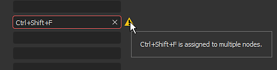
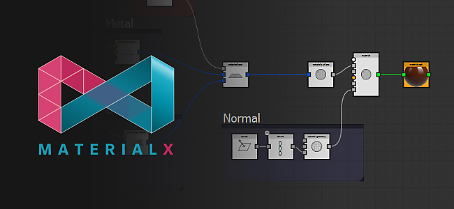
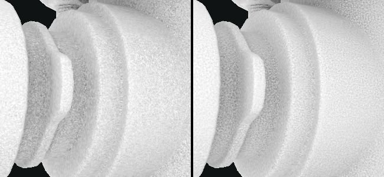
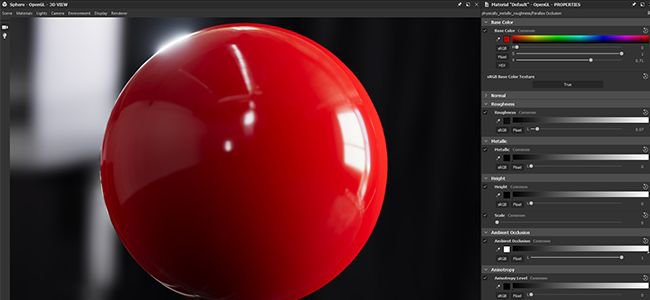

# Versão 2020.1 (10.1)

O **Substance Designer 2020.1** inclui um novo editor de atalhos, um plug-in MaterialX e várias novas melhorias no gerenciamento de cores com funcionalidades de Adobe Color Engine e novas baker.

Data de lançamento: *10 de abril de 2020*

>[!NOTE]
>
> A partir desta versão, o número de versão do aplicativo mudará seu formato. O que deveria ser o **2020.1** agora se torna o **10.1.0**.

## Principais recursos

### Novo editor de atalhos para criação de nó

Nesta versão, apresentamos um novo editor de atalhos que permite definir atalhos de teclado para acelerar a criação de nós nos diferentes modos de gráfico.

O novo editor de atalhos está acessível nas preferências principais por meio de **Editar > Preferências > Atalhos**. Por padrão, todos os campos de atalho estão vazios.

* **Atalhos para cada tipo de gráfico**\
  É possível definir um atalho para cada tipo de gráfico disponível em Substance Designer, desde o gráfico de composição regular até o mais avançado, como funções e MDL.

  
* **Atribua atalhos para nós atômicos e filtros personalizados**\
  Por padrão, a interface mostra os nós atômicos para cada tipo de gráfico. Usar o campo de pesquisa permite refinar a lista, mas também tornar acessíveis os nós e filtros de biblioteca personalizados:

  
* **Criando um novo atalho**\
  Para criar um novo atalho para um nó específico, basta clicar no campo de texto ao lado de seu nome e digitar as teclas solicitadas no teclado. Para limpar um atalho, use o botão de cruz.

  
* **Gerenciando conflitos de atalhos**\
  Use a dica de ferramenta no ícone de aviso para saber mais sobre um conflito. Menciona se uma chave entra em conflito com uma existente ou se já é usada pela aplicação para outra finalidade.

  

  
* **Procurar atalhos**\
  Caso haja muitos atalhos a serem rastreados ou se um nó não estiver visível por padrão, use o sistema de pesquisa para isolá-los:

  

### Novo plug-in MaterialX (beta)

Durante o SIGGRAPH 2019, demonstramos um plug-in MaterialX para o Substance Designer. O [MaterialX](http://www.materialx.org/) é um formato desenvolvido pelo [Industrial Light &amp; Magic (ILM)](https://www.ilm.com/) que permite que os artistas criem materiais que possam ser usados em uma ampla variedade de plataformas e vários usos (como filmes, programas de TV, jogos, experiências de realidade virtual e manufatura). Este novo plug-in, que agora está disponível na versão beta, permite criar materiais MaterialX para serem usados em outro aplicativo DCC compatível. Dê uma olhada em nosso recente [artigo sobre o MaterialX](https://magazine.substance3d.com/research-a-portable-shader-graph/) para saber mais sobre o processo e os objetivos por trás deste novo plug-in.

Este novo plug-in permite:

* Desenvolva sombreadores e texturas de procedimentos em paralelo.
* Crie sombreadores avançados para Substance Painter com recursos como mapas de detalhes e máscaras de procedimentos alteráveis no tempo de execução.
* Combine recursos shader de um mecanismo de jogo ou pipeline VFX na viewport Substance Designer e Substance Painter.

Para obter o plug-in, basta passar o [Substance share](https://share.substance3d.com/libraries/6111) para baixá-lo.

### Nova integração de Adobe Color Engine (ACE)

Além do OpenColorIO, agora é possível usar o Adobe Color Engine (ACE) para suportar perfis ICC para o gerenciamento de cores. Isso significa que agora é possível importar e exportar imagens calibradas para que correspondam a outros softwares, como o Photoshop e o Illustrator.

* **Habilitando Adobe Color Engine**\
  Use as configurações do projeto para definir o sistema de gerenciamento de cores a ser usado:

  
* **Alterando perfil de tela**\
  Ao visualizar imagens por meio da visualização 2D ou 3D, use o menu suspenso para especificar o perfil a ser usado:

  
* **ACES para gerenciamento de cores herdadas**\
  A transformação de saída mapeada em tons do ACES agora está disponível com o modo de gerenciamento de cores herdado.

### Padarias aprimoradas

Refinamos alguns de nossos baker com duas mudanças principais:

* **Amostragem aprimorada**\
  O baker de Oclusão de ambiente, Thickness e Curvatura agora usa um novo método de amostragem que melhora muito a qualidade dos resultados feitos bake. Produz um ruído mais atraente e resultados mais estáveis, sem a necessidade de aumentar a contagem de amostras. A imagem abaixo mostra o método de amostra anterior na parte superior e o novo método na parte inferior com da esquerda para a direita 4, 8 e 16 amostras (todas as renderizações foram feitas com suavização de serrilhado definida para subamostragem 4x4).

  {width="600px"}
* **Nova configuração de normalização**\
  Os baker Thickness e Heightmap têm um novo parâmetro de normalização que permite fazer bake valores brutos em textura em vez de valores fixados no intervalo 0-1. Isso é útil com um mapa de altura para conhecer as distâncias brutas entre uma malha de baixo e alto polígono, por exemplo. O valor do divisor corresponderá exatamente à intensidade do deslocamento a ser configurada na malha de baixo polígono para corresponder à silhueta de malha de alto polígono. Para interpretar corretamente o mapa de altura, também expusemos um novo parâmetro “Valor zero escalar” para definir o valor de pixel correspondente a 0. Além disso, o fator manual permite corrigir possíveis problemas de emenda nas malhas UDIM causados por uma normalização por UV-Tile.

  

### Visualização 3D aprimorado

A visualização 3D recebeu várias melhorias na qualidade de vida que devem tornar o trabalho diário mais agradável:

* **Sincronização de parâmetros entre renderizadores**\
  Os parâmetros de sombreador agora estão sincronizados entre OpenGl e Iray, o que torna o salto entre eles muito mais fácil.
* **Exibir visualização de entrada de textura e adicionar parâmetro de desabilitação**\
  Os parâmetros de entrada de sombreador agora exibem uma visualização de sua entrada: pode ser um parâmetro de cor uniforme, um nó de gráfico ou um bitmap. Também é possível desmarcar um parâmetro para desativá-lo temporariamente.

  

  
* **Visualização do mapa de ambiente nas configurações**\
  Ao ir para **Visualização 3D > Ambiente > Editar**, agora há uma visualização do mapa de ambiente usado para iluminar a cena.

  
* **Novo sombreador Não Aceso**\
  Um novo sombreador chamado “unlit” foi incluído por padrão. Ele não reage a nenhuma iluminação e, em vez disso, pode ser usado para exibir uma única textura na janela de visualização sobre uma malha. Isso é útil para examinar texturas feitas bake, por exemplo.

  {width="500px"}
* **Desempenho aprimorado em telas High DPI com downscaling de viewport**\
  Semelhante ao Substance Painter, agora há um novo parâmetro chamado **Dimensionamento do visor** nas preferências principais que detecta que uma tela usa dimensionamento HDPI (como telas Retina no MacOS) e dividirá automaticamente a resolução do visor em 2. Esse comportamento evita desenhar a viewport em resoluções muito altas e melhora o desempenho geral.\
  Os valores de configuração atuais são:

  * **Nenhum**: nenhum dimensionamento de viewport.
  * **Automático** (padrão): se o aplicativo estiver em uma tela HDPI, a resolução do visor será dividida por dois.

  

### Novo conteúdo

Esta versão também inclui alguns nós novos ou aprimorados:

* **Nó de Renderização PBR aprimorado**\
  Já introduzido em uma versão anterior, este nó foi muito aprimorado. Agora oferece controles de câmera, novas formas (como plano e cilindro), pós-efeitos (Profundidade de campo, Bloom/brilho, Vinheta etc.) e novos tipos de materiais (como revestimento transparente e Anisotropia), bem como suporte para materiais com opacidade.\
  Para obter mais informações, consulte a [página de documentação](../../../compositing-graphs/nodes-reference-for-com/node-library/material-filters/pbr-utilities/pbr-render/pbr-render.md) dedicada.

  {width="250px"}

  {width="250px"}

  {width="250px"}
* **Novo Nó de Mapeamento de Renderização PBR**\
  Como uma extensão para Renderizações PBR, você pode usar este novo nó para criar visualizações compostas map-channel.\
  Para obter mais informações, consulte a [página de documentação](../../../compositing-graphs/nodes-reference-for-com/node-library/material-filters/pbr-utilities/pbr-render-mapping/pbr-render-mapping.md) dedicada.

  {width="250px"}

  {width="250px"}
* **Novo filtro FXAA**\
  O novo filtro implementa o algoritmo de suavização aproximada de borda rápida (FXAA), que é um método de suavização de borda. Ele pode ser usado em textura regular para suavizar linhas ou bordas irregulares.\
  Para obter mais informações, consulte a [página de documentação](../../../compositing-graphs/nodes-reference-for-com/node-library/filters/effects/fxaa/fxaa.md) dedicada.

  {width="600px"}
* **Novo filtro Hald CLUT**\
  Esse filtro permite ajustar o tom e a cor de uma imagem com uma tabela de pesquisa de entrada (LUT). Ele usa o formato Hald CLUT para criar um simplesmente a partir de uma identidade LUT [disponível aqui](http://www.quelsolaar.com/technology/clut.html).\
  Para obter mais informações, consulte a [página de documentação](../../../compositing-graphs/nodes-reference-for-com/node-library/filters/adjustments/hald-clut/hald-clut.md) dedicada.

  {width="600px"}

## Notas de versão

### 2020.1.3

*(Lançado Em 11 De junho De 2020)*

**Adicionado:**

* [Content] Expor o parâmetro “Matte Color” no nó Tons de cinza de transformação segura
* [Content] Renderização PBR: Adicionar uma opção personalizada de Entrada em segundo plano
* [Content] Nós do Panorama Light: nova opção para obter uma amostra da cor da imagem de fundo
* [Parâmetros] Ocultar parâmetros com sinalizador &#39;sem suporte&#39; na lista da janela Expor Parâmetros

**Corrigido:**

* [Exibição 3D] Falha ao alternar malhas personalizadas em um caso específico
* [Visualização 3D] O formato normal é sempre DirectX na inicialização
* [Content] 3D Worley noise: renderizar artefato ao usar um valor de tamanho de grade alto
* [Content] A mesclagem do nó de dissolução está incorreta
* [Content] Renderização PBR: remover aviso de Cooker
* [Content] Renderização PBR: o resultado contém cores negativas em alguns casos
* [Cooker] Problema de injeção de cache para nós de instância de várias saídas
* [Explorer] Falha ao fechar um pacote que contém um gráfico MDL exibido
* [Graph] Cozimento em 2 passos: a alteração do tipo de nó não aciona um recook
* [Graph] Falha ao excluir entradas ao usar a conexão
* [Gráfico] Os pontos de extremidade do link podem ser movidos para um espaço vazio
* [MDL] Falha ao cancelar a exportação MDL do gráfico MaterialX
* [MDL] Erro ao cancelar exportação para MDLE
* [Predefinições] Falha na guia Predefinições após alterar o tipo de parâmetro incluído na predefinição
* [Resources] A lista de materiais está vazia no menu contextual do gráfico para malhas vinculadas como não UDIM

### 2020.1.2

*(Lançado Em 27 De abril De 2020)*

**Adicionado:**

* [Content] Adicionar modelo de filtro de Alchemist
* [Content] Renderização PBR: adicionar parâmetros para controlar as intensidades das sombras difusas/de specular
* [Content] Nós de luz da forma: adicionar parâmetro de posição da câmera
* [Notícias] O estilo de grupo “Seta” é quebrado na primeira vez que a janela é exibida
* [Padeiros] Adicione o atalho Z à Visualização 2D para ver a imagem em 1:1
* [Project] Ocultar o alias $(PROJECT\_DIR) da lista
* [Explorer] Não criar recurso personalizado para recursos que não são um arquivo no disco

**Corrigido:**

* [Player] Relatar aliases ausentes ao carregar pacotes SBS
* [Player] Exibe o valor de Distribuição aleatória em base decimal
* [Player] Empacotar todos os mapas de ambiente incluídos no Substance Designer
* [Player] Falha ao sair no macOS High Sierra
* [Player] Não é possível carregar pacotes usando sbs://
* [Content] 3D Worley noise: renderizar artefato ao usar um valor de tamanho de grade alto
* [Content] A entrada &#39;GreaterThanZero&#39; no nó &#39;Wave&#39; não é usada
* [Conteúdo] Luz de plano: o modo de posição do espaço global não funciona
* [Conteúdo] Luz da esfera: a posição interna da luz não funciona corretamente
* [Padeiros] Falha ao assar com a janela de cozimento enquanto uma opção “Atualizar todos os mapas baked” está em execução
* [Padeiros] Falha de cozimento no Optix para AO da malha usando baixo como alto com um mapa normal
* [Padeiros] A resolução da visualização dos arquivos UVT não corresponde ao tamanho da tela
* [Exibição 3D] O bitmap atribuído será substituído ao carregar um MDL se o valor padrão não for uma texture2d
* [3D View] Os widgets de Propriedades de materiais mudam após a redefinição de uma propriedade
* [Exibição 3D] A preferência global de Formato normal não funciona mais
* [MatX] Biblioteca: a categoria MaterialX Graph não exibe todos os nós disponíveis
* [MatX] O menu contextual de um Gráfico personalizado pode conter subpastas vazias na pasta “Adicionar nó”
* [SBSAR] A entrada principal é revertida para a primeira entrada da lista
* [Biblioteca] Somente o primeiro gráfico é incluído no SBSAR com vários gráficos
* [CustomGraph] Os nós que não fazem parte do tipo de gráfico atual são criados automaticamente em alguns casos
* [Iray] O parâmetro &#39;Profundidade&#39; de projeção de caixa não funciona corretamente
* [Preferências] Aprimorar layout nas configurações do projeto
* [Parâmetros] Falha ao mover um widget de posição depois de excluir um parâmetro
* [UI] Falha ao alterar a hierarquia de usos no nó de saídas
* [Graph] Falha ao usar uma caixa de seleção em um comentário e um nó com marca

### 2020.1.1

*(Lançado Em 10 De abril De 2020)*

**Corrigido:**

* [Visualização 3D] O uso da memória é muito alto ao trabalhar em gráficos de composição
* [Content] Formas inesperadas na saída não quadrada de nós &#39;Polygon&#39;
* [Content] Renderização PBR: a câmera ortográfica não funciona corretamente ao usar uma resolução não quadrada
* [Conteúdo] Renderização PBR: bokeh giratório aumenta o brilho da borda da imagem
* [Gerenciamento de cores] O seletor de cores na caixa de diálogo Novo bitmap não é gerenciado por cores.
* [Gerenciamento de cores] Os seletores de cores nas ferramentas de pintura e vetor na exibição 2d não são gerenciados por cores.

### 2020.1.0

*(Lançado Em 09 De abril De 2020)*

**Adicionado:**

* [Atalhos] Gerenciador de atalhos para criação de nó
* [Content] Nó Nova Renderização PBR
* [Content] Novo filtro FXAA
* [Content] Novo filtro Hald CLUT
* [Content] Expor a filtragem em nós “Cortar”
* [Exibição 3D] Melhorar os parâmetros do sombreador / fluxo de trabalho de atribuição de textura
* [Visualização 3D] Novo sombreador sem iluminação
* [Exibição 3D] Adicione um “Valor zero escalar” aos sombreadores de deslocamento
* [3D View] Adiciona uma opção para reduzir a resolução da viewport quando High DPI está ativada
* [Modo de exibição 3D] GLSLFX: permite definir informações de gui no sampler (padrão, mín, máx, guiMin, guiMax, guiStep, guiWidget, guiName, guiGroup)
* [Exibição 3D] Adicione a opção “Carregar estado com malha...” no menu Cena
* [Exibição 3D] Adicione o ACES tonemapped output transform no modo de gerenciamento de cores herdado
* [Padarias] Novo método de amostragem em AO, Curvatura, Normal Torto, Padarias de Thickness
* [Padeiros] Novas opções de normalização em padeiros de Heights e Thicknesss
* [Gerenciamento de cores] Integrar Adobe ACE (Adobe Color Engine)
* [Gerenciamento de cores] Adicionar opções para definir o comportamento padrão quando o perfil ICC estiver ausente
* [Parâmetros] Tornar os controles deslizantes incrementais consistentes com o Substance Painter
* [Pacote] Incluir o máximo de dlls Qt que pudermos para scripts Python
* [Projeto] Desabilitar configurações para arquivos de projeto somente leitura e comunicar esse estado claramente
* [Preferências] Ocultar configurações não claras específicas relacionadas à capacidade de resposta e aos períodos de cálculo
* [UI] Renomear Pow2 -> 2Pow
* [Propriedades] Otimizar a exibição das propriedades do gráfico de composição
* [AXF] Atualização para o AXF SDK 1.7.1

**Corrigido:**

* [Exibição 3D] Os parâmetros de Luz ambiente não são visíveis, embora estejam ativados
* [Visualização 3D] glslfx: o widget de cor é sempre um vec3 sem alfa
* [3D View] O mapa de ambiente definido de um recurso não é salvo no recurso da cena
* [Visualização 3D] Iray: a luz ambiente é convertida em uma luz de ponto na origem da cena
* [Visualização 3D] glslfx: o widget de cor é sempre um vec3 sem alfa
* [Parâmetros] A URL do Pacote de Instâncias não está correta no grupo de atributos
* [Parâmetros] Falha ao expor parâmetros
* [Parâmetros] Os ícones não estão corretamente alinhados nos parâmetros dos nós Curva
* A cadeia de caracteres do nó [Parameters] &#39;Text&#39; só é exibida no modo &#39;Preview&#39; quando exposta
* [Parameters] Falha ao renomear um parâmetro de entrada usado na instrução &#39;Visible If&#39;
* [Parâmetros] Falha ao excluir um nó de Níveis que tem uma função definida em qualquer um de seus parâmetros
* [IU] O ícone de aviso na lista de parâmetros de entrada é colocado sobre um botão existente
* [UI] Os avisos não são apagados no item de parâmetro de entrada correto em um caso específico
* [UI] Impedir a mensagem “Is mesh UDIM ?” popup para aparecer quando os UVs de malha estiverem estritamente no bloco [0,1]
* [UI] As listas suspensas de predefinições podem ser roladas com a roda do mouse ao passar o mouse
* [UI] A opção “Cálculo de saída(s)” nos atributos do gráfico foi nomeada incorretamente
* [MDL] Falha ao inserir um recurso de gráfico SBS em um gráfico MDL
* [MDL] O nó SBS com entrada de imagem não funciona corretamente
* [MDL] Associações de textura e nomes de uso incorretos
* [Graph] O grupo de valores de entrada e o uso são ignorados no modo de criação de link &#39;Material&#39;
* [Gráfico] Valores de Entrada usam o valor padrão em vez dos dados de entrada para Booleanos
* [Bakers] Normais incorretos no padeiro World Space Normals usando um mapa normal tangente em casos específicos
* [Pães] Uso excessivo de memória ao assar com a janela de visualização aberta
* [Predefinições] a predefinição corrompida causa uma falha na renderização
* [Predefinições] O parâmetro booliano do SBS antigo não é afetado pela predefinição
* [Library] Os recursos do primeiro pacote aberto são listados no menu flutuante de criação de nó
* [Publish] Publicar no SBSAR retorna o código de erro 13 em SBSCooker no macOS
* [Publish] Aviso de argumento preterido no SBSCooker ao publicar no SBSAR
* [API] Não é possível obter os metadados de um pacote que vem de um arquivo .sbsar
* [Exportar] No modo Legado, a opção colorspace é revertida para os padrões de saídas específicas
* [2D View] Copiar para a área de transferência não leva em consideração o estado do Gerenciamento de cores
* [Unix] O Designer ignora os sinais do sistema
* [Library] Alguns filtros da biblioteca não funcionam corretamente devido às tags traduzidas
* [Cooker] A raiz quadrada de números negativos deve retornar 0 em vez de NaN
* [Visualização 2D] Os canais vermelho e azul são trocados após desfazer o primeiro traçado de tinta
* [Console] Mensagem de aviso em excesso no console “QPixmap::scaled: Pixmap é um pixmap nulo”
* [Content] “Shape Glow”: aviso de culinária
* [Dependências] Atribuir um gráfico localizado em um pacote diferente a uma malha não cria dependências
* [Iray] As propriedades do material ficam inativas após alternar a geometria

**Adicionado:**

* [Atalhos] Gerenciador de atalhos para criação de nó
* [Content] Nó Nova Renderização PBR
* [Content] Novo filtro FXAA
* [Content] Novo filtro Hald CLUT
* [Content] Expor a filtragem em nós “Cortar”
* [Exibição 3D] Melhorar os parâmetros do sombreador / fluxo de trabalho de atribuição de textura
* [Visualização 3D] Novo sombreador sem iluminação
* [Exibição 3D] Adicione um “Valor zero escalar” aos sombreadores de deslocamento
* [3D View] Adiciona uma opção para reduzir a resolução da viewport quando High DPI está ativada
* [Modo de exibição 3D] GLSLFX: permite definir informações de gui no sampler (padrão, mín, máx, guiMin, guiMax, guiStep, guiWidget, guiName, guiGroup)
* [Exibição 3D] Adicione a opção “Carregar estado com malha...” no menu Cena
* [Exibição 3D] Adicione o ACES tonemapped output transform no modo de gerenciamento de cores herdado
* [Padarias] Novo método de amostragem em AO, Curvatura, Normal Torto, Padarias de Thickness
* [Padeiros] Novas opções de normalização em padeiros de Heights e Thicknesss
* [Gerenciamento de cores] Integrar Adobe ACE (Adobe Color Engine)
* [Gerenciamento de cores] Adicionar opções para definir o comportamento padrão quando o perfil ICC estiver ausente
* [Parâmetros] Tornar os controles deslizantes incrementais consistentes com o Substance Painter
* [Pacote] Incluir o máximo de dlls Qt que pudermos para scripts Python
* [Projeto] Desabilitar configurações para arquivos de projeto somente leitura e comunicar esse estado claramente
* [Preferências] Ocultar configurações não claras específicas relacionadas à capacidade de resposta e aos períodos de cálculo
* [UI] Renomear Pow2 -> 2Pow
* [Propriedades] Otimizar a exibição das propriedades do gráfico de composição
* [AXF] Atualização para o AXF SDK 1.7.1
