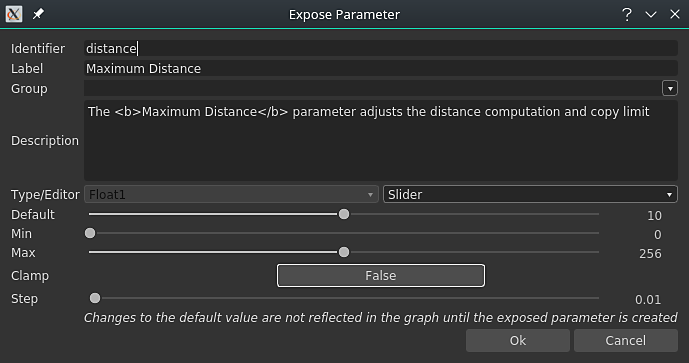
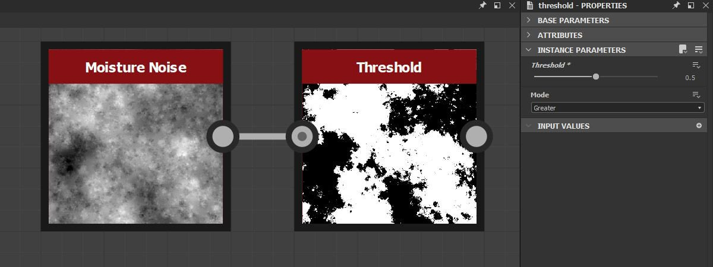
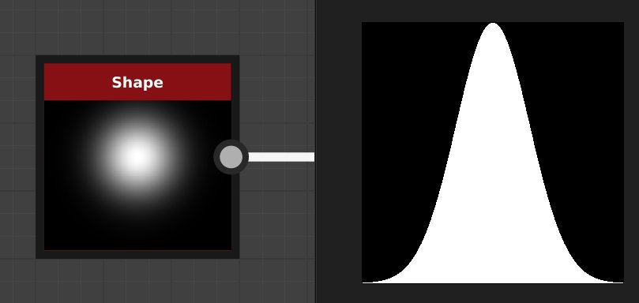

# Versão 2020.2 (10.2)

O **Substance Designer 2020.2** traz uma nova atualização de Substance Engine, fluxo de trabalho aprimorado para a exposição de parâmetros, algumas melhorias de desempenho e novo conteúdo.

Data de lançamento: *12 de outubro de 2020*

## Principais recursos

### Nova atualização do mecanismo (versão 8)

Nesta nova versão, o Substance Engine está agora na versão 8 e traz novas funcionalidades e várias melhorias:

* **Valores padrão para imagens de entrada**\
  As entradas de imagem no gráfico agora podem definir uma cor padrão, tornando-a útil para usar fallback em um valor apropriado quando nada estiver carregado ou conectado a essa entrada.

  {width="600px"}

* **Novos modos de distância**\
  [O nó de distância](../../../compositing-graphs/nodes-reference-for-com/atomic-nodes/distance/distance.md) agora tem dois novos modos que alteram a maneira como o cálculo é feito:

  * **Euclidiano** (modo original): distância em linha reta entre pontos na geometria euclidiana.
  * **Manhattan**: distância entre pontos, mas restrita a uma grade, semelhante aos blocos da cidade.
  * **Chebyshev**: distância máxima da diferença de dois pontos em uma grade de tamanho uniforme.

  {width="600px"}

* **Nova interpolação de degradê**&#x200B;[&#x200B; O nó de degradê](../../../compositing-graphs/nodes-reference-for-com/atomic-nodes/gradient-map/gradient-map.md) tem um novo modo **Suavizar** para interpolar chaves, o que produz transições de cores muito mais naturais. Funciona observando chaves vizinhas. O modo anterior **Interpolação** foi renomeado para **Tangente Simples**.

  {width="600px"}

  

  Há também um parâmetro adicional para o modo **Suave** que controla o comprimento da Tangente usada para calcular a curva que se mescla entre as cores. Um valor de 0 significa que as tangentes têm um comprimento de 0, enquanto um valor ou 1 significa que as tangentes terão metade do comprimento entre duas chaves.

  

* **Nó de curva aprimorado**&#x200B;[&#x200B; O nó de curva](../../../compositing-graphs/nodes-reference-for-com/atomic-nodes/curve/curve.md) agora pode gerar uma imagem em tons de cinza diretamente. Essa alteração permite definir uma curva e exportá-la diretamente sem a necessidade de conectar primeiro uma textura de gradiente.

  

### Parâmetro de exposição aprimorado

O fluxo de trabalho para exposição e edição de parâmetros foi aprimorado para ser mais simples:

* **Ações de menu aprimoradas** As ações para expor e editar parâmetros expostos foram separadas para serem mais explícitas. Um novo atalho também foi introduzido para editar parâmetros expostos com mais facilidade e rapidez. Por exemplo, agora há um botão dedicado para editar a função de um parâmetro e uma ação dedicada para ir para o parâmetro de gráfico exposto.

  

  

* **Configurando o novo parâmetro diretamente na caixa de diálogo** Ao expor um parâmetro, todos os controles regulares, como a descrição e os valores padrão, agora podem ser acessados na caixa de diálogo **Expor Parâmetro**. Isso torna a configuração e a criação de novos parâmetros de gráfico muito mais fáceis e rápidas, evitando a necessidade de ir para a visualização de parâmetros de gráfico imediatamente após a criação de um parâmetro.

  {width="600px"}

### Configuração de ícone aprimorada para gráfico de Substance

Configurar miniaturas no gráfico de Substance agora está muito mais fácil com a interface aprimorada:

* **Geração automática de miniaturas de gráficos**\
  Agora é possível gerar automaticamente uma visualização para um gráfico de Substance clicando no botão Gerar ao lado do ícone nos parâmetros do gráfico. No momento, ele só suporta gráficos que usam o workflow PBR metálico/áspero como nós de saída. Ao gerar a miniatura, a intensidade do deslocamento é calculada a partir do valor do Tamanho físico, se definido. Caso contrário, o padrão é um valor de 0,1.

  {width="600px"}

* **Adicionando miniaturas personalizadas com os novos botões**\
  Adicionamos vários novos botões para simplificar a configuração de miniaturas personalizadas:

  * **Procurar**: abre uma caixa de diálogo de arquivo para carregar uma imagem. Também pode ser feito clicando no ícone de pasta ao lado dos botões.
  * **Gerar**: veja a demonstração acima.
  * **Colar**: carrega uma imagem da área de transferência.
  * **Remover**: remove a imagem atualmente atribuída ao ícone.

  

### Desempenho aprimorado

Duas novas otimizações foram feitas nesta nova versão que reduzem o tempo entre o iteração:

* **Desempenho de computação gráfica aprimorado**\
  Os nós de saída agora são computados diretamente quando solicitados, em vez de computar os nós intermediários no caminho (que agora está em uma segunda etapa). Essa alteração permite visualizar os resultados de um gráfico muito mais rapidamente, mesmo ao ajustar nós raiz. Na comparação abaixo, esta otimização permite ver mais iterações do gráfico no mesmo período de tempo (aqui com um material em uma resolução 4K):

  

* **Dilatação e geração de difusão de Baker aprimoradas**\
  A geração de dilatação e difusão de texturas feitas bake agora é até quatro vezes mais rápida do que nas versões anteriores. Isso reduz o tempo de espera entre as fazes bake.

  

### Novo conteúdo

Esta versão apresenta a adição de alguns novos nós, bem como possibilidades adicionais em alguns já existentes:

* **[Novo filtro de Limite](../../../compositing-graphs/nodes-reference-for-com/node-library/filters/adjustments/threshold/threshold.md)**&#x200B;Este nó permite isolar rapidamente como uma máscara em preto e branco alguma parte de uma imagem com base em uma entrada em tons de cinza. Na prática, isso é semelhante ao filtro Verificação de histograma já existente, mas mais conveniente para usar diariamente. Saiba mais sobre isso com a [página de documentação dedicada](../../../compositing-graphs/nodes-reference-for-com/node-library/filters/adjustments/threshold/threshold.md).

  {width="650px"}

* **[Novo filtro de Seção Cruzada](../../../compositing-graphs/nodes-reference-for-com/node-library/filters/effects/cross-section/cross-section.md)**&#x200B;Este nó permite visualizar a forma de uma entrada em tons de cinza como um perfil, facilitando a criação de mapas de altura e formas com este filtro como uma ferramenta de depuração. Para obter mais informações, confira a [página de documentação dedicada](../../../compositing-graphs/nodes-reference-for-com/node-library/filters/effects/cross-section/cross-section.md) .

  {width="600px"}

  {width="600px"}

* **Tile Generator [&#128279;](../../../compositing-graphs/nodes-reference-for-com/node-library/texture-generators/patterns/tile-generator/tile-generator.md)&#x200B; e** [**Bloco Sampler**](../../../compositing-graphs/nodes-reference-for-com/node-library/texture-generators/patterns/tile-sampler/tile-sampler.md) aprimorados\
  Esses dois nós agora têm novos parâmetros para expandir ainda mais recursos e usos:

  * **Manter proporção**: mantém a proporção dos blocos gráficos, não é necessário compensar manualmente o tamanho quando a contagem nos eixos X e Y for irregular.
  * **Absoluto**: mantém o ladrilho com uma porcentagem predefinida da largura da imagem final.
  * **Pixel**: defina o tamanho do bloco em pixels.

  Para obter mais detalhes, consulte a [página de documentação dedicada](../../../compositing-graphs/nodes-reference-for-com/node-library/texture-generators/patterns/tile-generator/tile-generator.md).

  

### Diversos

A **Iray** foi atualizada para a versão 2020.1.0, que adiciona o suporte da nova GPU Ampere pela Nvidia (como o RTX 3080 e o RTX 3090).

## Notas de versão

### 2020.2.0

*(Lançado Em 12 De outubro De 2020)*

**Adicionado:**

* [Content] Adicionar nó “Cross Section”
* [Content] Adicione a função “Cross product vec2” a functions.sbs
* [Content] Adicionar nó de valor “Get Size”
* [Content] Adicione a função “Orthogonal vec2” a function.sbs
* [Content] Adicionar funções Average a function.sbs
* [Conteúdo] Adicionar filtro de Limite
* [Conteúdo] Correspondência de cores: adicione uma entrada de máscara para especificar onde aplicar o filtro
* [Content] Tile Generator/Sampler: adicione novas opções para controlar o tamanho do padrão
* [Content] Atualizar nó de Renderização PBR com valor padrão para entradas de imagem
* [Parâmetros] Adicione ícones de aviso para destacar problemas nos Parâmetros de Instância
* [Parâmetros] Ignorar instruções If visíveis para Entradas/Saídas envolvendo parâmetros que têm uma Função aplicada
* [Parâmetros] Melhorar a UX para associação de grupo
* [Parâmetros] Retrabalho da maneira de expor um único parâmetro
* [Parâmetros] Realçar parâmetros expostos
* [Parâmetros] Melhorar a limpeza de parâmetros não usados
* [Engine] Nó Curve: nova opção para gerar a textura da curva
* [Engine] Valores padrão em imagens de entrada
* [Engine] Nó de distância: novos modos de distância (distâncias de Manhattan e Chebyshev)
* [Engine] Nó de degradê: novo modo de interpolação para ter uma mistura mais natural entre as cores
* [Engine] Alguns parâmetros ficam acinzentados, dependendo de outros parâmetros
* [UX] Aceitar cores de RGB de 6 dígitos no campo hexadecimal do Seletor de cores
* [UX] Evite mostrar as propriedades dos comentários assim que forem selecionados
* [UX] Exibir grupos relevantes ao começar a gravar um nome de grupo
* [UX] Atalho para exportar novamente as saídas do gráfico
* [UX] Fazer com que todas as caixas de combinação Dropdown-textfield pareçam diferentes das caixas de combinação normais
* [GraphRender] Exibe as miniaturas dos nós uma a uma e não apenas quando são todas computadas
* [GraphRender] Melhorar o atraso de cancelamento durante a renderização do gráfico
* [GraphRender] Aprimorar a precisão da barra de progresso da renderização
* [Miniaturas] Cálculo automático de miniaturas (ícone)
* [Miniaturas] Retrabalho da UX para adicionar uma miniatura (ícone) a um pacote
* [Preferências] Ativar Rastreamento de raios do GPU por padrão para novos usuários
* [Preferências] 3DView / OpenGL / Qualidade: substitua o controle deslizante para contagens de amostras por uma lista mais intuitiva de opções
* [Padarias] Aprimorar o desempenho dos pós-processos
* [Gerenciamento de cores] Mostrar espaço de cores de trabalho atual na caixa de diálogo de preferências.
* [Iray] Alternar automaticamente para o modo CPU quando não houver GPU compatível
* [Desempenho] Melhorar o tempo de resposta para calcular o nó em que estamos interessados (agora calculado primeiro)
* [API Python] Novo método addActionToExplorerToolbar para adicionar ícones à barra de ferramentas do explorador
* [Recursos] Atualização para FBX 2020.0.1
* [iRay] Atualização para o Iray 2020.1.0
* [API] Adicionar acesso Python às configurações e propriedades de gerenciamento de cores

**Corrigido:**

* [Gráfico] Alterar o tamanho pai ou o bloco uv não cancela a renderização atual
* [Graph] Falha ao mover uma conexão de saída e pressionar Alt+LMB
* [Graph] Falha ao mover conexões no modo Material ou Material compacto
* [Graph] Os nós de entrada não podem visualizar recursos de bitmap
* [Graph] Compatibilidade de nó interrompida em instâncias
* [Graph] Muitos nós são invalidados ao alterar um parâmetro de gráfico
* [Content] A forma de saída “Extrusão de forma” é invertida em casos específicos: é necessária uma nova versão, a antiga é obsoleta
* [Content] Resultado incorreto usando a Variação de cor personalizada no nó Correspondência de cores
* [Conteúdo] O tamanho por taxa de quantidade X/Y em Atlas scatter tem o efeito oposto
* [Conteúdo] O tamanho por taxa de quantidade X/Y no respingo de forma tem o efeito oposto
* [Visualização 3D] Falha na operação Desfazer após carregar um recurso Cena de um pacote
* [Visualização 3D] O ambiente personalizado não é salvo no SBSSCN se o caminho tiver alias com caracteres especiais
* [Visualização 3D] Alternar o Formato normal nas configurações de material resulta em estados invertidos
* [UI] O texto do botão “Definir como principal” está excedendo a partir da área de exibição
* [UI] A posição da janela principal não é restaurada corretamente ao trabalhar no modo de janela
* [UI] O texto da barra de status é deslocado quando a janela está em tela cheia ou arrastada perto da borda da tela
* [Iray] Falha com mensagem de “Marca inválida” ao alternar para frente e para trás entre renderizadores
* [Iray] Faces visíveis em superfícies não opacas
* [Predefinições] Falha ao aplicar predefinições em instâncias de alguns gráficos de Substance Source
* [Predefinições] nome incorreto exibido após desfazer na instância do sbs
* [Render] Renderização incorreta ao ajustar um parâmetro no modo de visualização
* [Padarias] A atualização de vários mapas baked resulta em avisos bloqueando alguns tornos
* [Cooker] Ajustar nós SBSAR em instâncias SBS resulta em 0 saída da instância
* [Explorer] Os aliases personalizados não são transmitidos ao usar “Salvar e abrir no Substance Player”
* [Editor de gradiente] A seleção de cor absoluta não afeta todas as teclas selecionadas
