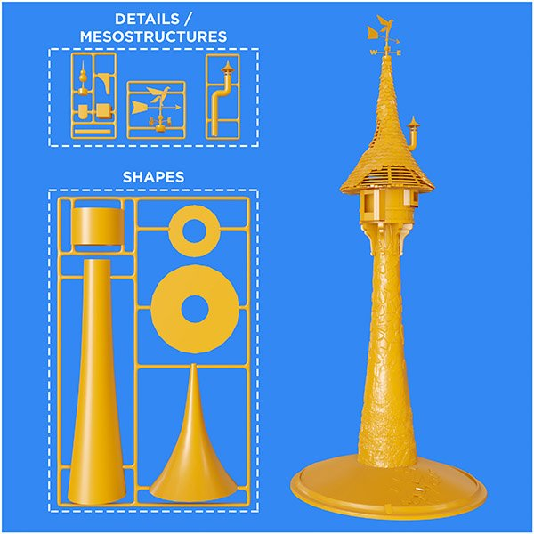

# Versão 11.2

O **Substance 3D Designer 11.2** mudou ligeiramente de nome e agora está conectado ao Adobe Creative Cloud. Ele traz a primeira versão dos Substance Model Graphs, a funcionalidade Enviar para, vários nós baseados em Raytrace e algumas alterações na interface do usuário.

Data de lançamento: *23 de junho de 2021*

## Principais recursos

### Novos gráficos de modelo de Substance

Um tipo de gráfico totalmente novo, o gráfico de modelo de Substance, está disponível, permitindo criar modelos 3D de procedimentos usando uma interface de nó familiar.

<table>
<tr style="border: 0;">
<td style="border: 0;" valign="top">

{width="300px"}

</td>
<td style="border: 0;" valign="top">

{width="300px"}

</td>
</tr>
</table>

Não se esqueça de mergulhar na nova seção de documentação dedicada para saber mais.

Esta é a primeira versão, portanto, espere algumas limitações.

### Funcionalidade Enviar para

As versões Adobe do Substance 3D Designer têm a nova funcionalidade Enviar para, que permite enviar ativos para outros aplicativos da Substance 3D rapidamente. Não é mais necessário publicar como SBSAR e carregar arquivos individuais. Enviar para resolve isso em um clique.

>[!NOTE]
>
> As versões Steam do Substance 3D Designer não apresentam a funcionalidade Enviar para.

### Novos nós Raytrace

Nenhuma versão do Designer foi concluída sem alguns novos nós. Com base na força fenomenal da Renderização PBR, 5 novos nós baseados em RT se juntam a nós nesta versão.

<table>
<tr style="border: 0;">
<td style="border: 0;" valign="top">

{width="300px"}

</td>
<td style="border: 0;" valign="top">

{width="300px"}

</td>
</tr>
</table>

O RTAO faz um trabalho ainda melhor em AO nítido e correto do que o nó HBAO anterior.

{width="300px"}

A Caustics gera cáusticas fisicamente corretas e rastreadas com base em um mapa de altura, como um ruído Perlin simples. Bom para criar texturas de flipbook animadas realistas para cáusticas em tempo real.

{width="300px"}

A Sombra RT gera sombras precisas e com rastreamento de raios, com alguns controles fáceis.

<table>
<tr style="border: 0;">
<td style="border: 0;" valign="top">

{width="200px"}

</td>
<td style="border: 0;" valign="top">

{width="200px"}

</td>
<td style="border: 0;" valign="top">

{width="200px"}

</td>
</tr>
</table>

A Irradiância RT é a mais avançada dos novos nós. Ele faz irradiância com rastreador de raios baseado em um material com mapa de height, e um mapa de Ambiente e/ou um mapa Emissivo.

{width="600px"}

Isso significa que você pode criar texturas com iluminação pré-assada, como em projetos estilizados, ou assar um brilho rastreado de raio saltando do mapa de altura.

{width="300px"}

E por último, há o nó Normal Curvado. Comparado a uma conversão normal regular, este nó usa o AO para modificar seu mapa normal para usar essa informação do AO. Antes de precisar dos padeiros de malha para criar o efeito, este nó faz isso em espaço de texto para você.

### Adobe Standard Material Shader

Em nossos esforços para unificar materiais e renderização em nossos aplicativos, o novo sombreador padrão na exibição 3D é o Adobe Standard Material Shader. À primeira vista, não é diferente do antigo sombreador de aspereza metálica PBR (é baseado nele mesmo), mas oferece suporte a muitos canais mais exóticos, permitindo visualizá-los sem precisar de um renderizador externo.

### Alterações na interface do usuário

Pequenas modificações foram feitas na interface do usuário, mas as mais óbvias são um menu Arquivo > Novo pacote aprimorado, que permite escolher o tipo de gráfico e botões aprimorados e atualizados na barra de ferramentas principal, fornecendo atalhos para novos tipos de gráfico e enviando para outros aplicativos.

## Tutorials

Veja abaixo nossos tutoriais em vídeo que abrangem os novos recursos:

## Notas de versão

### 11.2.0

*(Lançado Em 23 De junho De 2021)*

**Adicionado:**

* [Branding] Substance Designer se torna Adobe Substance 3D Designer
* [Modelos de Substance] Novos gráficos de modelos de Substance para criar modelos 3D de procedimentos
* [Conteúdo] Adicionar novos mapas de ambiente HDR
* [Content] Novo nó Normal Torto
* [Content] Novo nó de Oclusão de ambiente RT
* [Content] Novo nó Caustics RT
* [Content] Novo nó Caustics RT
* [Content] Novo nó de irradiância RT
* [Content] Novo nó de sombras RT
* [Interoperabilidade] Enviar ativo para a Painter abrirá o Painter e adicionará ou atualizará o ativo na biblioteca (requer um plano Adobe Substance 3D)
* [Interoperabilidade] Enviar ativo para a Sampler abrirá o Sampler e adicionará ou atualizará o ativo na biblioteca (requer um plano Adobe Substance 3D)
* [Interoperabilidade] Procure seu ativo no Adobe Bridge e iniciará o Bridge no local do ativo (requer um plano do Adobe Substance 3D)
* [ASM] Suporte ao novo Adobe Standard Material (ASM) no gráfico Gráfico do Substance e MDL
* [ASM] Adicionar modelos de ASM
* [ASM] Adicionar Sombreador OpenGL para ASM
* [ASM] Definir sombreador ASM como o sombreador padrão
* [Geral] Agregar todos os arquivos temporários ao diretório temporário definido pelo usuário
* [Geral] Novo comando “Salvar uma cópia como”
* [Geral] Menu Atualizar arquivo
* [Geral] Atualizar menu Ajuda
* [Publish] Nova janela de publicação
* [Publish] Adicione a opção nas preferências para não salvar o arquivo SBS ao publicar um arquivo SBSAR
* [Propriedades] Adiciona o campo de tipo de gráfico às propriedades de gráfico
* [Propriedades] Reordenar propriedades de gráficos de uma maneira mais relevante
* [Branding] Nova janela Sobre
* [Branding] Atualizar estilo do aplicativo
* [GLSLFX] Adicionar um rótulo às técnicas
* [GLSLFX] Adicionar a possibilidade de definir o rótulo de um sombreador GLSLFX
* [Metadados] Adicionar metadados nos recursos do pacote
* [Metadados] Permitir a edição de metadados para gráficos, entradas, saídas e recursos
* [Localização] Novas traduções para alemão, francês e chinês simplificado
* [UX] Aplicar zoom reverso na visualização 3D no caso de um arrastar com o mouse
* [AXF] Atualização para a versão 1.8.0
* [Logs] Adicionar plug-ins instalados aos logs
* [VFX] Adicionar a configuração OpenColorIO do ACES 1.2
* [API Python] Adicionar um método para consultar a pasta tmp especificada nas configurações
* [API Python] Adicionar um método isModified ao SDPackage para verificar se um pacote foi salvo
* [API Python] Adicionar alguns métodos de conversão de cores ao SDColorManagementEngine
* [API Python] Excluir objetos de gráfico (comentários, pinos, quadros, ...)
* [Python API] Expor propriedade Tamanho físico para nós de instância de gráfico
* [API Python] Expor salvar uma cópia como
* [API Python] Corrigir método SDPackageMgr.savePackage
* [API Python] Obter uma lista de objetos de gráfico selecionados
* [API Python] Introduzir novos nomes de método para trabalhar com seleções de gráficos
* [API Python] Os plug-ins não podem adicionar ações ao primeiro painel do explorador criado

**Corrigido:**

* [Parâmetros] Valores negativos nos parâmetros suspensos Integer1 resultam em comportamento incongruente na instância
* [Parâmetros] Problema ao incrementar um valor em um widget de ângulo
* [Graph] Problemas de temporização quando a saída é exibida na visualização 2D ou 3D.
* [Internacionalização] Alguns caracteres específicos são alterados em espaços em identificadores de arquivo
* [Preferências] O rótulo de arquivo “Projeto do usuário” não é traduzido de volta do japonês
* [Python API] RecursionError ao executar o método SDUIMgr.getCurrentGraphSelectedNodes()
* [Python API] SDApplication.getPath(SDApplicationPath.InstallationDir) não retorna nada
* [API Python] O SDSBSARExporter não envia notificações de salvamento de arquivo
