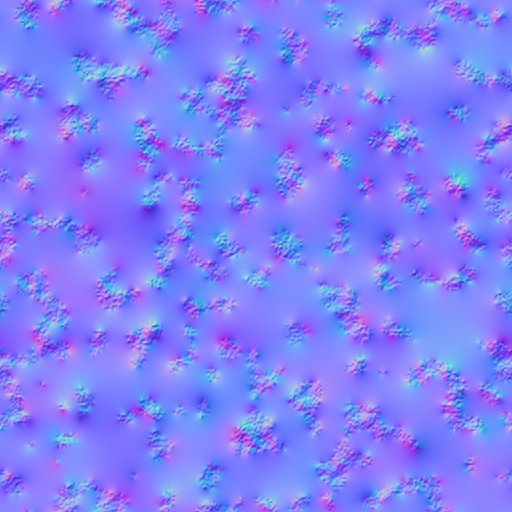

# Versão 11.3

**Substance 3D Designer**

Data de lançamento: *24 de novembro de 2021*

## Recurso principal

### Novas funcionalidades de gráfico de modelo

Muitas melhorias foram adicionadas ao gráfico de modelo para expandir os recursos de modelagem:

* <b>Novo fluxo de trabalho de partícula</b>\
  O novo fluxo de trabalho de modelagem de partículas permite criar nuvens de ponto para manipular a geometria. Eles podem ser usados para criar muitas formas complexas e/ou repetitivas, como as telhas na imagem logo acima.\
  Para saber mais sobre o novo fluxo de trabalho de partícula, consulte as seguintes páginas de documentação:

  * Tipos de itens em uma cena
  * Partículas
  * Corte de partículas
  * Partículas de instâncias

  

* <b>Novos nós de modelagem e deformação</b>\
  Novos nós adicionais foram adicionados para criar formas mais complexas. Clique em cada nó para saber mais sobre eles:
  * Transformação generativa
  * Padrão orgânico
  * Torno
  * Ajuste de curva

* <b>Melhorias gerais\
  </b>O fluxo de trabalho em torno do gráfico de modelagem foi aprimorado com:
  * Novas dicas de ferramentas nos parâmetros de nós para torná-los mais fáceis de aprender.
  * A hierarquia de modelo 3D agora é preservada ao exportar em FBX
  * A atribuição de materiais pode ser exportada com os formatos de arquivo OBJ e FBX.
  * Visualize os nós intermediários na viewport no modo de sobreposição.

### Interoperabilidade aprimorada

As ações de envio foram ampliadas, com duas novas possibilidades:

* **Enviar SBSM (arquivo de modelo do substance) para o Stager**\
  Modelos 3D de procedimentos agora podem ser enviados para o Stager e modificados a partir daí com os parâmetros expostos.

* **Receber SBS/SBSAR da Sampler**\
  Agora é possível receber arquivos de Substance gerados pelo Sampler diretamente no Designer.

### Diversos

Foram feitas várias melhorias na qualidade de vida:

* **Entradas relativas às entradas**\
  As entradas de gráfico definidas em Em relação às entradas herdarão agora o tamanho do nó conectado, em vez do padrão para o tamanho do gráfico pai. Isso facilita muito o gerenciamento de resoluções diferentes por meio de entradas de tamanhos diferentes.

  {width="400px"}

* **Nova janela de gráfico**\
  A nova janela de gráfico foi reformulada e agora permite ver melhor os detalhes de um modelo específico e criar um novo gráfico diretamente em um pacote existente.

  {width="400px"}

* **Fechar Todos os Pacotes**\
  Uma pequena ação que torna menos tedioso gerenciar muitos pacotes no explorador. Use **Arquivo** > **Fechar tudo** para fechar todos os pacotes abertos no momento.

  

* **Maximizar Modo de Exibição Atual**\
  Use o novo ícone **da barra de título** ou o atalho **SHIFT+Espaço** para expandir uma janela para tela inteira. Isso também pode ser usado em janelas flutuantes.

* **Melhorias na exibição 3D**\
  A visualização 3D tem novas configurações de exibição para alternar a exibição de faces traseiras em um modelo 3D, bem como a exibição de Vértices, Tangentes e Bitangents.

### Conteúdo

Essa versão adiciona novos nós de difusão e melhorias para o nó Renderização PBR:

* <b>Nós de difusão</b>\
  Os novos nós Cor de difusão, Tons de cinza de difusão e Difusão UV permitem gerar desfoques de sangramento suaves com base em uma máscara de entrada.

  {width="230px"}

   

* **Nó de Renderização PBR aprimorado**\
  Este nó teve as seguintes alterações:
  * Novo modo UV cúbico para a forma de esfera.
  * Novo suporte para dispersão de subsuperfície.
  * O Anisotropia agora segue o modelo Adobe Strand Material (5ASM).
  * A iluminação baseada em imagem foi aprimorada com o suporte da amostragem importante.
  * A iluminação emissiva foi aprimorada com o suporte da amostragem importante.

## Notas de versão

### 11.3.0

*(Lançado Em 24 De novembro De 2021)*

**Adicionado:**

* [modelos de Substance] Adicionar dicas de ferramentas para parâmetros de nós
* [Modelos de Substance] Permite exibir em sobreposição na janela de visualização 3D o resultado de um nó intermediário
* [Modelos de Substance] Melhorar a exibição das bases
* [Modelos de Substance] Preserva a hierarquia dos objetos ao exportar um gráfico de Modelo de Substance para .fbx
* [Modelos de Substance] Suporte a vários materiais no gráfico Exportação de FBX/OBJ a partir do modelo de Substance
* [Substance models]&#x200B;[Content] Nó de partículas
* [Modelos de Substance]&#x200B;[Conteúdo] Nó de transformação generativa
* [Substance models]&#x200B;[Content] Organic Pattern node
* [Modelos de Substance]&#x200B;[Conteúdo] Partículas do nó Instâncias
* [Modelos de Substance]&#x200B;[Conteúdo] Nó de remoção de partículas
* [Modelos de Substance]&#x200B;[Conteúdo] nó Lathe
* [Substance models]&#x200B;[Content] Nó do shell
* [Substance models]&#x200B;[Content] Nó de projeção
* [Modelos de Substance]&#x200B;[Conteúdo] Nó Curve Trim
* [Modelos de Substance]&#x200B;[Conteúdo] Atualizar nó Sampler da curva
* [Modelos do Substance]&#x200B;[Conteúdo] Atualizar nó do Mesh Sampler
* [Modelos de Substance]&#x200B;[Conteúdo] Atualizar nó de tremulação
* [UX] Botão para maximizar a visualização atual
* [UX] Atualizar a janela Novo gráfico
* [UX] Adicionar a opção “Baixar Player” no menu Ferramentas e agregar com “Localizar Player”
* [UX] Adicionar a entrada “Fechar tudo” ao menu Arquivo
* [UX] Aplicar uso consistente de maiúsculas e minúsculas no menu principal
* [UX] Exibir automaticamente as propriedades de itens de gráfico duplicados
* [UX] Adicionar botões na barra de ferramentas do gráfico para desativar o tamanho de tela constante para títulos/comentários/pinos de quadros
* [UX] Botões para copiar informações de versão para a área de transferência na caixa de diálogo Sobre
* [Materiais] Entradas relativas às entradas
* [Conteúdo] Adicionar opção de divisão em blocos gráficos em ruídos Perlin 3D
* [Content] Novo nó do processo de difusão
* [Content] Nova versão de nó de Renderização PBR
* [Interoperabilidade] Receber SBS e SBSAR da Sampler
* [Interoperabilidade] Enviar SBSM para o Stager
* [3D View] Adicionar uma opção para desativar a remoção de face
* [Exibição 3D] Adicione uma opção para exibir o espaço tangente do vértice
* [Explorer] Realçar o gráfico no Explorer ao clicar duas vezes no plano de fundo da Exibição de gráfico
* [Explorer] Remover a opção “Explorar” em menus contextuais
* [Padarias] Ocultar padarias obsoletas
* [Gerenciamento de cores] Adicione suporte para as regras do arquivo de configuração OCIO v2
* [Biblioteca] Renomear categorias de acordo com tipos de gráficos
* [Preferences] Desative automaticamente a CPU nas preferências de hardware do Iray se a GPU CUDA compatível for detectada

**Corrigido:**

* [Modelos Substance] Falha no Mac ao usar a opção “as sudb” no .fbx
* [Modelos de Substance] Falha ao exportar para SBSM em um caso específico
* [Modelos de Substance] Falha na exportação ao exportar parâmetros expostos em quais widgets nunca foram criados
* [Modelos Substance] Falha aleatória ao abrir um gráfico que se refere a vários arquivos .fbx
* [Modelos de Substance] Os intervalos não são aplicados dinamicamente nos widgets dos parâmetros expostos
* [Modelos de Substance] A opção Recarregar malha não funciona em recursos usados no gráfico de modelos de Substance
* [Modelos Substance] As cenas não são exibidas em uma visualização 3D disponível em um caso específico
* [IU] A área de desativação é muito grande em opções de material
* [UI] Problema de estilo na caixa de diálogo “Arquivo de pacote não salvo”
* [UI] A tecla Tab deve ser pressionada duas vezes para navegar pelos valores
* [IU] O zoom com arrastar o mouse é invertido entre a Exibição 3D e outras Portas de Visualização
* [UI] Carregar um SBS já aberto usando a lista “Arquivos recentes” aciona incorretamente um prompt “Pacote não encontrado”
* [UI]&#x200B;[macOS] Layout de interface padrão incorreto após iniciar o aplicativo
* [UI] Os pacotes não podem ser salvos na raiz de uma unidade (somente Windows)
* [Graph] A opção “Exibir automaticamente na visualização 2D” é inconsistente em um caso específico
* [Graph] A opção &#39;Abrir referência&#39; está disponível para nós de instância SBSAR
* [Gráfico] As propriedades do pino são exibidas somente quando o item é criado
* [Gráfico] As regras de sequência de caracteres do pino são aplicadas de forma inconsistente
* [Graph] Falha ao salvar um gráfico vazio
* [Visualização 3D] O ângulo de Anisotropia é invertido no sombreador ASM
* [3D View] Sombreador ASM: problemas de linearização com mapas relacionados a SSS
* [Visualização 3D] Renderização OpenGL incorreta após fechar visualizações 3D adicionais em um caso específico
* [Visualização 3D] As posições predefinidas das câmeras não estão corretas na Visualização 3D com alguns arquivos .fbx
* [MDL] “Adicionar Nó” do menu contextual não funciona para Gráficos MDL
* [MDL] Erro: falha na conexão do nó ao usar componentes float2.x e semelhantes (SD 11.1.2)
* [MDL] Falha ao abrir o arquivo specific.sbs
* [MDL] Unidades de cena por metro na Iray não definidas no início da sessão de renderização
* [MDL] Congela ao ajustar um nó de aprendizado no gráfico MDL
* [MDL] Ordem de parâmetros no código MDL exportado
* [Explorer] a pasta de recursos vazia é criada após o cancelamento da criação do recurso
* [Explorer] Somente o primeiro elemento de um pacote pode ser movido para a parte inferior da lista
* [Content] RT Bent Normal e RT AO acionam a computação de nós em gráficos aninhados
* [Nó de entrada] O bitmap nos Nós de entrada não é atualizado quando o UDIM é alterado
* [Iray] Demora ao tentar exibir uma cena de modelos de Substance com muitas instâncias
* [Preferências] Linha vazia ao cancelar a adição de um arquivo de projeto
* [Editor de Python] A opção “Fechar” permanece ativada após fechar o último script e ainda inclui seu nome
