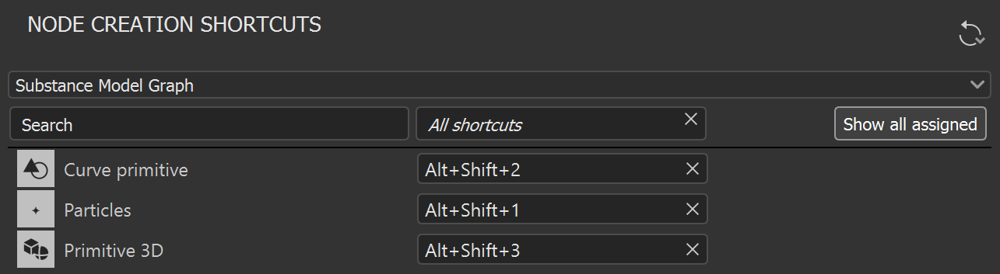

# Versão 12.2

O <b>Substance 3D Designer 12.2</b> traz suporte nativo para computadores com Apple Silicon (M1), algumas melhorias para gráficos de modelos de Substance e outras pequenas atualizações. Esta página descreverá todos os detalhes dessa nova versão.

Data de lançamento: *19 de julho de 2022*

## Principais recursos

### Suporte nativo para chips Apple Silicon (M1)

A versão 12.2 do Designer é a primeira com suporte nativo completo para novos computadores Apple baseados no chip M1. Embora o Designer pudesse ser executado tecnicamente em dispositivos Apple Silicon anteriormente, o suporte nativo trará a você uma experiência mais rápida e eficiente. Como você pode ver na imagem abaixo, os cálculos são *até duas vezes mais rápidos* com essa nova versão nesses computadores.

{width="600px"}

### Melhorias para gráficos de modelo de Substance

* <b>Dicas de ferramentas em nós\
  </b>Nem sempre é possível explicar o que um nó está fazendo com apenas um ícone e um título. É por isso que agora temos uma dica de ferramenta com uma *descrição completa do nó* quando você está na Biblioteca ou na Exibição de Gráfico. Ele ajudará você a encontrar o nó que está procurando ou a entender melhor quais são suas capacidades. 

* <b>Atalhos para criação de nó\
  </b>Para acelerar a criação dos nós mais usados, agora você pode definir seus próprios atalhos nas Preferências, como para os outros tipos de gráficos.

* <b>Visualizar nó no menu contextual do nó\
  </b>Na versão mais recente, adicionamos a possibilidade de visualizar um nó na Exibição 3D graças a um atalho de teclado (*SHIFT + clique* em um nó). Este recurso agora também está disponível no *menu contextual de nó* para torná-lo mais detectável.

  {width="600px"}
* <b>Pesquisar com base na compatibilidade do nó\
  </b>Quando você está procurando um nó no menu de nós (acessível ao pressionar a *Barra de Espaços* na Exibição de Gráfico), os nós agora são filtrados corretamente para mostrar apenas os que são *compatíveis com o selecionado atualmente* no gráfico. Ele ajuda a localizar rapidamente o nó que você está procurando.

### Diversos

* <b>Melhorias no modo de exibição 2D</b>\
  Quando era possível, em versões anteriores, visualizar as saídas do gráfico na Visualização 3D por meio do *menu contextual* do gráfico de Substance, não era possível visualizar uma saída do gráfico na Visualização 2D. Esta opção foi adicionada ao menu, com um submenu listando todas as saídas do gráfico a serem exibidas na visualização 2D.\
  O botão “Visualizar saídas” na barra de ferramentas de Visualização 2D também foi atualizado com uma seta para baixo e uma dica de ferramenta para tornar seu comportamento mais claro.\
  Por fim, a opção “Saídas automáticas do gráfico de exibição ao carregar um gráfico” nas Preferências foi *dividida em duas configurações separadas* - para o Visualização 2D e o Visualização 3D, respectivamente - para permitir que você controle qual exibição deve ser aberta e preenchida automaticamente ao carregar um gráfico.

* <b>Modelo CLO</b>\
  Para melhorar a interoperabilidade com o software CLO, adicionamos um *novo modelo dedicado*. Ele adicionará automaticamente ao seu gráfico todos os *metadados* necessários para importar corretamente o material no CLO.

  {width="600px"}

* <b>Requisitos da Plataforma de Referência VFX</b>\
  Todos os anos, a plataforma de referência VFX publica uma lista de ferramentas e versões de bibliotecas a serem usadas em todos os softwares para o setor de VFX a fim de minimizar as incompatibilidades entre softwares. Como de costume, *atualizamos todas as nossas dependências* para respeitar todas essas recomendações.

## Notas de versão

### 12.2.0

*(Lançado Em 19 De julho De 2022)*

<b>Adicionado:</b>

* [Apple] Suporte nativo para Apple Silicon (M1) (somente versão Creative Cloud)
* [Gráfico do modelo do Substance] Exibe dicas de ferramentas do nó na Exibição do gráfico
* [Gráfico do modelo do Substance] Exibe dicas de ferramentas do nó na Biblioteca
* [Gráfico do modelo do Substance] Adicionar uma entrada de menu contextual para visualizar nós
* [Gráfico do modelo do Substance] Permite que o usuário crie atalhos para a criação de nós
* [UI] Adicionar a opção “Exibir saída em Visualização 2D” no menu contextual do gráfico de Substance
* [UI] Dividir a configuração “Exibição automática de saídas” em configurações específicas de Visualização 2D/Visualização 3D
* [UI] Adicionar seta suspensa e dica de ferramenta ao botão “Exibir saída” na barra de ferramentas do Visualização 2D
* [IU] Repalavra e reordenação de itens no painel Informações do Explorer
* [Gerenciamento de cores] Adicione “Linear Adobe RGB (1998)” e “Adobe RGB (1998)” para exportar espaços de cor para ACE Adobe
* [Gerenciamento de cores] Adicionar espaço de cores de trabalho “Linear Adobe RGB (1998)” para ACE Adobe
* [Gerenciamento de cores] Adicionar suporte para telas OCIO ICC
* [Gerenciamento de cores] Ocultar o espaço de cores de trabalho do Adobe RGB das preferências de ACE
* [Gerenciamento de cores] Melhorar a qualidade de LUTs 3D feitos bake no modo ACE
* [Gerenciamento de cores] Usar a nova infraestrutura de GPU no visualizador 3D
* [Localização] Atualização completa do idioma coreano
* [Engine] Atualização para a versão 8.6.0
* [Gráfico] Atribuir um identificador de gráfico padrão quando essa propriedade for deixada em branco
* [Biblioteca] Desativar hiperlinks de dica de ferramenta para nós que não sejam de instância
* [NewProject] Atualizar resolução padrão
* [Modelos] Adicionar modelo CLO
* [API] Expor a propriedade defaultParentSize para objetos SDSBSCompGraph
* [Dependências] Atualize o Alembic para a versão 1.8.3
* [Dependências] Atualize o AXF para a versão 1.9.0
* [Dependências] Atualize o Boost para a versão 1.76
* [Dependências] Atualize o FBX para a versão 2020.2.1
* [Dependências] Atualize o IRay para a versão 2021.1.0
* [Dependências] Atualize o OpenColorIO para a versão 2.1.1
* [Dependências] Atualize o OpenEXR para a versão 3.1.5
* [Dependências] Atualize o TBB para a versão 2020.3
* [Dependências] Atualize o USD para a versão 0.22.3
* [Remover] Desativar o recurso pós-efeitos (Yebis)
* [Remover] Remover o comando “Salvar renderização na estação de arte” do menu do Visualização 3D

<b>Corrigido:</b>

* [Modelos de Substance] O intervalo rígido definido no parâmetro exposto é salvo ao cancelar a exposição
* [modelos Substance] O Identificador não é amigável em nós constantes
* [Modelos de Substance] Aprimorar a pesquisa com base na compatibilidade de nós
* [UI] A ordem do submenu “Novo” está incorreta para recursos de pasta
* [UI] O tamanho padrão da janela principal é muito pequeno
* [UI] As barras de ferramentas não são afetadas pela opção “Redefinir layout”
* [UI] Grade de transparência visível no ícone de recurso de fonte no Explorer
* [Cooker] Gráficos de Substance instanciados no gráfico MDL são sempre totalmente recozidos
* [Graph] Falha ao colar um nó copiado de um gráfico com identificador em branco
* [MDL] Falha ao fechar um gráfico MDL específico
* [Performances] O aplicativo não responde ao carregar pacotes muito grandes
* [Recursos] O recurso Cena 3D pode ser importado em um caso específico
