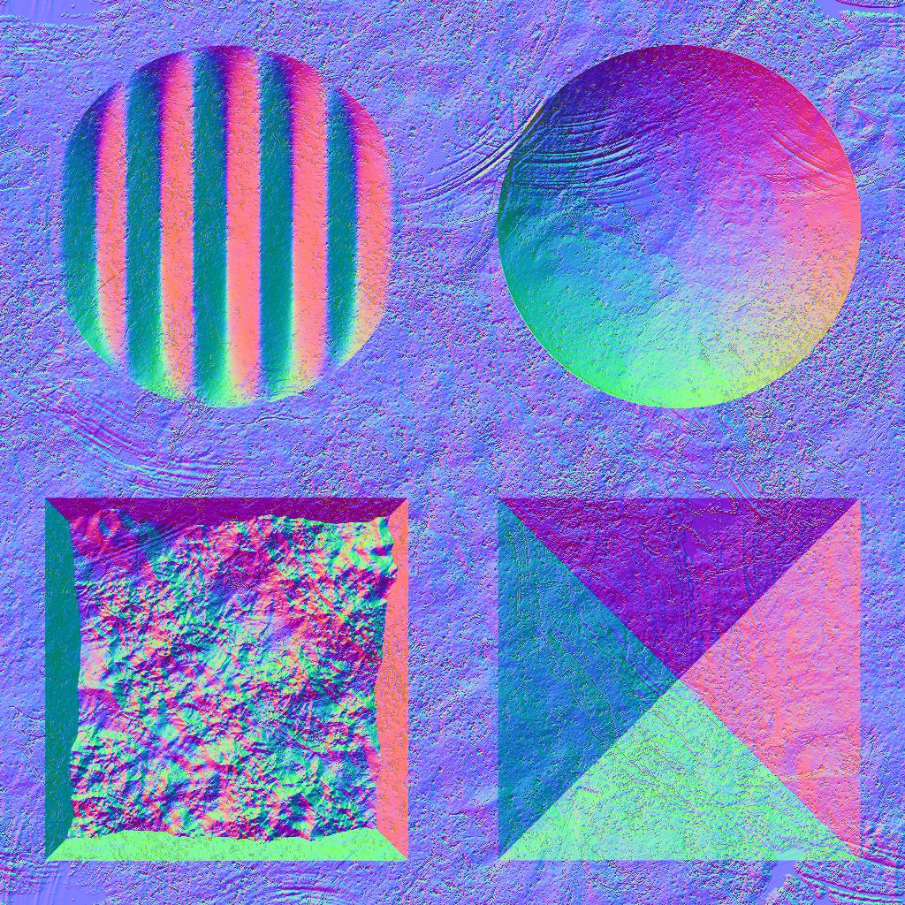
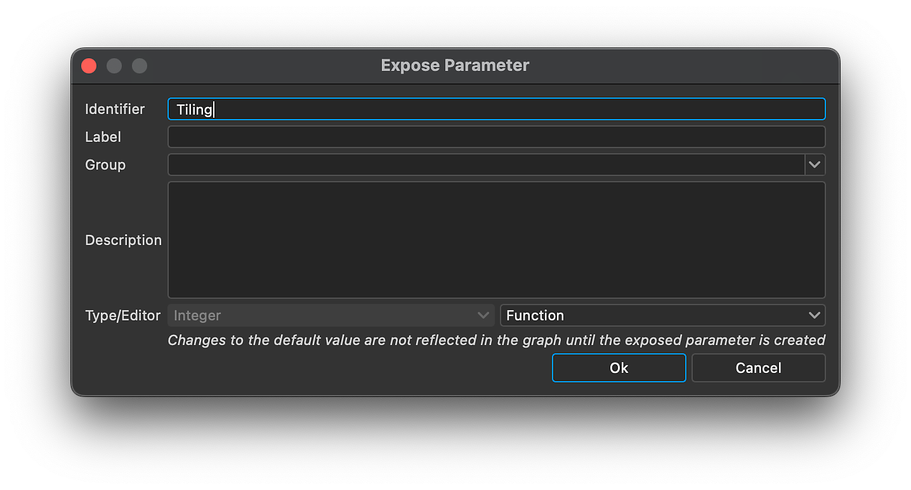

# Versão 14.0

O <b>Substance 3D Designer 14.0 </b>traz várias melhorias na qualidade de vida (navegação em gráficos, desempenho, etc.) mas, acima de tudo, inclui muitos novos nós (manipulação de cores, filtro Kuwahara, ferramentas de histograma, suavizações de chanfro, distâncias direcionais, ...). Veja abaixo para obter mais detalhes sobre todas essas alterações.

*Data de lançamento: 30 de julho de 2024*

## Novo conteúdo

Esta versão 14.0 traz muito conteúdo novo com os novos nós listados abaixo:

* <b>Nós dedicados à manipulação de cores: </b>um nó <b>(</b>[Quantificar cores](../../compositing-graphs/nodes-reference-for-com/node-library/filters/adjustments/quantize-color/quantize-color.md)<b>) </b>a<b> </b>reduza o número de cores em uma imagem e extraia uma paleta dela, uma família de nós de ferramenta para criar sua própria paleta de cores ([Exibir](../../compositing-graphs/nodes-reference-for-com/node-library/filters/adjustments/view-color-palette/view-color-palette.md) / [Criar](../../compositing-graphs/nodes-reference-for-com/node-library/filters/adjustments/create-color-palette-16/create-color-palette-16.md) / [Modificar](../../compositing-graphs/nodes-reference-for-com/node-library/filters/adjustments/modify-color-palette/modify-color-palette.md)<b> </b>paleta de cores) e uma para aplicá-la a outra imagem usando um mapa de ID ([Aplicar paleta de cores](../../compositing-graphs/nodes-reference-for-com/node-library/filters/adjustments/apply-color-palette/apply-color-palette.md)). Você também encontrará o nó [ID para mascarar tons de cinza](../../compositing-graphs/nodes-reference-for-com/node-library/filters/adjustments/id-to-mask/id-to-mask.md) para converter seu mapa de ID (calculado pela cor Quantizar) em uma máscara de tons de cinza. Com esse conjunto completo de nós, você tem tudo para criar efeitos de estilização usando cores.

{zoomable="yes"}

{zoomable="yes"}

* <b>Filtro de Kuwahara</b>: se você quiser ir ainda mais longe com a estilização, poderá gerar alguns efeitos de pintura graças aos filtros de [Cor de Kuwahara anisotrópica](../../compositing-graphs/nodes-reference-for-com/node-library/filters/effects/anisotropic-kuwahara/anisotropic-kuwahara.md) / [tons de cinza](../../compositing-graphs/nodes-reference-for-com/node-library/filters/effects/anisotropic-kuwahara-gra/anisotropic-kuwahara-grayscale.md). Em detalhes, ele aplica um desfoque direcional anisotrópico que se adapta aos detalhes da imagem. O resultado é uma imagem que parece fluir na direção das formas dentro.

Estes nós (Quantize a cor e Kuwahara anisotrópico) estão explicados neste [tutorial](https://www.adobe.com/go/designer-tutorial-quantize). Ele mostra como usá-los para estilizar materiais, bem como manipular cores de forma mais eficiente e intuitiva!

Outros nós poderosos unem-se ao partido:

* [<b>Curvatura suave</b>](../../compositing-graphs/nodes-reference-for-com/node-library/filters/effects/curvature-smooth/curvature-smooth.md): esta nova versão agora suporta corretamente todos os modos de divisão em blocos gráficos, adiciona duas novas saídas (convexidade e concavidade) e melhora na precisão e no desempenho.
* <b>[Histograma equalizado](../../compositing-graphs/nodes-reference-for-com/node-library/filters/adjustments/histogram-equalize/histogram-equalize.md):</b> este nó equaliza o histograma de uma imagem em tons de cinza ajustando valores para obter uma distribuição igual. Estes nós vêm com dois nós complementares: [Renderização do histograma](../../compositing-graphs/nodes-reference-for-com/node-library/filters/adjustments/histogram-render/histogram-render.md) para gerar a saída do histograma da imagem e [Computação do histograma](../../compositing-graphs/nodes-reference-for-com/node-library/filters/adjustments/histogram-compute/histogram-compute.md)<b> </b>para codificar um histograma como uma linha de pixels.
* <b>[Suavização de chanfro](../../compositing-graphs/nodes-reference-for-com/node-library/filters/effects/bevel-smooth/bevel-smooth.md):</b> graças a esta, você pode desenhar um gradiente ou uma cor plana a partir das bordas de uma máscara (para fora, para dentro ou ambos). O nó [Distância direcional](../../compositing-graphs/nodes-reference-for-com/node-library/filters/effects/directional-distance/directional-distance.md)<b> </b>também desenha um gradiente, mas em uma direção específica.
* <b>[Normal uncombine](../../compositing-graphs/nodes-reference-for-com/node-library/filters/normal-map/normal-uncombine/normal-uncombine.md):</b> este nó é o oposto do nó [Normal combine](../../compositing-graphs/nodes-reference-for-com/node-library/filters/normal-map/normal-combine/normal-combine.md), ele remove de um mapa normal os detalhes da superfície descritos por um mapa de height.

<table>
<tr style="border: 0;">
<td style="border: 0;" valign="top">

Curvatura suave

<table>
  <tr>
    <td>
      
       <i>Antes</i>
    </td>
    <td>
      
       <i>Depois</i>
    </td>
  </tr>
</table>

</td>
<td style="border: 0;" valign="top">

Histograma equalizado

<table>
  <tr>
    <td>
      
       <i>Antes</i>
    </td>
    <td>
      
       <i>Depois</i>
    </td>
  </tr>
</table>

</td>
</tr>
</table>

<table>
<tr style="border: 0;">
<td style="border: 0;" valign="top">

Suavização de chanfro

<table>
  <tr>
    <td>
      
       <i>Antes</i>
    </td>
    <td>
      
       <i>Depois</i>
    </td>
  </tr>
</table>

</td>
<td style="border: 0;" valign="top">

Descombinar normal

<table>
  <tr>
    <td>
      
       <i>Antes</i>
    </td>
    <td>
      
       <i>Depois</i>
    </td>
  </tr>
</table>

</td>
</tr>
</table>

## Melhorias na qualidade de vida

* <b>Os desempenhos </b>e a <b>capacidade de resposta</b> ao trabalhar em projetos grandes foram aprimorados. Por exemplo, a remoção de nós pode ser até 75 vezes mais rápida. O tempo de [cozimento](../../glossary/glossary.md) também foi reduzido para gráficos que fazem referência várias vezes ao mesmo bitmap.
* <b>Parâmetros herdados</b>: quando um parâmetro é [herdado](../../glossary/glossary.md), em vez de mostrar o valor padrão, agora exibimos o herdado para que você saiba o valor usado atualmente. Saiba mais sobre herança em [esta página dedicada da nossa documentação](../../compositing-graphs/inheritance-compositing/inheritance-in-substance-compositing-graphs.md).
* O <b>suporte a trackpad</b> no MacOS foi totalmente reformulado para ser mais natural e estar em conformidade com outros softwares. Mover os nós além das bordas da [Exibição de gráfico](../../interface/the-graph-view/the-graph-view.md) também foi repensado para ser mais suave e consistente em todos os sistemas operacionais.

* <b>Exibição 2D: </b>quando a exibição lado a lado está habilitada na [exibição 2D](../../interface/2d-view/2d-view.md), agora você pode obter valores mesmo para pixels que não estão no bloco original: ajuda muito verificar [amostragem](../../glossary/glossary.md) e transições de valor entre blocos.

{width="320px" zoomable="yes"}

* <b>Mapa de gradientes</b>: use o clique do meio do mouse para deslocar todas as [teclas de gradiente](../../compositing-graphs/nodes-reference-for-com/atomic-nodes/gradient-map/gradient-map.md) para a esquerda ou para a direita (e assim preservar todos os espaços entre todas as teclas).
* <b>Parâmetros</b>: para injetar funções personalizadas por meio de parâmetros, agora você pode usar o widget de função Editar. É uma solução poderosa para criar ferramentas personalizadas nas quais você deseja direcionar parâmetros usando um [gráfico de função Substance](../../function-graphs/the-function-graph/the-function-graph.md).

<table>
<tr style="border: 0;">
<td style="border: 0;" valign="top">

{zoomable="yes"}

</td>
<td style="border: 0;" valign="top">

{zoomable="yes"}

</td>
</tr>
</table>

## Melhorias na API

A API de script inclui quatro novos métodos:

* Métodos para obter e definir o tipo de gráfico de um gráfico de composição de Substance: myGraph.setGraphType(”newType”) ; myGraph.getGraphType()
* Método para abrir um recurso de pacote em seu editor (por exemplo, um gráfico de Substance na Visualização de gráfico): myUIManager.openResourceInEditor(myResource)
* Método para selecionar um recurso de pacote no Explorer (por exemplo, um gráfico de Substance): myUIManager.setExplorerSelection(myResource)
* Método para enquadrar um nó específico na exibição de gráfico: myUIManager.focusGraphNode(myGraphViewID, myNode)

## Requisitos da plataforma VFX

Todos os anos, a [Plataforma de Referência VFX](https://vfxplatform.com/) publica uma lista de ferramentas e versões de bibliotecas a serem usadas em todos os softwares para o setor de VFX a fim de minimizar as incompatibilidades entre os softwares. Como de costume, *atualizamos todas as nossas dependências* para respeitar todas essas recomendações.

Observe que essas atualizações têm duas consequências principais:

* <b>Os requisitos do Linux</b> foram alterados e o Designer agora exige o RHEL versão 8 ou 9 (não há mais suporte para CentOS). Todos os detalhes podem ser encontrados na página [Requisitos de sistema](../../getting-started/system-requirements/system-requirements.md).
* <b>Os plug-ins para o Designer precisam ser atualizados </b>pois algumas funções foram descontinuadas no Qt6. Você encontrará todas as informações necessárias para atualizar seus plug-ins no [fórum da comunidade](https://community.adobe.com/t5/substance-3d-designer-discussions/plugins-required-updates-in-designer-14-0/td-p/14768559).

## Notas de versão

### 14.0.0

*(Lançado em 30 de julho de 2024)*

### Adicionado

* [Conteúdo] Novo filtro Kuwahara anisotrópico
* [Content] Nó Nova Suavização de chanfro
* [Content] Novo nó Curvatura suave v2
* [Content] Novo nó de Distância direcional
* [Content] Novas Ferramentas De Histograma: Calcular, Equalizar, Renderizar
* [Content] Novo ID para nó Máscara
* [Content] Novo nó Descombinar normal
* [Content] Novos nós de Paleta: Criar, Aplicar, Modificar, Exibir
* [Content] Novo nó Quantificar cor
* [Content] Distorção direcional não uniforme: defina o valor padrão do mapa de intensidade como 1
* [Conteúdo] Adicionar sufixo &#39;Cor&#39; ou &#39;Tons de Cinza&#39; a todos os rótulos de nó que possuem essas versões
* [Content] Preterir “White Noise” e manter apenas “White Noise Fast”
* [Content] Preterir nó &#39;Negate Float1&#39; no gráfico de função Substance
* [Content] Renomeie “Quantize cor” para “Quantize cor (simples)”
* [Exibição 2D] Exibe valores no painel Informações para pixels fora do intervalo 0-1
* [Mecanismo]&#x200B;[Texto] Novo kerning para algumas fontes
* [Graph] Melhorar o tempo de invalidação ao editar subgrafos profundos ao usar a edição no contexto
* [Vinculador] Não duplicar bitmaps em SBSASM
* [Parâmetros] Adiciona um novo widget “função” para todos os tipos de parâmetro de entrada
* [Propriedades] Aprimorar a exibição de parâmetros herdados
* [UX] Melhorar o suporte a trackpad (somente Mac)
* [UX] Modernizar panorâmica ao atingir a borda do gráfico ao selecionar
* [UX] Remover a funcionalidade “Desativar Hi DPI”
* [Branding] Nova marca para a tela de apresentação e a janela Sobre
* [Mapa de degradê] Adicionar uma maneira de deslocar todas as teclas e loop
* [Library] Alternar todos os filtros padrão para maiúsculas e minúsculas da frase
* [API] Adicionar método para enquadrar um nó específico no visor da Exibição de gráfico
* [API] Adicionar método para abrir um recurso de pacote em seu editor (por exemplo, um gráfico de Substance na Exibição de gráfico)
* [API] Adicionar método para selecionar um recurso de pacote no Explorer (por exemplo, um gráfico de Substance)
* [API] Adicionar métodos para obter e definir o tipo de gráfico de um gráfico de composição de Substance
* [Terceiros] Siga as recomendações das plataformas 2023 VFX
* [Terceiros] Siga as recomendações das plataformas 2024 VFX
* [Terceiro] Atualize o impulso para 1.82.0 + US$ para 23.08
* [ThirdParty] Atualize o NGL para 1.38
* [Terceiros] Atualize o OpenColorIO para 2.3.x
* [ThirdParty] Atualize o OpenExr para a versão 3.2.x
* [ThirdParty] Atualizar o OpenSubdiv para 3.6.x
* [Terceiros] Atualize o Python para a versão 3.11.x
* [ThirdParty] Atualize o Qt para 6.5.x
* [Terceiro] Atualize o gcc para 11.2.1
* [Terceiro] Atualize o glibc para 2.28
* [ThirdParty] Atualizar libstdc++ ABI para C++11 um
* [Documentação] Nova página de &#39;Glossário&#39;

### Correções

* [Bakers] Falha ao reassentar uma cena cujo nome de arquivo foi alterado
* [Padeiros] Falha ao salvar a predefinição de padeiros em arquivo JSON
* [Content] &#39;Dispersão na spline&#39;: Parâmetro alfa Expor imagem de entrada
* [Content] &#39;Tile Sampler Color&#39;: expressão visibleif ausente
* [Conteúdo] Ruído anisotrópico: valor negativo para quantidade X/Y produz resultado incorreto
* [Content] Ruído anisotrópico: problema de divisão em blocos gráficos ao usar um valor ímpar como uma quantidade X e sem smoothness
* [Content] Função de distribuição normal: max() inserido incorretamente pode levar a NaN
* [Content] RTAO, Bent Normal e RT Shadows não funcionam corretamente em algumas plataformas
* [Conteúdo] Cor de mesclagem de respingo de forma: mapas normais de OpenGL não são mesclados corretamente
* [Content] Espaço ingarantido após o prefixo &#39;Multi&#39; nos rótulos do nó
* [Dependências] Falha ao mover o gráfico dentro ou entre pacotes
* [Engine] Erro de precisão em nós de distorção que afetam os nós de Desfoque de Inclinação
* [Engine] A camada SBSAR no SD não é capaz de ler o SBSAR com conteúdo SBSASM > 2 GB
* [Gráfico de função] Resultado incorreto para 0^n
* [Gráfico] A opção “Exibir tamanho do nó” está rotulada incorretamente
* [Graph] Falha ao copiar um comentário com parentesco para outro gráfico
* [Gráfico] Congela ao arrastar um nó Ponto com a tecla Alt pressionada
* [Gráfico] A pesquisa de nós pode não encontrar correspondências óbvias em alguns casos
* [Graph] Problema de desempenho ao editar um gráfico de função instanciado várias vezes com o supergráfico aberto
* [Graph] Muitas invalidações ao criar uma saída
* [Segurança] Vulnerabilidade de gravação fora dos limites de análise de ICO
* [Segurança] Preterir alguns formatos de imagem não usados
* [Parâmetros] O caminho do recurso Bitmap PKG não deve ser editável
* [Parâmetros] Corrigir problemas relacionados à exposição/exposição em lote do parâmetro de um processador de valores
* [Parâmetros] Os parâmetros de cadeia de caracteres são ignorados ao expor o lote
* [Propriedades] Problema de desempenho ao editar um gráfico de função instanciado várias vezes com propriedades abertas
* [SVG] As edições em formas não são aplicadas em imagens rasterizadas
* [UI] Corrigir alguns erros/inconsistências com widgets com rolagem (somente Windows)
* [UI] Ordem inconsistente de formatos de arquivo de cena 3D em listas de importação/exportação
* [UI] As ações da janela são duplicadas na interface do usuário
* [Controle de versão] O script &#39;perforce.py&#39; não funciona em Python 3
