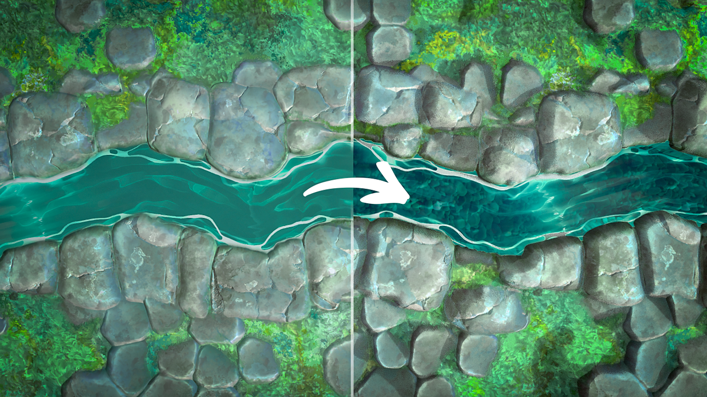
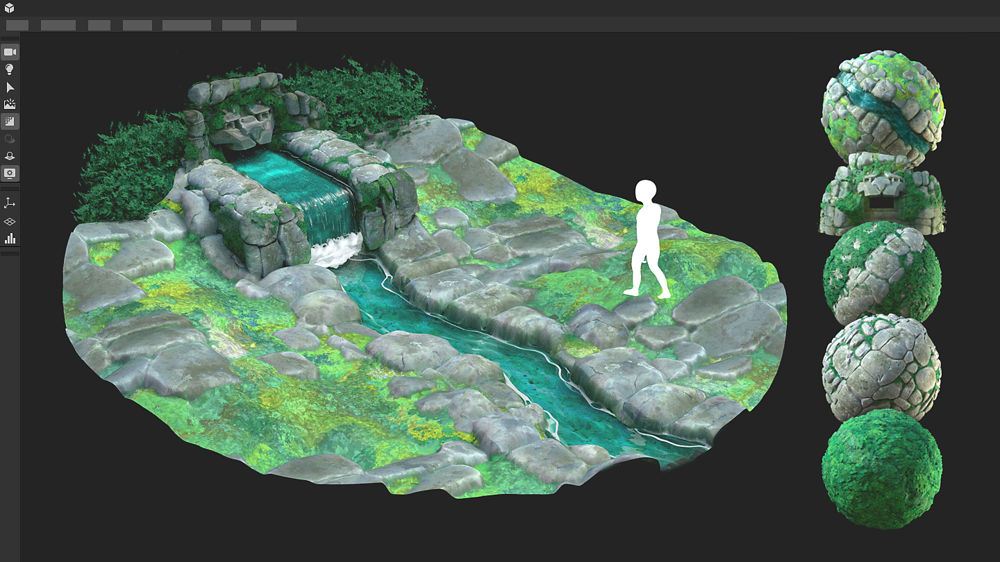
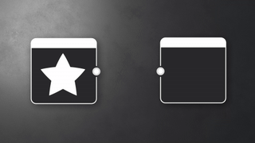

# Versão 15.0

Esta atualização traz um renderizador 3D totalmente novo, com modos rasterizador e pathtracer, além de suporte nativo ao [USD](https://openusd.org/release/index.html) para permitir que você edite e exporte cenas sem perda de dados.

*Data de lançamento: 15 de julho de 2025*

## Novo renderizador 3D

### Novo rasterizador e rastreador de caminho

Esta nova versão oferece acesso a um [renderizador 3D](../../interface/3d-view/3d-renderers/3d-renderers.md) avançado, com um modo rasterizador (para ter uma visualização em tempo real enquanto você trabalha no material) e um modo rastreador de caminho (um modo rastreado de raio para obter uma renderização perfeita e precisa). Este novo renderizador aprimora a funcionalidade com recursos como sombras no modo rasterizador, melhora a qualidade e o desempenho e foi projetado para dar suporte a tecnologias futuras como o [MaterialX](https://materialx.org/). Ele complementa os renderizadores OpenGL e Iray existentes no Designer e se alinha aos renderizadores disponíveis no Substance 3D Viewer e no Substance 3D Sampler, garantindo uma experiência uniforme em todo o ecossistema.

A [barra de ferramentas de exibição 3d](../../interface/3d-view/3d-view.md) foi atualizada para ter acesso rápido a alguns dos novos recursos disponíveis neste renderizador:

* <b>Ferramenta Seleção:</b> para selecionar uma submalha na cena. Depois que uma submalha é selecionada, você pode focar nela (F) ou acessar suas propriedades de material (clique com o botão direito do mouse).
* <b>Habilite o pathtracer:</b> para alternar rapidamente entre os modos pathtracer e rasterizador.
* <b>Ativar sombras:</b> para ativar sombras na cena, útil para ver como os materiais se comportam de acordo com a luz.
* <b>Habilitar o plano terrestre:</b> para habilitar ou não o plano terrestre na cena.

Além disso, a tecla de atalho para girar a luz ambiente foi alterada para corresponder aos outros aplicativos Substance, então agora é possível clicar com o *<b>shift-right</b>* em vez de *<b>ctrl-shift-right click</b>*.

### Pós-efeitos

[Os pós-efeitos voltaram](../../interface/3d-view/camera/post-effects/post-effects.md)! Elas agora estão disponíveis pelo menu Câmera e são desenvolvidas internamente.

* <b>Bloom:</b> simule o brilho em pontos brilhantes como luzes e reflexos, permitindo visualizar melhor superfícies emissivas.
* <b>Mapeamento de tons: </b>o intervalo de cores com perfis para obter um efeito de intervalo dinâmico alto (HDR).
* A <b>Profundidade de campo:</b> simula as propriedades de foco de uma lente de câmera (somente rasterizador).

## Edição de ativo em contexto

Ao trabalhar em seus materiais, talvez você queira [visualizá-los no contexto de uma cena 3D específica](../../working-with-3d-scenes/working-with-3d-scenes.md). É por isso que adicionamos a possibilidade de importar e renderizar uma cena completa, com todas as suas texturas, câmeras e luzes. E cereja em cima, se esta cena faz referência a sombreadores MaterialX, eles serão renderizados corretamente com o rasterizador!

Cena 

Depois de importado, você pode trabalhar em sua cena selecionando uma malha (com um SHIFT + clique ou graças ao navegador de cena) e [substituindo qualquer um de seus materiais](../../working-with-3d-scenes/overriding-scene-mat/overriding-scene-materials.md). Você pode então:

* Crie ou carregue um gráfico e aplique-o a um material de cena.
* Faça ajustes em um material existente [extraindo suas texturas](../../working-with-3d-scenes/extracting-materials-val/extracting-materials-values-and-textures.md) em um novo gráfico.

Por fim, depois que a cena 3d for editada, você poderá [exportá-la](../../working-with-3d-scenes/exporting-scenes/exporting-scenes.md) como um novo arquivo ou como uma nova camada do arquivo original, evitando a perda de dados (somente para o formato USD).

Por último, mas não menos importante, mais formatos 3d agora são suportados para importação e exportação: USD (+ usda, usdc, usdz), STL, PLY e GLTF, além de formatos já disponíveis FBX e OBJ.

## Dicas avançadas de ferramentas

Dicas de ferramentas avançadas foram introduzidas para demonstrar melhor o propósito de cada nó. Essas dicas de ferramentas, atualmente disponíveis apenas para [nós atômicos](../../compositing-graphs/nodes-reference-for-com/atomic-nodes/atomic-nodes.md), incluem visuais para demonstrar o efeito do nó e fornecem um link direto para a documentação para informações detalhadas, incluindo a lista de parâmetros, dicas e truques.

<table>
<tr style="border: 0;">
<td style="border: 0;" valign="top">

</td>
<td style="border: 0;" valign="top">

</td>
<td style="border: 0;" valign="top">

</td>
</tr>
</table>

## Melhorar o suporte não quadrado

Se você precisar trabalhar com texturas não quadradas, essa nova opção é feita para você. Nas [propriedades do material](../../interface/3d-view/material-properties/material-properties.md) da exibição 3D, nas opções de UVs para controlar a divisão em blocos gráficos, agora você pode definir um valor diferente para ambos os eixos.

{zoomable="yes"}

## Baking

Embora a interface de cozimento tenha visto apenas pequenas atualizações (consulte a lista detalhada abaixo para obter mais informações), a biblioteca de panificação foi totalmente reconstruída para usar panificadores baseados em GPU, resultando em um desempenho muito melhor. Juntamente com os novos formatos de arquivo compatíveis mencionados acima, esta atualização representa um avanço substancial para usuários envolvidos em fluxos de trabalho de culinária.

Observação: se você estava usando sbsbaker.exe para automatizar o processo, a ferramenta foi renomeada para substance3d\_baker.exe (use substance3d-baker —help para obter mais informações).

## Atualizações de requisitos da plataforma VFX

Todos os anos, a [Plataforma de Referência VFX](https://vfxplatform.com/) publica uma lista de ferramentas e versões de bibliotecas a serem usadas em todos os softwares para o setor de VFX a fim de minimizar as incompatibilidades entre os softwares. Como de costume, *atualizamos todas as nossas dependências* para respeitar todas essas recomendações.

## Vídeo

## Notas de versão

### 15.0.0

*(Lançado em 15 de julho de 2025)*

### Adicionado

* [Exibição 3D] Renderizador completamente novo, com modos rasterizador e rastreador de caminho
* [Visualização 3D] Adicione uma ferramenta de seleção para escolher um objeto na cena 3D
* [Exibição 3D] Adicionar nova “Exportar cena com camadas...” ação no menu “Cena”
* [Visualização 3D] Adicionar novos botões da barra de ferramentas
* [Exibição 3D] Adicione a possibilidade de alternar entre várias câmeras contidas em uma cena do USD
* [Visualização 3D] Permita que o foco se concentre no objeto selecionado ao pressionar “F” na janela de visualização
* [Exibição 3D] Permite gerar um Substance Gráfico de composição a partir de um material existente
* [Exibição 3D] Permite enviar um Gráfico de composição SBS na Exibição 3D e atribuir sua saída exclusiva ao uso de Ambiente/Panorama
* [Visualização 3D] Limpe a seleção atual pressionando a tecla Escape
* [Visualização 3D] Exibir uma cena 3D importada com texturas
* [Visualização 3D] Distinguir controles de repetição de textura X e Y
* [Exibição 3D] Ativar/desativar sombras
* [Exibição 3D] Ativar/desativar plano terrestre
* [Exibição 3D] No menu “Materiais”, adicione “Remover” apenas para os Materiais que foram adicionados manualmente e não são usados
* [Exibição 3D] No menu “Materiais”, remova a ação “Remover tudo”
* [Visualização 3D] Tornar arquivos USDZ exportados independentes
* [Exibição 3D] Tornar as propriedades do renderizador persistentes ao alternar o modo de renderizador
* [Visualização 3D] Preservar as entradas de material existentes ao substituir um Material
* [Visualização 3D] Reorganizar propriedades da câmera
* [Visualização 3D] Remover ações “Câmera/Salvar captura de tela...” e “Captura de tela da câmera/cópia para a área de transferência”
* [Visualização 3D] Remover a ação de menu “Material/Reconstruir tudo”
* [Visualização 3D] Remova o prefixo “Padrão” do rótulo da câmera padrão
* [Visualização 3D] Defina a ação do menu “Redefinir para valor padrão” como a última no menu de hambúrguer de propriedade de entrada de material
* [Visualização 3D] Ajustes de atalho
* [Visualização 3D] Suporte a sombras e translucidez no modo de tempo real
* [Visualização 3D] Suporte a shaders MaterialX de uma cena USD importada
* [Visualização 3D / OpenGL] Renomeie o parâmetro “Escala UV ativada” para “Ativar Tamanho físico do gráfico”
* [Visualização 3D] Bloom
* [Visualização 3D] Profundidade de campo
* [Visualização 3D] Mapeamento de tom
* [Visualização 3D / Navegador de cena] Permite exibir as propriedades do material ao selecioná-lo no Navegador de cena
* [Visualização 3D / Navegador de cena] Ocultar a coluna “Material”
* [Visualização 3D / Navegador de cena] Coloque em negrito os Primitivos USD controlados por uma entidade Predefinida
* [Baker] Adiciona um menu contextual na exibição de árvore com as ações “Selecionar tudo”/”Desmarcar tudo”
* [Baker] Adicionar uma opção para controlar a interpolação de bitangente
* [Baker] Adicionar divisor horizontal na interface
* [Baker] Adicionar macro UDIM por padrão no nome de saída quando a cena estiver udim
* [Baker] Permitir recalcular tangente
* [Baker] Permite renomear um baker sem quebrar links
* [Baker] Alterar o tamanho padrão do painel do meio
* [Baker] textura de entrada para o fluxo de trabalho UDIM
* [Baker] Fazer com que a ordem da lista de Visualização 2D corresponda à ordem da lista de renderização de Baker
* [Baker] Tornar modal a janela de fça bake
* [Baker] Gerenciar parâmetros de mapeamento de tom
* [Baker] Remover a seleção de plug-in do espaço tangente
* [Baker] Salvar status “ativado” ou “desativado” para Baker ao salvar uma predefinição
* [Baker] Selecionar material por padrão no widget de seleção
* [Baker] Define a orientação padrão da textura de saída Normal em relação à preferência
* [Baker] Por padrão, defina os blocos UV como Todos
* [Baker] Opção de adição FromTexture/FromValue do WordSpaceDirection
* [Baker] Mundo à tangente: defina a entrada padrão como “de textura”
* [SBSBaker] Criar uma opção para controlar a ordem de backend
* [SBSBaker] Melhorar o uso do argumento StringList
* [SBSBaker] Renomear “match\_source\_instance” para “match\_mesh\_name”
* [SBSBaker] Renomear “Submesh” para “GeomSubset”
* [SBSBaker] Renomeie para substance3d\_baker
* [Conteúdo] Adicionar a forma &#39;Hemisfério&#39; aos nós geradores expondo as formas do Quadrante
* [Interop] Suporte ao formato de arquivo GLTF
* [Interop] Suporte ao formato de arquivo PLY
* [Interop] Suporte ao formato de arquivo STL
* [Biblioteca] Uniformizar dicas de ferramentas para nós atômicos
* [Mac] Parar de oferecer suporte à plataforma MacIntel
* [Nodes] Adicionar richtooltips para nós atômicos
* [Parâmetros] Fechar a seção &#39;Atributos&#39; por padrão
* [Parâmetros] Permite que o usuário especifique valores padrão de parâmetro base para novas instâncias
* [Preferências] Baker: adicione uma opção booleana para calcular o espaço tangente por fragmento
* [Preferências] Remover os plug-ins de espaço tangente
* [Preferências] Armazenar as preferências por versão secundária do SD (XX.X)
* [VFX] Atualizar o aumento para 1.85.0
* [VFX] Atualizar a versão mínima do MacOS para 12.0
* [VFX] Atualize o OpenColorIO para 2.4.2
* [VFX] Atualize o OpenColorIO para 2.4.x
* [VFX] Atualizar o OpenExr para 3.3.x
* [VFX] Atualize o Qt para 6.5.8

### Correções

* [Visualização 3D] As Texturas na cena de USD exportada não são aplicadas corretamente
* [Visualização 3D] [UDIM] Não é possível exibir as saídas do gráfico UDIM no Visualização 3D quando a exibição automática ao abrir o gráfico está desativada nas preferências de gráfico
* [Baker] &#39;Suavização de borda.&#39; e &#39;Média as células normais para baker não aplicáveis ficam em branco e são editáveis
* [Baker] A ação &#39;Atualizar&#39; usa a infraestrutura de Rastreamento de raios quando está desativada nas preferências
* [Baker] Baker bloqueados como ocupados após falha durante o processo “Atualizar todos os mapas baked”
* [Baker] Falha em mais de 180 UDIMs ao fazer bake o mapa de posição OpenGL na malha específica
* [Baker] Falha ao abrir a caixa de diálogo “Fazer bake informações do modelo” várias vezes seguidas (somente macOS)
* [Baker] Na exportação predefinida JSON, o valor “udim” é substituído por “1001” quando foi definido como “Todos”
* [Baker] A memória não é detectada corretamente no Linux
* [Baker] A dependência de entrada de mapa ausente não aciona o aviso e/ou a renderização de bloco
* [Baker] Nenhum rótulo de erro quando o nome de saída está vazio
* [Baker] Alternar a malha alta de poli de um arquivo não tem efeito
* [Baker] O baker de destino não é selecionado por padrão ao usar a ação &#39;Reprogramar&#39;
* [Engine] Distância: “corte” visível em algumas situações
* [Engine] Fx-Map: não há suporte para cores negativas quando a profundidade de bits é de 8 bits (somente mecanismos de GPU)
* [Localização] A entrada do caractere volta do japonês para o latim no menu do nó
* [Security] Vulnerabilidade de Análise de Arquivo USDC Fora de Gravação Associada
* [Security] Out-of-Bound WRITE Vulnerability II, ao analisar arquivo NEF
* [Security] Out-of-Bound Read Vulnerability III, ao analisar o arquivo DNG
* [Preferências] Problemas de UX nas configurações do projeto para projetos somente leitura
* [Recursos] Vários conjuntos UV não são exibidos ao abrir arquivos FBX
* [UI] Rótulos sobrepostos na barra de status
* [UI] As dicas de ferramenta do menu suspenso “Modo de criação de link” não são exibidas

### PROBLEMAS CONHECIDOS

* [Baker] Falha durante a faz bake com alguns drivers NVIDIA específicos
* [Visualização 3D] OpenGL: algumas cenas importadas podem não ser renderizadas
* [Visualização 3D] Rasterizador: sombrear artefatos ao usar o deslocamento em uma cena plana
* [Visualização 3D] Pathtracer: desempenho lento ao atualizar o textura com mosaico/deslocamento ativado
* [Visualização 3D] Algumas propriedades do material de cor não são gerenciadas corretamente quando substituídas
* [Visualização 3D] Cenas com primitivas animadas não são suportadas corretamente
* [Visualização 3D] Ainda não há suporte para malhas com vários UDims
* [Visualização 3D] Malha com vários UVs não é suportada no sim e pode resultar em renderização de material inválida
* [Visualização 3D] Pathtracer não compatível com placas gráficas AMD
