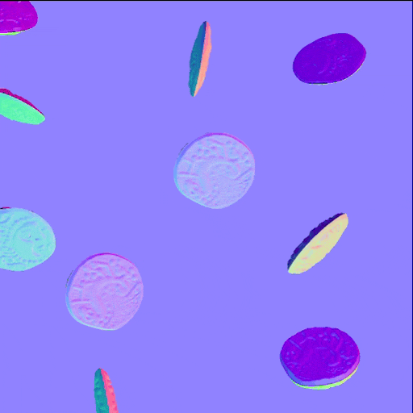

# Versão 16.0

Esta versão 16.0 apresenta um fluxo de trabalho mais criativo para dispersão e manipulação de padrões, graças ao novo Shape Splatter e aos nós SDF. Também oferece suporte nativo a OpenPBR e melhora as configurações do deslocamento na visualização 3D.

*Data de lançamento: 14 de abril de 2026*

## Nós do Shape splatter v2

### Novas maneiras de espalhar formas

Os novos nós do [respingo de forma v2](../../compositing-graphs/nodes-reference-for-com/node-library/texture-generators/patterns/shape-splatter-v2/shape-splatter-v2.md) desbloqueiam comportamentos de dispersão complexos que têm sido desafiadores até agora, com **mais métodos de distribuição de formas** (disco Poisson, uniforme) que são *sem colisões* por padrão e controlam a *reunião limpa* de formas em áreas específicas com um **mapa de densidade**.\
Usuários avançados podem configurar *distribuições personalizadas* definidas por um gráfico de função.

<table style="margin-top: 32px; margin-bottom: 32px">
    <tr style="border: 0">
        <td style="width: 33%; border: 0">
             <i>Distribuição Poisson</i>
        </td>
        <td style="width: 33%; border: 0">
             <i>Distribuição uniforme</i>
        </td>
        <td style="width: 33%; border: 0">
             <i>respingo de forma v2: Mapa de densidade</i>
        </td>
    </tr>
</table>

### Formas 3D

Formas dispersas agora são **objetos 3D** que podem ser movidos, girados e dimensionados em todos os eixos XYZ.

Use **primitivas simples**, como cubos, esferas e cilindros ou **formas personalizadas complexas** formadas por *extrusão de um mapa de height* ou criação de *formas SDF 3D*. (Mais sobre isso abaixo)

Isso desbloqueia dispersões mais dinâmicas, variadas e críveis em toda a placa. Agora é possível redimensionar formas 3D para variações invertendo-as. (Nós te vemos, artistas ambientais!)

<table style="margin-top: 32px; margin-bottom: 32px; border: none">
    <tr style="border: 0">
        <td style="width: 33%; border: 0">
             <i>Rotação 3D aleatória</i>
        </td>
        <td style="width: 33%; border: 0">
             <i>Extrusão de forma</i>
        </td>
        <td style="width: 33%; border: 0">
             <i>Formas 3D SDF</i>
        </td>
    </tr>
</table>

### Nós complementares

Da mesma forma que a família de nós Shape splatter v1, Shape splatter v2 vem com sua própria coorte de nós companheiros.

Os nós do [mapeador de respingo de forma v2](../../compositing-graphs/nodes-reference-for-com/node-library/texture-generators/patterns/shape-splatter-v2-mapper-color/shape-splatter-v2-mapper-color.md) habilitam a projeção de texturas nas formas 3D dispersas, com suporte para *projeção triplanar* e *IDs de material* para mapear várias texturas. Os resultados podem ser ajustados globalmente ou por forma para deslocamentos de textura e variações de cores.\
Novamente, usuários avançados podem configurar *mapeamentos de textura personalizados* definidos por um gráfico de função.

O [respingo de forma v2 para máscara](../../compositing-graphs/nodes-reference-for-com/node-library/texture-generators/patterns/shape-splatter-v2-to-mask/shape-splatter-v2-to-mask.md) cria máscaras para seleção específica de formas e/ou IDs de material, permitindo o uso mais granular de formas downstream no gráfico.

<table style="margin-top: 32px; margin-bottom: 32px; border: none">
    <tr style="border: 0">
        <td style="width: 33%; border: 0">
             <i>Mapeamento triplanar</i>
        </td>
        <td style="width: 33%; border: 0">
             <i>Mapeamento normal</i>
        </td>
        <td style="width: 33%; border: 0">
             <i>Mapeamento por ID de material de formas SDF</i>
        </td>
    </tr>
</table>

### Grade de atlas

<table>
    <tr style="vertical-align: top; border: 0">
        <td style="border: 0">
            
Padrões personalizados podem ser fornecidos separadamente para o nó Shape splatter v2 ou empacotados em uma grade de atlas para fluxos de trabalho mais simples e eficientes.

Os padrões de embalagem são simplificados graças aos novos nós de <a href="../../compositing-graphs/nodes-reference-for-com/node-library/texture-generators/patterns/grid-atlas-color/grid-atlas-color.md">Grade de atlas</a>.

        </td>
        <td style="text-align: right; width: 33%; margin-left: 32px; border: 0">
            
        </td>
    </tr>
</table>

### Amostra de material

<table style="border: none">
    <tr style="border: none">
        <td style="border: none; vertical-align: top">
            
Os <b>parafusos enferrujados</b> <a href="../../compositing-graphs/creating-compositing-gra/material-samples/material-samples.md">amostra de material</a> estão disponíveis para pular a família de nós Shape splatter v2 e seus recursos.

O gráfico é organizado e anotado para guiá-lo através de sua estrutura, configurações de nó e técnicas.

Ele também é <i>totalmente editável</i>. Portanto, pode ser usado como uma sandbox para obter uma compreensão mais prática do conjunto de ferramentas Shape splatter v2. Você pode criar quantos gráficos de amostra quiser, portanto, fique à vontade para brincar.

        </td>
        <td style="border: none; width: 20%; vertical-align: top; text-align: right">
            
        </td>
    </tr>
</table>

## Nós SDF 3D (campo de distância assinado)

<table>
    <tr style="vertical-align: top; width: 75%; border: 0">
        <td style="border: 0">
            
O Designer 16.0 adiciona um método eficiente de gerar formas 3D em um gráfico de função usando um vasto catálogo de nós para Funções SDF de criação.

Campos de distância assinados são representações do espaço como uma distância para superfícies definidas matematicamente. Eles podem ser usados para definir formas de complexidade crescente, pois essas superfícies são transformadas e combinadas usando vários operadores.

        </td>
        <td style="text-align: right; width: 25%; margin-left: 32px; border: 0">
            
        </td>
    </tr>
</table>

### Criação de Funções SDF 3D

As Funções SDF envolvem uma [nova família de nós](../../function-graphs/nodes-reference-for-fun/function-node-library/function-node-library.md#sdf-functions) que vêm em 4 categorias:

* **Primitivas** são os blocos de construção básicos. Elas geram formas ajustáveis simples com alguns controles que permitem personalizá-las conforme necessário.
* **Operadores** combinam ou replicam formas de maneira direta ou complexa, dependendo do nó: de operadores booleanos simples a morfos, shell e simetrias, eles expandem drasticamente as possibilidades de que tipo de forma 3D pode ser obtida
* **Transformas** permitem ajustar a posição, rotação e tamanho das formas, conforme você espera e além, com curvatura, torção e alongamento.
* Os nós **Material** permitem definir alguns atributos básicos de material, como cor e ID de material, que podem ser usados pela família de nós [respingo de forma v2](../../compositing-graphs/nodes-reference-for-com/node-library/texture-generators/patterns/shape-splatter-v2/shape-splatter-v2.md) para mascaramento ou colorir formas.

>[!INFO]
> 
> Vá para a página [Trabalhando com o Função SDF](../../function-graphs/nodes-reference-for-fun/function-node-library/function-nodes-sdf-functions/working-with-sdf-functions.md) para começar a trabalhar com esses nós.

Nós leves com ícones claros e legíveis tornam a criação de Funções SDF 3D mais fácil do que você pode pensar, especialmente com esta próxima adição ao conjunto de ferramentas...

### Nó do visualizador 3D

Ao criar Funções SDF 3D, será necessário visualizar as formas resultantes no espaço 3D. O [nó de visualizador 3D](../../compositing-graphs/nodes-reference-for-com/node-library/filters/effects/3d-viewer/3d-viewer.md) renderiza o SDF 3D ou as funções de interseção como uma cena 3D com controles ajustáveis de câmera, iluminação do ambiente personalizada e suporte para renderizar materiais básicos. (Cor, rugosidade e metalidade)

O nó também inclui recursos para verificar as formas geradas em detalhes e depurar problemas: passagens de renderização separadas (AOV), isolines SDF e auxiliares visuais. (E.g. Coloração de sangria da caixa, arcos de grade e rotação)

<table style="margin-top: 32px; margin-bottom: 32px">
    <tr style="width: 50%; border: 0">
        <td style="text-align: center; width: 50%; border: 0; padding: 15px">
            
        </td>
        <td style="width: 50%; border: 0; padding: 0">
            <table>
                <tr style="vertical-align: top; border: 0">
                    <td style="text-align: center; border: 0">
                        
                    </td>
                    <td style="text-align: center; border: 0">
                        
                    </td>
                </tr>
                <tr style="vertical-align: top; border: 0; background: transparent">
                    <td style="text-align: center; border: 0; background: transparent">
                        
                    </td>
                    <td style="text-align: center; border: 0; background: transparent">
                        
                    </td>
                </tr>
            </table>
    </tr>
</table>

## Suporte a OpenPBR

A [Superfície de OpenPBR](https://academysoftwarefoundation.github.io/OpenPBR/) é uma especificação de um modelo de sombreamento de superfície destinado como padrão para gráficos de computador e é capaz de modelar com precisão a grande maioria dos materiais.

Este modelo de material agora é compatível com todo o aplicativo, com [sombreadores dedicados](../../interface/3d-view/material-properties/material-properties.md#openpbr) em nossos novos renderizadores (Rasterizador, GPU Pathtracer) e no renderizador OpenGL.

Comece com este padrão do setor amplamente adotado com novos modelos de gráfico ou analise as amostras de material incorporadas agora com base no OpenPBR.

<table style="border: none; margin-top: 32px; margin-bottom: 32px">
    <tr style="vertical-align: top; border: 0">
        <td style="text-align: center; border: 0">
            
        </td>
        <td style="text-align: center; border: 0">
            
        </td>
    </tr>
</table>

O sombreador de OpenPBR agora é o padrão para o Visualização 3D e suporta nativamente gráficos de versões anteriores, combinando os usos do PBR herdado com os do OpenPBR.

Os sombreadores de OpenPBR oferecem mais efeitos do que os sombreadores existentes, como película fina e parede fina. Todos os efeitos estão disponíveis na rasterização (Rasterizador, OpenGL), incluindo a refração por fim!

<table style="border: none;">
    <tr style="vertical-align: top; border: 0">
        <td style="border: 0">
            Também é mais fácil manter os fluxos de trabalho envolvendo sombreadores específicos em sincronia, com um novo atributo <a href="../../compositing-graphs/graph-parameters/graph-parameters.md#attributes">'Modelo de material'</a> para gráficos de Substance que garante que os gráficos visualizados no Visualização 3D usem o sombreador apropriado para o modelo de material do gráfico.
        </td>
        <td style="text-align: right; margin-left: 32px; border: 0">
            
        </td>
    </tr>
</table>

>[!NOTE]
> 
>O atributo também está incluído nos arquivos SBSAR publicados para integrar ao fluxo de trabalho de material.

## Controles de deslocamento no Visualização 3D

Agora é mais rápido e fácil ajustar o deslocamento e o mosaico no Visualização 3D, com acesso direto a um [novo pop-up de Deslocamento](../../interface/3d-view/displacement/displacement.md) disponível na barra de ferramentas do Visualização 3D.

Ajuste os valores de **escala de Height**, **nível de Height** e **mosaico** sem repetições para frente e para trás nas configurações de propriedades de material e de renderizador.

Esses controles estão disponíveis para os novos renderizadores (Rasterizador, GPU Pathtracer) e para o renderizador OpenGL.

Se a cena incluir vários materiais, selecione o objeto da cena que deseja ajustar de antemão, mantendo pressionada a tecla <code>Shift</code> e clicar nele (Somente Rasterizador e GPU Pathtracer) ou selecione-o no navegador de Cena.

>[!NOTE]
> 
>O mosaico é *por objeto* em Rasterizador e GPU Pathtracer e *por material* em OpenGL.

## Outras alterações

### Nós de valor constante

<table style="border: none; margin-top: 32px; margin-bottom: 32px">
    <tr style="vertical-align: top; border: 0">
        <td style="border: 0">
            
Para facilitar o acesso a valores constantes em gráficos de Substance, <a href="../../compositing-graphs/nodes-reference-for-com/node-library/values/constant.md">novos nós</a> foram adicionados para gerar um valor simples de cada tipo.

Você pode encontrar todos eles na seção <b>Valores &gt; Constantes</b> da Biblioteca.

        </td>
        <td style="width: 60%; border: 0">
            
        </td>
    </tr>
</table>

### Gráficos MDL e fim da vida útil do Iray

Conforme notificado na versão 15.1, o conjunto de recursos de gráfico MDL e o renderizador Iray foram removidos do Designer.\
Nosso GPU Pathtracer interno é o renderizador preferencial para renderização fotorrealista de alta qualidade no Designer.

A Designer está deixando de usar o MDL em favor do MaterialX como sua linguagem de sombreamento de escolha para definições de material intercambiáveis e amplamente suportadas.\
O MaterialX rapidamente ganhou força nas indústrias de computação gráfica e pode ser transportado por arquivos USD para portabilidade completa da cena em DCCs e renderizadores.

>[!NOTE]
> 
>A documentação para gráficos MDL e o renderizador Iray está disponível na sua [página dedicada de fim de vida](../../technical-issues/mdl-graph-iray-eol/mdl-graph-iray-eol.md).

### Atualizações da plataforma VFX e versão mínima do macOS

As bibliotecas a seguir foram atualizadas para atender ao padrão de plataforma VFX mais recente:

* C++ 20
* Python 3.13
* Qt 6. 8
* Aumento de 1,88
* OpenColorIO 2,5
* OpenSubDiv 3.7
* OpenEXR 3,4
* oneTBB 2022

O requisito para a versão mínima compatível do macOS foi atualizado para o macOS 14 Sonoma.

## Notas de versão

### 16.0.0

*(Lançado em 14 de abril de 2026)*

### Adicionado

* [Content] Nó v2 de respingo de forma
* [Conteúdo] Nós de cores/tons de cinza do mapeador de respingo de forma v2
* [Conteúdo] respingo de forma v2 para nó de máscara
* Nós de Grade de atlas [Content]
* [Conteúdo] Nó do visualizador 3D
* [Content] Nós do operador SDF 3D
* [Conteúdo] Nós primitivos SDF 3D
* [Content] Nós de transformo SDF 3D
* [Content] Nós de material SDF 3D
* [Content] Ângulo para nó de vetor
* [Content] Nós de valor constante
* [Visualização 3D] sombreador de OpenPBR para o renderizador OpenGL
* [Visualização 3D] sombreador de OpenPBR para renderizadores Rasterizador e GPU Pathtracer
* [Visualização 3D] Janela do Deslocamento para definir a escala, o nível e o mosaico do height
* [Visualização 3D] Reorganizar os itens da barra de ferramentas
* [Visualização 3D] Definir OpenPBR como o modelo de material padrão no Visualização 3D
* [Visualização 3D] Fazer com que a exibição 3D leve em consideração o atributo do gráfico “Modelo de material”
* [Visualização 3D] Sincronizar modelos de material ao alternar entre os renderizadores Rasterizer/GPU Pathtracer e OpenGL
* [Visualização 3D] Garanta que o modelo de material seja persistente ao alternar renderizadores 3D e alterações de definição de material
estão sincronizados
* [Visualização 3D] GPU Pathtracer: Ativar ciclo de pixel de ruído azul
* [Visualização 3D] Expor controle de opacidade de Oclusão de ambiente
* [Visualização 3D] Defina o intervalo do parâmetro &#39;Tiling&#39; como [0, 10] para todos os sombreadores
* [Visualização 3D] Renomear a ação &#39;Foco&#39; como &#39;Quadro&#39;
* [Visualização 3D] Manipular o novo parâmetro refineLevel que substitui tessellationFactor
* [Visualização 3D] Adicionar contador FPS
* [Visualização 3D] Mova a barra de progresso na mesma barra de ferramentas horizontal que o espaço de cores na parte inferior
* [Baker] Exibe o UV da baker selecionada na visualização
* [Graph] Adicionar novo atributo &#39;Modelo de material&#39; aos gráficos de Substance
* [NewGraph] Adiciona separadores na visualização de miniaturas
* [Parâmetros] Defina o valor de constante padrão para parâmetros de entrada com o editor &#39;Function&#39;
* [Parâmetros] Preencha a caixa de combinação dos parâmetros de nó `Set` e `Is defined` com as variáveis disponíveis
* [Preferências] Remover a opção obsoleta “Fator de desescala” na guia “Visualização 3D”
* [Publish] Caixa de diálogo Publish: incluir modelo de material nas informações do gráfico
* [Python] Adicionar nova classe SDMaterialModelDescription para obter as informações de um modelo de material
* [Python] Permite obter/definir a propriedade modelo de material de objetos SDSBSCompGraph
* [Editor Python] Aumentar tamanho da fonte para 12
* [Modelos] Adicionar modelos de OpenPBR
* [Modelos] Converter amostras de material em OpenPBR
* [ThirdParty] Atualizar o impulso para a versão 1.88
* [Terceiros] Atualizar API C++ para C++ 20
* [ThirdParty] Atualize o NGL para 1.42
* [Terceiros] Atualize uma versão para a versão 2022.x
* [ThirdParty] Atualizar o OpenColorIO para a versão 2.5.x
* [Terceiro] Atualizar o OpenEXR para a versão 3.4.x
* [ThirdParty] Atualize Qt e QtForPython para 6.8.x e Python para 3.13.x
* [Terceiros] Atualize o TBB para oneTBB 2021.x
* [Descontinuação] Remover Iray e o Editor de MDL

### Correções

* [2D View] O intervalo de seleção do histograma não é preservado quando a largura do widget se torna pequena
* [Exportação 3D] As malhas exportadas do Designer não renderizam o mesmo no usdview
* [Exibição 3D] Atribuir objetos não udim à Exibição 3D deixa o modo de renderização de bloco único
* [Exibição 3D] Resultado apertado ao usar o OCIO
* [Visualização 3D] Falha ao aplicar uma textura de gráfico em um material não substituído para uma cena específica
* [Visualização 3D] Falha ao criar buffers de quadro
* [Visualização 3D] GPU Pathtracer Eclair: geometria quebrada e baixo desempenho ao renderizar um modelo específico
* [Visualização 3D] Transformação de textura incorreta para cena(s) específica(s)
* [Exibição 3D] Enquadramento inconsistente de cena/seleção ao usar a resolução de renderização fixa
* [Visualização 3D] Cor difusa incorreta ao renderizar determinado arquivo GLTF
* [Exibição 3D] Ambiente invisível ao alternar renderizadores em um caso específico
* [3D View] Os materiais não são detectados corretamente quando importados alguns arquivos .fbx
* [Visualização 3D] A substituição de materiais mais de uma vez redefine a divisão em blocos gráficos para 1
* [Visualização 3D] As propriedades na categoria “UVs” não são salvas em arquivos SBSSCN
* [Exibição 3D] “Redefinir e exibir saídas na exibição 3D” de gráficos de saída única não redefine materiais
* [Exibição 3D] “Salvar renderização”: o formato de imagem editado não é preservado
* [Visualização 3D] A seleção não funciona em GPUs AMD
* [Visualização 3D] A cena 3D independente não é atualizada quando modificada no disco
* [Exibição 3D] Algumas propriedades do material de cores não são gerenciadas corretamente quando substituídas
* [Exibição 3D] As texturas UDIM não são aplicadas corretamente em uma malha específica
* [Visualização 3D] A cena do USD com material MaterialX não é mais renderizada corretamente
* [Padarias] Falhas com algumas malhas
* [Bakers] Transferência de textura: Falha em bkBufferViewCopy
* [Cooker] Loop infinito no nó de Loop While em um caso que poderia ser evitado
* [Engine] Parar o mecanismo Substance ao fechar o aplicativo
* [Geral] Evitar falhas aleatórias ao sair do aplicativo (somente Windows)
* [Graph] Gráfico de função: a propagação de tipo não funciona corretamente em algumas situações
* [Gráfico] Os vínculos de gráfico são excluídos quando um nó de entrada de imagem é renomeado
* [Gráfico] Links e fixares às vezes exibem artefatos
* [Preferences] &#39;Viewport scaling&#39; é invertido
* [Propriedades] Falha ao modificar o ajuste de entrada do gráfico ao exibir seus parâmetros de instância
* [Python] Não é possível importar módulos PySide6 (possível conflito com a instalação existente do PySide6)
* [Python] Os módulos existentes do PySide e do Shiboken entram em conflito com os
* [UI] O estilo hover desaparece nos botões em casos específicos (somente Windows)
* [UI] O estilo de foco não é visível nos botões suspensos quando clicados (somente no macOS)
* [UI] O botão “Saiba mais” na dica de ferramenta “?” não funciona quando a dica de ferramenta está fora dos limites da caixa de diálogo (somente Windows)

### PROBLEMAS CONHECIDOS

* [Gráfico] Os ícones gerados para gráficos de OpenPBR não são precisos
* [Exibição 3D] As cenas com primitivas animadas não são suportadas corretamente
* [Exibição 3D] Não há suporte para Pathtracer em todas as placas gráficas AMD

