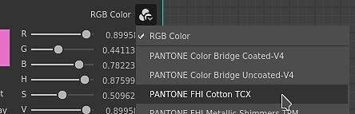
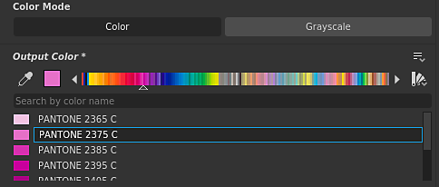

# Versão 2021,1 (11,1)

O **Substance Designer 2021.1** traz um conjunto de novos recursos com o suporte de cores Pantone, a capacidade de desabilitar um nó em um gráfico e a exportação de malhas mosaicas, além de várias melhorias na qualidade de vida.

Data de lançamento: *28 de janeiro de 2021*

## Principais recursos

### Novo suporte às cores do Pantone

Esta versão adiciona a compatibilidade com cores especiais do Pantone. A Pantone é conhecida por seu grande conjunto de cores usadas em uma grande variedade de setores, como design gráfico, design de moda, fabricação e muito mais. Com essa nova funcionalidade, agora é muito mais fácil combinar a cor de um material com seu valor real. Para obter mais detalhes, confira a [página de documentação](../../color-management/spot-colors-pantone/spot-colors-pantone.md) dedicada.

>[!NOTE]
>
> Para usar essas novas cores Pantone, a configuração de gerenciamento de cores precisa ser definida como **Adobe ACE** nas preferências do aplicativo.

* **Escolha entre cores RGB e Pantone**\
  O seletor de cores tem agora uma opção para selecionar em qual modo uma cor pode ser editada. Por padrão, ele está definido como RGB, mas também é possível alternar para um livro do Pantone (uma biblioteca de cores). Vários livros estão incluídos por padrão.

  

  Quando o modo do seletor de cores for alterado, as cores disponíveis serão definidas pelo livro selecionado.

  

* **Procurar cores no livro atual**\
  O campo de texto na parte superior da lista permite pesquisar cores específicas em todo o livro do Pantone. Ele não vai olhar para os outros livros, então lembre-se de alternar entre eles quando procurar por algo.

  

* **Escolha e encontre as cores certas**\
  O seletor de cores pode escolher qualquer cor na tela e encontrar a correspondência mais próxima no livro atual.

  

### Novos nós de desativação em um gráfico

Esta versão adiciona a capacidade de desativar um nó, fazendo com que ele passe dentro de um gráfico. Isso é útil quando se deseja comparar e iterar em um material para ver quais efeitos um nó específico adiciona ao resultado final, por exemplo.

Para desabilitar um nó, basta clicar com o botão direito nele e escolher **Desabilitar Seleção** ou pressionar o atalho de teclado **Shift+D**. Nem todos os nós podem ser desativados, isso depende de vários critérios. Para obter mais detalhes, consulte a seção dedicada na [página de documentação](../../interface/the-graph-view/the-graph-view.md) a seguir.

### Nova exportação de malha em mosaico a partir do visor

A malha em mosaico na Visualização 3D agora pode ser exportada em vários formatos de arquivo.

Para fazer isso, basta usar a ação de cena **Arquivo > Exportar** na **Exibição 3D**. Para obter mais detalhes, consulte a [página de documentação](../../interface/3d-view/3d-view.md) dedicada.

{width="700px"}

### Melhorias gerais

Várias melhorias e novas funcionalidades pouco úteis foram adicionadas nesta versão para ajudar no trabalho diário:

* **Alocação automática de orçamento de memória para o mecanismo**\
  O gerenciamento de Ram e Vram do aplicativo foi aprimorado e agora se ajusta melhor à memória disponível do sistema. As GPUs com muita Vram agora podem aproveitar ainda mais a memória integrada.

* **A Exibição 3D agora dá suporte à nova semântica “physicalSize”.**\
  Sombreadores personalizados agora podem levar em conta a tamanho físico de um material para ajustar seu comportamento. Para mais detalhes, confira os sombreadores fornecidos com o aplicativo.

* **Novas configurações para excluir conteúdo da biblioteca**\
  A biblioteca agora pode excluir extensões de arquivo específicas ou padrões de nome específicos (com o suporte de curingas). Isso permite ignorar conteúdo indesejado na janela [Biblioteca](../../interface/the-library/the-library.md).

* **Criar pastas ao exportar bitmaps**\
  Ao exportar bitmaps de um gráfico, agora é possível especificar barras para criar pastas e subpastas quando elas não existem. Isso ajuda a organizar os bitmaps por gráfico em sua própria pasta, por exemplo, usando: **projeto/$(gráfico)/$(identificador)**.

* **O SBSRender agora oferece suporte aos perfis Adobe ACE e ICC**\
  O processo SBSRender (parte do Kit de ferramentas de automação) agora pode renderizar saídas de Substance com o gerenciamento de cores adequado ao usar o mecanismo Adobe ACE.

&#x200B;>> 

Créditos da imagem: [cachorro com flor](https://unsplash.com/photos/2s6ORaJY6gI) e [cachorro com óculos](https://unsplash.com/photos/siNDDi9RpVY) de &#42;&#42;Unsplash&#42;&#42;.

## Tutorials

Veja abaixo nossos tutoriais em vídeo que abrangem os novos recursos:

## Notas de versão

### 2021.1.0

*(Lançado Em 28 De Janeiro De 2021)*

**Adicionado:**

* [Cores especiais] Cores Pantone compatíveis no Designer
* [Gráfico] Desativar nós
* [Visualização 3D] Exportar malhas em mosaico da janela de visualização
* [Internacionalização] Atualizar a versão em japonês
* [Visualização 3D] Otimizar o consumo de memória quando não estiver usando o Iray
* [API Python] Adicionar método SDResource.delete() para excluir um SDResource
* [API Python] Adicionar compatibilidade com cores especiais na API Python
* [API Python] Novo retorno de chamada para acionar quando um pacote é fechado
* [2D View] Converter banco de dados de pincéis do SQLite para o formato Json
* [Exibição 2D] Melhorar o desempenho e a confiabilidade da renderização (computação da CPU)
* [Library] Adicionar a opção &#39;Excluir padrão&#39; nas configurações do projeto
* [Library] Renomeie “Excluir padrão” para Excluir extensões de arquivo nas configurações do projeto
* [UX] Remover o botão &#39;?&#39; nas barras de título da janela no Windows
* [UX] Mover o atalho Ctrl+E para “Abrir referência” quando a edição no contexto estiver desativada
* [Padeiros] Excluir o cache de visualização ao excluir um padeiro na lista de bolos
* [Desempenho] Melhorar o orçamento do cache de imagem no hardware com GPU com memória compartilhada
* [Preferências] Adaptar o valor de &#39;Limite de cache da GPU&#39; ao pool de memória disponível
* [Propriedades] Exibir atributo de Tamanho físico em instância de nó
* [Script] Marcar sistema de script externo como obsoleto
* [Share] Remover recursos de “Exportar para o Substance share”

**Adicionado:**

* [Content] Ordem de I/O inconsistente em nós de material
* [Content] A entrada principal em nós de distorção é inconsistente
* [Content] Solucionar avisos de Fogão a partir do nó Desfoque radial
* [Exportar] A exportação em lote com mecanismo de CPU usa VRAM para determinar o orçamento de memória
* [Exportar] Exportar para um caminho que não existe criará as pastas
* [Exportar] O orçamento de memória é muito baixo ao usar a exportação em lote
* [Exibição 2D] Artefatos/faixas ao copiar imagens HDR para a área de transferência
* [Exibição 2D] Exportar imagens de recursos sempre exporta 8 bits
* [3D View] Iray: mudar o valor normal usando o editor dá um resultado estranho
* [3D View] Iray: desativar o canal normal não produz o resultado correto
* [Biblioteca] A filtragem por URL não funciona corretamente
* [Library] Os recursos correspondentes a um padrão excluído da biblioteca não podem ser importados manualmente
* [Padeiros] Renomear um padeiro não afeta sua entrada na lista de visualização de Exibição 2D
* [Explorer] Perda de sincronização entre o Explorer e os dados do gráfico
* [Gráfico de função] Falha ao definir o nó da função com o tipo de saída incompatível como saída
* [MDL] Os nós da instância do SBS não têm visualização, saída 0 e não acionam o cálculo do gráfico
* [API Python] A propriedade &#39;editor&#39; do parâmetro de entrada não pode ser modificada
* [Python] A redefinição de layout não redefine corretamente as docking stations criadas pelo Python
* [Recursos] Não é possível vincular/importar o documento PSD de 32 bits
