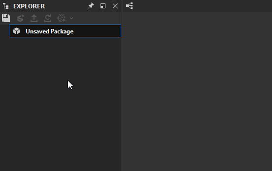

# Recurso de cena 3D

Esta página descreve o tipo de recurso **Cena 3D** no Substance 3D Designer, incluindo os formatos de arquivo com suporte e como ele pode ser usado.

## Visão geral

Os recursos de cena 3D podem ser usados em vários fluxos de trabalho:

* [fazendo bake mapas de malha](../../bakers/bakers.md)
* visualizar *textura* de [gráficos de Substance](../../compositing-graphs/substance-compositing-graphs.md) em [Visualização 3D](../../interface/3d-view/3d-view.md)

Os seguintes formatos de arquivo de cena 3D são compatíveis:

* [USD](https://graphics.pixar.com/usd/release/index.html) (\*.usd)
* [USDA](https://graphics.pixar.com/usd/release/index.html) (\*.usda)
* [USDZ](https://graphics.pixar.com/usd/release/index.html) (\*.usdz)
* [Autodesk FBX](https://www.autodesk.com/products/fbx/overview) (\*.fbx)
* [Wavefront OBJ](https://www.fileformat.info/format/wavefrontobj/egff.htm) (\*.obj)
* [Autodesk 3D Studio Mesh](https://knowledge.autodesk.com/support/3ds-max/learn-explore/caas/CloudHelp/cloudhelp/2022/ENU/3DSMax-Data-Exchange/files/GUID-A16ECF7F-70E5-4F9F-8EAD-35F5CFB485A2-htm.html) (\*.3ds)
* [Collada](https://www.khronos.org/collada/) (\*.dae)
* [Desenho do Autodesk AutoCAD](https://knowledge.autodesk.com/support/autocad/learn-explore/caas/CloudHelp/cloudhelp/2019/ENU/AutoCAD-Core/files/GUID-D4242737-58BB-47A5-9B0E-1E3DE7E7D647-htm.html) (\*.dxf)

## Armazenamento em malha

Cenas 3D *somente* podem ser vinculadas, o que significa que elas permanecem no local em disco e acabam de ser referenciadas no aplicativo.

Quando um pacote com um recurso de cena 3D é publicado como um ativo do [Substance 3D](https://www.adobe.com/br/products/substance3d/3d-augmented-reality.html) (SBSAR), a malha *não é incorporada*, mas descartada.

## Fazendo bake mapas de malha

Vincular uma cena 3D ao seu pacote é a única maneira de [fazer bake mapas de malha](../../bakers/bakers.md) dessa geometria de cena. Você pode executar as seguintes etapas para começar:

* Clique em *RMB* em um pacote e selecione a opção <b>Link > Malha 3D</b> no menu contextual
* Escolha qualquer arquivo de cena 3D compatível
* Se o prompt da caixa de diálogo <b>Vincular como malha Udim</b> for exibido, clique em *Não*, a menos que você deseje fazer bake blocos UV
* Com o recurso carregado no [Explorer](../../interface/the-explorer-window/the-explorer-window.md), clique em *RMB* nele e selecione a opção <b>Fazer bake Informações do Modelo</b> no menu contextual
* A caixa de diálogo [Fazer bake informações do modelo](../../bakers/bakers.md) é exibida para que você configure e execute qualquer faço bake de mapas de malha

{width="512px"}

## Uso de UDIM/blocos UV

Quando um recurso de malha é vinculado e o aplicativo detecta que tem UVs fora do intervalo 0-1, você será perguntado se essa malha deve ser tratada como uma malha UDIM (também conhecida como Blocos UV). Esta é uma configuração que pode ser alterada depois e, a menos que você tenha certeza de que está usando UV-Tiles, deve ser respondida como <b>Não</b>.

Se o comportamento UV-Tile estiver ativo, fazer bake se comporta de forma diferente e fará bake texturas para cada UV-Tile detectado.

## Recurso/Cena vs. estado

O aplicativo separa o que você vê na visualização 3D em dois arquivos distintos. O modelo ou malha 3D real é um recurso visível no Explorer. A configuração de luzes, câmeras e outras configurações é chamada de “<b>Estado</b>”. Os estados podem ser salvos em arquivos .sbsscn externos para serem carregados novamente mais tarde. Os arquivos .sbsscn não são recursos, eles são arquivos de configuração adicionais que só podem ser carregados pelo [menu Cena no Visualização 3D.](../../interface/3d-view/3d-view.md)
