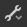
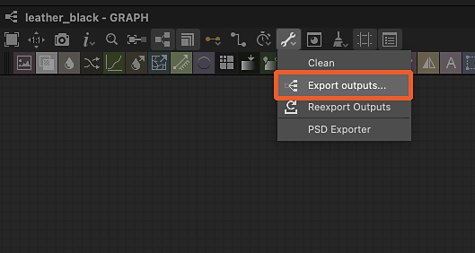

# AxF (Appearance eXchange Format)

<table>
<tr style="border: 0;">
<td width="25.00%" style="border: 0;" valign="top">

</td>
<td width="100.00%" style="border: 0;" valign="top">

O Substance 3D Designer oferece suporte ao formato de aparência do eXchange do [X-Rite.](https://www.xrite.com/axf) Os criadores do formato o descrevem da seguinte maneira:

Os arquivos AxF são usados para capturar, armazenar, editar e comunicar características complexas de materiais em todo o fluxo de trabalho de design digital. O AxF fornece uma maneira padrão de armazenar e compartilhar todos os dados relevantes de aparência - cor, textura, brilho, refração, translucidez, efeitos especiais (brilhos) e propriedades de reflexão - nos aplicativos de renderização de última geração, de PLM (Product Lifecycle Management, gerenciamento do ciclo de vida dos produtos) e CAD (Computer-Aided Design, design auxiliado por computador).

</td>
</tr>
</table>

Em termos simples, os arquivos AxF hospedam uma série de texturas extraídas pelo hardware de scanner TAC7 da X-Rite, juntamente com metadados que descrevem propriedades adicionais do material. Isso significa que um AxF é mais do que apenas dados de textura: ele também carrega propriedades de sombreamento.

Os arquivos AxF *não* foram importados como um pacote [recurso](../../resources/resources.md). Em vez disso, o [processo de importação](#import) envolve a extração de texturas e metadados do arquivo AxF e, em seguida, o uso deles para preparar gráficos criados a partir de [modelos dedicados](#graph-templates).

Os modelos disponíveis se destinam a dois fluxos de trabalho do AxF:

* <b>Convertendo</b> um material SVBRDF em um arquivo AxF em um material PBR;
* <b>Editando</b> um material SVBRDF no local e [exportando-o](#export) para um arquivo AxF existente como uma nova camada.

>[!NOTE]
>
> Modelos de material compatíveis
> 
> Somente materiais que usam um modelo <b>SVBRDF</b> (BRDF com variação espacial) podem ser *totalmente* carregados e editados no Designer.
> 
> Os materiais que usam o modelo <b>EP-SVBRDF</b> (Preservação de Energia SVBRDF) podem ser carregados, mas somente os recursos existentes no modelo SVBRDF podem ser editados e visualizados. Não há suporte para recursos exclusivos para EP-SVBRDF.
> 
> Outros modelos não são compatíveis.

## Importação de arquivos AxF

O fluxo de trabalho de importação de arquivos AxF pode ser iniciado a partir de um dos dois métodos abaixo:

+++Página inicial

Clique no botão <b>Importar AxF...</b> na seção esquerda de [Tela inicial](../../interface/home-screen/home-screen.md).

{width="600px"}

+++

+++Explorer

Clique em RMB em um pacote no [Explorer](../../interface/the-explorer-window/the-explorer-window.md) e vá para <b>Importar > AxF</b> no menu contextual do pacote.

{width="600px"}

+++

### Caixa de diálogo Importar

A caixa de diálogo <b>Importar AxF</b> permite examinar os dados carregados do arquivo AxF selecionado e configurar os modelos de gráfico necessários para executar as edições ou conversões desejadas.

Ele apresenta quatro seções:

O <b>Cabeçalho</b> exibe o nome do material detectado no arquivo AxF, bem como sua representação (atualmente, sempre SVBRDF). A miniatura da visualização incorporada ao arquivo também é exibida.

A seção <b>Modelos</b> permite configurar o modelo de [gráfico de Substance](../../compositing-graphs/substance-compositing-graphs.md) para começar a trabalhar no material. Consulte a seção [Modelos de gráfico](#graph-templates) abaixo para saber mais sobre esses modelos e como configurá-los.

<b>Texturas</b> lista todas as texturas extraídas do arquivo AxF envolvido no material detectado. Para cada textura, o nome, a resolução nativa, o formato de dados e o tamanho físico são exibidos.

Os <b>Metadados</b> e as <b>Propriedades</b> listam os dados extraídos do material no arquivo AxF. Elas têm um impacto sobre como algumas propriedades de modelos de gráfico de Substance são configuradas (consulte a seção [Modelos de gráfico](#graph-templates) abaixo).

### Resultado

Depois de clicar no botão <b>OK</b>, um pacote é criado no [Explorer](../../interface/the-explorer-window/the-explorer-window.md). O pacote inclui os seguintes recursos:

<table>
<tr style="border: 0;">
<td style="border: 0;" valign="top">

Uma pasta <b>Recursos</b> hospeda uma *subpasta* para cada material importado do arquivo AxF.

Cada subpasta inclui outra subpasta que contém as *texturas* extraídas do arquivo AxF desse material. Esta última subpasta foi nomeada em homenagem à *representação* do material usada pelas texturas (atualmente apenas <b>SVBRDF</b>).

Um gráfico para cada modelo configurado na seção <b>Modelos</b> da caixa de diálogo de importação.\
No caso de [gráficos de Substance](../../compositing-graphs/substance-compositing-graphs.md), eles são pré-configurados com as texturas e os dados extraídos do arquivo AxF, bem como suas configurações de modelo selecionadas (consulte a seção Modelos de gráfico abaixo).

</td>
<td style="border: 0;" valign="top">

</td>
</tr>
</table>

## Modelos de gráfico

<table>
<tr style="border: 0;">
<td style="border: 0;" valign="top">

Existem modelos de gráficos dedicados aos fluxos de trabalho do AxF para [gráficos de Substance](../../compositing-graphs/substance-compositing-graphs.md).

Clique no botão <b>Adicionar modelo</b> e selecione o tipo de gráfico desejado no menu suspenso.

</td>
<td style="border: 0;" valign="top">

</td>
</tr>
</table>

### modelos de gráficos Substance

<table>
<tr style="border: 0;">
<td style="border: 0;" valign="top">

Dois tipos de modelos de gráficos de Substance estão disponíveis:

Os modelos <b>AxF para aspereza metálica</b> e <b>AxF para Specular brilhante</b> são *conversão* e permitem mapear materiais AxF para modelos PBR padrão.\
Eles podem ser usados com os sombreadores de exibição 3D padrão e combinados com outros materiais PBR produzidos no Designer, no [Sampler](https://www.adobe.com/products/substance3d-sampler.html) ou adquiridos na nossa biblioteca de [Ativos 3D](https://substance3d.adobe.com/assets/).

O <b>AxF para AxF</b> é um modelo de *passagem* que permite editar os materiais do AxF no local e exportar essas alterações como novas camadas em arquivos AxF existentes. Consulte Exportar arquivos AxF abaixo para saber mais.

</td>
<td style="border: 0;" valign="top">

</td>
</tr>
</table>

<table>
<tr style="border: 0;">
<td style="border: 0;" valign="top">

Para todos os modelos de Substance adicionados à lista <b>Modelos</b>, as seguintes operações adicionais são executadas:

Para qualquer nó [<b>Input</b>](../../compositing-graphs/nodes-reference-for-com/atomic-nodes/input/input.md) que *usage* corresponda ao *identificador* de uma textura extraída do arquivo AxF, esse nó de entrada é substituído por um nó [Bitmap](../../compositing-graphs/nodes-reference-for-com/atomic-nodes/bitmap/bitmap.md) fazendo referência a essa textura;

A propriedade <b>Resolution</b> do gráfico (isto é, tamanho de saída) é definida automaticamente para a potência de dois igual ou acima da resolução da *maior* textura extraída;

A propriedade <b>Resolution</b> dos nós [Bitmap](../../compositing-graphs/nodes-reference-for-com/atomic-nodes/bitmap/bitmap.md) (isto é, tamanho de saída) é definida automaticamente para corresponder ao gráfico, após a operação anterior ser aplicada;

A propriedade <b>Tamanho físico</b> do gráfico está definida como o tamanho físico da textura extraída *primeiro*;

Os *valores padrão* dos parâmetros do gráfico estão definidos para corresponder aos dados no arquivo AxF.

Os *metadados* extraídos do material no arquivo AxF são copiados na propriedade <b>Description</b> do gráfico.

>[!IMPORTANT]
>
> Os valores padrão dos parâmetros do gráfico não devem ser modificados após essa configuração inicial.
> 
> Eles especificam as propriedades de sombreamento que são essenciais para interpretar corretamente os valores nas texturas.
> 
> Portanto, alterar essas configurações resultará em renderização incorreta ao visualizar o material na [Exibição 3D](../../interface/3d-view/3d-view.md).

</td>
<td style="border: 0;" valign="top">

</td>
</tr>
</table>

## Exportação de arquivos AxF

Os arquivos AxF existentes podem ser editados no local no Designer, e seus recursos são atualizados usando as [saídas](../../compositing-graphs/nodes-reference-for-com/atomic-nodes/output/output.md) de um [gráfico de Substance](../../compositing-graphs/substance-compositing-graphs.md).

Com a capacidade de exportar saídas de gráfico para arquivos AxF, um fluxo de trabalho típico do AxF no Designer pode se parecer com isto:

1. Importar arquivo AxF
1. Usar o modelo de gráfico de Substance &#39;AxF para AxF&#39;
1. Edite as texturas extraídas usando os recursos e nós disponíveis nos gráficos de Substance
1. Exportar as saídas do gráfico para o mesmo arquivo AxF

A propriedade <b>Tamanho físico</b> do gráfico é usada para definir o atributo <b>Tamanho físico</b> das texturas atualizadas no arquivo AxF editado.

>[!NOTE]
>
> As alterações nos recursos no arquivo são adicionadas como uma *nova camada*. Isso significa que cada exportação executada do Designer para o mesmo arquivo AxF será adicionada ao tamanho desse arquivo.

<table>
<tr style="border: 0;">
<td width="33.33%" style="border: 0;" valign="top">

### Caixa de diálogo Exportar

A caixa de diálogo de exportação do <b>AxF</b> está disponível na caixa de diálogo <b>Exportar saídas</b> como uma guia dedicada.

Na barra de ferramentas do [Modo de Exibição de Gráfico](../../interface/the-graph-view/the-graph-view.md), abra o menu  <b>Ferramentas</b> e selecione a opção <b>Exportar saídas...</b> para exibir a caixa de diálogo e selecione a guia <b>AxF</b>.

</td>
<td width="100.00%" style="border: 0;" valign="top">

</td>
</tr>
</table>

O diálogo apresenta três seções principais:

O campo de entrada <b>Arquivo</b> permite selecionar o arquivo AxF de destino que deve ser editado. Esse arquivo é carregado e verificado, então, se válidos, seus dados são usados para preencher as colunas &#39;AxF resource&#39; abaixo.

<b>Saídas mapeadas</b> lista as saídas de gráfico na coluna Saída e corresponde seu *uso* com um recurso AxF no arquivo de destino que compartilha o mesmo *identificador*. Se forem detectados problemas, eles serão exibidos como um aviso (amarelo) ou um erro (ref) na coluna Observações.

<b>Saídas não mapeadas</b> lista saídas de gráfico e recursos AxF no arquivo de destino que não puderam ser mapeados. Essas saídas são ignoradas e os recursos do AxF permanecem inalterados.

>[!NOTE]
>
> Uma saída de gráfico precisa ter sua propriedade <b>Group</b> definida como &#39;AxF&#39; para ser listada nesta caixa de diálogo.

Clique em <b>Iniciar exportação </b> para editar o arquivo AxF de destino com a nova camada que contém as alterações nas saídas mapeadas.

O resultado é exibido como uma mensagem ao lado da barra de progresso na barra de status da caixa de diálogo.

>[!TIP]
>
> Uma nova camada no arquivo de destino é criada sempre que uma exportação é executada. Portanto, tenha cuidado ao fazer exportações deliberadas e funcionais para gerenciar o tamanho e a complexidade do arquivo.

### Mapear saídas para recursos do AxF

Ao exportar para um arquivo AxF existente, seus recursos são atualizados usando as saídas do gráfico. O Designer corresponde o identificador de recurso aos nós [Saída](../../compositing-graphs/nodes-reference-for-com/atomic-nodes/output/output.md) que têm o mesmo identificador que um <b>Uso</b>.

Além disso, a propriedade *Grupo</b> da saída <b>deve* ser definida como &#39;AxF&#39; para que seja listada na caixa de diálogo de exportação do AxF (veja acima).

Os recursos podem ser texturas (ou seja, bitmaps) ou uniformes (ou seja, valores) com um número específico de canais. É obrigatório que a saída do gráfico corresponda exatamente a esse número de canais. Se não for esse o caso, um erro será gerado para esse recurso durante a exportação, e o recurso permanecerá inalterado.

O número de canais é especificado de forma diferente dependendo do tipo de dados fornecidos para o nó Saída:

* <b>Bitmap (Textura):</b> a propriedade [Componentes](../../compositing-graphs/nodes-reference-for-com/atomic-nodes/output/output.md) é usada para especificar o número de canais, onde R é um canal, RG são dois canais e assim por diante. A propriedade é usada para permitir que o Designer saiba quais canais RGBA do bitmap de cor devem ser codificados no recurso.
* <b>Valor (Uniforme):</b> o número de componentes do valor vetorial é usado para especificar o número de canais, onde [Flutuante](../../function-graphs/nodes-reference-for-fun/atomic-function-nodes/constant-nodes/constant-nodes.md) é um canal, [Flutuante2](../../function-graphs/nodes-reference-for-fun/atomic-function-nodes/constant-nodes/constant-nodes.md) são dois canais e assim por diante.

>[!IMPORTANT]
>
> No modelo de gráfico <b>AxF para AxF</b> Substance, o nó [Saída](../../compositing-graphs/nodes-reference-for-com/atomic-nodes/output/output.md) da contribuição do <b>Lóbulo de Specular</b> é configurado por padrão como um *único canal* (isto é, sua propriedade Componentes é definida como &#39;R&#39;).\
> Se o arquivo AxF importado usar mais de um canal em seu recurso de lobo de Specular, defina a propriedade <b>Componentes</b> da saída de acordo.
> 
> Por exemplo, para um recurso do Lóbulo de Specular usando dois canais (Vermelho para Aspereza do Specular e Verde para Anisotropia do Specular), defina a propriedade Componentes como &#39;RG&#39;.

## Visualização de arquivos AxF na Visualização 3D

O método para renderizar materiais SVBRDF do AxF na [Exibição 3D](../../interface/3d-view/3d-view.md) depende da [configuração de importação](#import).

+++Converter em PBR

Se você deseja converter um material SVBRDF em um arquivo AxF em um material PBR padrão, sua configuração de importação provavelmente envolverá um [modelo de conversão de gráfico de Substance](#graph-templates).

Nesse caso, você deve usar o **renderizador OpenGL** na Visualização 3D e selecionar o <code>AxF SVBRF</code> sombreador.\
Em seguida, você pode arrastar e soltar o gráfico de Substance configurado na caixa de diálogo de importação para conectar suas saídas ao sombreador.

+++

+++Editar no local

Se o seu objetivo é executar *edições* em um arquivo AxF existente, siga as instruções abaixo para visualizar o material SVBRDF de acordo com o renderizador selecionado:

Um sombreador GLSLFX dedicado está disponível para visualizar materiais usando uma representação SVBRDF de um arquivo AxF: <b>AxF SVBRDF</b>.

O sombreador está disponível no menu <b>Materiais</b>: abra o submenu do material da cena (&#39;Padrão&#39; por padrão) e selecione qualquer técnica na entrada <b>AxF SVBRDF</b>.

Use a opção <b>Editar</b> no mesmo submenu para exibir as propriedades do sombreador no encaixe [Propriedades](../../interface/properties/properties.md).\
Em particular, a propriedade <b>Divisão em blocos gráficos</b> permite ajustar a divisão em blocos gráficos das texturas no modelo, para que você possa visualizar o material em uma escala apropriada.

Após selecionar o sombreador, clique com o botão direito do mouse no espaço vazio do gráfico e selecione a opção <b>Exibir saídas na Visualização 3D</b> para visualizar suas saídas na [Visualização 3D](../../interface/3d-view/3d-view.md).

{width="600px"}

Este sombreador é atualmente um *trabalho em andamento* e alguns recursos ainda não são suportados. Por conseguinte, embora possa fornecer uma panorâmica das características dos materiais, não deve ser utilizado para ajustamentos finos.

Use a opção <b>Editar</b> no mesmo submenu para exibir as propriedades do sombreador no encaixe [Propriedades](../../interface/properties/properties.md).\
Em particular, a propriedade <b>Divisão em blocos gráficos</b> permite ajustar a divisão em blocos gráficos das texturas no modelo, para que você possa visualizar o material em uma escala apropriada.

Após selecionar o sombreador, clique com o botão direito do mouse no espaço vazio do gráfico e selecione a opção <b>Exibir saídas na Visualização 3D</b> para visualizar suas saídas na [Visualização 3D](../../interface/3d-view/3d-view.md).

<i>Observação:</i> ignore a parte do vídeo do switch para o renderizador Iray até o final, pois o renderizador Iray e o suporte MDL foram <i>removidos</i> do Designer na versão 16.0.0.

+++

### Variantes de modelo compatíveis

Os sombreadores usados na Visualização 3D são compatíveis com as seguintes variantes para modelos de transmissão de specular, Fresnel e revestimento claro:

<table>
<tr style="border: 0;">
<td style="border: 0;" valign="top">
<b>Variantes de Specular</b>

* Ward/Geisler-Moroder 2010
* GGX/Walter2007
* GGX/Ross 2005

</td>
<td style="border: 0;" valign="top">
<b>Variantes Fresnel</b>

* Schlick 1994
* Schlick 1994 Colorida
* Fresnel simples

</td>
<td style="border: 0;" valign="top">
<b>Variantes de transmissão de casaco claro</b>

* Dirac Refrativo *(somente OpenGL)*
* Dirac Refrativo / Sem Compactação de Ângulo Sólido *(Somente OpenGL)*
* Dirac Não Refratativo
* Dirac não refrativa / DSPBR 2020x
* GGX

</td>
</tr>
</table>
