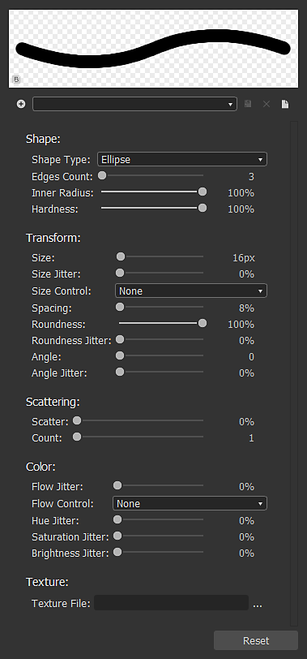
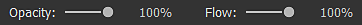

# Ferramentas de pintura de bitmap

Esta página descreve as ferramentas de pintura disponíveis no painel [Exibição 2D](../../../interface/2d-view/2d-view.md) para bitmaps compatíveis.

{width="512px"}

## Visão geral

O painel [Exibição 2D](../../../interface/2d-view/2d-view.md) oferece ferramentas básicas de pintura em bitmap que permitem criar ou editar imagens *manualmente* diretamente no aplicativo. Essas ferramentas são particularmente úteis, por exemplo, para pintar rapidamente *máscaras*.

As ferramentas são compatíveis com a entrada da caneta, incluindo a *pressão da caneta*. Para aproveitar as vantagens de exibições com caneta, você pode [desencaixar](../../../interface/customizing-your-wor/customizing-your-workspace.md) o painel [exibição 2D](../../../interface/2d-view/2d-view.md) e, em seguida, colocá-lo e redimensioná-lo em qualquer configuração que seja mais confortável para pintura.

As edições podem ser *desfeitas individualmente*, e todos os outros recursos do painel Exibição 2D ainda estão *disponíveis* enquanto você edita a imagem, como o painel [Histograma](../../../interface/2d-view/2d-view.md), a [Exibição lado a lado](../../../interface/2d-view/2d-view.md) e a [Imagem de fundo](../../../interface/2d-view/2d-view.md).

>[!IMPORTANT]
>
> Você pode pintar *somente* em *recursos de [bitmap](../../../resources/bitmap-resource/bitmap-resource.md) de 8 bits* que são [novos ou importados](../../../resources/importing-linking-and-new/importing-linking-and-new-resources.md).

>[!WARNING]
>
> **Somente Windows**
> 
> Os usuários do tablet devem aplicar as configurações descritas na página a seguir para obter a experiência mais confiável: [Configurando Canetas e Tablets](https://docs.substance3d.com/display/SPDOC/Configuring+Pens+and+Tablets)

{width="512px"}

## Ativar as ferramentas de pintura

As ferramentas de pintura serão habilitadas automaticamente no painel [exibição 2D](../../../interface/2d-view/2d-view.md) quando os seguintes critérios relativos a um bitmap forem atendidos:

* O bitmap é um recurso [novo ou importado](../../../resources/importing-linking-and-new/importing-linking-and-new-resources.md)
* O bitmap tem a precisão *8 bits*
* O bitmap é exibido no painel [exibição 2D](../../../interface/2d-view/2d-view.md)

Os bitmaps *novos* podem ser criados das seguintes maneiras:

* No painel [Explorador](../../../interface/the-explorer-window/the-explorer-window.md), clique no RMB em um *pacote SBS* ou em uma *pasta* de um pacote para abrir o menu contextual, abra o submenu <b>Novo</b> e selecione a opção <b>Bitmap</b>
* Em um [gráfico](../../../interface/the-graph-view/the-graph-view.md), crie um [nó de bitmap](../../../compositing-graphs/nodes-reference-for-com/atomic-nodes/bitmap/bitmap.md) e selecione a opção <b>Do novo recurso...</b> no menu contextual

A janela <b>Novo bitmap</b> será aberta, permitindo que você defina o *nome*, a *resolução* e a *cor do plano de fundo* do novo recurso de bitmap.

>[!NOTE]
>
> *Novos* recursos de bitmap *sempre* têm *cores RGBA* e precisão de *8 bits*.

>[!WARNING]
>
> Para obter o melhor desempenho com as ferramentas de pintura, recomendamos o uso de bitmaps com resoluções que são *potências de dois* - por exemplo, 128, 256, 512, 1024, ...

## Barras de ferramentas

As ferramentas e opções de pintura estão organizadas em *barras de ferramentas* no painel [exibição 2D](../../../interface/2d-view/2d-view.md). Essas barras de ferramentas podem ser realocadas para *qualquer lado* do painel ou como uma *barra de ferramentas flutuante*, clicando e segurando <b>LMB</b> na *alça* - exibido como uma linha tripla - e depois soltando <b>LMB</b> no local desejado.

Duas barras de ferramentas são exibidas quando as ferramentas de pintura estão habilitadas: a [barra de ferramentas Seleção de ferramentas](#bitmappaintingtools-toolselectiontoolbar) e a barra de ferramentas Opções de ferramentas, que estão descritas abaixo.

## Barra de ferramentas de seleção de ferramentas

As ferramentas de pintura podem ser encontradas na **Barra de ferramentas de seleção de ferramentas**, que está posicionada no *lado esquerdo* do painel [exibição 2D](../../../interface/2d-view/2d-view.md) por padrão. Os atalhos de teclado permitem acessar essas ferramentas rapidamente e são marcados abaixo entre parênteses após o nome da ferramenta/função:

 <b>Seleção de cores</b> <b>miniaturas:</b> permitem definir uma cor *primária* e uma cor *secundária*. Clique em qualquer uma dessas miniaturas para exibir a janela do <b>Editor de cores</b> e definir uma cor. As ferramentas usarão a cor *primária*. As cores primárias e secundárias podem ser *trocadas* (<b>X</b>) a qualquer momento

 A <b>ferramenta Pincel (B):</b> aplica a cor *primária* no local do cursor, quando a ponta da caneta ou o botão <b>LMB</b> é pressionado, usando as opções definidas na barra de ferramentas Opções de ferramenta

 <b>Ferramenta Carimbo (T):</b> Permite carimbar uma parte da imagem em outra. Você pode definir a *origem* que deve ser carimbada mantendo a tecla <b>Alt</b> pressionada e clicando em <b>LMB</b>. Esta área da imagem será carimbada na área *de destino* da imagem, no local do cursor, quando a ponta da caneta ou o botão <b>LMB</b> for pressionado, usando as opções definidas na barra de ferramentas Opções de ferramenta. Observe que a origem *rastreará* os movimentos do destino e que o tamanho da área *de origem* *corresponderá* ao tamanho do *pincel*

 <b>Habilitar alinhamento (opção da ferramenta Carimbo):</b> Permite definir se a origem deve *permanecer no local* quando um novo carimbo começar ou se deve *se realocar relativamente para o novo local do carimbo*

<b> Borracha (E):</b> Substitui a cor atual da imagem pelo valor (0, 0, 0, 0) no local do cursor, quando a ponta da caneta ou o botão <b>LMB</b> é pressionado, usando as opções definidas na barra de ferramentas Opções de ferramenta. Verifique se a [exibição de transparência](../../../interface/2d-view/2d-view.md) está habilitada para acompanhar o impacto desta ferramenta no canal <b>Alpha</b>.

## Barra de ferramentas de opções de ferramentas

As opções para as ferramentas disponíveis na [Barra de ferramentas de seleção de ferramentas](#bitmappaintingtools-toolselectiontoolbar) podem ser encontradas na barra de ferramentas Opções de ferramenta, que está posicionada no *lado superior* do painel [exibição 2D](../../../interface/2d-view/2d-view.md) por padrão.

<table>
<tr style="border: 0;">
<td style="border: 0;" valign="top">

### SELEÇÃO DE PINCEL

A  <b>seleção de pincel</b> permite selecionar um pincel *pré-configurado* nas *predefinições* de pincel disponíveis, definir seu <b>Tamanho</b> e sua <b>Dureza</b> *(* consulte a seção <b>Forma</b> do editor de pincel) e exibir uma *visualização* de um traçado de pincel.

As predefinições de pincel podem ser criadas e editadas no Editor de pincel e organizadas em *bibliotecas*. As predefinições de pincel que aparecerão neste painel são a *soma* de todas as bibliotecas de predefinições de pincel carregadas. Essas bibliotecas podem ser gerenciadas acessando o menu  <b>Biblioteca de pincéis</b> (consulte a seção <b>Predefinições</b> do Editor de pincéis)

O botão  <b>Selecionar cor do plano de fundo</b> permite alterar a cor do plano de fundo da *visualização do traçado do pincel*.

</td>
<td style="border: 0;" valign="top">

</td>
</tr>
</table>

<table>
<tr style="border: 0;">
<td style="border: 0;" valign="top">

### EDITOR DE PINCÉIS

O  <b>editor de pincel</b> dá acesso a opções granulares para definir o comportamento do pincel:

<b>Predefinições</b>

Os pincéis podem ser personalizados e salvos como uma <b>predefinição de pincel</b>, que estará disponível na  <b>lista de predefinições de pincel</b> e no painel  <b>Seleção de pincel</b>.

Para criar uma predefinição, defina as propriedades abaixo de acordo com suas preferências e clique no botão  <b>Adicionar predefinição de pincel </b>e defina um nome de pincel na janela <b>Nome da predefinição</b>. A nova predefinição agora está selecionada automaticamente na <b>lista de predefinições do pincel</b> e, a qualquer momento, você pode  <b>atualizá-la</b> com as novas configurações atuais ou  <b>excluí-la</b>.

As predefinições são organizadas e salvas em *bibliotecas*, que podem ser gerenciadas no menu  <b>Biblioteca de pincéis</b>:

<b>Exportar biblioteca:</b> *salvar* as predefinições atuais e todas as suas configurações em um arquivo de biblioteca

<b>Importar biblioteca:</b> *carregar* predefinições de um arquivo de biblioteca existente e *adicioná-las* à lista atual - as predefinições com *mesmo nome são substituídas* pelas predefinições do arquivo de biblioteca

<b>Redefinir biblioteca:</b> redefine as predefinições atuais pela biblioteca padrão

<b>Substituir biblioteca:</b> *carregar* predefinições de um arquivo de biblioteca existente e *ignorar* a lista atual

</td>
<td style="border: 0;" valign="top">

</td>
</tr>
</table>

#### Configurações do pincel

As configurações de um pincel são agrupadas nas seguintes seções:

+++Forma
O parâmetro <b>Tipo de forma</b> controla a forma básica do pincel. As formas disponíveis são:

* *Elipse*: uma forma redonda definida como um *círculo* por padrão

* *Retângulo*: uma forma reta definida como um *quadrado* por padrão

* *Polígono*: uma forma reta que tem um número *personalizável* de bordas e ângulos

<b>Contagem de bordas </b>(*Forma de polígono* somente): permite escolher o número de *faces* do polígono

<b>Raio interno </b>(*Forma de polígono* somente): fornece controle sobre a distância entre uma face *ponto médio* e o centro da forma, criando efetivamente um padrão de *estrela*

<b>Dureza</b>: define o *raio do fade* da forma

+++

+++Transformar
Ao aplicar um traçado de pincel à imagem, o traçado é efetivamente uma estampagem repetida do padrão do pincel, seguindo o comportamento definido pelos controles nesta seção.

<b>Tamanho</b>: define o *diâmetro* da forma do pincel em pixels

<b>Tremulação de tamanho</b>: permite *randomizar* o tamanho do pincel por carimbo, é expresso como uma *porcentagem* do valor de <b>Tamanho</b> e controla o *intervalo* de valores aleatórios de <b>0</b> ao valor de <b>Tamanho</b>

<b>Controle de tamanho</b>: se você usar uma entrada de caneta com suporte para *pressão da caneta*, poderá usar este parâmetro para permitir que ele controle o tamanho do pincel

<b>Espaçamento</b>: controla o espaçamento *entre cada carimbo individual* ao longo de um traçado de pincel. Isso ajuda a separar e definir com mais clareza os padrões da forma

<b>Arredondamento</b>: por padrão, o <b>tipo de forma</b> selecionado na seção <b>Forma</b> tem uma proporção de largura para height de *1:1*. Esse parâmetro permite alterar essa proporção *diminuindo a largura* como uma porcentagem do height

<b>Tremulação de arredondamento</b>: permite *randomizar* a arredondamento por carimbo, é expressa como uma *porcentagem* do valor de <b>Arredondamento</b> e controla o *intervalo* de valores aleatórios de <b>0</b> para o valor de <b>Arredondamento</b>

<b>Ângulo</b>: controla a *rotação* do padrão do pincel em *graus*

<b>Tremulação de ângulo</b>: permite *randomizar* a rotação por carimbo, é expressa como uma *porcentagem* do valor de <b>Ângulo</b> e controla o *intervalo* de valores aleatórios de <b>0</b> a <b>360 </b>graus

+++

+++Dispersão
Por padrão, o padrão da forma é marcado estritamente ao longo do traçado. Convém interromper esse processo aplicando um deslocamento ao padrão da forma para que eles possam ser espalhados ao redor do traçado e gerar um efeito mais orgânico ou caótico.

<b>Dispersão</b>: a *distância* máxima pela qual cada carimbo individual deve ser deslocado do traçado, expressa como uma porcentagem do *tamanho do pincel*. Observe que essa distância é *aleatória* por padrão de <b>0</b> para a *porcentagem definida* do tamanho do pincel e que a *direção* do deslocamento também é aleatória

<b>Contagem</b>: o número de cópias dispersas de carimbos individuais

+++

+++Cor
A cor aplicada pelo pincel é definida pela *cor primária selecionada* - e pela <b>textura do pincel</b>, se alguma estiver aplicada atualmente. Essa cor pode ser alterada dinamicamente usando os controles nessa seção.

<b>Tremulação de fluxo</b>: permite *randomizar* o fluxo por carimbo, expresso como *percentual* do fluxo máximo

<b>Controle de fluxo</b>: se você usar uma entrada de caneta com suporte para *pressão da caneta*, poderá usar este parâmetro para permitir que ele controle o fluxo

<b>Tremulação de matiz</b>: permite *randomizar* a matiz de cor *deslocamento* por carimbo, é expressa como uma *porcentagem* de todo o intervalo de matiz

<b>Tremulação de saturação</b>: permite *randomizar* a saturação de cor *deslocamento* por carimbo, que é expressa como uma *porcentagem* de todo o intervalo de saturação

<b>Tremulação de brilho</b>: permite *randomizar* o brilho da cor *deslocamento* por carimbo, expresso como *percentual* de todo o intervalo de brilho

+++

+++Textura
Você pode aplicar um *arquivo de bitmap* ao pincel e usá-lo para *carimbar* esse bitmap em vez de usar uma cor simples. A textura do pincel se comporta da seguinte maneira:

<b>Arquivo de textura: </b>define o *caminho* do bitmap que deve ser usado como uma textura de pincel. Você pode selecionar o bitmap pelo navegador de arquivos do sistema usando o botão  ao lado do campo de entrada

A textura *somente* substitui a cor simples básica do pincel, o que significa que *todas as propriedades do pincel listadas acima ainda podem ser usadas* e funcionam conforme descrito

As cores da textura são *mudadas de matiz* em direção à *cor primária definida*, o que significa que, se a cor primária definida for branca, as cores da textura poderão ser usadas como estão. Quanto mais saturada for a cor primária definida, mais as cores da textura serão alteradas em direção a ela

+++

### OPACIDADE/FLUXO

As ferramentas Pincel, Carimbo e Borracha oferecem controles para a <b>Opacidade</b> e o <b>Fluxo</b>:

<b>Opacidade</b> controla a *opacidade máxima* do carimbo. É *aditivo em traçados separados*, o que significa que a opacidade de uma área pode ser adicionada de volta ao máximo de 100% executando vários traçados *separados* nessa área

O <b>Fluxo</b> controla a *quantidade de efeitos da ferramenta* que é aplicada a qualquer momento. É *aditivo no mesmo traçado*, o que significa que a opacidade de uma área pode ser adicionada de volta ao máximo de 100% executando várias passagens do *mesmo traçado* nessa área ou vários traçados separados.

<table>
<tr style="border: 0;">
<td width="100.00%" style="border: 0;" valign="top">

### MODO LADO A LADO

As ferramentas Pincel, Carimbo e Borracha também permitem definir seus  <b>Modos de divisão em blocos gráficos</b>, que definem sua capacidade de *circular novamente* no lado oposto da imagem quando um traçado afeta uma área fora dos limites da imagem:

<b>Colocar X e Y lado a lado</b>: pinceladas lado a lado *horizontalmente e verticalmente*

<b>Lado a lado X</b>: ladrilho de traçados de pincel *somente horizontalmente*

<b>Bloco Y</b>: bloco de traçados de pincel *somente verticalmente*

<b>Sem divisão em blocos gráficos</b>: traçados de pincel *não dividir em blocos gráficos*

</td>
<td width="25.00%" style="border: 0;" valign="top">

</td>
</tr>
</table>
