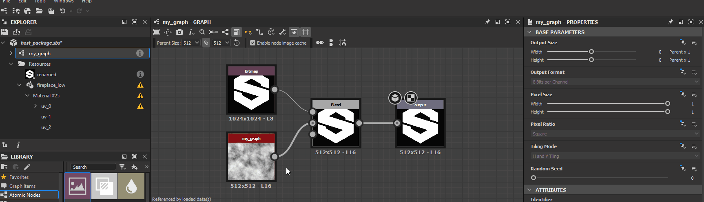
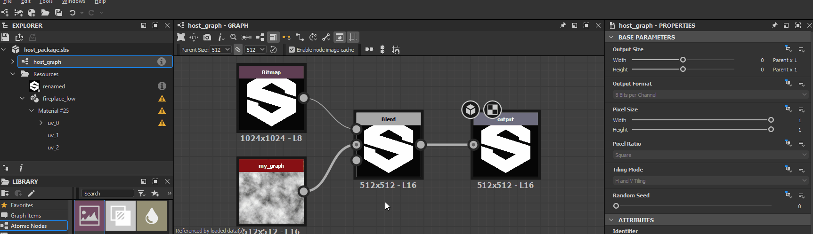

# Avisos de dependências

Esta página lista avisos e mensagens de erro que podem ser acionados por dependências no Substance 3D Designer e oferece etapas comuns de solução de problemas para cada um.

As dependências são *outros arquivos* referenciados por um arquivo do Substance 3D (SBS). Eles incluem [recursos](../../resources/resources.md) e outros arquivos do Substance 3D referenciados pelos nós da [instância do gráfico](../../compositing-graphs/creating-compositing-gra/graph-instances-sub-gra/graph-instances-sub-graphs.md).

##  Pacote dependente inválido

Um pacote de dependências não pode ser carregado porque está ausente, corrompido ou incompatível com a versão do Designer que está sendo usada.

<b> Solução</b>

Há duas formas principais de corrigir esse problema:

1. <b>Fazer com que a dependência seja carregada com êxito</b>

   Verifique se o pacote de dependência existe no local especificado na mensagem de aviso. Caso contrário, localize o arquivo e coloque-o novamente nesse local ou recrie-o no local. Se o arquivo existir, *tente carregá-lo* no Designer e procure todos os avisos ou erros relacionados a esse pacote. Consulte as etapas de solução de problemas para esses problemas específicos e corrija-os adequadamente.

   Em seguida, recarregue o pacote de host clicando nele com o botão direito do mouse no painel [Explorador](../../interface/the-explorer-window/the-explorer-window.md) e selecionando a opção <b>Recarregar</b> no menu contextual.

   
1. <b>Realocar a dependência no pacote</b>

   Você pode realocar a dependência usando o [Gerenciador de dependências](../../interface/dependency-manager/dependency-manager.md). Clique em RMB no pacote de host no painel [Explorer](../../interface/the-explorer-window/the-explorer-window.md) e selecione a opção <b>Gerenciador de Dependências</b> no menu contextual.

   Localize a dependência ausente na lista do Gerenciador de Dependências, clique em RMB nela e selecione a opção <b>Realocar...</b>. Localize o pacote de dependências usando a caixa de diálogo do navegador de arquivos e clique em <b>Abrir</b>.

   Em seguida, recarregue o pacote de host clicando nele com o botão direito do mouse no painel [Explorador](../../interface/the-explorer-window/the-explorer-window.md) e selecionando a opção <b>Recarregar</b> no menu contextual.

   

##  Verifique se o alias *&#39;X&#39;* está definido em seu projeto

Uma das dependências ou recursos do pacote está sendo carregada de um local com [alias](../../interface/preferences-window/project-settings/project-settings.md) nos dados do arquivo do Substance 3D (SBS) sob o alias relatado no aviso, embora esse alias não esteja definido nos [arquivos de projeto](../../interface/preferences-window/project-settings/project-settings.md) atuais.

<b> Solução</b>

Pelo menos um dos [arquivos de projeto](../../interface/preferences-window/project-settings/project-settings.md) deve definir o alias que é relatado no aviso.

##  Nenhum arquivo correspondente a este recurso foi encontrado

Não é possível localizar os arquivos correspondentes ao *modelo UDIM* de um [recurso de bitmap](../../resources/bitmap-resource/bitmap-resource.md).

<b> Solução</b>

Quando um [recurso de bitmap](../../resources/bitmap-resource/bitmap-resource.md) está vinculado e o Designer detecta uma *taxonomia de nomeação UDIM* em seu nome de arquivo - por exemplo, `0x1` em `my_texture_0x1.png`, ele se oferece para vinculá-lo como um *modelo UDIM*, de modo que os nós do [bitmap](../../compositing-graphs/nodes-reference-for-com/atomic-nodes/bitmap/bitmap.md) possam *alternar automaticamente* para outros bitmaps em um conjunto UDIM usando essa taxonomia, ao usar um fluxo de trabalho UDIM no Designer. Nesse caso, o Designer vincula o recurso de Bitmap de *modo diferente*, levando em consideração o modelo de numeração UDIM.

Há duas formas principais de corrigir esse problema:

1. <b>Restaurar os arquivos</b>

   Vá para o local especificado pelo atributo <b>Caminho do Arquivo</b> do recurso e verifique se existem arquivos seguindo o modelo. Caso contrário, restaure ou recrie o arquivo.

   
1. <b>Realocar os arquivos</b>

   Se os arquivos tiverem sido movidos ou renomeados, realoce-os clicando no RMB no item de recurso no painel [Explorador](../../interface/the-explorer-window/the-explorer-window.md) e selecione a opção <b>Realocar</b> para vincular esse recurso ao *primeiro arquivo em um conjunto* de imagens UDIM do mesmo tipo.

   

##  Arquivo vinculado não encontrado

O arquivo referenciado por um recurso vinculado não existe no local especificado por seu atributo <b>Caminho do Arquivo</b>.

<b> Solução</b>

Há duas formas principais de corrigir esse problema:

1. <b>Restaurar o arquivo</b>

   Vá para o local especificado pelo atributo <b>Caminho do Arquivo</b> do recurso e verifique se o arquivo existe. Caso contrário, restaure ou recrie o arquivo.

   
1. <b>Realocar o arquivo</b>

   Se o arquivo tiver sido movido ou renomeado, realoce-o clicando no RMB no item de recurso no painel [Explorador](../../interface/the-explorer-window/the-explorer-window.md) e selecione a opção <b>Realocar</b> para vincular esse recurso a outro arquivo do mesmo tipo.

   

##  Espaço de cores não encontrado

Um [recurso de bitmap](../../resources/bitmap-resource/bitmap-resource.md) faz referência a um espaço de cores que não pode ser encontrado no ambiente atual de [gerenciamento de cores](../../color-management/color-management.md). Pode ser um perfil ICC ou um espaço de cores em uma configuração OCIO.

<b> Solução</b>

A lista de opções do atributo Espaço de cor é preenchida automaticamente com o espaço de cor válido disponível. Altere o valor do espaço de cor desse recurso para qualquer outra entrada na lista.

Como alternativa, adicione esse espaço de cores ao ambiente atual de [gerenciamento de cores](../../color-management/color-management.md) e reinicie o Designer. Pode ser um perfil ICC ou um espaço de cores em uma configuração OCIO.

>[!NOTE]
>
> Este aviso só é acionado ao usar um modo de gerenciamento de cores diferente de **Herdado** (que é semelhante a desativar o gerenciamento de cores). Você pode habilitar o gerenciamento de cores na seção **Gerenciamento de cores** das [Configurações do projeto](../../interface/preferences-window/project-settings/project-settings.md).

Solução 

##  Recurso de referência não encontrado

O gráfico atribuído ao bloco UV de um [recurso de cena 3D](../3d-scene-resource/3d-scene-resource.md) não pode ser encontrado no local relatado no aviso.

<b> Solução</b>

Há duas formas principais de corrigir esse problema:

1. <b>Restaurar o gráfico</b>

   Verifique o conteúdo do pacote no painel [Explorer](../../interface/the-explorer-window/the-explorer-window.md) para obter o gráfico especificado na lista <b>Blocos UV</b>. Se não existir, restaure ou recrie o arquivo.

   
1. <b>Selecione outro gráfico</b>

   Atribua outro gráfico no pacote ao bloco UV.

   

##  blocos UV são atribuídos várias vezes

Um bloco UV para um [recurso de cena 3D](../3d-scene-resource/3d-scene-resource.md) foi atribuído mais de uma vez a um [gráfico de Substance](../../compositing-graphs/substance-compositing-graphs.md).

<b> Solução</b>

Para cada conjunto UV de um recurso de malha 3D, verifique se nenhum índice UDIM está presente *mais de uma vez* na lista <b>Blocos UV</b>.

##  Blocos UV inválidos

Um bloco UV listado para um [recurso de cena 3D](../3d-scene-resource/3d-scene-resource.md) não está definido na malha ou está corrompido.

<b> Solução</b>

Para cada conjunto UV de um recurso de malha 3D, verifique se todos os itens na lista <b>Blocos UV</b> se referem a UDIMs que *existem* no recurso vinculado.

>[!NOTE]
>
> Este aviso não pode ser disparado por meio da interface do usuário, pois *somente* lista os UDIMs detectados no recurso vinculado. Modificar apenas os dados no arquivo do Substance 3D (SBS) *diretamente* pode fazer com que este aviso seja disparado.

