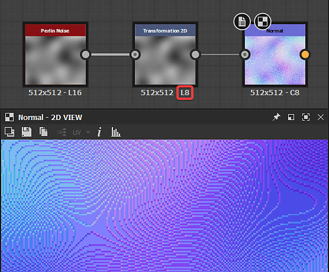

# Saída de imagem incorreta

Esta página lista problemas técnicos no Substance 3D Designer que resultam em uma saída de imagem incorreta de inesperada e oferece etapas de solução de problemas para cada um.

## Revisão/faixa visível

<table>
<tr style="border: 0;">
<td width="58.30%" style="border: 0;" valign="top">

** Problema**

Em vez de suaves, os gradientes na saída da imagem são incrementados. A depuração é causada pelo *intervalo de valores usado pela imagem ser muito estreita*.\
Isso significa que não há valores suficientes para fazer uma transição suave de uma etapa de um gradiente para a próxima.

Os valores de Luminância/RGBA podem ser codificados usando valores inteiros ou de ponto flutuante, afetando sua *precisão*:

* **Inteiro** oferece precisão de 8 bits (0-255, portanto 256 valores possíveis) e precisão de 16 bits (0-65535, portanto 65536 valores possíveis) para armazenar um valor no intervalo de 0-1.
* **O ponto flutuante** oferece uma precisão de 16 bits (HDR 16F) e 32 bits (HDR 32F), com a capacidade de armazenar valores fora do intervalo 0-1, incluindo valores negativos. Isso permite trabalhar com imagens de intervalo dinâmico (HDR), em que o valor de luminância pode ir muito acima de 1,0.

Se você não precisa especificamente trabalhar com imagens HDR, então a maioria dos nós provavelmente irão gerar valores no intervalo 0-1 codificados usando inteiros. Se o formato de saída da imagem for de 8 bits, a imagem só poderá usar 256 valores, o que muitas vezes resultará em revisões visíveis de gradientes. Isso pode afetar especialmente a saída de nós Normais.

</td>
<td width="41.60%" style="border: 0;" valign="top">

{width="256px"}{width="256px"}{width="256px"}

</td>
</tr>
</table>

** Etapas recomendadas**

Verifique o **Formato de saída** (ou seja, profundidade de bits) do nó e todos os nós upstream e certifique-se de que esses nós usam *precisão de Inteiro de pelo menos 16 bits*.

O parâmetro Formato de saída é frequentemente definido como *Relativo à entrada* [método de herança](../../compositing-graphs/inheritance-compositing/inheritance-in-substance-compositing-graphs.md), que pode propagar a baixa precisão em todo o gráfico. O ideal é que, ao subir no gráfico, você encontre a causa raiz do problema.

Você pode identificar rapidamente a precisão da saída de um nó examinando as informações de texto exibidas abaixo do nó:

* **L/C** refere-se à imagem como Tons de Cinza (por exemplo, Luminância) ou Cor
* **8/16** significa codificação de inteiro
* **16F/32F** significa codificação de ponto flutuante

Por exemplo:

* L8: inteiro de 8 bits em escala de cinza
* C16: inteiro de 16 bits colorido
* C32F: ponto flutuante colorido de 32 bits (HDR)

## Perda de qualidade na SBSAR publicada

<table>
<tr style="border: 0;">
<td width="58.30%" style="border: 0;" valign="top">

<b> Problema</b>

A qualidade da saída de imagens de um arquivo Substance 3D (SBSAR) é visivelmente inferior ao gráfico do arquivo Substance 3D do qual é publicado, conforme mostrado na imagem à direita.\
A saída aparece em baixa resolução.

</td>
<td width="41.60%" style="border: 0;" valign="top">

{width="256px"}

</td>
</tr>
</table>

<b> Etapas recomendadas</b>

Verifique se a propriedade [Tamanho de saída](../../compositing-graphs/output-size/output-size.md) de todos os nós [Bitmap](../../compositing-graphs/nodes-reference-for-com/atomic-nodes/bitmap/bitmap.md) está definida como o método de herança [&#128279;](../../compositing-graphs/inheritance-compositing/inheritance-in-substance-compositing-graphs.md) ** Absoluto.

Caso contrário, o [recurso de bitmap](../../resources/bitmap-resource/bitmap-resource.md) referenciado nele será salvo na resolução padrão de 256\*256 no arquivo publicado do Substance 3D, o que* afetará a qualidade* de uma ou mais saídas.

## A imagem está desfocada

<table>
<tr style="border: 0;">
<td width="58.30%" style="border: 0;" valign="top">

** Problema**

As formas ficam um pouco desfocadas após o uso de alguns nós, como [Transformação 2D](../../compositing-graphs/nodes-reference-for-com/atomic-nodes/transformation-2d/transformation-2d.md) ou [Combinar](../../compositing-graphs/nodes-reference-for-com/atomic-nodes/blend/blend.md).

</td>
<td width="41.60%" style="border: 0;" valign="top">

{width="256px"}

</td>
</tr>
</table>

** Etapas recomendadas**

Ao reorganizar pixels em uma imagem, por exemplo, ao redimensionar uma forma ou alterar a resolução de uma imagem, há duas maneiras de determinar como os pixels da origem devem ser *mapeados* para o destino:

* **Mais próximo**: o pixel será mapeado para o destino *no estado em que se encontra* na coordenada correspondente. Se o destino for de resolução mais baixa, o pixel pode ser totalmente ignorado. Se o destino tiver uma resolução maior, ele será mapeado para todos os pixels que cubram sua extensão. A saída é *mais nítida* e terá uma aparência levemente *com alias*.
* **Filtragem bilinear**: um processo de filtragem é aplicado à imagem de origem para que os pixels sejam mapeados para a resolução de destino de forma que *suavize* as transições entre pixels. A saída é *mais suave* e parecerá levemente *desfocada*.

O nó [Transformação 2D](../../compositing-graphs/nodes-reference-for-com/atomic-nodes/transformation-2d/transformation-2d.md) fornece uma opção de **método de filtragem** para selecionar qual destes dois métodos de mapeamento deve ser usado.

A maioria dos nós, por exemplo, [Combinar](../../compositing-graphs/nodes-reference-for-com/atomic-nodes/blend/blend.md), usa como padrão a *filtragem bilinear* ao obter a amostra de uma textura de entrada de resolução diferente, o que pode gerar um desfoque indesejado.\
Como o nó Transformação 2D é *atômico* - portanto, muito leve - ele pode ser usado *mesmo que nenhuma transformação seja necessária* para alterar uma resolução de textura usando sua propriedade [Tamanho de saída](../../compositing-graphs/output-size/output-size.md) antes de enviar a textura para outro nó, para que você possa *controlar o impacto* desse redimensionamento.

No [gráfico de função](../../function-graphs/function-graphs.md) do nó [Processador de pixels](../../compositing-graphs/nodes-reference-for-com/atomic-nodes/pixel-processor/pixel-processor.md), os nós **Amostra** incluem a *mesma opção* para controlar como a textura amostrada deve ser mapeada para a resolução do nó.
