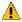

# Avisos e erros

Esta página explica o relatório de avisos e mensagens de erro que podem aparecer no [Substance 3D Designer](https://www.adobe.com/br/products/substance3d-designer.html) e links para solução de problemas de avisos com base na sua origem.

## Visão geral

Ao trabalhar em projetos no Designer, você pode encontrar avisos e mensagens de erro, que o notificam de um problema no projeto:

* Os **avisos** são exibidos em texto *amarelo* e chamam sua atenção para um problema que pode resultar em um resultado indesejável devido à falta de entrada ou a um erro de configuração. Eles geralmente *não bloqueiam* seu trabalho.
* **Erros** são exibidos em texto *vermelho* e denotam uma computação com falha, um resultado inesperado ou a incapacidade de executar uma tarefa. Eles normalmente *bloqueiam* seu trabalho.

Geralmente, avisos e erros são exibidos no item que os acionou e *aparecem em cada pai* desse item. Veja uma lista de locais comuns onde avisos e erros são relatados:

<table>
<tr style="border: 0;">
<td width="58.30%" style="border: 0;" valign="top">

### Explorer

Para qualquer item no painel [Explorer](../../interface/the-explorer-window/the-explorer-window.md) que tenha um aviso, esse aviso é exibido com um ícone  na borda mais à direita da entrada do item na lista. Deixe o cursor sobre esse ícone por alguns segundos para exibir uma *dica de ferramenta* listando todos os avisos detalhadamente.

Eles seguem estas regras:

* Se o item estiver aninhado em qualquer outro item (por exemplo, uma pasta), serão exibidos avisos para esse item se ele estiver recolhido.
* As listas de avisos são *cumulativas*, pois são a soma dos avisos de um item *e* todos os avisos de superfície de seus filhos.
* Todos os avisos relatados pelo conteúdo de um pacote são exibidos no item *pacote* e adicionados aos avisos *próprios* do pacote.

</td>
<td width="41.60%" style="border: 0;" valign="top">

{width="256px"}

</td>
</tr>
</table>

<table>
<tr style="border: 0;">
<td width="58.30%" style="border: 0;" valign="top">

### Exibição de gráfico

Para qualquer item no painel [Exibição gráfica](../../interface/the-graph-view/the-graph-view.md) que tenha um aviso, esse aviso é exibido com texto colorido no *canto inferior esquerdo* do visor. Se o aviso for disparado por um nó específico, esse nó terá um emblema de aviso . Deixe o cursor sobre essa medalha por alguns segundos para exibir uma *dica de ferramenta* listando todos os avisos em detalhes.

Eles seguem estas regras:

* Se um gráfico de origem *instanciado* em qualquer outro gráfico de host tiver um ou mais avisos, o [nó de instância](../../compositing-graphs/creating-compositing-gra/graph-instances-sub-gra/graph-instances-sub-graphs.md) desse gráfico de origem terá um aviso *único* `The referenced data has some warnings`.
* As listas de avisos são *cumulativas*, pois são a soma dos avisos do gráfico *e* todos os avisos de seus nós filhos.
* Todos os avisos de um gráfico são informados no item que representa esse gráfico no painel do Explorer.

</td>
<td width="41.60%" style="border: 0;" valign="top">

{width="256px"}

</td>
</tr>
</table>

<table>
<tr style="border: 0;">
<td width="58.30%" style="border: 0;" valign="top">

### Propriedades

Para qualquer item no painel [Propriedades](../../interface/properties/properties.md) que tenha um aviso, esse aviso é exibido com um ícone  na borda mais à direita da entrada do item na lista. Deixe o cursor sobre esse ícone por alguns segundos para exibir uma *dica de ferramenta* listando todos os avisos detalhadamente.

Eles seguem estas regras:

* Se o item estiver aninhado em qualquer outro item (por exemplo, um cabeçalho de seção), serão exibidos avisos para esse item se ele estiver recolhido.
* As listas de avisos são *cumulativas*, pois são a soma dos avisos de um item *e* todos os avisos de superfície de seus filhos.
* Se o [gráfico de função](../../function-graphs/function-graphs.md) aplicado a um [parâmetro de entrada](../../compositing-graphs/manage-parameters/exposing-a-parameter/exposing-a-parameter.md) tiver um ou mais avisos, o item de parâmetro terá um aviso *único* `The [x] parameter's function has some warnings`.

</td>
<td width="41.60%" style="border: 0;" valign="top">

{width="256px"}

</td>
</tr>
</table>

<table>
<tr style="border: 0;">
<td width="58.30%" style="border: 0;" valign="top">

### Console

Aviso e erros estão relatados no painel **Console**, que você pode acessar por meio do menu **Janelas** no [menu principal](../../interface/the-main-toolbar/the-main-toolbar.md). Você pode isolar avisos e erros do restante das entradas do console definindo a configuração **Canal** como `ErrorMgr`.

>[!NOTE]
>
> Como todo o texto no Console é *selecionável*, você pode usar este painel para *copiar facilmente avisos e mensagens de erro* e colá-los na ferramenta **Pesquisa local** desta documentação ou em qualquer mecanismo de pesquisa da Internet. Isso acelera a busca de orientações para solucionar problemas.

</td>
<td width="41.60%" style="border: 0;" valign="top">

{width="256px"}

</td>
</tr>
</table>

### Mensagens com “(# vezes)”

No aviso ou erro *exato igual* que foi disparado *mais de uma vez* em um item *e* qualquer um de seus filhos, esses avisos serão *mesclados em um* e o sufixo `(# times)` aparecerá, permitindo que você saiba quantas vezes esse aviso ou erro foi relatado.

## Categorias

Veja uma lista de avisos e erros que você pode encontrar no Designer, classificados de acordo com a origem. Os títulos de categoria são vinculados à sua página dedicada, que oferece explicações e guias de solução de problemas para resolver cada problema.

<table>
<tr style="border: 0;">
<td style="border: 0;" valign="top">

### Avisos em gráficos do Substance

* Nenhum nó de saída definido
* A função do parâmetro `[x]` possui alguns avisos
* Os dados referenciados têm alguns avisos
* Recurso de referência não encontrado
* O nó de texto usa fonte inválida

</td>
<td style="border: 0;" valign="top">

### Avisos em gráficos de função

* Nenhum nó de saída definido
* O nó de saída atual retorna um valor do tipo x
* Alguns nós Get não têm um nome de variável
* Alguns nós Set não têm um nome de variável

</td>
</tr>
</table>

### Avisos de dependências

* Pacote dependente inválido
* Verifique se o Alias &#39;x&#39; está definido no seu projeto
* Nenhum arquivo correspondente a este recurso foi encontrado
* Arquivo vinculado não encontrado
* Espaço de cor não encontrado
* Recurso de referência não encontrado
* Os blocos UV são atribuídos várias vezes
* Blocos UV inválidos
