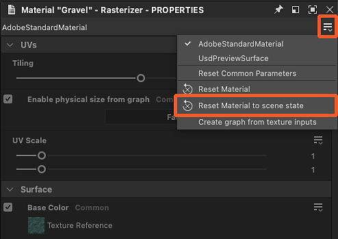

# Substituição de materiais de cena

Ao trabalhar com cenas 3D com materiais existentes, é necessário substituir esses materiais para substituí-los pelos seus.

Seu material pode ser construído do zero ou de uma versão ajustada do material de uma cena que foi [extraído em um Substance gráfico](../../working-with-3d-scenes/extracting-materials-val/extracting-materials-values-and-textures.md).

{zoomable="yes"}

<table>
<tr style="border: 0;">
<td style="border: 0;" valign="top">

## Substituir material da cena

</td>
<td style="border: 0;" valign="top">

### Redefinir para o estado da cena

</td>
<td style="border: 0;" valign="top">

### Material conectado

</td>
</tr>
</table>

## Substituir material da cena

Qualquer material usado em uma cena pode ser substituído pela sua própria versão, ou seja, um material novo ou uma versão editada do material existente.

A ação &#39;Substituir material&#39; pode ser encontrada em dois locais:

* Abra o menu “Materiais” e vá para o submenu do material desejado
* Pressione Shift+LMB em um objeto de cena para selecioná-lo e clique em RMB para abrir seu menu contextual

<table>
<tr style="border: 0;">
<td style="border: 0;" valign="top">

{zoomable="yes"}

*Ação no Visualização 3D viewport*

</td>
<td style="border: 0;" valign="top">

{zoomable="yes"}

*Ação no menu Materiais*

</td>
</tr>
</table>

No contexto do Designer, que usa USD para sua descrição de cena interna, substituir significa *criar uma cópia* do material que corresponda ao original o mais próximo possível e alterar a *ligação de material* das malhas da cena, do original para a cópia.

>[!NOTE]
>
> As cópias são criadas na cena em uma pasta ‘<b>material</b>’ (‘Scope’ em USD) sob a raiz e usam o mesmo identificador do original mais um sufixo numérico (por exemplo: ‘rustedMetal\_0’)

Isso significa duas coisas importantes:

1. O material original nunca é alterado de forma alguma.
1. Qualquer trabalho feito no Designer será aplicado à cópia.

Você pode ativar e desativar qualquer substituição em qualquer ponto por meio da mesma ação “Substituir material” se quiser restaurar o material da cena original ou executar uma verificação rápida antes e depois enquanto vai

Considerando que a cópia foi criada para corresponder ao original, a substituição de um material não deve alterar sua aparência na maioria dos casos (consulte a Observação abaixo) até que você conecte um gráfico de Substance a ele ou edite suas propriedades.

>[!NOTE]
>
> Quando uma substituição é aplicada, o Designer calcula as tangentes e os binormais das malhas afetadas, o que pode levar algum tempo e alterar o aspecto dessas malhas, especialmente se essas malhas não tiverem escala e polarização normais definidas ou usarem outras.

>[!IMPORTANT]
>
> O modelo de sombreamento <b>AdobeStandardMaterial</b> é compatível com o ecossistema do Substance 3D, mas não é padrão do setor e, portanto, *pode não ser compatível* com aplicativos de terceiros, como o Blender.
> 
> Para obter a melhor interoperabilidade fora dos aplicativos da Substance 3D, é recomendável usar o modelo de sombreamento <b>UsdPreviewSurface</b>, mesmo que esse modelo ofereça suporte a muito menos propriedades e efeitos materiais.

## Redefinir para o estado da cena

Se você precisar voltar ao estado inicial de um material, mantendo-o substituído e ainda podendo editá-lo, qualquer cópia de material pode ser redefinida para seus valores iniciais.

Se um valor de propriedade de material foi modificado ou uma textura de um gráfico foi aplicada a ele, a propriedade é revertida para seu valor inicial ou textura.

Um material pode ser redefinido inteiramente ou por propriedade.

Use a ação “Redefinir material para o estado da cena” no submenu do material ou no menu contextual de uma malha para redefinir o material totalmente.

A ação pode ser encontrada em três locais:

* Abra o menu “Materiais” e vá para o submenu do material desejado
* Pressione Shift+LMB em um objeto de cena para selecioná-lo e clique em RMB para abrir seu menu contextual
* O menu de hambúrguer no topo das propriedades daquele material

<table>
<tr style="border: 0;">
<td style="border: 0;" valign="top">

{zoomable="yes"}

*Ação no visor 3D*

</td>
<td style="border: 0;" valign="top">

{zoomable="yes"}

*Ação no menu Materiais*

</td>
<td style="border: 0;" valign="top">

{zoomable="yes"}

*Ação nas propriedades do material*

</td>
</tr>
</table>

<table>
<tr style="border: 0;">
<td style="border: 0;" valign="top">

A ação também está disponível *por propriedade* nas propriedades do material, caso você queira redefinir apenas alguns aspectos de um material.

Abra o menu de hambúrguer da propriedade de material para encontrar a ação “Redefinir para estado de cena padrão”.

</td>
<td style="border: 0;" valign="top">

{zoomable="yes"}

</td>
</tr>
</table>

## Material conectado

Novamente: o Designer não altera diretamente o material de uma cena, ele cria uma cópia na cena e liga as malhas a essa cópia em vez do original.

Por outro lado, o Designer tem *sua própria* lista separada de materiais no menu “Materiais”, que corresponde à lista de materiais da cena por padrão. Você pode adicionar novos materiais nessa lista a qualquer momento.

Este é um conjunto de dados *diferente*, criado e gerenciado somente no Designer. Esses materiais são então *conectados às cópias* que substituem os materiais originais da cena.

{zoomable="yes"}

Você pode conectar qualquer um dos materiais listados no menu “Materiais” às cópias criadas pelo Designer na cena: clique em RMB em uma cópia no navegador de Cena e vá para o submenu “Conectar material”.

O submenu lista todos os materiais na cena e todos os materiais que você pode ter criado manualmente no menu “Materiais”.

{zoomable="yes"}
