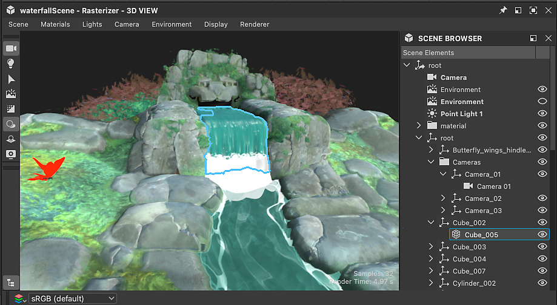
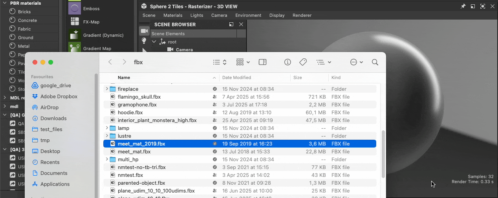

# Trabalhar com cenas 3D

{zoomable="yes"}

O Designer permite carregar [cenas 3D](../glossary/glossary.md) para trabalhar em materiais no contexto. Você pode encontrar uma lista de formatos de arquivo compatíveis com cenas 3D aqui, incluindo uma lista de recursos compatíveis com cada formato. <b>&lt;link necessário></b>

O trabalho em contexto envolve [substituir](../working-with-3d-scenes/overriding-scene-mat/overriding-scene-materials.md) um dos [materiais](../glossary/glossary.md) da cena para substituí-lo por um material criado no Designer.\
Você pode começar do zero usando qualquer um dos modelos de gráfico de Substance disponíveis no Designer ou [extrair valores e texturas](../working-with-3d-scenes/extracting-materials-val/extracting-materials-values-and-textures.md) do material da cena 3D como ponto de partida.

Ao terminar a cena 3D, você poderá [exportá-la](../working-with-3d-scenes/exporting-scenes/exporting-scenes.md) para um novo arquivo a ser assimilado em outro aplicativo.

Ao exportar para formatos USD, este fluxo de trabalho pode ser totalmente <b>não destrutivo</b>, o que significa que apenas edições e adições são exportadas.

Primeiro, você precisa carregar uma cena 3D para trabalhar e manter seu estado no Designer entre as sessões.

<table>
<tr style="border: 0;">
<td style="border: 0;" valign="top">

## Conteúdo de cenas 3D

</td>
<td style="border: 0;" valign="top">

### Carregamento de uma cena

</td>
<td style="border: 0;" valign="top">

### arquivos de estado de cena

</td>
</tr>
</table>

## Conteúdo de cenas 3D

Ao carregar uma cena 3D, o Designer criou sua própria cena para hospedá-la.

Você pode interagir com os seguintes conteúdos da cena:

* <b>Materiais:</b> todos os materiais usados na cena podem ser [substituídos](../working-with-3d-scenes/overriding-scene-mat/overriding-scene-materials.md) por uma cópia criada pelo Designer. Você pode editar as [propriedades do material](../interface/3d-view/material-properties/material-properties.md) dessa cópia, com valores brutos ou texturas de um gráfico de Substance.
* <b>Malhas:</b> a geometria pode ser escolhida diretamente no visor ou no [navegador de cena](../interface/3d-view/scene-browser/scene-browser.md), para acessar suas ações de material ([substituir](../working-with-3d-scenes/overriding-scene-mat/overriding-scene-materials.md), [redefinir](../working-with-3d-scenes/overriding-scene-mat/overriding-scene-materials.md), [extrair para gráfico de Substance](../working-with-3d-scenes/extracting-materials-val/extracting-materials-values-and-textures.md))
* <b>Luzes:</b> todas as luzes da cena podem ser desabilitadas no [navegador de cena](../interface/3d-view/scene-browser/scene-browser.md).
* <b>Câmeras:</b> qualquer câmera detectada na cena é adicionada como uma predefinição à câmera adicionada pelo Designer.

{zoomable="yes"}

O Designer usa uma descrição de USD para sua cena 3D. Seu layout pode ser navegado no navegador de Cena, onde cada tipo de [prim USD](https://openusd.org/release/glossary.html#usdglossary-prim) tem seu próprio ícone (geometria, material, sombreador, câmera, transformo, ...).

O [navegador de cena](../interface/3d-view/scene-browser/scene-browser.md) pode ser usado para selecionar, habilitar e desabilitar o conteúdo da cena. Portanto, recomendamos que você o mantenha exibido ao trabalhar com cenas 3D personalizadas.

## Carregamento de uma cena

Há vários caminhos para carregar uma cena 3D no Visualização 3D:

1. Clique duas vezes ou arraste um [recurso de cena 3D](../resources/3d-scene-resource/3d-scene-resource.md) de um [pacote](../glossary/glossary.md) para o Visualização 3D
1. Arraste um item de cena 3D da [Biblioteca](../interface/the-library/the-library.md) para o Visualização 3D (desde que você [tenha adicionado seu próprio conteúdo à Biblioteca](../interface/the-library/managing-custom-content/managing-custom-content-and-filters.md))
1. Arrastar um arquivo de cena 3D do navegador de arquivos do sistema para o Visualização 3D
1. Carregar um arquivo de estado de cena 3D (SBSSCN) junto com sua malha referenciada

Observe que apenas os métodos 1 e 4 permitem carregar a cena novamente exatamente como estava quando você trabalhou nela pela última vez, pois o estado da cena é gravado no arquivo de recursos de cena 3D e de estado da cena e salvo no pacote. Os métodos 2 e 3 carregam a cena como qualquer outra.

<table>
<tr style="border: 0;">
<td style="border: 0;" valign="top">

{zoomable="yes"}

Carregamento de um recurso de cena 3D

</td>
<td style="border: 0;" valign="top">

{zoomable="yes"}

Carregamento de uma cena 3D da biblioteca

</td>
</tr>
</table>

<table>
<tr style="border: 0;">
<td style="border: 0;" valign="top">

{zoomable="yes"}

Carregamento de um arquivo de cena 3D

</td>
<td style="border: 0;" valign="top">

{zoomable="yes"}

Carregamento de um arquivo de estado de cena

</td>
</tr>
</table>

>[!NOTE]
>
> Navegar e visualizar a cena na Visualização 3D é abordado na [documentação do Visualização 3D](../interface/3d-view/3d-view.md).

<table>
<tr style="border: 0;">
<td width="100.00%" style="border: 0;" valign="top">

O Designer sempre cria seu próprio ambiente (DomeLight no USD) e câmera, além daqueles que podem existir na cena.

Todos os itens criados pelo Designer são listados com os <b>rótulos em negrito</b> no navegador de Cenas.

>[!NOTE]
>
> Quando uma cena carregada tem pelo menos um ambiente (DomeLight), o ambiente criado pelo Designer é *desabilitado por padrão* para que não interfira na iluminação do ambiente da cena.

</td>
<td width="33.33%" style="border: 0;" valign="top">

{zoomable="yes"}

</td>
</tr>
</table>

## Arquivos de estado de cena

Depois de configurar materiais, câmera, luzes etc. na Visualização 3D, esse estado pode ser salvo em um arquivo de estado de cena (.sbsscn) que pode ser carregado posteriormente para restaurar esse estado. Por exemplo, talvez você queira configurar algumas cenas para visualizar diferentes tipos de materiais ou um ambiente de iluminação específico.

{zoomable="yes"}

Um estado da cena salva também pode ser usado como o estado padrão da Visualização 3D, de modo que, a qualquer momento que uma nova Visualização 3D for criada, esse estado seja usado. Isso é útil se você deseja visualizar materiais de seus materiais por padrão na malha Esfera 2 ladrilhos com um valor de revestimento de 2 e um mapa de ambiente específico.

As ações relacionadas aos arquivos de estado da cena estão localizadas no menu Cena da Exibição 3D e estão documentadas [aqui](../interface/3d-view/3d-view.md).

Os arquivos de estado de cena usam o formato XML e usam [aliases](../pipeline-and-project-con/project-configuration-fil/project-configuration-files-sbsprj.md) se houver algum definido nas [configurações do projeto](../interface/preferences-window/project-settings/project-settings.md).

>[!NOTE]
>
> O renderizador não é salvo no arquivo de estado de cena.
